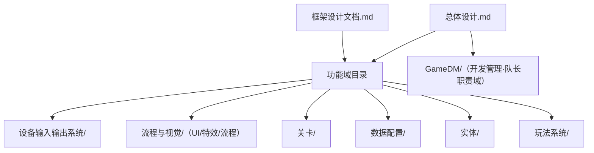
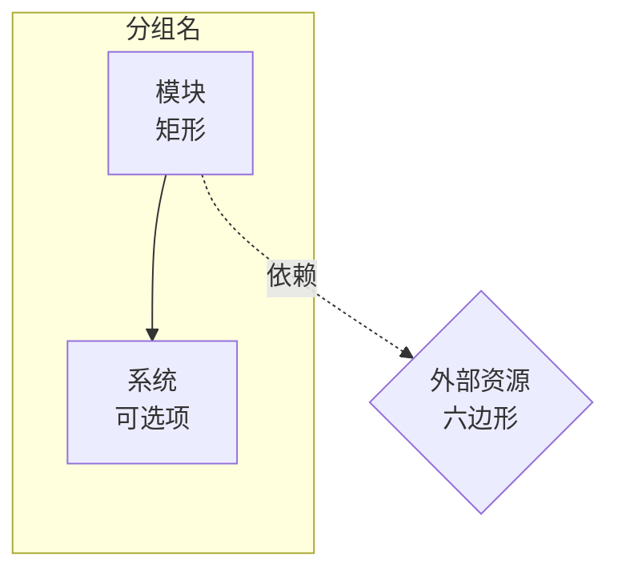
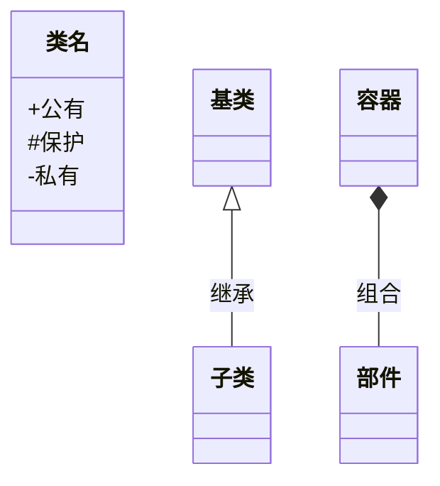
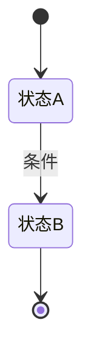

# 详细设计与开发文档编写规范及约束

> **职责边界（多会话协作）**：本目录为**详细设计层**（LTPHDoc/GameDD/），本规范只约束 `GameDD/` 下的设计文档。
> 策划规范见 `GamePlan/AGENTS.md`；代码规范见项目根 `AGENTS.md` 与技能 `kf-code`；
> 设计文档必须标注来源策划（`来源: [[GamePlan/...]]`）；frontmatter `状态` 为跨会话唯一权威，流转 `策划中 → 开发中 → 已实现 ⇄ 修复中`。
> 改文档必须同步更新状态/版本/更新日期；策划变更时对应设计文档状态改 `修复中` 并同步内容。

> 本文档定义 **基于 KFramework 开发游戏时，详细设计与开发文档** 的编写规范及约束。
> 核心文档体系为：一份 `总体设计.md`（架构总览）→ 各 `XX模块` / `XX系统` / `XX配置说明` / `XX对象说明`（具体实现）。
> **主题是「文档的文档」**，约束文档怎么写，而非具体游戏内容。

---

## 一、文档体系

### 1.1 目录定位与域划分

> 目录安排与 GamePlan 策划体系同构：**GameDD = GamePlan 在代码视角的具体设计与实现**。一级域对应 GamePlan 的模块/关卡/数据域，域内文档承载模块/系统/配置/对象四类设计。



| 文档/目录 | 定位 | 内容范围 |
| ------------- | ---- | ------------------------------------- |
| **总体设计.md** | 架构总览 | 架构全景图、设计红线、三资源经济模型、彩票结算与断电持久化、数据链与数值基线、功能域列表、所有子文档索引 |
| **GameDM/** | 开发管理 | Task Gantt 管理文档进度和任务甘特图（库根一级目录，队长/任务管理维护） |
| **框架设计文档.md** | 框架描述 | KFramework 架构入口、Module/System 基类、核心机制、GameplayModule 玩法模块（§4.7）、玩法系统理论 |
| **设备输入输出系统/** | 功能域 | DeviceModule、串口输入输出系统、设备协议配置 |
| **流程与视觉/** | 功能域 | `UI/`、`特效/`、`流程/玩家流程/`、`流程/场景流程/` |
| **关卡/** | 功能域 | 关卡侧设计：总纲性配置说明一级放置；`鱼潮关卡/`（标准关卡/ 视对应文档增设） |
| **数据配置/** | 功能域 | 参数配置说明（数据管线全景见 总体设计.md §四） |
| **实体/** | 功能域 | `鱼/`、`炮台/`、`子弹/` 对象说明与鱼生成/路径系统；实体基础设施（对象模块/层级管理）一级放置 |
| **玩法系统/** | 功能域 | `伤害系统/`、`附魔系统/`（占位）；彩票结算实现权威在 总体设计.md §七（奖励不构成玩法系统） |
| **{名称}.md**（域内） | 模块设计 | 单个 Module 的设计、API、生命周期、配置、扩展 |
| **{名称}系统.md**（域内） | 系统设计 | 单个 System 的设计、API、数据来源、扩展 |
| **XX配置说明.md** | 配置说明 | 数据格式、字段定义、加载方式、指向所属域和对象 |
| **XX对象说明.md / {名称}.md**（实体域） | 实体说明 | 继承 Pawn 的实体对象属性、状态、生命周期、交互 |

### 1.2 文档目录结构

```
LTPHDoc/GameDD/（详细设计与开发）
├── 总体设计.md / 框架设计文档.md / 文档索引.md    ← 根层
（开发管理不在此目录：库根一级目录 GameDM/，队长/任务管理维护）
│
├── 设备输入输出系统/          ← 设备域：主文档与文件夹同名 + 系统/配置文档
│   ├── 设备输入输出系统.md
│   ├── SerialInputSystem系统.md / SerialControlSystem系统.md
│   └── 设备协议配置说明.md
│
├── 流程与视觉/               ← 流程与视觉域
│   ├── UI/UI.md
│   ├── 特效/（特效.md + 特效对象说明.md）
│   └── 流程/
│       ├── 玩家流程/玩家流程.md
│       └── 场景流程/（场景流程.md + WaveSystem系统.md）
│
├── 关卡/                     ← 关卡域：总纲性配置说明一级放置
│   ├── 关卡配置说明.md / 鱼与关卡数据配置说明.md / 条件事件库.md
│   ├── WaveTimeline与事件配置器设计概要.md
│   ├── 标准关卡/            ←（视对应设计文档增设）
│   └── 鱼潮关卡/鱼潮阵型配置说明.md
│
├── 数据配置/                 ← 参数域（游戏参数配置说明.md）
│
├── 实体/                     ← 实体域：对象说明按实体类型分目录，基础设施一级放置
│   ├── 对象模块.md / 层级管理.md
│   ├── 鱼/（鱼.md + FishSpawnSystem系统.md + SplinePathSystem系统.md）
│   ├── 炮台/炮台.md
│   └── 子弹/子弹.md
│
├── 玩法系统/                 ← 玩法域
│   ├── 伤害系统/伤害系统实现设计.md
│   └── 附魔系统/附魔系统.md   ← 占位（延后重规划）
│
├── templete/                 ← 文档模板（新建时复制）
└── 文档索引.md                ← 全部文档的索引
```

### 1.3 命名规范

| 规则 | 示例 |
| ------------------------------------- | --------------------- |
| 总体设计固定为 `总体设计.md` | `总体设计.md` |
| 开发管理文档放在库根 `GameDM/` 下（队长/任务管理维护） | `GameDM/开发管理.md` |
| 框架设计固定为 `框架设计文档.md`（含 GameplayModule 玩法模块章节） | `框架设计文档.md` |
| 功能域主文档：`{域名称}.md` 与域文件夹同名，放域目录一级 | `设备输入输出系统/设备输入输出系统.md`、`流程与视觉/流程/玩家流程/玩家流程.md` |
| 系统文档：按系统名命名（可带"系统"），放在所属域目录下 | `设备输入输出系统/SerialInputSystem系统.md`、`实体/鱼/SplinePathSystem系统.md` |
| 配置文档：`{名称}配置说明.md`——关卡类归 `关卡/`，参数类归 `数据配置/`，设备专属归 `设备输入输出系统/` | `关卡/关卡配置说明.md`、`数据配置/游戏参数配置说明.md` |
| 实体对象文档：`实体/{实体名}/{实体名}.md`（派生/支撑文档同目录） | `实体/鱼/鱼.md`、`实体/炮台/炮台.md` |

### 1.4 文档属性

每份文档必须在文件顶部使用 YAML frontmatter 标注文档属性：

```yaml
---
类型: 总体设计 | 框架设计 | 模块设计 | 系统设计 | 配置数据 | 对象说明 | 开发管理
状态: 策划中 | 开发中 | 修复中 | 已实现 | 已废弃
版本: 1.0
更新日期: 2026-07-24
来源策划: [[GamePlan/实体/炮台/炮台]]   # 推荐：标注对应的策划文档
---
```

各类型文档的**特有属性**：

```yaml
# 模块设计 / 系统设计
关联模块: [模块A, 模块B]
关联系统: [系统A, 系统B]
关联数据: [数据模型A, 数据模型B]

# 配置数据
所属模块: [关联的 Module]
所属对象: [关联的实体对象]

# 对象说明
继承: Pawn | Character | Effect | AbstractActor
所属模块: [所属 Module]
关联系统: [关联 System]
```

| 字段 | 说明 | 必填 |
|------|------|------|
| `类型` | 文档类型 | ✅ |
| `状态` | 文档当前状态（统一枚举，与策划/代码一致；修复中=bug 返工，修完回已实现） | ✅ |
| `版本` | 版本号 | ✅ |
| `更新日期` | 最后更新日期 | ✅ |
| `来源策划` | 对应的策划文档（wiki-link） | 推荐 |
| `关联模块` | 关联的 Module 列表 | 推荐 |
| `关联系统` | 关联的 System 列表 | 推荐 |
| `关联数据` | 关联的数据模型列表 | 推荐 |
| `所属模块` | 所属的 Module（配置/对象文档） | 推荐 |
| `所属对象` | 关联的实体对象（配置文档） | 推荐 |
| `继承` | Pawn 继承链类型（对象文档） | ✅ |

---

## 二、模板文件

模板文件位于 `templete/` 目录，新建文档时复制对应模板并填充内容。

| 模板              | 用途                         | 类型值    |
| --------------- | -------------------------- | ------ |
|[[templete/总体设计模板]]   | 项目架构总览，末尾索引所有子文档           | `总体设计` |
|[[templete/框架设计文档模板]] | KFramework 架构描述            | `框架设计` |
|[[templete/XX模块模板]]   | 单个 Module 的详细设计            | `模块设计` |
|[[templete/XX系统模板]]   | 单个 System 的详细设计            | `系统设计` |
|[[templete/XX配置说明模板]] | JSON/YAML/表格配置说明，指向所属模块和对象 | `配置数据` |
|[[templete/XX对象说明模板]] | 继承 Pawn 的实体对象说明            | `对象说明` |

---

## 三、格式通用规范

### 3.1 Markdown 格式

| 规则 | 说明 |
|------|------|
| **一级标题** | 每文档只有一个，与文件名对应 |
| **二级标题** | 汉字数字编号：`一、` `二、` `三、` |
| **三级标题** | `### 数字.数字`，如 `### 2.3 核心字段` |
| **标题层级** | 不超过四级 |
| **分隔线** | 大章节之间用 `---` |

### 3.2 表格格式

```markdown
| 左列（文字） | 中列 | 右列（数字） |
|-------------|------|-------------|
| 内容         | 内容  | 内容          |
```

- 表头下用 `---|---` 分隔
- 空值用 `—` 而非留空
- 每格不超过 50 字

### 3.3 代码块

````markdown
```csharp
// 必须标注语言
```
````

| 语言标签 | 使用场景 |
|---------|---------|
| `csharp` | C# 代码 |
| `json` | JSON 配置 |
| `yaml` | YAML 配置 |
| `text` | 日志/输出 |

### 3.4 代码示例注释规范

设计文档中的代码示例，注释格式遵循代码规范（技能 `kf-code` 第四节）：`<summary>` 与 `</summary>` 各占一行，复杂参数用 `<param>`，返回值用 `<returns>`，中文注释。私有成员允许单行注释。

### 3.5 交叉引用

```markdown
<!-- 跨文档引用（按域相对路径） -->
[XX系统](../设备输入输出系统/XX系统.md)
[XX对象说明](../实体/XX/XX.md)
[XX配置说明](../关卡/XX配置说明.md)

<!-- 文档内锚点 -->
参见 [二、接口定义](#二接口定义)
```

### 3.6 语言风格

| 规则 | 说明 |
|------|------|
| 正文用中文 | 技术术语保留英文 |
| 主动语态 | "Module 注册 System" 而非 "System 被注册" |
| 术语统一 | 全文使用同一术语 |

---

## 四、Mermaid 图表规范

### 4.1 图表选用

| 场景 | 图表 |
|------|------|
| 架构/层级/包含关系 | `graph TD/LR` |
| 类继承/接口实现 | `classDiagram` |
| 状态/流程转换 | `stateDiagram-v2` |
| 调用链/数据流 | `graph LR` / `sequenceDiagram` |

### 4.2 架构图规范



### 4.3 类图规范



| 关系 | 符号 |
|------|------|
| 继承 | `<|--` |
| 实现 | `<|..` |
| 组合 | `*--` |
| 聚合 | `o--` |
| 关联 | `-->` |

### 4.4 状态图规范



### 4.5 统一主题配色

```mermaid
%%{init: {'theme': 'base', 'themeVariables': {
    'primaryColor': '#15607A',
    'primaryBorderColor': '#0D4659',
    'primaryTextColor': '#ffffff',
    'lineColor': '#2A9D8F',
    'secondaryColor': '#F0F7FA',
    'secondaryBorderColor': '#2A9D8F',
    'secondaryTextColor': '#0D4659',
    'tertiaryColor': '#FFF3D6',
    'tertiaryBorderColor': '#D4A843',
    'tertiaryTextColor': '#0D4659',
    'clusterBkg': '#E8F2F7',
    'clusterBorder': '#2A9D8F',
    'edgeLabelBackground': '#ffffff'
}}}%%
```

| 颜色 | 用途 |
|------|------|
| 深蓝 `#15607A` | 主模块、核心系统 |
| 浅蓝 `#F0F7FA` | 辅助、依赖系统 |
| 浅黄 `#FFF3D6` | 外部系统 |
| 青色 `#2A9D8F` | 连接线 |

---

## 五、各文档编写要点

### 5.1 总体设计

| 必含章节 | 说明 |
|---------|------|
| 架构全景图 | Mermaid 展示所有模块/系统层级 |
| 模块/系统列表 | 类型、位置、职责 |
| 模块依赖关系 | 模块依赖表 |
| 初始化顺序 | 数据→设备→流程→视图 |
| 功能域索引 | 链接到各功能域主文档（含系统/配置/对象文档） |
| 数据与配置索引 | 链接到 `关卡/`、`数据配置/`、`设备输入输出系统/` 下配置文档 |
| 实体对象索引 | 链接到 `实体/{名称}/` 下对象文档 |

### 5.2 模块文档

| 必含章节 | 说明 |
|---------|------|
| 架构位置 | 本模块在架构总览中的位置图 |
| 关键依赖 | 依赖项 + 获取方式 |
| 核心接口 | 接口定义 + 代码示例 |
| 继承关系 | Mermaid 类图 |
| 公开 API | API 表格 + 调用示例 |
| 生命周期 | 流程图 + 回调说明 |
| 配置与数据 | 配置字段表 + 数据格式 |
| 扩展指南 | 步骤 + 代码示例 |

### 5.3 系统文档

| 必含章节 | 说明 |
|---------|------|
| 所属 Module | 挂载在哪个 Module 下 |
| 关键依赖 | 依赖项 + 获取方式 |
| 公开 API | 方法签名 + 说明 |
| 生命周期 | `OnInit` → 运行时 → `OnDeinit` |
| 数据来源 | 从哪个 Model 读取数据 |
| 扩展指南 | 步骤 + 代码示例 |

### 5.4 配置文档

| 必含章节 | 说明 |
|---------|------|
| 所属 | 所属模块、所属对象 |
| 数据格式 | JSON/YAML/表格 示例 + 字段表 |
| 加载方式 | 加载位置、加载入口 |
| ID/Key 约定 | 命名规则 |

### 5.5 对象文档

| 必含章节 | 说明 |
|---------|------|
| 继承链 | Mermaid 类图，标注 Pawn 继承链 |
| 属性字段 | 配置字段表 + 数据来源 |
| 状态机 | Mermaid stateDiagram-v2 |
| 生命周期 | 分配→OnSpawn→运行→OnDespawn |
| 交互规则 | 触发条件 + 结果 |
| 移动策略 | 如适用，策略列表 + 配置链接 |

### 5.6 框架设计文档

| 必含章节 | 说明 |
|---------|------|
| 架构入口 | KArchitecture API + 初始化流程 |
| Module 基类 | 成员表 |
| System 基类 | 成员表 |
| 各模块设计 | 各核心 Module 简要设计 + 链接 |
| 核心机制 | 对象池、流程线、条件系统 |

### 5.7 开发管理

开发管理是库根独立目录 `GameDM/`（与 GameDD/、GamePlan/ 平级，队长·任务指挥职责域），不需要模板。通过 Task Gantt 插件管理任务（甘特图），每项任务是一个 frontmatter 笔记。

| 必含章节 | 说明 |
|---------|------|
| 文档进度总览 | Dataview 按功能域分组查询文档状态 + 统计 |
| 进展摘要 | 手动表格：模块/系统状态、阻塞项、备注 |
| 里程碑 | 目标日期、状态、涉及文档 |

任务笔记放在 `GameDM/任务/` 下，frontmatter 格式：

```yaml
---
type: task
status: todo        # todo | in-progress | done
requester: design   # 需求方/审核方：plan | design（开发完成后向 ta 汇报审核）
start: 2026-07-24
end: 2026-08-01
depends: []         # 前置任务笔记名
milestone: false
---
```

验收闭环：开发完成 → 经队长转 `requester` 审核 → 通过后队长标记 done（详见技能 kf-task 第五节；员工交流一律经队长）。

---

## 六、文档质量检查清单

### 6.1 总体设计检查

- [ ] 架构全景图展示所有核心模块/系统
- [ ] 模块列表包含类型、位置、职责
- [ ] 依赖关系表完整
- [ ] 初始化顺序明确
- [ ] 模块索引链接到所有模块文档
- [ ] 配置索引链接到所有配置文档
- [ ] 实体对象索引链接到所有对象文档

### 6.2 模块/系统文档检查

- [ ] 架构位置图明确
- [ ] 依赖关系完整（依赖项 + 获取方式）
- [ ] 核心 API 有表格说明 + 调用示例
- [ ] 生命周期有流程图
- [ ] 配置字段有表格说明
- [ ] 扩展指南包含步骤 + 代码示例
- [ ] 符合 KFramework 架构规范（无 Singleton、Command 改 Model 等）

### 6.3 配置文档检查

- [ ] 标明了所属模块和所属对象
- [ ] 数据格式示例完整
- [ ] 字段表类型、必填、说明齐全
- [ ] 加载方式明确

### 6.4 对象文档检查

- [ ] 继承链类图正确
- [ ] 状态机完整（初始态→运行态→终态）
- [ ] 生命周期包含所有回调
- [ ] 交互规则覆盖所有触发场景

### 6.5 通用检查

- [ ] YAML frontmatter 完整（类型、状态、版本、更新日期）
- [ ] 一级标题与文件名对应
- [ ] Mermaid 图表有首行注释 + 统一主题配色
- [ ] 代码块标注了语言类型
- [ ] 表格有表头分隔行
- [ ] 代码示例注释格式遵循代码规范（kf-code：summary 换行、私有成员可单行）
- [ ] 无 TODO / TBD / FIXME 占位符

### 6.6 开发管理检查

- [ ] 文档进度总览 Dataview 查询覆盖各功能域文档
- [ ] 进展摘要表格完整（模块/系统 → 状态/阻塞项/备注）
- [ ] 里程碑有目标日期和涉及文档
- [ ] 任务笔记使用正确的 frontmatter 格式（type/status/start/end/depends/milestone）

---

## 附录：术语对照

| 术语               | 说明                                                     |
| ---------------- | ------------------------------------------------------ |
| Module           | 模块，KFramework 模块基类（MonoBehaviour），管理业务能力集合，可注册子 System |
| System           | 系统，KFramework 系统基类（MonoBehaviour），具体业务逻辑               |
| Controller       | 控制，表现层基类，处理输入/视图                                       |
| Model           | 模型，纯 C# 数据模型（基接口 `IModel`；项目数据接口 `IData : IModel`，`AbstractData : AbstractModel, IData`） |
| Pawn             | 实体对象，对象池基类，所有可池化实体的根                                   |
| Character        | 角色基类（继承 Pawn），含移动策略管理                                  |
| Effect           | 特效基类（继承 Pawn），支持对象池分配/回收                               |
| FlowLine         | 流程线（ISystem），状态机驱动                                     |
| Command          | 命令模式，修改 Model 的唯一途径                                    |
| Event            | 事件模式，模块间通知                                             |
| BindableProperty | 可绑定属性，值变化自动通知                                          |
| PawnModule       | 对象模块，对象池管理                                             |
| ViewModule       | 视觉模块，管理（UI + 特效）                                       |
| DataModule       | 数据模块，数据注册查询                                            |
| FlowModule       | 流程模块，管理流程线                                             |
| DeviceModule     | 设备模块，管理设备和设备的系统                                        |

---

## 附录二：文档衔接与变更规则

1. **来源策划**：设计文档的 frontmatter `来源策划` 字段标注对应策划文档（wiki-link），内容必须与策划一致；策划变更后设计文档状态改 `修复中` 并同步内容
2. **变更留痕（现状规范）**：文档只写现状——修改直接更新正文与 `版本` + `更新日期`，**不写 `[变更]` 留痕行/修订记录段**（历史一律看 git）；跨层变更（改设计影响代码/策划）同样只更新正文为现状描述，并按第 1/3 条同步 `来源策划` 与 `状态`
3. **状态同步**：frontmatter `状态` 是跨会话同步的唯一权威（开发管理 dataview 汇总），修改文档必须同步更新
4. **文档索引**：新增/重命名/删除文档后，必须同步更新 `文档索引.md` 和 `总体设计.md` 中的对应索引
5. **开发管理任务**：任务状态 `todo → in-progress → done`（无修复中；返工 = 新建任务或改回 in-progress），详见技能 `kf-task`
