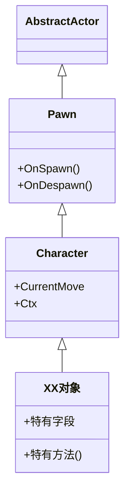
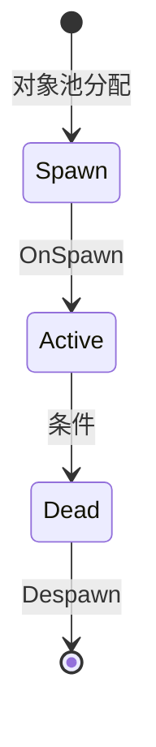
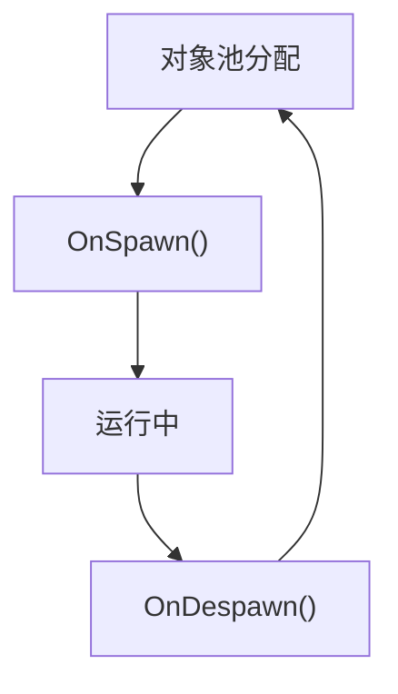

# XX对象说明

> 本文档描述 XX 实体对象的属性、状态、行为和生命周期。

---

## 一、对象概述

### 1.1 继承链

### 1.2 用途

一句话描述该对象的功能定位。

---

## 二、属性字段

### 2.1 配置字段

| 字段 | 类型 | 默认值 | 说明 |
|------|------|--------|------|
| `fieldName` | type | value | 说明 |

### 2.2 数据来源

| 数据 | 来源 | 说明 |
|------|------|------|
| `XXData` | JSON / 运行时 / 配置表 | 说明 |

---

## 三、状态与行为

### 3.1 状态机

| 状态 | 说明 |
|------|------|
| Spawn | 说明 |
| Active | 说明 |
| Dead | 说明 |

### 3.2 生命周期

| 阶段 | 回调 | 说明 |
|------|------|------|
| 分配 | `OnSpawn()` | 初始化状态、注册事件 |
| 运行 | — | 每帧 Update / 策略 Tick |
| 回收 | `OnDespawn()` | 清理引用、归还资源 |

---

## 四、交互规则

| 交互 | 触发条件 | 结果 |
|------|---------|------|
| 交互A | 条件说明 | 结果说明 |
| 交互B | 条件说明 | 结果说明 |

---

## 五、移动策略（如适用）

| 策略 | 说明 | 配置 |
|------|------|------|
| 策略A | 说明 | 见 [[XX移动策略配置]] |

---

## 六、相关文档

- [所属域主文档](../XX域/XX域.md)
- [关联配置](../数据配置/XX配置说明.md)
