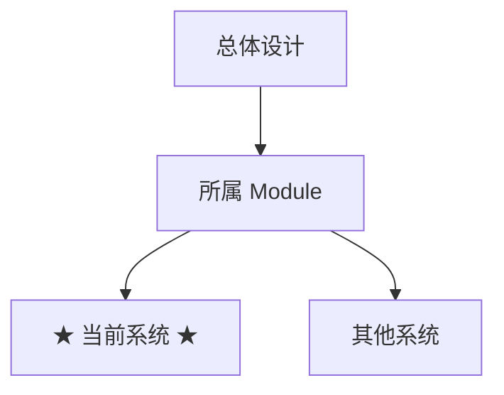
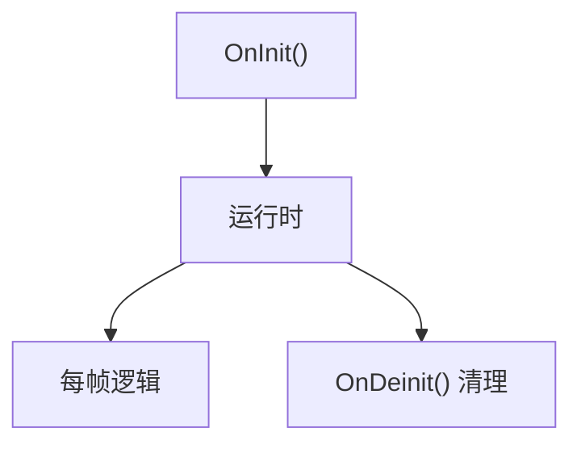

# XX系统详细设计与开发

> 本文档描述 XX 系统的详细设计、API 说明、扩展方式和调试方法。

---

## 一、系统概述

### 1.1 架构位置



### 1.2 所属 Module

| 项目 | 内容 |
|------|------|
| 所属 Module | `ModuleName` |
| 挂载位置 | `ModuleName 子级 GameObject` |

### 1.3 关键依赖

| 依赖项 | 类型 | 说明 | 获取方式 |
|--------|------|------|---------|
| `模块A` | Module | 依赖原因 | `this.GetModule<模块A>()` |
| `系统B` | System | 依赖原因 | `this.GetSystem<系统B>()` |

---

## 二、接口定义

### 2.1 核心接口

```csharp
public interface IXXSystem {
    /// <summary>
    /// 方法说明
    /// </summary>
    void DoSomething();
}
```

### 2.2 公开 API

| API | 返回类型 | 说明 |
|------|---------|------|
| `Method(ParamType param)` | void | 功能说明 |

```csharp
// 调用示例
this.GetSystem<XXSystem>().Method(param);
```

---

## 三、核心实现

### 3.1 生命周期



| 阶段 | 回调/方法 | 说明 |
|------|----------|------|
| 初始化 | `OnInit()` | 加载配置、注册事件 |
| 运行 | `Update()` | 每帧处理逻辑 |
| 销毁 | `OnDeinit()` | 清理资源 |

### 3.2 核心逻辑

文字描述关键算法或流程。

### 3.3 关键技术点

| 技术点 | 说明 |
|--------|------|
| 关键机制 | 说明 |

---

## 四、配置与数据

### 4.1 配置字段

| 字段 | 类型 | 默认值 | 说明 |
|------|------|--------|------|
| `fieldName` | type | value | 说明 |

### 4.2 数据来源

| 数据 | 来源 | 说明 |
|------|------|------|
| `XXModel` | `this.GetModel<XXModel>()` | 说明 |

---

## 五、扩展指南

### 5.1 扩展步骤

1. 第一步
2. 第二步

### 5.2 代码示例

```csharp
// 创建自定义扩展
public class MyCustom : XXSystem {
    public override void OnInit() {
        base.OnInit();
        // 自定义初始化
    }
}
```

---

## 六、调试方法

### 6.1 Inspector 调试

| 调试开关 | 位置 | 说明 |
|---------|------|------|
| `debugLog` | XXSystem Inspector | 开启日志输出 |

### 6.2 快捷键/命令

| 操作 | 效果 |
|------|------|
| 按键X | 触发调试功能 |

---

## 相关文档

- [总体设计](../总体设计.md)
- [所属 Module 文档](../所属Module/所属Module.md)
