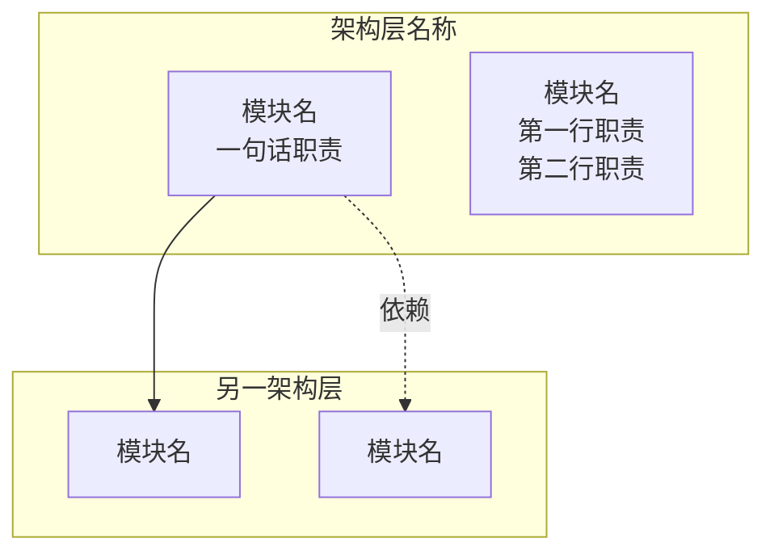
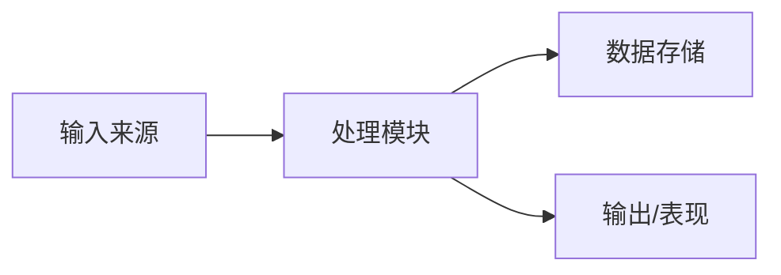
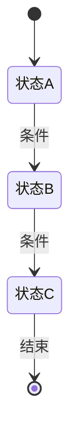

---
类型: 总体设计
关联模块: []
关联系统: []
关联数据: []
状态: 策划中
版本: 1.0
更新日期: 2026-07-24
---

# 总体设计

> 本文档描述项目的整体架构设计，包括架构全景、模块依赖、核心流程和目录结构。
> 各子系统的详细设计请参见对应的模块/系统文档。

---

## 一、架构全景

### 1.1 架构总览图



### 1.2 模块/系统列表

| 模块/系统 | 类型 | 位置 | 职责 |
|----------|------|------|------|
| `模块A` | Module/System/Controller | `Scripts/路径/` | 一句话职责 |
| `模块B` | Module/System/Controller | `Scripts/路径/` | 一句话职责 |

### 1.3 模块依赖关系

| 模块 | 依赖 | 依赖说明 |
|------|------|---------|
| 模块A | 模块B、模块C | 依赖原因 |

### 1.4 初始化顺序

| 顺序 | 模块 | 说明 |
|------|------|------|
| 1（最先） | DataModule | 数据服务先行初始化 |
| 2 | DeviceModule | 设备服务次之 |
| ... | ... | ... |

---

## 二、核心数据流

### 2.1 主数据流图



### 2.2 事件/命令列表

| 命令/事件 | 触发者 | 消费者 | 说明 |
|----------|--------|--------|------|
| `XXCommand` | 模块A | 模块B | 作用说明 |
| `XXEvent` | 模块B | 模块C、模块D | 作用说明 |

---

## 三、运行流程

### 3.1 主流程



| 状态 | 说明 |
|------|------|
| 状态A | 说明 |
| 状态B | 说明 |

---

## 四、目录结构

```
Assets/
├── KFramework/        ← 框架层（不可修改）
├── Scripts/            ← 游戏层（业务逻辑）
│   ├── ModuleA/
│   ├── SystemB/
│   └── ...
├── Settings/            ← 配置资产
├── Resources/           ← 运行时资源
└── StreamingAssets/     ← 运行时数据
```

---

## 五、模块索引

| 文档 | 所属文件夹 | 说明 |
|------|----------|------|
| [XX域](XX域/XX域.md) | `XX域/` | 说明 |
| [YY系统](XX域/YY系统.md) | `XX域/` | 说明 |

---

## 六、配置索引

| 文档 | 所属对象 | 说明 |
|------|---------|------|
| [XX配置说明](数据配置/XX配置说明.md) | [[XX对象说明]] | 说明 |

---

## 七、实体对象索引

| 文档 | 继承 | 说明 |
|------|------|------|
| [XX对象说明](实体/XX/XX.md) | Pawn / Character / Effect | 说明 |

---

## 八、相关文档

- [框架设计文档](../框架设计文档.md)
- [开发管理](../../GameDM/开发管理.md)
