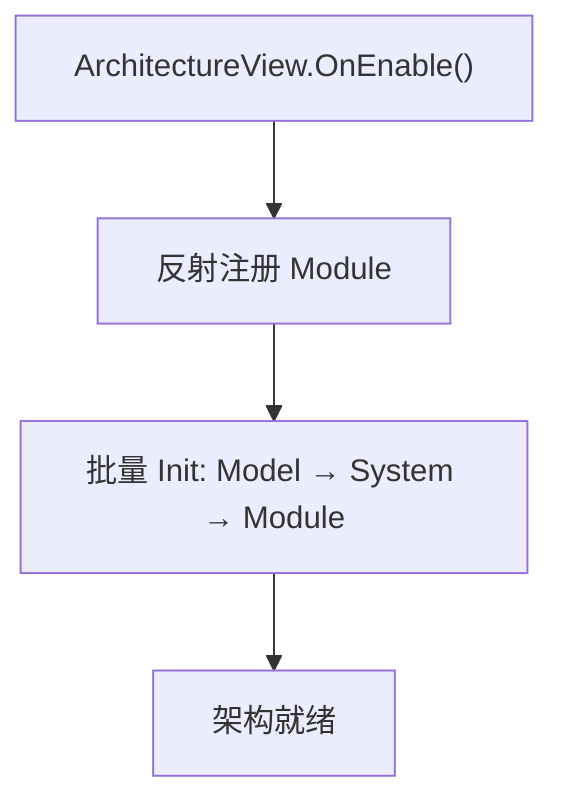

# KFramework 框架设计文档

> 本文档描述 KFramework 扩展层的架构设计，包含架构入口、模块/系统基类、对象池、流程线和视觉模块等核心机制。
> 各模块的详细设计请参见对应的模块文档。

---

## 一、架构入口

### 1.1 KArchitecture

| API | 说明 |
|------|------|
| `Interface` | 架构单例 |
| `GetModule<T>()` | 获取 Module |
| `GetFlowLine<T>()` | 语义化获取流程线 System |

### 1.2 初始化流程

---

## 二、模块系统

### 2.1 Module 基类

| 成员 | 说明 |
|------|------|
| `OnInit()` | 子类初始化入口 |
| `OnDeinit()` | 反初始化 |
| `Initialized` | 标记已初始化 |

### 2.2 System 基类

| 成员 | 说明 |
|------|------|
| `OnInit()` | 抽象方法，子类必须实现 |
| `OnDeinit()` | 可选清理 |

---

## 三、各模块设计

（按实际项目列出各核心 Module 的简要设计，链接到各自的模块文档）

| 模块 | 文档 | 说明 |
|------|------|------|
| DataModule | [[DataModule]] | 数据注册与查询 |
| DeviceModule | [[DeviceModule]] | 设备管理 |
| FlowModule | [[FlowModule]] | 流程线管理 |
| PawnModule | [[PawnModule]] | 对象池管理 |
| ViewModule | [[ViewModule]] | 视觉管理 |

---

## 四、核心机制

### 4.1 对象池（PawnModule）

双键索引 `(Type, pawnName)` → `PawnPool`，Stack 管理。

### 4.2 流程线（FlowLine）

`FlowLine<TState>` → 自动收集子级 `Flow` 组件 → 构建 `StateMachine`。

### 4.3 条件系统（ConditionDef）

Inspector 驱动的数据绑定条件，反射读取 `BindableProperty<T>.Value`。

---

## 五、相关文档

- [总体设计](../总体设计.md)
- 各功能域文档：`设备输入输出系统/` · `流程与视觉/` · `关卡/` · `数据配置/` · `实体/` · `玩法系统/`
