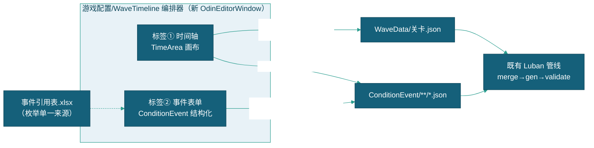

# WaveTimeline + 事件配置器 · 设计概要（三部曲 ③）

> 【现状】WaveTimeline 编排器已退役（编辑器套件已删除），Timeline 数据编辑走 .duowei 多维表格。

> 配置工具三部曲收官件。目标：关卡时间轴可视化编排（拖 TriggerTime）+ 条件事件结构化表单（联动事件引用表枚举），替代纯表单手填。执行模式：主程出设计 + 工程师分担实现（队长协调）。

---

## 一、现状与缺口

| 现状 | 缺口 |
|------|------|
| 关卡编辑器（LevelConfigWindow）已覆盖 WaveData/ConditionEvent 的表单 CRUD（ Odin 表格 + 文件树） | **无时间轴可视化**：Timeline 是纯列表，时序关系（先后/间隔/重叠）不可见 |
| 事件引用表.xlsx 已枚举 eventName/propertyPath 可填值 | **表单未联动**：DataCondition.propertyPath / EventCondition.eventName 仍手敲字符串（下拉数据源 EventConditionHelper 存在但依赖运行时反射，编辑器外不可查） |
| validate 已拦 Timeline→EventId 断链 | 防线在生成期，编辑期无即时反馈 |

## 二、总体设计（两个子工具，一窗两标签）

## 三、子工具 A：WaveTimeline 时间轴

### A1 画布（UnityEditor.TimeArea，Timeline 风格）

- **横轴**=时间（秒，自动缩放：关卡 Duration 内自动适配 + 滚轮缩放/拖拽平移）；**纵轴**=事件行（每 FishTimelineEntry 一行，按 TriggerTime 排序，左侧事件名列）
- **事件块**：矩形块（宽=固定视觉宽度或 Loop 区段），颜色按 TriggerId 前缀分类（1xxx-4xxx 个体鱼/3xxx 奖励鱼=蓝、5xxx-6xxx 群=青、其他 SpawnByName=黄）——一眼区分编排密度
- **拖拽改时**：水平拖块 = 改 TriggerTime（吸附 0.5s 网格，按住 Ctrl 关闭吸附）；双击块 = 精确值弹窗
- **增删**：右键画布 → 添加（从事件库下拉选 EventId）/ 删除块；空行提示引导
- **即时校验**：EventId 断链块标红边框 + 状态栏计数（"断链 2 处"）；保存时走 validate 语义前置检查

### A2 关卡选择与数据绑定

- 顶部下拉：关卡列表（读 WaveData 全量，同 Test 优先约定过滤）
- 加载 → 读 FishWaveData.Timeline[]；保存 → 写回源 json（保 Id/其余字段不碰，只动 Timeline 数组——**最小侵入**）
- Duration 参考线（红色竖线标 Duration 位置，超界块橙显）

## 四、子工具 B：事件配置器（结构化表单）

### B1 表单结构（联动事件引用表）

| 字段 | 控件 | 数据源 |
|------|------|--------|
| EventId | 自动 GUID（只读）+ Name 可编辑 | — |
| TriggerId | **分类下拉**：鱼种（FishData 产物 Id+Name）/ 阵型组（GroupData 列表）/ 预制体名（SpawnByName 列表） | Luban 产物 + GroupData 源 |
| DataConditions | 子表单列表：propertyPath **多级下拉**（IData 类型→字段树，复用 EventConditionHelper 反射逻辑但静态缓存）/ op 枚举按钮 / compareValue（字面值或 @引用下拉） | 反射 IData + 事件引用表对齐 |
| ListenEvents | 子表单列表：eventName **下拉**（事件引用表 13 项 + 反射校验）/ compares 字段比较子表单 | 同上 |
| TriggerEventIds | 链触发多选（从事件库选） | ConditionEvent 全量 |
| 循环参数 | Loop/LoopInterval/StopOnCondition/EventDelay | — |

### B2 事件库管理

- 文件树（复用 EventFolder 结构）+ 新建/重命名/删除文件
- 保存 = 写 ConditionEvent json 原格式（FishEvent struct 序列化不变——**源格式不变红线**）

## 五、实现拆分（工程师分担建议，2-3 人日）

| # | 模块 | 工作量 | 说明 |
|:-:|------|:-----:|------|
| 1 | WaveTimelineWindow 骨架 + 关卡加载/保存（Timeline 读写） | 0.5d | OdinEditorWindow + ConfigPaths 复用，Mode 切换 |
| 2 | TimeArea 画布（块渲染/拖拽/缩放/吸附/右键菜单） | 1d | 核心交互；TimeArea 为 UnityEditor 内部 API（Unity 2022 可用，需 using UnityEditor；时间轴标尺+块绘制纯 IMGUI Handles/GUILayout） |
| 3 | 事件表单（下拉联动 + 子表单 + 保存） | 0.5-1d | 大量复用 EventConditionHelper 反射 + Odin ValueDropdown（与 ①② 同模式） |
| 4 | 即时校验 + 状态栏 + README/收尾 | 0.25d | 断链标红/计数 |

拆分方案：工程师1 拿 1+2（画布重交互），工程师2 拿 3+4（表单/校验，与 ② 组装器同风格）；或单人串行全拿。

## 六、验收（复制 ①② 模式）

1. **自证校验闭环**：工具故意产出断链 Timeline（EventId 篡改）→ validate 活捉 FAIL → 修复 → 0 FAIL
2. 实操抽查（负责人）：一关完整编排从工具产出（拖时/建事件/链触发）→ 生成校验过 → 游戏内时序正确
3. 菜单 + README 登记 + 兜底约定（产出即源 json，手写等价）

## 七、红线与边界

- 不动游戏运行时/加载层（纯 Editor 工具）
- 源格式不变（FishWaveData.Timeline / FishEvent json 结构原样）
- TimeArea 属 UnityEditor 内部 API：需 #if UNITY_EDITOR + 版本锁定注释（Unity 2022.3.62 验证）；若 API 不稳退化为纯 GUILayout 自绘标尺（设计兼容）
- 事件引用表.xlsx 为枚举**文档层**；表单下拉数据源以**运行时反射**为准（引用表静态快照对齐校验，漂移时提示刷新 export_event_reference.ps1）
