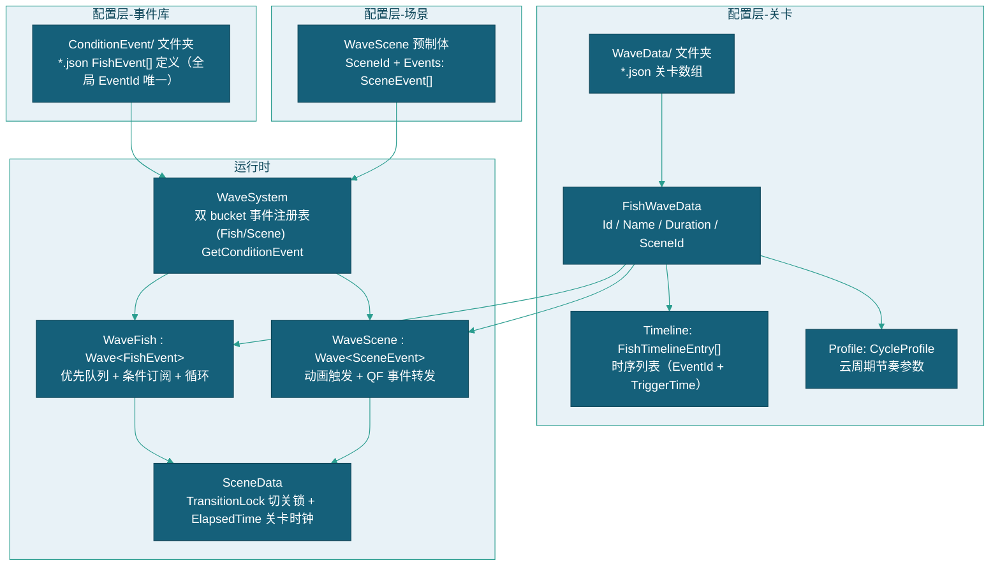
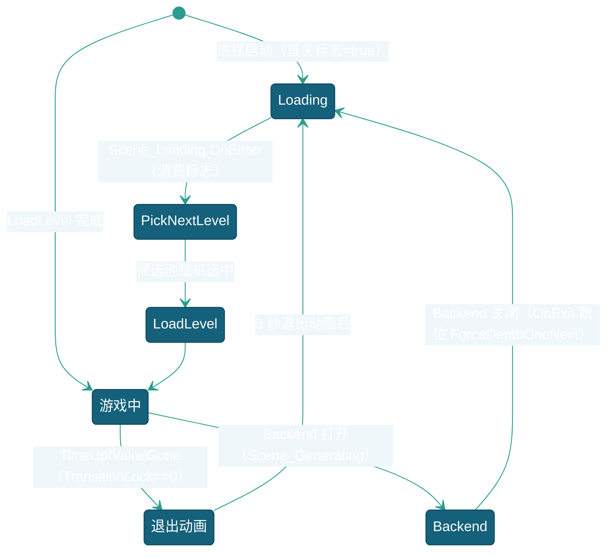
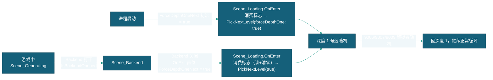

# 关卡配置说明

> 本文档描述关卡（FishWaveData）的 JSON 配置方式，包括条件事件库（ConditionEvent）、WaveFish 的鱼生成时序列表和 WaveScene 的场景动画事件队列的完整字段说明与配置示例。
> 现状定位：关卡与事件数据的编辑载体已随三表 Luban 原生化迁移至 `.duowei` 编辑源 → xlsx → Luban 产物 `Assets/StreamingAssets/luban/cfg_tb*.json`（本文 JSON 目录结构为概率制时代路径），字段结构、深度切关体系（§十二）与排队事件方案（§十一）仍为现行设计基准。关联模块 CloudModule 已退役——§十二 中 WarmingActive/炒场预算链路（12.2b/12.6 T2）随概率云退役失效，`SceneData.WarmingHasEnded` 现恒为 false（9003/9008 两关解锁条件待裁定，见 [总体设计](../总体设计.md) §八 待决与剩余项；Cloud 退役清单见其 §1.3）。

---

## 一、配置架构

### 1.1 关卡系统组成



### 1.2 数据流

```
WaveSystem.LoadLevel(id)
  → Cloud.Model[id + "start"] → FishWaveData
    → PawnModule.Spawn<WaveFish>("WaveFish")
      → WaveFish.Load(data.Timeline)      → 从 WaveSystem 事件库解析 EventId 入队
    → LoadWaveScene(data.SceneId)         → 实例化 WaveScene 预制体
      → WaveScene.Activate()
        → WaveScene.LoadEvents(Events)    → 动画队列入队
```

`FishWaveData` 的 `Timeline` 字段是 `FishTimelineEntry[]`（只存 EventId + TriggerTime），事件定义由 WaveSystem 条件事件库维护，由 `WaveFish`（继承 `Wave<FishEvent>`）执行。
WaveScene 预制体自带 `SceneEvent[]`，由 `WaveScene`（继承 `Wave<SceneEvent>`）执行。

---

## 二、FishWaveData — 关卡根数据

### 2.1 数据结构

`FishWaveData` 继承 `CloudWater`（拥有 `Id`、`Name`、`Volume` 基础字段，不含 `Magnification`），存储在 `StreamingAssets/WaveData/` 文件夹下，ID 段为 **9000~9999**（标准关 90xx，鱼潮关 91xx~99xx，见 §九 ID 段约定）。事件定义不内联在本类，统一存于条件事件库（见 [三、条件事件库](#三条件事件库)）。

### 2.2 完整字段表

| 字段              | 类型                 | JSON Key          | 必填  | 说明                                                    |
| --------------- | -------------------- | ----------------- | --- | ----------------------------------------------------- |
| `Id`            | string               | `"Id"`            | ✅   | 关卡唯一标识，9001-9999。Cloud 引擎以 `"{Id}start"` 为键存储         |
| `Name`          | string               | `"Name"`          | ✅   | 关卡显示名称，如 `"龙宫海域"`                                     |
| `Volume`        | int                  | `"Volume"`        | —   | 关卡初始总价值（CloudWater 继承），`VolumeForNext > 0` 时被扣减值覆盖    |
| `Duration`      | float                | `"Duration"`      | —   | 关卡时长（秒）。`0` = 不限时，仅靠 VolumeForNext 触发切关               |
| `SceneId`       | string               | `"SceneId"`       | —   | 匹配 WaveScene 预制体的 `SceneId` 字段。空字符串 = 无场景动画           |
| `VolumeForNext` | int                  | `"VolumeForNext"` | —   | 切关价值阈值。`> 0` 且 `_levelValue <= 0` 时触发切关。`0` = 不启用价值切关 |
| `NextLevelId`   | string               | `"NextLevelId"`   | —   | 指定下一关 ID。空字符串 = 从关卡池随机选取                              |
| `Timeline`      | FishTimelineEntry[]  | `"Timeline"`      | ✅   | 时序列表：引用条件事件库 EventId，每项覆盖触发时间（可为空数组）              |
| `Profile`       | CycleProfile         | `"Profile"`       | —   | 云周期节奏配置。`null` = 使用全局默认参数                             |

**FishTimelineEntry — 时序条目：**

| 字段          | 类型     | JSON Key      | 必填 | 说明                                                        |
| ------------- | ------- | ----------- | ---- | --------------------------------------------------------- |
| `EventId`     | string   | `"EventId"`   | ✅   | 条件事件库中定义的 GUID（下拉按 Name 选择，存 GUID）                  |
| `TriggerTime` | float    | `"TriggerTime"` | ✅   | 相对关卡开始的触发秒数，覆盖事件库定义里的 TriggerTime。同一条 EventId 可多次出现 |

### 2.3 CycleProfile — 云周期节奏

| 字段 | 类型 | JSON Key | 必填 | 默认值 | 说明 |
|------|------|----------|------|--------|------|
| `Type` | int | `"Type"` | — | `0` | 节奏类型：`0`=Standard（标准），`1`=Variation（变奏），`2`=FishTide（鱼潮放分） |
| `Intensity` | float | `"Intensity"` | — | `1.0` | 程度（0.1~3.0）。Variation 下放大预算摆幅，FishTide 下控制放分强度 |
| `TargetRaindropsOverride` | int | `"TargetRaindropsOverride"` | — | `-1` | 目标抽水点覆盖。`>= 0` 时覆盖全局 SystemConfig。`-1` = 使用全局默认 |
| `DifficultyLevel` | int | `"DifficultyLevel"` | — | `5` | 难度档（1~10）。切关时按表查 baseCoef 下发（0.5600~0.5200，见[游戏参数配置说明](../数据配置/游戏参数配置说明.md) §4.3）；`null Profile` 关卡用 SystemConfig 全局默认 |

> Profile 完整 JSON 示例：
> `{ "Type": 2, "Intensity": 2, "TargetRaindropsOverride": 3, "DifficultyLevel": 5 }`

**三种节奏说明：**

| 节奏类型 | Type 值 | 行为 |
|----------|---------|------|
| Standard | 0 | 4-6 组 × 2 交替收放水阶段，budget [-100k, -60k] / [+60k, +100k]，每阶段 3-7 周期 |
| Variation | 1 | Standard × Intensity（1-3x 振幅，时限压缩） |
| FishTide | 2 | 2-3 个短周期，全部放分（负 raindrops），放分强度 = Intensity × [5, 12]，持续 3-9s |

---

## 三、条件事件库（ConditionEvent）

### 3.1 概述

条件事件库是**所有 FishEvent 定义的全局注册表**，由 `WaveSystem` 在 `OnInit` 时从 `StreamingAssets/ConditionEvent/**/*.json` 递归读入（`Dictionary<string, FishEvent>`，按 EventId(GUID) 索引）。关卡 JSON 只存时序引用，不内联事件定义。

**组织方式（去重复用）**：事件**不属于单一关卡**，按类型归组去重：
- `Stand/`：标准简单事件，按 TriggerId 首数字分文件（1xxx~6xxx）
- `Chain/`：链事件，**每个逻辑事件链一个 JSON**（互为条件/链触发的事件归一组，如 `紫金葫芦美猴王.json`、`螃蟹.json`）
- `Award/`：鱼潮事件，FixedFormationFish 单独文件 + 按鱼潮关卡名分文件夹、每波阵型集合一个 JSON

相同定义（同 TriggerId/条件/链）的事件全库只保留一条（GUID 由定义生成），各关卡 Timeline 引用同一 GUID。

**文件清单（10 个）：**

| 子目录 | 文件 | 内容 |
|-------|------|------|
| `Stand/`（6） | `1xxx.json` | 个体鱼事件（TriggerId 1001~1010，小剑鱼/凤尾鱼/蝴蝶鱼/海马/尖嘴鱼/神仙鱼/小丑鱼/乌贼/刺豚/电鳗循环） |
| | `2xxx.json` | 个体鱼事件（TriggerId 2004~2009，进阶鱼循环） |
| | `3xxx.json` | 奖励鱼事件（TriggerId 3001~3011，黄金龟/金蟾/金墨鱼/金鲨鱼/聚宝盆/紫金葫芦等） |
| | `4xxx.json` | Boss 事件（TriggerId 4005~4014） |
| | `5xxx.json` | 群事件（TriggerId 5993~5999，群组头：小剑鱼群/小剑鱼阵等） |
| | `6xxx.json` | 群事件（TriggerId 6002~6018，群组头：各鱼群/鱼阵/随机阵） |
| `Chain/`（3） | `CiTun_Boom.json` | 刺豚 3秒3只（TriggerId 1010，Loop 3s/Count 3；原被 9511 引用，随 9111 删除后无引用方，事件保留待确认） |
| | `紫金葫芦美猴王.json` | 紫金葫芦↔美猴王互链（4 事件，互为条件触发） |
| | `螃蟹.json` | 螃蟹惩罚链（螃蟹 60秒惩罚 Count=0 链触发 + 螃蟹 15秒循环，TriggerId 3013） |
| `Award/`（5） | `FixedFormationFish.json` | 固定阵鱼潮事件（占位/预留） |
| | `龙宫海域鱼潮/w1~w4.json` | 鱼潮每波阵型集合一个 JSON（9101 龙宫鱼潮引用） |

### 3.2 加载方式

| 项 | 说明 |
|----|------|
| 位置 | `StreamingAssets/ConditionEvent/**/*.json`，每文件为 `FishEvent[]` 数组 |
| Test 优先 | `ConditionEvent/Test/` 下有 JSON 时仅加载 Test 文件夹（与关卡 Test 优先约定一致） |
| 加载入口 | `WaveSystem.LoadConditionEvents()`（Newtonsoft.Json） |
| 命名规范 | 事件用 **纯 GUID EventId**（32 位 hex，自动生成，全局唯一，**不属于单一关卡，可跨关卡复用**）+ **Name**（意义明确的显示名）。时序/链引用存 EventId(GUID)，下拉显示 Name。运行时不解析 Name |

### 3.3 事件库 JSON 示例

```json
[
  {
    "EventId": "02964496e384212e585995452cbc6636",
    "Name": "黄金龟 循环",
    "TriggerTime": 0,
    "Loop": true,
    "LoopInterval": 26,
    "StopOnCondition": false,
    "DataConditions": [],
    "ListenEvents": [],
    "EventDelay": -1,
    "TriggerId": "3001",
    "Count": 1,
    "TriggerEventIds": []
  }
]
```

> 库中 `TriggerTime` 无效（时序覆盖）；`TriggerEventIds` 链引用指向 GUID EventId，可跨关卡/预制体。`Name` 仅作显示，非唯一。

---

## 四、FishEvent — 鱼生成事件

### 4.1 数据结构

`FishEvent` 是实现 `IConditionEvent` 接口的结构体，定义存于条件事件库（见 [三、条件事件库](#三条件事件库conditionevent)），由 `WaveFish` 执行。`TriggerTime` 字段在库中仅作结构占位，实际触发时间由关卡 `Timeline` 覆盖。

### 4.2 完整字段表

| 字段 | 类型 | JSON Key | 必填 | 默认值 | 说明 |
|------|------|----------|------|--------|------|
| `EventId` | string | `"EventId"` | — | `""` | 全局唯一 GUID（32 位 hex，自动生成）。时序/链引用它，跨关卡复用 |
| `Name` | string | `"Name"` | — | `""` | 意义明确的显示名。时序/链下拉显示 Name、存 EventId(GUID)。可为空（回退显示 EventId） |
| `TriggerTime` | float | `"TriggerTime"` | ✅ | `0` | 首次触发时间（秒），相对于关卡开始。`0` = 立即触发（库中无效，时序覆盖） |
| `Loop` | int | `"Loop"` | — | `0` | 是否循环。`1`=循环，`0`=单次 |
| `LoopInterval` | float | `"LoopInterval"` | — | `0` | 循环间隔（秒）。循环时每次执行后间隔此秒数再次触发 |
| `StopOnCondition` | int | `"StopOnCondition"` | — | `0` | 停止模式。`1`=条件满足时**停止循环**（事件照常执行），`0`=条件作为执行门控 |
| `DataConditions` | DataCondition[] | `"DataConditions"` | — | `[]` | IData 数据模型条件数组（AND 逻辑） |
| `ListenEvents` | EventCondition[] | `"ListenEvents"` | — | `[]` | QF 事件监听条件数组（AND 逻辑） |
| `EventDelay` | float | `"EventDelay"` | — | `-1` | 条件满足后的延迟执行时间。`>= 0` 时条件满足不立即执行，延迟后执行并发送 WaveEvent |
| `TriggerId` | string | `"TriggerId"` | ✅ | `""` | 目标 ID。1000-4999=个体鱼，5000-6999=群体鱼 |
| `Count` | int | `"Count"` | — | `1` | 生成数量。`0` = 哨兵事件（只用于链触发，不生成实体） |
| `TriggerEventIds` | string[] | `"TriggerEventIds"` | — | `[]` | 链触发目标：执行后将这些 EventId 对应的事件重新入队 |

### 4.3 条件触发机制

条件有两种来源：**值监听**（`DataConditions`，监听 IData 的 BindableProperty 值变化）和**事件监听**（`ListenEvents`，监听 QF 事件）。每个条件可通过 `isOr` 勾选与/或，组合逻辑见 [4.4 条件组合方式](#44-条件组合方式与或)。

**DataCondition（数据条件 / 值监听）：**

| 字段 | 类型 | JSON Key | 必填 | 默认值 | 说明 |
|------|------|----------|------|--------|------|
| `propertyPath` | string | `"propertyPath"` | ✅ | `""` | IData 字段路径，如 `"SceneData.TransitionLock"`。支持 `.Value` 后缀容错 |
| `op` | int | `"op"` | ✅ | `0` | 比较符：`0`=≥, `1`=>, `2`==, `3`=<, `4`=≤, `5`=≠ |
| `compareValue` | string | `"compareValue"` | — | `""` | 比较目标值。字面数值字符串，或 `@` 开头引用另一 IData 字段。**空值等价于比较 0**（见下方注意） |
| `isOr` | bool | `"isOr"` | — | `false` | 或条件：勾选=本条件单独达成即触发整个事件；不勾=需与其他条件全部满足 |

**EventCondition（QF 事件条件 / 事件监听）：**

| 字段 | 类型 | JSON Key | 必填 | 默认值 | 说明 |
|------|------|----------|------|--------|------|
| `eventName` | string | `"eventName"` | ✅ | `""` | QF 事件完整类名，如 `"FishKilledEvent"` |
| `compares` | EventFieldCompare[] | `"compares"` | 见注意 | — | 事件字段比较数组。`StopOnCondition` 模式下可留空（事件一触发即满足）；普通门控模式下必须非空才能订阅 |
| `isOr` | bool | `"isOr"` | — | `false` | 或条件：勾选=本条件单独达成即触发整个事件；不勾=需与其他条件全部满足 |

**EventFieldCompare（事件字段比较）：**

| 字段 | 类型 | JSON Key | 必填 | 默认值 | 说明 |
|------|------|----------|------|--------|------|
| `propertyPath` | string | `"propertyPath"` | ✅ | `""` | 事件结构体的字段名，如 `"FishName"`、`"PlayerId"` |
| `op` | int | `"op"` | ✅ | `0` | 比较符（同上） |
| `compareValue` | string | `"compareValue"` | — | `""` | 比较值。字符串比较仅支持 Equal(`2`) 和 NotEqual(`5`) |

> **⚠️ 空 `compareValue` 的行为（值监听）：** 空值会被当作数值 `0` 参与比较。因此：
> - 搭配 `op=0`（≥）：`值 >= 0` 恒成立，且**订阅时立即检查一次** → 条件在订阅瞬间即满足，事件立即触发。**这不等同于"任意变化"，而是"比较 0"的副作用**。
> - 搭配 `op=2`（=）：仅当值恰为 `0` 时满足。
>
> 要实现「达到某阈值再触发」，**必须填写 `compareValue`**。例如监听 `SceneData.ElapsedTime` 需填 `"30"` 才是"30 秒后触发"。

> **⚠️ 空 `compareValue` 的行为（事件监听）：** `compares` 数组为空时，`StopOnCondition`（停止循环）模式下事件一触发即视为条件满足；普通门控（非 StopOnCondition）模式下 `compares` 为空会导致订阅失败、事件永不触发。

**可用的事件类型（13 种）：**（完整字段说明见 [九、可用条件参考](#九可用条件参考策划查阅)）

| 事件                       | 可比较字段                                                            | 触发时机         |
| ------------------------ | ---------------------------------------------------------------- | ------------ |
| `FishKilledEvent`        | `FishName`(string), `PlayerId`(int), `Volume`(int)               | AwardFish 死亡 |
| `FishSpawnEvent`         | `FishName`(string), `IsGroup`(bool), `Count`(int), `Volume`(int) | 鱼/鱼群生成       |
| `ScoreRefreshEvent`      | `PlayerId`(int), `Score`(int)                                    | 分数变更         |
| `BulletSwitchEvent`      | `PlayerId`(int), `BulletLevel`(int)                              | 炮等级切换        |
| `BulletRefreshEvent`     | —                                                                | 炮刷新          |
| `BulletFiredEvent`       | `PlayerId`(int), `BulletLevel`(int)                              | 子弹发射         |
| `BulletRecycledEvent`    | —                                                                | 子弹回收         |
| `AcquireCannonEvent`     | `PlayerId`(int), `cannonType`(Type)                              | 获取特殊炮台       |
| `PlayerInputStatusEvent` | `PlayerID`(int), `isDisabled`(bool)                              | 输入状态切换       |
| `SceneChangeEvent`       | —                                                                | 场景切换         |
| `SceneBeforeChangeEvent` | —                                                                | 场景切换前        |
| `SceneAfterChangeEvent`  | —                                                                | 场景切换后        |
| `WaveEvent`              | `Name`(string)                                                   | 波次自定义事件      |

### 4.4 条件组合方式（与/或）

`DataConditions`（值监听）和 `ListenEvents`（事件监听）中的每个条件均可通过 `isOr` 勾选标记为**或条件**。所有条件共享一个 `ConditionState` 协调判定：

| 组合模式 | 判定逻辑 | 触发条件 |
|----------|---------|---------|
| **纯与（默认）** | 所有条件 `isOr = false` | 全部 And 条件同时满足才触发 |
| **有或（任一）** | 存在任一条件 `isOr = true` | 任一 Or 条件单独满足即触发 |
| **混合** | 部分 `isOr = true`，部分 `false` | 任一 Or 满足即触发（And 条件不参与阻止） |

**与/或的判定细节：**

| 条件类型                             | And（isOr=false）                                                       | Or（isOr=true）  |
| -------------------------------- | --------------------------------------------------------------------- | -------------- |
| **值监听**（DataCondition）           | 动态判定：当前值满足则贡献计数，当前值不满足则撤销计数，确保**触发时刻所有 And 条件仍成立**（支持 `< 59` 这类非单调条件） | 值一旦满足即触发       |
| **事件监听**（EventCondition）         | 事件首次触发且字段匹配时贡献一次计数（防重复虚增）                                             | 任一字段匹配的事件触发即满足 |
| **字段级 Or**（EventFieldCompare 内部） | 所有字段比较全部通过才满足                                                         | —（见下方）         |

> **事件监听字段内的 Or：** `EventCondition.isOr = true` 时，其 `compares` 数组内**任一字段满足**即视为该条件满足（字段级 Or）；`isOr = false` 时需**所有字段满足**。而 `StopEventWatcher` 额外支持 `compares` 为空数组 → 事件一触发即满足。

**JSON 配置示例：**

```json
// 示例 1：纯与 — 玩家 1 击杀螃蟹 且 关卡时间 ≥ 30 秒（两个条件都满足才执行）
{
    "ListenEvents": [
        {
            "eventName": "FishKilledEvent",
            "isOr": false,
            "compares": [
                { "propertyPath": "FishName", "op": 2, "compareValue": "PangXie" },
                { "propertyPath": "PlayerId", "op": 2, "compareValue": "1" }
            ]
        }
    ],
    "DataConditions": [
        { "propertyPath": "SceneData.ElapsedTime", "op": 0, "compareValue": "30", "isOr": false }
    ]
}

// 示例 2：或 — 玩家击杀螃蟹 或 关卡时间到 60 秒（任一满足即执行）
{
    "ListenEvents": [
        {
            "eventName": "FishKilledEvent",
            "isOr": true,
            "compares": [
                { "propertyPath": "FishName", "op": 2, "compareValue": "PangXie" }
            ]
        }
    ],
    "DataConditions": [
        { "propertyPath": "SceneData.ElapsedTime", "op": 0, "compareValue": "60", "isOr": true }
    ]
}
```

### 4.5 执行模式总结

| 场景 | StopOnCondition | 有条件 | EventDelay | 行为 |
|------|:---:|:---:|:---:|------|
| 普通定时事件 | 0 | 无 | -1 | 到时间立即执行 |
| 循环事件 | 0 | 无 | -1 | 按 LoopInterval 重复执行 |
| 条件门控 | 0 | 有 | -1 | 等待条件满足后执行（与/或按 4.4 判定） |
| 条件门控 + 延迟 | 0 | 有 | ≥0 | 条件满足后延迟 N 秒执行，执行前发 WaveEvent |
| 条件停止循环 | 1 | 有 | -1 | 照常循环，条件满足后停止循环（与/或按 4.4 判定） |
| 链触发 | — | — | — | 执行后将 `TriggerEventIds` 中的事件以当前时间入队 |

---

## 五、WaveScene — 场景动画事件

### 4.1 概述

`WaveScene` 是挂载在预制体上的 MonoBehaviour，继承 `Wave<SceneEvent>`。每个关卡通过 `FishWaveData.SceneId` 匹配对应的 WaveScene 预制体。

WaveScene **不由 PawnModule 管理**（生命周期由 WaveSystem 控制），队列耗尽时**不自动销毁**（`OnQueueDepleted()` 为空实现）。

### 4.2 预制体结构

```
WaveScene 预制体
├── SceneId: "龙宫海域"           ← 与 FishWaveData.SceneId 匹配
├── Events: SceneEvent[]          ← 动画事件队列
├── [可选] Animator (根级)         ← 根动画控制器
│   └── [可选] "InLoading" 状态    ← 切关退出动画
└── 子级 GameObject
    ├── xxx (Animator)             ← 带 Animator 的子物体
    └── yyy (Animator)
```

### 4.3 SceneEvent 字段表

| 字段 | 类型 | JSON Key | 必填 | 默认值 | 说明 |
|------|------|----------|------|--------|------|
| `EventId` | string | `"EventId"` | — | `""` | 事件标识 |
| `TriggerTime` | float | `"TriggerTime"` | ✅ | `0` | 触发时间（秒） |
| `Loop` | int | `"Loop"` | — | `0` | 是否循环 |
| `LoopInterval` | float | `"LoopInterval"` | — | `0` | 循环间隔（秒） |
| `StopOnCondition` | int | `"StopOnCondition"` | — | `0` | 停止模式 |
| `DataConditions` | DataCondition[] | `"DataConditions"` | — | `[]` | 数据条件（值监听），`isOr` 字段支持与/或，见 [3.3](#43-条件触发机制) |
| `ListenEvents` | EventCondition[] | `"ListenEvents"` | — | `[]` | 事件条件（事件监听），`isOr` 字段支持与/或，见 [3.3](#43-条件触发机制) |
| `EventDelay` | float | `"EventDelay"` | — | `-1` | 条件延迟 |
| `TriggerId` | string | `"TriggerId"` | ✅ | `""` | 动画路径/事件名（见下方格式） |
| `TriggerEventIds` | string[] | `"TriggerEventIds"` | — | `[]` | 链触发目标 |

**TriggerId 格式：**

| 格式 | 示例 | 行为 |
|------|------|------|
| 纯动画名 | `"Idle"` | 在根 Animator 上播放该状态 |
| 路径/动画名 | `"Loading/InLoading"` | 在子物体 `Loading` 的 Animator 上播放 `InLoading` |
| `@` 前缀 | `"@SceneChange"` | 发送 `new WaveEvent { Name = "SceneChange" }` |

**路径解析：** 路径是相对于 WaveScene 根 Transform 的层级路径（`子物体名/孙子物体名`），Awake 时自动扫描所有子级 Animator 并建立映射字典。

---

## 六、SceneData — 全局关卡数据

`SceneData` 是 `AbstractData` 子类，注册在 `DataModule` 中，供关卡事件、特效和全局代码读取。

| 字段 | 类型 | 说明 |
|------|------|------|
| `TransitionLock` | `BindableProperty<int>` | 场景切换引用计数锁。特效播放 +1，回收 −1，归零时允许切关 |
| `ElapsedTime` | `BindableProperty<float>` | 当前关卡实时运行时间（秒）。由 WaveSystem 每帧同步 `_levelElapsed` |

### 5.1 TransitionLock — 切换锁

| 操作 | 调用者 | 说明 |
|------|--------|------|
| `LockTransition()` (+1) | AwardEffect、钻头特效等 | 特效播放前加锁，阻止切关 |
| `UnlockTransition()` (−1) | AwardEffect、钻头特效等 | 特效回收/完成后解锁 |
| 监听 `TransitionLock == 0` | SceneEvent | 归零时触发关卡切换动画 |

### 5.2 ElapsedTime — 关卡实时时间

`ElapsedTime` 由 `WaveSystem.Update()` 每帧写入当前关卡的已运行秒数。**切关时归零**（`LoadLevel` 重置 `_levelElapsed = 0`）。

**典型用途：** 策划可通过 `DataCondition` 监听 `SceneData.ElapsedTime` 实现「关卡进行到某时刻」的条件触发，**不依赖事件队列的 TriggerTime**：

```json
// 关卡进行 30 秒后触发的条件（DataCondition）
{
    "propertyPath": "SceneData.ElapsedTime",
    "op": 0,                          // ≥
    "compareValue": "30"
}
```

> **与 `TriggerTime` 的区别：** `TriggerTime` 是事件自身的绝对入队时刻；`SceneData.ElapsedTime` 是全局关卡时钟，可在任意事件/特效/场景中跨组件引用。

---

## 七、JSON 配置示例

### 7.1 基础关卡（最少配置）

关卡 JSON（只存时序，事件定义在条件事件库，按类型归入 `Stand/` 等文件夹）：

```json
[
  {
    "Id": "9001",
    "Name": "基础关卡",
    "Duration": 300,
    "SceneId": "",
    "VolumeForNext": 0,
    "NextLevelId": "",
    "Profile": null,
    "Timeline": [
      { "EventId": "a1b2c3d4e5f60718293a4b5c6d7e8f90", "TriggerTime": 0 },
      { "EventId": "b2c3d4e5f60718293a4b5c6d7e8f90a1", "TriggerTime": 0 }
    ]
  }
]
```

条件事件库 `ConditionEvent/Stand/1xxx.json`、`3xxx.json`（GUID EventId + Name；`a1b2...` = 每 16s 生成 3 条 1001 小剑鱼，`b2c3...` = 每 26s 生成 1 条 3001 黄金龟）：

```json
[
  {
    "EventId": "a1b2c3d4e5f60718293a4b5c6d7e8f90",
    "Name": "小剑鱼 循环",
    "TriggerTime": 0, "Loop": true, "LoopInterval": 16,
    "StopOnCondition": false, "DataConditions": [], "ListenEvents": [],
    "EventDelay": -1, "TriggerId": "1001", "Count": 3, "TriggerEventIds": []
  },
  {
    "EventId": "b2c3d4e5f60718293a4b5c6d7e8f90a1",
    "Name": "黄金龟 循环",
    "TriggerTime": 0, "Loop": true, "LoopInterval": 26,
    "StopOnCondition": false, "DataConditions": [], "ListenEvents": [],
    "EventDelay": -1, "TriggerId": "3001", "Count": 1, "TriggerEventIds": []
  }
]
```

### 7.2 带条件链触发（Boss 关卡模式）

条件事件库 `ConditionEvent/Chain/紫金葫芦美猴王.json`（GUID + Name，链引用用 GUID）：

```json
[
  {
    "EventId": "c3d4e5f60718293a4b5c6d7e8f90a1b2",
    "Name": "螃蟹 15秒",
    "TriggerTime": 0, "Loop": true, "LoopInterval": 15,
    "StopOnCondition": true, "DataConditions": [],
    "ListenEvents": [{ "eventName": "FishKilledEvent", "compares": [{ "propertyPath": "FishName", "op": 2, "compareValue": "PangXie" }], "isOr": false }],
    "EventDelay": -1, "TriggerId": "3013", "Count": 1, "TriggerEventIds": []
  },
  {
    "EventId": "d4e5f60718293a4b5c6d7e8f90a1b2c3",
    "Name": "螃蟹 惩罚",
    "TriggerTime": 0, "Loop": true, "LoopInterval": 15,
    "StopOnCondition": false, "DataConditions": [],
    "ListenEvents": [{ "eventName": "FishKilledEvent", "compares": [{ "propertyPath": "FishName", "op": 2, "compareValue": "PangXie" }], "isOr": false }],
    "EventDelay": 60, "TriggerId": "3013", "Count": 0, "TriggerEventIds": ["c3d4e5f60718293a4b5c6d7e8f90a1b2"]
  },
  {
    "EventId": "e5f60718293a4b5c6d7e8f90a1b2c3d4",
    "Name": "紫金葫芦 开始",
    "TriggerTime": 0, "Loop": true, "LoopInterval": 15,
    "StopOnCondition": false, "DataConditions": [],
    "ListenEvents": [{ "eventName": "FishKilledEvent", "compares": [{ "propertyPath": "FishName", "op": 2, "compareValue": "MeiHouWang" }], "isOr": false }],
    "EventDelay": 60, "TriggerId": "4012", "Count": 0, "TriggerEventIds": ["f60718293a4b5c6d7e8f90a1b2c3d4e5"]
  },
  {
    "EventId": "f60718293a4b5c6d7e8f90a1b2c3d4e5",
    "Name": "紫金葫芦 循环",
    "TriggerTime": 0, "Loop": true, "LoopInterval": 15,
    "StopOnCondition": true, "DataConditions": [],
    "ListenEvents": [{ "eventName": "FishKilledEvent", "compares": [{ "propertyPath": "FishName", "op": 2, "compareValue": "ZiJinHuLu" }], "isOr": false }],
    "EventDelay": -1, "TriggerId": "4012", "Count": 1, "TriggerEventIds": []
  }
]
```

关卡 `WaveData/9001_龙宫海域.json`（时序引用上述事件库 EventId GUID）：

```json
[
  {
    "Id": "9001", "Name": "龙宫海域", "Duration": 600, "SceneId": "龙宫海域",
    "VolumeForNext": 0, "NextLevelId": "",
    "Profile": null,
    "Timeline": [
      { "EventId": "a1b2c3d4e5f60718293a4b5c6d7e8f90", "TriggerTime": 0 },
      { "EventId": "c3d4e5f60718293a4b5c6d7e8f90a1b2", "TriggerTime": 15 },
      { "EventId": "d4e5f60718293a4b5c6d7e8f90a1b2c3", "TriggerTime": 0 },
      { "EventId": "e5f60718293a4b5c6d7e8f90a1b2c3d4", "TriggerTime": 0 },
      { "EventId": "f60718293a4b5c6d7e8f90a1b2c3d4e5", "TriggerTime": 700 }
    ]
  }
]
```

**链触发流程解读：**

```
1. t=0 起: 小剑鱼每 16s 生成 3 条（持续循环，定义在 Stand/）
2. t=0 起: 监听 FishKilledEvent(FishName=PangXie)
   → 玩家击杀螃蟹后 60s 延迟 → 重新入队 "螃蟹 15秒"
3. t=15: "螃蟹 15秒" 每 15s 生成 1 条螃蟹
   → StopOnCondition=1，螃蟹被击杀后停止循环
4. t=0: 监听 FishKilledEvent(FishName=ZiJinHuLu)
   → 击杀紫金葫芦 → 触发 "紫金葫芦 循环"
5. "紫金葫芦 循环" 每 40s 生成 1 条美猴王（首次 1000s 后）
   → StopOnCondition=1，美猴王被击杀后停止
```

### 7.3 带云周期配置

```json
[
  {
    "Id": "9003", "Name": "鱼潮关卡", "Duration": 180, "SceneId": "",
    "VolumeForNext": 0, "NextLevelId": "",
    "Profile": { "Type": 2, "Intensity": 1.5, "TargetRaindropsOverride": -1 },
    "Timeline": [
      { "EventId": "a1b2c3d4e5f60718293a4b5c6d7e8f90", "TriggerTime": 0 }
    ]
  }
]
```

事件定义 `ConditionEvent/Stand/1xxx.json`：`a1b2c3d4...`（小剑鱼 循环）`LoopInterval 12`、`Count 5`、`TriggerId 1001`。

### 7.4 价值驱动切关

```json
[
  {
    "Id": "9004", "Name": "价值限定关", "Duration": 0, "SceneId": "",
    "VolumeForNext": 5000, "NextLevelId": "9005",
    "Profile": null,
    "Timeline": [
      { "EventId": "10a2b3c4d5e6f708192a3b4c5d6e7f809", "TriggerTime": 0 }
    ]
  }
]
```

事件定义 `ConditionEvent/Stand/2xxx.json`：`10a2b3c4d...`（虾 循环）`LoopInterval 8`、`Count 2`、`TriggerId 2005`。

`Duration=0` 不限时，每次生成鱼时 `WaveFish.Execute` 调用 `WaveSystem.DeductLevelValue(volume)` 扣除 `_levelValue`。当 `_levelValue <= 0` 且 `VolumeForNext > 0` 时触发切关。

---

## 八、文件组织与加载

### 8.1 目录结构

```
StreamingAssets/
├── ConditionEvent/                  ← 条件事件库（FishEvent[] 定义，全局 EventId(GUID) 唯一，按类型去重复用）
│   ├── Stand/                       ← 标准简单事件（非链、非鱼潮），按 TriggerId 首数字分文件
│   ├── 1xxx.json                ← 个体鱼（1001~1010）
│   │   ├── 2xxx.json                ← 个体鱼（2004~2009）
│   │   ├── 3xxx.json                ← 奖励鱼（3001~3011）
│   │   ├── 4xxx.json                ← Boss（4005~4014）
│   │   ├── 5xxx.json                ← 群（5993~5999）
│   │   └── 6xxx.json                ← 群（6002~6018）
│   ├── Chain/                       ← 链事件（TriggerEventIds 非空），每个逻辑事件链一个 JSON
│   │   ├── 紫金葫芦美猴王.json       ← 紫金葫芦↔美猴王互链（4 事件，互为条件触发）
│   │   └── 螃蟹.json                ← 螃蟹惩罚链
│   └── Award/                       ← 鱼潮（FishTide）
│       ├── FixedFormationFish.json  ← 使用 FixedFormationFish 的事件（暂空占位）
│       └── 龙宫海域鱼潮/             ← 按鱼潮关卡名称分文件夹
│           ├── w1.json              ← 每波大阵型集合一个 JSON
│           ├── w2.json
│           ├── w3.json
│           └── w4.json
└── WaveData/                      ← 关卡数据（按关卡拆分，运行时会递归加载该文件夹及子文件夹下所有 .json）
    ├── Startand/                  ← 常规关卡
    │   ├── 9001_龙宫海域.json
    │   ├── 9002_希腊神话.json
    │   ├── 9003_宝藏海域.json
    │   ├── 9004_水下遗址.json
    │   ├── 9005_恐龙遗址.json
    │   ├── 9006_幽海草地.json
    │   ├── 9007_朽木深渊.json
    │   ├── 9008_海底宝藏.json
    │   ├── 9009_珊瑚浅海.json
    │   └── 9010_水下遗址-景海.json
    └── Award/                     ← 鱼潮关卡
        ├── 9101_龙宫鱼潮.json        ← Duration 73 / Profile Type 2（鱼潮）Intensity 2 / TargetRaindropsOverride 3 / NextLevelId 9001
        ├── 9102_希腊神话鱼潮.json    ← Duration 50 / SceneId 希腊神话 / NextLevelIds [9002]
        ├── 9103_宝藏海域鱼潮.json    ← Duration 60 / SceneId 宝藏海域 / NextLevelIds [9003]
        ├── 9104_水下遗址鱼潮.json    ← Duration 47 / SceneId 水下遗址 / NextLevelIds [9004]
        ├── 9105_恐龙遗址鱼潮.json    ← Duration 50 / SceneId 恐龙遗址 / NextLevelIds [9005]
        ├── 9106_幽海草地鱼潮.json    ← Duration 50 / SceneId 幽海草地 / NextLevelIds [9006]
        ├── 9107_朽木深渊鱼潮.json    ← Duration 50 / SceneId 朽木深渊 / NextLevelIds [9007]
        ├── 9108_海底宝藏鱼潮.json    ← Duration 50 / SceneId 海底宝藏 / NextLevelIds [9008]
        ├── 9109_珊瑚浅海鱼潮.json    ← Duration 50 / SceneId 珊瑚浅海 / NextLevelIds [9009]
        └── 9110_水下遗址-景海鱼潮.json ← Duration 45 / SceneId 水下遗址-景海 / NextLevelIds [9010]
```

> **说明：** 事件定义统一放 `ConditionEvent/`（WaveSystem 启动加载），关卡数据统一放 `WaveData/`（GameModel 加载），均递归扫描。

### 8.2 加载入口

- **关卡**：`GameModel.OnConfigInit()` 递归扫描 `WaveData/`，`InitCloudWater<FishWaveData>(file)`
- **事件库**：`WaveSystem.OnInit()` 递归扫描 `ConditionEvent/`（Test 优先），`JsonConvert.DeserializeObject<FishEvent[]>` 读入注册表

```csharp
// GameModel：WaveData 文件夹下所有 JSON（含子目录）逐一加载
string waveDir = Path.Combine(Application.streamingAssetsPath, "WaveData");
if (Directory.Exists(waveDir))
{
    foreach (string file in Directory.GetFiles(waveDir, "*.json", SearchOption.AllDirectories))
        InitCloudWater<FishWaveData>(file);
}
```

### 8.3 策划配置指南

| 操作 | 做法 | 注意事项 |
|------|------|---------|
| **新增关卡** | 在 `WaveData/` 或其子文件夹下新建 `{关卡名}.json` | 文件名任意，内容为 `FishWaveData[]` 数组格式 |
| **一个文件一个关卡** | 推荐每个 JSON 文件只包含一个 FishWaveData 对象 | 便于策划协同编辑和版本管理 |
| **新增事件定义** | 在 `ConditionEvent/` 对应子文件夹写入 FishEvent（EventId 全局唯一） | 命名规范 `生成物_[循环/条件/事件]`，加 `{关卡Id}_` 前缀 |
| **子文件夹管理** | 使用子文件夹分类（如 `Startand/` 常规、`Award/` 奖池） | ✅ 子文件夹内的 JSON **会被加载** |
| **修改 ID** | 确保关卡 ID 在 9001-9999 范围（鱼潮关按总纲 ID 规则 91xx~99xx：所属标准关百位+1）且不重复 | 重复 ID 后加载的会覆盖先加载的 |

### 8.4 加载流程

```
StreamingAssets/ConditionEvent/**/*.json   (WaveSystem 递归扫描)
  → JsonConvert 反序列化为 FishEvent[]
    → 注册表 Dictionary<string, FishEvent>（按 EventId）

StreamingAssets/WaveData/**/*.json  (GameModel 递归扫描)
  → JSON 反序列化为 List<FishWaveData>
    → 遍历注册到 Cloud.Model["{Id}start"] = waveData

WaveSystem.LoadLevel("9001")
  → Cloud.Model["9001start"] as FishWaveData
    → PawnModule.Spawn<WaveFish> → Load(data.Timeline) → 从注册表解析 EventId 入队
    → LoadWaveScene(data.SceneId) → 匹配预制体 → Instantiate + Activate
```

### 8.5 关卡配置编辑器（游戏配置/关卡编辑器）

| 项 | 说明 |
|----|------|
| 入口 | `游戏配置/关卡编辑器`（`LevelConfigWindow`，OdinEditorWindow） |
| 结构 | 四个标签页：关卡 Level（`WaveData/`）、条件事件 ConditionEvent（`ConditionEvent/`）、阵型 Formation（FormationData/）、路径 Path（PathConfig/）。关卡/条件事件为三级布局（文件夹→文件→条目），操作逻辑对齐角色编辑器（加载全部/保存全部/添加文件/添加文件夹/每文件保存/添加条目/删除/搜索导航） |
| 条件事件下拉 | 时序 `Timeline.EventId` 与链 `TriggerEventIds` 均下拉选择条件事件：**显示 Name、存 EventId(GUID)**（`LevelConfigHelper`） |
| 添加条目 | 关卡自动分配下一个 9001-9999 Id；条件事件自动生成 GUID EventId + 空 Name（策划填名称） |
| 校验 | 保存全部时校验关卡 Id 唯一、事件 EventId 32 位 GUID 唯一，冲突中止保存 |

---

## 九、ID 段约定

| ID 段 | 类型 | 存储位置 | 说明 |
|-------|------|---------|------|
| 1000-4999 | 个体鱼 | FishData.json | FishWaveData.Timeline 引用的条件事件库 EventId |
| 5000-6999 | 群体鱼 | GroupData/*.json | 鱼群生成 |
| 9000-9999 | 关卡 | WaveData/Startand/*.json | 常规关卡 |
| 9101~9110 | 鱼潮关卡 | WaveData/Award/*.json | 鱼潮关（所属标准关百位+1：9101 龙宫鱼潮 / 9102 希腊神话鱼潮 / … / 9110 水下遗址-景海鱼潮），白名单必含所属标准关 |
| `"{Id}start"` | Cloud 键 | Cloud.Model | FishWaveData 在云引擎中的存储键 |

---

## 十、可用条件参考（策划查阅）

> 以下是配置 FishEvent/SceneEvent 的 `DataConditions` 和 `ListenEvents` 时，所有可用的监听数据字段和事件类型。

### 9.1 DataCondition — 数据模型监听字段

`propertyPath` 格式为 `"{TypeName}.{FieldName}"`，监听 `IData` 中的 `BindableProperty<T>` 值变化。

#### SceneData（全局关卡数据）

| 字段路径 | 类型 | 说明 | 典型用法 |
|----------|------|------|---------|
| `SceneData.TransitionLock` | `int` | 场景切换引用计数锁。特效播放 +1，回收 −1，归零允许切关 | 监听 `== 0` 触发切关动画 |
| `SceneData.ElapsedTime` | `float` | 当前关卡实时运行秒数。WaveSystem 每帧同步，切关归零 | 监听 `>= 30` 实现关卡进行到某时刻的条件触发 |


#### SystemConfig（系统全局参数）

| 字段路径                              | 类型      | 说明              | 取值范围    |
| --------------------------------- | ------- | --------------- | ------- |
| `SystemConfig._targetRaindrops`   | `int`   | 目标抽水点，控制全局概率云基线 | 1~20    |
| `SystemConfig._baseCoef`          | `float` | 基准概率系数          | 0.1~2.0 |
| `SystemConfig._probExponent`      | `float` | 概率衰减指数          | 0.5~2.0 |
| `SystemConfig._warmingBudget`     | `int`   | 炒场预算（分）         | ≥5000   |
| `SystemConfig._warmingMultiplier` | `float` | 炒场概率放大倍率        | 1.0~1.5 |


#### AllConfigModel（配置聚合入口）

| 字段路径                          | 类型             | 说明      |
| ----------------------------- | -------------- | ------- |
| `AllConfigModel.SystemConfig` | `SystemConfig` | 系统配置子对象 |
| `AllConfigModel.GameConfig`   | `GameModel`    | 游戏配置子对象 |

#### 比较符（CompareOp）

| 值 | 符号 | 适用类型 | 说明 |
|----|------|---------|------|
| `0` | ≥ | int, float | 大于等于 |
| `1` | > | int, float | 大于 |
| `2` | = | int, float, string | 等于 |
| `3` | < | int, float | 小于 |
| `4` | ≤ | int, float | 小于等于 |
| `5` | ≠ | int, float, string | 不等于 |

> **跨字段引用：** `compareValue` 以 `@` 开头时（如 `"@GameModel.MinLv"`），引用另一个 IData 字段的值作为比较目标。

#### 配置示例

```json
// 示例 1：等待场景锁归零后触发（常用于切关动画）
{
    "propertyPath": "SceneData.TransitionLock",
    "op": 2,
    "compareValue": "0",
    "isOr": false
}

// 示例 2：关卡进行 30 秒后触发（ElapsedTime 条件）
{
    "propertyPath": "SceneData.ElapsedTime",
    "op": 0,
    "compareValue": "30",
    "isOr": false
}

// 示例 3：当目标抽水点低于 5 时触发放分
{
    "propertyPath": "SystemConfig._targetRaindrops",
    "op": 3,
    "compareValue": "5",
    "isOr": false
}

// 示例 4：引用另一个数据字段进行比较
{
    "propertyPath": "GameModel.PointsRate",
    "op": 0,
    "compareValue": "@GameModel.PointToLotteryRate",
    "isOr": false
}

// 示例 5：或条件 — 只要关卡时间到 60 秒即触发（无需其他条件）
{
    "propertyPath": "SceneData.ElapsedTime",
    "op": 0,
    "compareValue": "60",
    "isOr": true
}
```

---

### 9.2 EventCondition — QF 事件监听

`eventName` 为 QF 事件类型的完整类名，`compares` 是事件字段比较数组。每个条件可通过 `isOr` 标记或条件（见 [4.4 条件组合方式](#44-条件组合方式与或)）：

```json
// 单个 EventCondition 的结构
{
    "eventName": "FishKilledEvent",     // 事件完整类名
    "isOr": false,                      // 或条件标记（false=与，true=或）
    "compares": [ ... ]                 // 字段比较数组（isOr=true 时任一字段满足即可）
}
```

#### 可用事件类型

| 事件类名 | 触发时机 | 可比较字段 |
|----------|---------|-----------|
| `FishKilledEvent` | AwardFish 被击杀 | `FishName`(string), `PlayerId`(int), `Volume`(int) |
| `FishSpawnEvent` | 鱼/鱼群生成 | `FishName`(string), `IsGroup`(bool), `Count`(int), `Volume`(int) |
| `ScoreRefreshEvent` | 玩家分数刷新 | `PlayerId`(int), `Score`(int) |
| `BulletSwitchEvent` | 炮等级切换 | `PlayerId`(int), `BulletLevel`(int) |
| `BulletFiredEvent` | 子弹发射 | `PlayerId`(int), `BulletLevel`(int) |
| `BulletRefreshEvent` | 炮台刷新 | —（无字段，仅判断事件发生） |
| `BulletRecycledEvent` | 子弹回收 | `PlayerId`(int) |
| `AcquireCannonEvent` | 获取特殊炮台 | `PlayerID`(int), `cannonType`(Type) |
| `PlayerInputStatusEvent` | 玩家输入锁定/解锁 | `PlayerID`(int), `isDisabled`(bool) |
| `SceneChangeEvent` | 关卡切换即刻 | — |
| `SceneBeforeChangeEvent` | 关卡切换前 | — |
| `SceneAfterChangeEvent` | 关卡切换后 | — |
| `WaveEvent` | WaveScene `@` 前缀 TriggerId 触发 | `Name`(string) |

> **字符串比较** 仅支持 `Equal`(2) 和 `NotEqual`(5)；**Type 类型** 在 JSON 中以类名全称字符串序列化。

#### 事件字段详细说明

**FishKilledEvent**（最常用的条件事件）

| 字段 | 类型 | 说明 |
|------|------|------|
| `FishName` | string | 鱼的英文名，对应 `FishData.Name`，如 `"PangXie"` / `"MeiHouWang"` |
| `PlayerId` | int | 击杀玩家 ID（1-10） |
| `Volume` | int | 击杀价值（Data.Volume） |

**FishSpawnEvent**

| 字段 | 类型 | 说明 |
|------|------|------|
| `FishName` | string | 鱼的英文名 |
| `IsGroup` | bool | 是否为群体生成 |
| `Count` | int | 生成数量 |
| `Volume` | int | 群体总价值 |

**ScoreRefreshEvent**

| 字段 | 类型 | 说明 |
|------|------|------|
| `PlayerId` | int | 玩家 ID |
| `Score` | int | 当前积分（Water.Value） |

**WaveEvent**（WaveScene 内自定义事件桥接）

| 字段     | 类型     | 说明                                                                        |
| ------ | ------ | ------------------------------------------------------------------------- |
| `Name` | string | 自定义事件名，由 `TriggerId` 以 `@` 前缀触发，如 `@CustomEvent` → `Name = "CustomEvent"` |

> WaveEvent 是实现关卡事件和场景动画事件之间通信的关键机制。WaveFish 的 FishEvent 在执行时发送 `new WaveEvent { Name = ev.TriggerId }`，WaveScene 的 SceneEvent 可监听此事件来实现同步。

#### 配置示例

```json
// 示例 1：监听螃蟹击杀事件，停止生成循环（与条件）
{
    "eventName": "FishKilledEvent",
    "isOr": false,
    "compares": [
        { "propertyPath": "FishName", "op": 2, "compareValue": "PangXie" }
    ]
}

// 示例 2：等待玩家 1 的分数超过 1000（字段级与：两个字段都满足才视为本条件满足）
{
    "eventName": "ScoreRefreshEvent",
    "isOr": false,
    "compares": [
        { "propertyPath": "PlayerId", "op": 2, "compareValue": "1" },
        { "propertyPath": "Score", "op": 0, "compareValue": "1000" }
    ]
}

// 示例 3：或条件 — 玩家 1 击杀螃蟹 或 玩家 2 击杀螃蟹，任一即满足本条件
{
    "eventName": "FishKilledEvent",
    "isOr": true,
    "compares": [
        { "propertyPath": "FishName", "op": 2, "compareValue": "PangXie" },
        { "propertyPath": "PlayerId", "op": 2, "compareValue": "1" }
    ]
}

// 示例 4：监听 WaveEvent 自定义桥接事件
{
    "eventName": "WaveEvent",
    "isOr": false,
    "compares": [
        { "propertyPath": "Name", "op": 2, "compareValue": "CustomEvent" }
    ]
}

// 示例 5：监听子弹发射事件
{
    "eventName": "BulletFiredEvent",
    "isOr": false,
    "compares": [
        { "propertyPath": "BulletLevel", "op": 0, "compareValue": "5" }
    ]
}
```

---

## 十一、排队事件（RandomPathSwim 排队鱼）

> 排队鱼事件的 TriggerId 语义与生成机制。策划需求见 [[标准关卡事件设计]] §五 与 [[鱼潮关卡设计]]。
> 方案口径：鱼潮排队波次采用**专用预制体变体**（`{鱼种}_Path_{路径}`，PathIds 仅配指定单条路径）——零数据层/注入链路改动，参数可独立配置，符合「移动策略参数配置在预制体」惯例（不加 PathId 数据字段）。

### 11.1 TriggerId 语义（决策：直接填预制体名）

排队事件 `TriggerId` **直接填排队预制体名**（如 `"小剑鱼_Path"`），不新建组头 ID：

| 方案 | 结论 | 原因 |
|------|------|------|
| 新建组头 ID（6xxx） | ❌ 否 | 排队不是「群」（5 条独立鱼同路径），与 GroupData 语义不符，且需额外注册原型 |
| **TriggerId = `{鱼种}_Path` 预制体名** | ✅ 采用 | 预制体已配置 RandomPathSwim + PathIds，直接复用；仅需 FishSpawnSystem 支持非数字 TriggerId |

### 11.2 生成机制（FishSpawnSystem 改造要求）

`FishSpawnSystem.Spawn(targetId, count)` 增加**字符串分支**：`int.TryParse` 失败 → 按名称生成：

```csharp
// Spawn() 中 int.TryParse 失败后：
SpawnByName(targetId, count);   // 非数字 TriggerId → 直接按预制体名生成

// SpawnByName 要点：
// 1. pool.Spawn<Fish>(targetId)            —— 精确匹配（如 "小剑鱼_Path"）
// 2. 出生点：默认 HalfSize 边界（不按 PathId 取首点，排队路径由策略运行时生成）
// 3. SetData：优先按名称查 m_FishDataCache；查不到时按预制体 Fish.Data.Id 反查 FishData
//    —— 保证 Fish.Data.Name 非空（RandomPathSwim 排队缓存键 = Data.Name，空名会导致跨鱼种共用缓存）
// 4. 层级分配 + ChangeState(Move)（同 SpawnFishById）
```

> ⚠️ 重要：排队鱼必须走 `SetData`（按预制体 `Data.Id` 反查 JSON FishData），否则 `Fish.Data.Name` 为空，`RandomPathSwim` 的排队稳定缓存（`s_PathCache` 按鱼名索引）会把不同鱼种挤到同一缓存条目，排队错乱。

> ⚠️ **SpawnWeight=0 硬性要求**：`{鱼种}_Path` 预制体在 PawnModule Inspector 的 `SpawnWeight` **必须设为 0**。原因：`RegisterInternal` 会将所有含 `_` 的注册名自动归入分组池，若 `_Path` 权重 >0，普通「小剑鱼 循环」（`Spawn("小剑鱼")`）分组随机会**抽中 `_Path` 散兵鱼**，乱入排队队列（共用缓存键 `Data.Name`），破坏「每关 1 队」受控排布。`SpawnWeight=0` 时精确 `Spawn("小剑鱼_Path")` 不受影响（与特效鱼不同：`_Arrow/Boom/Rotate` 刻意参与分组随机 1/53，`_Path` 必须精确受控）。

### 11.2b 队列形态（槽位偏移）

5 条鱼同路径同速度同出生点会**完全重叠**（`m_T` 均从 0 开始），不是队列。要求 `RandomPathSwim` 排队缓存条目记录**已入队计数**，形成首尾相连队形：

```csharp
// RandomPathSwim.OnEnter（QueueStable 且命中缓存时）：
//   缓存条目.PathCacheEntry 增加 QueuedCount 字段（本周期已入队鱼数）
//   m_T = 条目.QueuedCount × QueueSpacing        —— 队尾依次滞后，首尾相连
//   条目.QueuedCount++
// 未命中缓存（队首）：m_T = 0，注册条目 QueuedCount = 1
// 缓存清空（PathRefreshInterval 到期）：QueuedCount 随条目重置
```

| 项 | 说明 |
|----|------|
| `QueueSpacing` | 槽位间隔（秒，按弧长计），`RandomPathSwimConfig` 新增字段，预制体配置，默认 1.0 |
| 入队节奏 | 事件 `Count=5` 同帧生成 5 条，由槽位偏移形成首尾相连队形 |
| 周期衔接 | `PathRefreshInterval=30` 到期清缓存重随机；第 2 队复用新路径，与第 1 队尾部自然接续 |

### 11.3 事件 JSON 示例

```json
// 标准关排队（每 30s 循环、45s 首出）：
{
  "EventId": "<GUID>",
  "Name": "小剑鱼 排队",
  "TriggerTime": 45,
  "Loop": true,
  "LoopInterval": 30,
  "StopOnCondition": false,
  "DataConditions": [],
  "ListenEvents": [],
  "EventDelay": -1,
  "TriggerId": "小剑鱼_Path",
  "Count": 5,
  "TriggerEventIds": []
}

// 鱼潮排队波次（单次触发）：
{
  "Name": "刺豚 排队·圆3.5圈",
  "TriggerTime": 20,
  "Loop": false,
  "TriggerId": "刺豚_Path",
  "Count": 4
}
```

### 11.4 图形路径引用（鱼潮专用预制体 / 标准关随机）

**鱼潮关排队波次策划指定具体图形路径**（9101「小剑鱼_Path × 圆2.5圈」等），标准关排队为随机（策划 §五）。方案：**鱼潮关使用专用排队预制体，PathIds 仅配指定单条路径**：

| 场景 | 路径来源 | 实现 |
|------|---------|------|
| 标准关排队 | 随机 | `{鱼种}_Path` 预制体 `PathIds` 内部随机（`QueueStable=1` + `PathRefreshInterval=30` 排队稳定） |
| 鱼潮关排队 | **专用预制体单路径** | 新增 `{鱼种}_Path_{路径}` 预制体（PathIds 仅含策划指定路径 1 条），事件 TriggerId 直接填该预制体名精确匹配 |

> 选型理由：①零数据层改动（FishEvent 不加 PathId 字段）、零注入链路（不改 MovementContext/FishSpawnSystem 传参）；②鱼潮固定中心演出与标准关随机中心参数互不干扰（CenterRange/RotationRange 可独立配置）；③符合「移动策略参数配置在预制体，不 Json 化」惯例。

```json
// 鱼潮排队事件（TriggerId=专用预制体，无需 PathId 字段）：
{
  "Name": "小剑鱼 排队·圆2.5圈",
  "TriggerTime": 58,
  "Loop": false,
  "TriggerId": "小剑鱼_Path_圆25",
  "Count": 5
}

// 标准关排队事件（随机路径，复用 {鱼种}_Path）：
{
  "Name": "小剑鱼 排队",
  "TriggerTime": 45,
  "Loop": true,
  "LoopInterval": 30,
  "TriggerId": "小剑鱼_Path",
  "Count": 5
}
```

**专用预制体参数要求（10 个，`Resources/Actor/Fish/Normal/RandomPath/`）：**

| 预制体名 | PathIds（单条） | 用于 |
|---------|----------------|------|
| `小剑鱼_Path_圆25` | 圆3_2.5圈（586fe829…） | 9101 |
| `小剑鱼_Path_螺旋3内` | 等距螺旋_3圈_内-外 | 9102 |
| `凤尾鱼_Path_圆25` | 圆3_2.5圈 | 9103 |
| `海马_Path_正弦1周` | 正弦_1周 | 9104 |
| `小丑鱼_Path_螺旋2外` | 等距螺旋_2圈_外-内 | 9105 |
| `刺豚_Path_圆35` | 圆3_3.5圈 | 9106 |
| `小丑鱼_Path_正弦05` | 正弦_0.5周 | 9107 |
| `小丑鱼_Path_螺旋4内` | 等距螺旋_4圈_内-外 | 9108 |
| `刺豚_Path_圆15` | 圆3_1.5圈 | 9109 |
| `刺豚_Path_螺旋3外` | 等距螺旋_3圈_外-内 | 9110 |

- `QueueStable=1`、`QueueSpacing` 槽位偏移（同 §11.2b）、**SpawnWeight=0**（含 `_` 自动归组，必须排除分组随机）
- **固定点位与旋转**：`CenterRange=(0,0)`（随机中心恒为原点 → 平移量为零 → 路径保持 `CustomPathConfig.Points` 原始世界坐标）；`RotationRange=(0,0)` 不旋转（需固定角度 θ 时配 `(θ,θ)`，min==max 恒取该值）；`RandomStart/End=0`、`ExtendRange=(0,0)`
- **固定点位由路径数据决定（零代码）**：`CustomPathConfig.Points` 为世界坐标（编辑器从场景 Spline 导出含摆放偏移）——策划在关卡编辑器把 Spline 摆到目标位置（视觉中心/入口方向）后导出，鱼潮预制体原样使用即为固定点位；固定旋转同理（编辑器旋转 Spline 导出，或 `RotationRange=(θ,θ)`）
- `DefaultMoveStrategy=RandomPathSwim`、`EnableRandomMoveStrategy=0`（同现有 `_Path` 预制体）

> 指定路径 + 排队稳定：同关内只有一个排队事件 → 周期内同鱼名恒走同一条指定路径，队形一致；跨关缓存由 `PathRefreshInterval`/关卡时间回退自然清空。

### 11.4b 鱼潮关排队波次清单（A5 落地输入，来自策划 10 关独立文档）

| 关卡 | 排队事件 | TriggerId（专用预制体） | T(s) | Count |
|------|---------|----------------------|:---:|:---:|
| 9101 龙宫鱼潮 | 小剑鱼 排队·圆2.5圈 | `小剑鱼_Path_圆25` | 58 | 5 |
| 9102 希腊神话鱼潮 | 小剑鱼 排队·螺旋3圈内收 | `小剑鱼_Path_螺旋3内` | 20 | 5 |
| 9103 宝藏海域鱼潮 | 凤尾鱼 排队·圆2.5圈 | `凤尾鱼_Path_圆25` | 22 | 5 |
| 9104 水下遗址鱼潮 | 海马 排队·正弦1周 | `海马_Path_正弦1周` | 20 | 5 |
| 9105 恐龙遗址鱼潮 | 小丑鱼 排队·螺旋2圈外扩 | `小丑鱼_Path_螺旋2外` | 22 | 5 |
| 9106 幽海草地鱼潮 | 刺豚 排队·圆3.5圈 | `刺豚_Path_圆35` | 20 | 4 |
| 9107 朽木深渊鱼潮 | 小丑鱼 排队·正弦0.5周 | `小丑鱼_Path_正弦05` | 22 | 4 |
| 9108 海底宝藏鱼潮 | 小丑鱼 排队·螺旋4圈内收 | `小丑鱼_Path_螺旋4内` | 20 | 5 |
| 9109 珊瑚浅海鱼潮 | 刺豚 排队·圆1.5圈 | `刺豚_Path_圆15` | 22 | 4 |
| 9110 水下遗址-景海鱼潮 | 刺豚 排队·螺旋3圈外扩 | `刺豚_Path_螺旋3外` | 20 | 5 |

> 10 个专用预制体（5 种鱼 × 路径组合）需新建，见 §11.4 参数要求；指定路径 GUID 以策划 10 关独立文档为准（本表摘自 [[../../../../GamePlan/鱼关卡/鱼潮关卡]]）。

### 11.5 关卡排布（A2/A5 落地输入）

| 场景 | 排布 | 排队鱼种 |
|------|------|---------|
| 标准关（A2 模板重排） | 每关 1 事件：T=45s 首出、30s 循环、Count=5、路径随机（PathId 缺省） | 深1：海马/蝴蝶鱼/小丑鱼；深2：凤尾鱼/海马/小丑鱼/刺豚；深3：小剑鱼/凤尾鱼/蝴蝶鱼 |
| 鱼潮关（A5） | 每关 1 排队波次：单次触发、Count 4-5、**PathId 指定**（见 11.4b 清单） | 小剑鱼/凤尾鱼/海马/刺豚/小丑鱼 `_Path` |

---

## 十二、深度体系切关（白名单/解锁/鱼潮候选池）

> 策划需求见 [[关卡设计总纲]] §2.2。策划六条需求要点 → 本设计章节映射：

### 12.0 需求映射总览（策划总纲 §2.2 → 设计）

| # | 策划需求要点 | 设计落点 | 状态 |
|:-:|------------|---------|:---:|
| 1 | 切关方向：深度 1 ⇄ 2 ⇄ 3 低→高→低循环 | 白名单配置自然保证（12.3/12.4），无需深度字段 | ✅ 已落地 |
| 2 | 每关解锁参数 + 可切换白名单（深度白名单表） | `NextLevelIds` + `UnlockConditions` 字段（12.1）；10 关全表（12.4） | ✅ 已落地 |
| 3 | 解锁视实时数据判定；击杀类=玩家级跨关成就（持久）；本关计数随关重置 | `UnlockData`（12.2a 位掩码+AtomicReadWriter 持久化，**按成就拆分 bool 暴露字段**）vs `SceneData` 场级字段（`AwardFishKilled` 计数、`WarmingHasEnded` 炒场结束标志，LoadLevel 重置）（12.2/12.2b） | ⚠️ WarmingHasEnded 字段待工程师实现 |
| 4 | 仅已解锁且在白名单内的随机关卡可切换 | `PickNextLevel` 候选过滤（12.3）：白名单 → 解锁过滤 → 随机 | ✅ 已落地 |
| 5 | 鱼潮关⇄标准关双向关联 | 标准关候选池=白名单+白名单内各关鱼潮（SceneId 相同且 Id∈[9100,9999]）；鱼潮关白名单必含所属标准关（12.3/12.4） | ✅ 已落地 |
| 6 | 标准关 10 分钟自动切关；鱼潮关结束即切关 | `Duration` 时长切关（TimeUp）+ 切关状态机（12.3a） | ✅ 已落地 |
| 7 | 首关从深度 1 开始（深度 1 可用关卡随机，不随机到深度 2/3） | 流程标志 `ForceDepthOneNext` + `PickNextLevel(forceDepthOne)` 深度 1 候选分支（12.7） | ⚠️ 待工程师实现 |
| 8 | 无人游玩（Backend 会话边界）回深度 1，回后继续正常循环 | Backend 关闭 → Loading → 消费标志强制深度 1（12.7），无停驻状态 | ⚠️ 待工程师实现 |

### 12.1 JSON 字段（FishWaveData 扩展，兼容旧字段）

```json
{
  "Id": "9001",
  "Name": "龙宫海域",
  "Duration": 600,
  "SceneId": "龙宫海域",
  "NextLevelId": "",                 // 单值指定（仅兼容旧配置，新配置用 NextLevelIds）
  "NextLevelIds": ["9009", "9007", "9006"],   // 白名单候选池；空数组=旧行为（按场景随机）
  "UnlockConditions": [               // 解锁条件（复用 DataCondition[] 结构）；空=无解锁
    { "propertyPath": "UnlockData.KilledEYu", "op": 2, "compareValue": "1" }   // 成就 bool 字段 == true（位判定走拆分字段，见 12.2a）
  ],
  "Profile": null,
  "Timeline": []
}
```

| 字段 | 类型 | 说明 |
|------|------|------|
| `NextLevelIds` | string[] | 白名单：可切换关卡 ID 列表。空数组=保持旧行为（`PickNextLevel` 按场景随机） |
| `UnlockConditions` | DataCondition[] | 解锁条件：候选过滤时即时评估**当前值**；全部满足才可切换。空=默认解锁 |

> **解锁条件限制（v1，✅ 已确认）**：仅支持 `DataCondition`（值条件，切关时刻快照评估）；**不支持 `ListenEvents`**（事件流与切关时刻不匹配）。

### 12.2 解锁数据来源（代码改造要求）

| 策划解锁条件 | 数据来源 | 实现要求 |
|------------|---------|---------|
| 击杀 Boss（跨关成就式） | `UnlockData` 成就 bool 字段（如 `KilledEYu`，**玩家级持久**，位掩码 `BossKillFlags` 为持久化载体） | ✅ D2 已确认（plan）+ 位判定走拆分 bool 字段（`== true`），不用掩码精确值比较（多成就并存失效），见 12.2a |
| 炒场期结束（场级一次性标志） | `SceneData.WarmingHasEnded`（`BindableProperty<bool>`，**本场置位、LoadLevel 重置**） | **裁定**：WarmingActive 出现 true→false 沿时置位 true，本场不翻转；见 12.2b |
| 奖励鱼击杀计数（财神爷链） | `SceneData.AwardFishKilled`（`BindableProperty<int>`，**本关内累计**） | ✅ 已定案（触发链.md + plan 确认）：奖励鱼 3xxx 击杀 10 次（**本关内累计、LoadLevel 重置**）→ 财神爷 1/分钟、击杀停止、深度 2/3。实现同机制：WaveSystem 监听 `FishKilledEvent`，`FishName` 对应 Id 前缀 3xxx 计数 |

> **存储层级区分（重要）**：解锁 = `UnlockData`（玩家级持久、跨关永久、位掩码）；财神爷计数 = `SceneData.AwardFishKilled`（本关内累计、LoadLevel 重置）。勿混淆。

### 12.2a UnlockData — 解锁成就数据

```csharp
/// <summary>
/// 玩家级持久解锁数据。注册进 DataModule，供 UnlockConditions 值条件监听。
/// 与 SceneData（关卡级、重置）存储层级区分：本类跨关永久保留。
/// 位判定走拆分 bool 暴露字段（KilledXxx），BossKillFlags 位掩码仅作持久化载体与调试总览。
/// </summary>
public class UnlockData : AbstractData
{
    /// <summary>Boss 击杀成就位掩码（bit 索引=成就表，见下）。持久化载体，不直接用于解锁条件比较</summary>
    public BindableProperty<int> BossKillFlags { get; } = new BindableProperty<int>(0);

    /// <summary>成就 bool 暴露字段：每成就一个，供 DataCondition `== true` 判定。追加式新增</summary>
    public BindableProperty<bool> KilledEYu { get; } = new BindableProperty<bool>(false);

    /// <summary>标记 Boss 击杀：置位掩码对应 bit + 同步置位对应 bool 字段</summary>
    public void MarkBossKilled(string fishName);

    /// <summary>查询某位成就是否已达成（内部用）</summary>
    public bool IsFlagSet(int bit);
}
```

**Boss 击杀成就位表（bit0 起，追加式扩展）：**

| bit | 成就 | bool 字段 | 解锁关卡 |
|:---:|------|----------|---------|
| 0 | 击杀鳄鱼（EYu，9004 水下遗址 Boss） | `KilledEYu` | 9007 朽木深渊、9010 水下遗址-景海 |
| 1+ | 预留扩展（后续 Boss 击杀成就） | `KilledXxx`（按序新增） | — |

> **T3 位判定语义（裁定）**：`BossKillFlags == 1` 精确值比较在多成就并存（掩码=3）时失效，**否决**。判定一律走拆分 bool 字段：`UnlockData.KilledEYu == true`。新成就**按序占新位、禁重排/复用已发布位**；bool 字段与位一一对应、同版本追加。
>
> 选型理由：`DataCondition` 类位于 ColorfulCloud 程序集（dll）无法扩展操作符；`CompareOp` 枚举在框架层 FlowTransition，加「位与」操作符影响面大。拆分 bool 字段零框架层改动、复用现有 bool 求值路径（op=Equal + compareValue "1"/"true"）。

**持久化（AtomicReadWriter，int 位掩码）：**

```csharp
// GameFlow 初始化（参照现有 recoverHandler 模式）：
// 读：CheckRecovery → 写回 UnlockData.BossKillFlags → 按位还原各 bool 字段
// 写：监听 BossKillFlags 变化 → AtomicReadWriter 周期落盘（persistentDataPath 加密文件，如 UnlockData.dat）
```

**UnlockConditions 表达（DataCondition 值条件）：**

```json
// 9007/9010 解锁条件（击杀过鳄鱼 = KilledEYu）：
{ "propertyPath": "UnlockData.KilledEYu", "op": 2, "compareValue": "1" }
// 多 Boss 任一（OR）：多条 isOr=true 条件，任一满足即解锁
```

### 12.2b 炒场期结束判定链路（场级一次性标志）

**语义（裁定：场级一次性标志，否决实时快照）**：解锁条件 =「本场至少进入过炒场期且炒场已结束」——`SceneData.WarmingHasEnded == true`。置位后本场不再翻转；换关/换场（LoadLevel）重置。

**判定与置位链路**：

```mermaid
%% 炒场期结束判定链路
%%{init: {'theme': 'base', 'themeVariables': {'primaryColor': '#15607A', 'primaryBorderColor': '#0D4659', 'primaryTextColor': '#ffffff', 'lineColor': '#2A9D8F', 'secondaryColor': '#F0F7FA', 'secondaryBorderColor': '#2A9D8F', 'secondaryTextColor': '#0D4659'}}}%%
graph LR
    A["C++ Cloud 引擎<br/>LastPourOut.WarmingBudget"] -->|"每场预算<br/>SystemConfig._warmingBudget 默认 5000"| B["CloudModule.IsWarmingActive<br/>预算 > 0"]
    B -->|"WaveSystem.Update 每帧轮询"| C["SceneData.WarmingActive<br/>BindableProperty bool"]
    C -->|"true→false 沿检测"| E["SceneData.WarmingHasEnded<br/>置位 true（本场不翻转）"]
    E -->|"DataCondition == true"| D["9003 宝藏海域 / 9008 海底宝藏<br/>解锁条件成立"]
```



| 环节 | 实现要求（工程师） |
|------|-------------------|
| 置位 | WaveSystem 轮询 WarmingActive：上一帧 true、本帧 false 时 `WarmingHasEnded.Value = true`（仅沿触发，不重复置位） |
| 重置 | `LoadLevel` 时 `WarmingHasEnded.Value = false`（与 AwardFishKilled 同生命周期） |
| 存储 | `SceneData` 场级字段（BindableProperty\<bool\>，**不持久化**——与 UnlockData 跨关成就区分） |
| 配置 | 9003/9008 `UnlockConditions`: `{ "propertyPath": "SceneData.WarmingHasEnded", "op": 2, "compareValue": "1" }` |

**T2 炒场预算每场重置（裁定：换关独立预算）**：

- 需求语义：每场完整收放水节奏——新场开局预算重置为 `SystemConfig._warmingBudget` 初始值 → `WarmingActive` 重新为 true，保证 `WarmingHasEnded` 有机会在本场置位（否则后续场次开局即 false→无法置位→9003/9008 永久锁定）
- 实现方案（推荐，C# 侧）：`CloudModule` 新增 `ResetWarmingBudget()`（调用已有 C++ 接口 `Cloud.SetWarmingParams(_warmingBudget.Value, _warmingBudget.Value)` 重新下发初始预算）；`WaveSystem.LoadLevel` 末尾调用
- 验证要求：工程师先实测 C++ `LastPourOut.WarmingBudget` 跨场行为——若引擎已每场重置，该调用为幂等保险；若跨场保留，该调用即为修复本体

### 12.3 PickNextLevel 逻辑（WaveSystem 改造要求）

```text
PickNextLevel(bool forceDepthOne = false):   // forceDepthOne 由流程标志驱动（见 12.7）
  if forceDepthOne → 深度 1 候选分支（12.7）：候选 = 深度 1 三关 [9006, 9007, 9009]
        中解锁条件满足者（复用 EvaluateUnlockConditions），随机；不加鱼潮扩展
  if NextLevelIds 为空 → 旧逻辑（按 SceneId 场景随机，排除当前场景）
  候选池 = NextLevelIds（白名单）
         + 白名单内每关的鱼潮关（SceneId 相同 且 Id ∈ [9100, 9999] 段）
  过滤：UnlockConditions 不满足的候选剔除（评估 DataCondition 当前值，读 UnlockData/SceneData）
  候选池非空 → 随机选一
  候选池为空 → 回退旧逻辑（仅异常配置兜底：白名单全部解锁条件不满足/引用失效；
                正常配置下白名单必含至少一个无解锁条件的候选，不应走到回退）

WaveSystem 监听 FishKilledEvent（Tag=Boss）→ UnlockData.MarkBossKilled(fishName)（跨关永久）
WaveSystem 监听 FishKilledEvent（3xxx 前缀）→ SceneData.AwardFishKilled++（本关计数，LoadLevel 清零）
```

> 鱼潮关自身配置：`NextLevelIds` 必含所属标准关（9101 → `["9001"]`，替换现有 `NextLevelId: "9001"`）。

### 12.3a 切关触发时机与状态机

**触发条件**（三选一，均受 TransitionLock 锁定约束）：

| 条件 | 判定（WaveSystem） | 适用关卡 | 配置 |
|------|-------------------|---------|------|
| 时长到（TimeUp） | `Duration > 0 && _levelElapsed >= Duration` | 标准关（600s=10 分钟）+ 鱼潮关（有限时长） | `Duration` 字段 |
| 价值耗尽（ValueGone） | `VolumeForNext > 0 && _levelValue <= 0` | 可选（当前 10 关均未启用） | `VolumeForNext` 字段 |
| 事件链结束 | 鱼潮关 Wave 事件链全部执行完毕 | 鱼潮关（其 `Duration` 已按事件链总时长配置，等价于时长切关） | 事件库配置 |

**切关状态机**（SceneFlow 流程线）：



- 锁定约束：`TransitionLock > 0`（特效播放中）时 TimeUp/ValueGone 恒 false，切关推迟到锁归零
- 退出动画：`Scene_Generating.OnUpdate` 检测 TimeUp → `SceneBeforeChangeEvent` → `PlayExitAnimation()` → 3 秒 → `SceneState.Loading`
- 鱼潮关结束即切关 = 鱼潮关 `Duration` 按事件链总时长配置（9101=73s 等，见 §8.1 目录树），事件链执行完毕时 TimeUp 同帧成立 → 切回所属标准关（白名单必含）
- Backend 分支：游戏中 Backend 打开 → `Scene_Backend`（无人游玩态）；Backend 关闭 → `Scene_Backend.OnExit` 置位 `ForceDepthOneNext` → 下一次 `Loading → PickNextLevel` 强制深度 1（见 12.7）
> 切换方向「低→高→低」由各关白名单配置自然保证，无需深度字段。

### 12.4 各关白名单配置建议（A1 落地输入）

| 关卡 | 深度 | NextLevelIds（白名单） | UnlockConditions | 鱼潮候选（自动） |
|------|:---:|----------------------|-----------------|:---:|
| 9001 龙宫海域 | 3 | [9009 珊瑚浅海, 9007 朽木深渊, 9006 幽海草地] | 无 | — |
| 9002 希腊神话 | 3 | [9009, 9007, 9006] | 无 | — |
| 9003 宝藏海域 | 3 | [9009, 9007, 9006] | `SceneData.WarmingHasEnded == 1`（炒场结束标志） | — |
| 9004 水下遗址 | 2 | [9001, 9002] | 无 | +9101（白名单含 9001） |
| 9005 恐龙遗址 | 2 | [9001, 9003] | 无 | +9101 |
| 9006 幽海草地 | 1 | [9008 海底宝藏, 9005 恐龙遗址] | 无 | — |
| 9007 朽木深渊 | 1 | [9005, 9010] | `UnlockData.KilledEYu == 1`（击杀过水下遗址 Boss-鳄鱼，**跨关永久**，位判定走拆分字段） | — |
| 9008 海底宝藏 | 2 | [9003, 9002] | `SceneData.WarmingHasEnded == 1` | — |
| 9009 珊瑚浅海 | 1 | [9004, 9008] | 无 | — |
| 9010 水下遗址-景海 | 2 | [9001, 9003, 9002] | `UnlockData.KilledEYu == 1`（击杀过鳄鱼） | +9101 |
| 9101 龙宫鱼潮 | — | [9001]（所属标准关必含） | 无 | — |

> ✅ D2 定案：解锁条件 = **跨关累计成就式（玩家级持久）**——击杀过 9004 Boss（鳄鱼）永久解锁 9007/9010（plan 确认）。解锁数据用 `UnlockData`（位掩码 + AtomicReadWriter 持久化），与财神爷本关计数（`SceneData.AwardFishKilled`）存储层级区分。

> ✅ 数据落地核对：`StreamingAssets/WaveData/Startand/` 10 关全部含 `Duration=600`、`NextLevelIds` 白名单与上表一致；9003/9007/9008/9010 各 1 条 `UnlockConditions`（炒场/击杀）；`WaveData/Award/` 9101~9110 全量落地（各含 `Duration`、`SceneId` 与所属标准关一致的 `NextLevelIds`，见 §8.1 目录树）；`VolumeForNext=0`（10 关均未启用价值切关）。
>
> ⚠️ 口径标注（策划审核建议 W）：上表「鱼潮候选（自动）」列 = **当前 WaveData 落地快照**（9101~9110 已落地，见 [[关卡设计总纲]] §7.1 逐关供给）；白名单含某标准关时其鱼潮关自动按 12.3 规则加入候选池，后续新增鱼潮关无需改设计。
>
> ⚠️ 数据待同步：9003/9007/9008/9010 的 `UnlockConditions` 现有 JSON 仍为旧口径（WarmingActive/BossKillFlags 精确值）——随工程师实现 T1/T3 代码后一并更新为 `WarmingHasEnded`/`KilledEYu` 字段路径。

### 12.5 关卡编辑器（LevelConfigWindow）

- 关卡标签页新增 `NextLevelIds` 多选下拉（从 WaveData 全量关卡选择）与 `UnlockConditions` 编辑（复用条件编辑控件，仅 DataCondition）
- 保存时校验：白名单引用存在的关卡 Id；鱼潮关白名单必含所属标准关（SceneId 相同）

### 12.6 裁定记录与实现工作项（T1/T2/T3 已裁定，待工程师实现）

| # | 裁定（策划确认，总纲 §2.2） | 设计落点 | 实现工作项（工程师） |
|:-:|------|---------|-------------------|
| T1 | 炒场期结束 = 场级一次性标志（否决实时快照） | 12.2b | ① SceneData 新增 `WarmingHasEnded`（BindableProperty\<bool\>）；② WaveSystem 轮询 WarmingActive 检测 true→false 沿置位；③ LoadLevel 重置；④ 9003/9008 JSON 解锁条件改 `SceneData.WarmingHasEnded == 1` |
| T2 | 炒场预算每场重置（换关独立预算） | 12.2b | ⑤ CloudModule 新增 `ResetWarmingBudget()`（SetWarmingParams 重新下发初始预算）；⑥ LoadLevel 末尾调用；先实测 C++ 跨场行为，跨场保留时此调用为修复本体 |
| T3 | 位判定 = 拆分 bool 字段（否决掩码精确值比较）；追加式扩展禁重排 | 12.2a | ⑦ UnlockData 新增 `KilledEYu` 等成就 bool 字段，MarkBossKilled 同步置位；⑧ CheckRecovery 按位还原 bool 字段；⑨ 9007/9010 JSON 解锁条件改 `UnlockData.KilledEYu == 1` |

> 实现范围=游戏层小改动（SceneData/UnlockData/WaveSystem/CloudModule + 4 条 JSON 解锁条件），无框架层、无 DataCondition 类改动（dll 程序集，选型理由见 12.2a）。实现完成后同步本表状态。

### 12.7 首关与无人游玩回深度 1（总纲 §2.2）

**需求口径（策划）**：

| # | 规则 | 口径 |
|:-:|------|------|
| R1 | 首关从深度 1 开始 | 首次进入 = 深度 1 三关 [9006 幽海草地、9007 朽木深渊、9009 珊瑚浅海] 中解锁条件满足者随机；开局无成就时实际候选 [9006, 9009]（9007 需击杀水下遗址 Boss）；**不随机到深度 2/3** |
| R2 | 无人游玩判定 | Backend 后台会话边界：后台打开 = 无人游玩开始；后台关闭后的**下一次关卡加载**（Scene_Loading → PickNextLevel）强制回深度 1 |
| R3 | 回深度 1 方式 | 同首关口径（深度 1 三关解锁者随机） |
| R4 | 回深度 1 后 | 继续正常白名单自动切关循环，不停驻、不等待投币 |

**触发链路**（两个触发点均收敛于 `Scene_Loading → PickNextLevel`，代码事实已核实）：



**流程标志设计（实现细节定案）**：

| 环节 | 设计 |
|------|------|
| 持有者 | `SceneFlow`（流程线控制器）新增 `public bool ForceDepthOneNext`，初始 `true`（进程启动首轮即首关） |
| 置位点 | ① 初始化默认 true；② `Scene_Backend.OnExit`：`FlowLine.ForceDepthOneNext = true`（Backend 关闭的唯一出口，显式单一位置） |
| 消费点 | `Scene_Loading.OnEnter`：读取并清零（消费语义，读后置 false）→ `FlowLine.WaveSys.PickNextLevel(forceDepthOne)` |
| 层级合规 | 标志在流程层（SceneFlow），由流程状态节点（Scene_Loading/Scene_Backend，均为 Flow 子类，可访问 FlowLine）读写；WaveSystem 不反向依赖流程层，只接收参数 |

**PickNextLevel 分支（WaveSystem 改造）**：

```csharp
/// <summary>
/// 选择下一关。forceDepthOne=true 时走深度 1 候选分支（首关/后台返回，见关卡配置说明 §12.7）。
/// </summary>
public string PickNextLevel(bool forceDepthOne = false)
{
    if (forceDepthOne)
    {
        // 深度 1 三关（总纲 §2.2 深度表）：解锁条件满足者入候选，随机；不加鱼潮扩展
        // 9006/9009 无解锁条件 → 候选恒非空；9007 需 KilledEYu 成就
        var depthOneIds = new[] { "9006", "9007", "9009" };
        var candidates = depthOneIds
            .Where(id => TryGetLevelData(id, out var level)
                && EvaluateUnlockConditions(level.UnlockConditions))
            .ToList();
        if (candidates.Count > 0)
            return candidates[UnityEngine.Random.Range(0, candidates.Count)];
        // 全部未解锁（异常态）→ 落到常规流程
    }
    // ……现有白名单/鱼潮扩展/解锁过滤/随机逻辑不变……
}
```

**口径边界**：

- 深度 1 候选 = **仅标准关**（9006/9007/9009），不加鱼潮候选扩展（鱼潮扩展属于白名单切关链，首关/回深度 1 从标准关开始）
- 深度 1 三关为**常量表**（与总纲深度表一致），不做数据字段（遵循策划注意「不改变现有白名单/解锁/候选池机制」）
- `PickNextLevel` 默认参数 `false` 不破坏既有调用；唯一调用点 `Scene_Loading.OnEnter` 改为显式传参

**实现工作项（工程师）**：

| # | 工作项 | 涉及 |
|:-:|--------|------|
| ⑩ | SceneFlow 新增 `ForceDepthOneNext`（初始 true）+ 消费方法（读+清零） | SceneFlow.cs |
| ⑪ | Scene_Backend.OnExit 置位标志 | Scene_Backend.cs |
| ⑫ | Scene_Loading.OnEnter 消费标志并传参 | Scene_Loading.cs |
| ⑬ | WaveSystem.PickNextLevel 加 `forceDepthOne` 参数与深度 1 候选分支（复用 EvaluateUnlockConditions） | WaveSystem.cs |
| ⑭ | 验证：启动首关 ∈ {9006,9009}；杀 EYu 后重启首关可含 9007；Backend 打开→关闭→下一次加载 ∈ 深度 1；回深度 1 后自动切关循环正常 | 播放实测 |

> 实现范围=游戏层（SceneFlow/Scene_Backend/Scene_Loading/WaveSystem），无框架层改动。实现完成后同步本节状态。

---

## 十三、相关文档

- [鱼与关卡数据配置说明](鱼与关卡数据配置说明.md) — FishData / FishGroupData 数据结构
- [游戏参数配置说明](../数据配置/游戏参数配置说明.md) — GameModel / PlayModel / SystemConfig
- [场景流程](../流程与视觉/流程/场景流程/场景流程.md) — SceneFlow 关卡循环、WaveSystem 系统
- [鱼](../实体/鱼/鱼.md) — Fish / FishGroup / AwardFish
- [总体设计](../总体设计.md) — 架构全景
