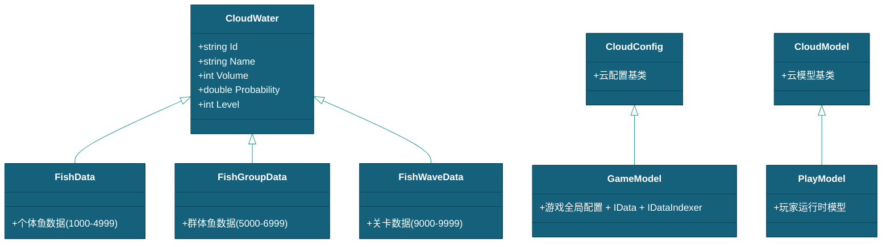

# 鱼与关卡数据配置说明

> 本文档描述 DragonBreakSea 的鱼种和鱼群数据的 JSON 配置格式。关卡（FishWaveData）的 FishEvent 详细配置请参见 [关卡配置说明](关卡配置说明.md)。
> 现状定位：三表已 Luban 原生化——本文所述 `StreamingAssets/` 各 JSON 目录（`FishData/`、`GroupData/`、`PathConfig/`、`FormationData/`、`WaveData/`、`ConditionEvent/`）已迁移，现行数据链为 `.duowei` 编辑源（`GameData/DuoWei/`）→ xlsx（`GameData/Xlsx/`）→ Luban 产物 `Assets/StreamingAssets/luban/cfg_tb*.json` → 模块主 Config（数据链全景见 [总体设计](../总体设计.md) §四）；关联模块 CloudModule 已退役（命中判定现由 DamageSystem 承担）。本文字段结构与 ID 段约定仍作数据结构参考。

---

## 一、所属

| 项目 | 内容 |
|------|------|
| 所属模块 | CloudModule |
| 关联系统 | FishSpawnSystem, WaveSystem |
| 关联数据 | FishData, FishGroupData, FishWaveData |
| 关联对象 | [鱼](../实体/鱼/鱼.md) |

---

## 二、FishData — 鱼种数据

### 2.1 数据结构

`FishData` 继承 `CloudWater`（拥有 `Id`、`Name`、`Volume` 基础字段）。

**文件位置：** `StreamingAssets/FishData/`（文件夹递归加载，可按文件/子文件夹拆分）

### 2.2 JSON 示例

```json
{
    "Id": 1001,
    "Name": "XiaoJianYu",
    "Volume": 2,
    "Probability": 0.5,
    "Level": 1,
    "Speed": 4,
    "Description": "小剑鱼",
    "ImagePath": "Image/FishHead/XiaoJianYu",
    "PathId": "d621f559dd584bc39685b731e8f6d818",
    "DeathRotationAngle": 60
}
```

### 2.3 字段表

| 字段                   | 类型      | JSON Key               | 必填  | 默认值     | 说明                                                                       |
| -------------------- | ------- | ---------------------- | --- | ------- | ------------------------------------------------------------------------ |
| `Id`                 | string   | `"Id"`                 | ✅   | —       | 唯一标识。1001-4999（普通鱼/奖励鱼/Boss 鱼）。代码中为 string，JSON 数字（如 `1001`）会自动转换 |
| `Name`               | string  | `"Name"`               | ✅   | —       | 鱼种名称（PascalCase）。用作 PawnModule 的 Spawn 键名（如 `Spawn<Fish>("XiaoJianYu")`） |
| `Volume`             | int     | `"Volume"`             | ✅   | —       | 基础云水值。参与命中概率计算（Probability = 1/Volume），值越大越难命中                           |
| `Probability`        | double  | `"Probability"`        | —   | `1/Volume` | CloudWater 继承字段。命中概率，由云引擎计算回写；JSON 中为序列化结果。Volume=0 时序列化为 `"Infinity"`（如美猴王 4012） |
| `Level`              | int     | `"Level"`              | —   | —       | CloudWater 继承字段。分类等级：1=普通、2=进阶、3=奖励、4=Boss、5=群变体、6=群组头/固定阵                 |
| `Speed`              | float   | `"Speed"`              | ✅   | —       | 移动速度（世界单位/秒）。Fish.SetData() 时会乘以 0.8~1.2 随机系数                            |
| `PathId`             | string  | `"PathId"`             | 否   | `""`    | 路径配置 GUID，引用 `PathConfig/RandomPathConfig/` 或 `CustomPathConfig/` 下的配置。空=使用 SplinePathSystem 默认随机路径参数 |
| `ImagePath`          | string  | `"ImagePath"`          | 否   | `""`    | 头像图片路径（`Resources/Image/` 下相对路径，不含扩展名，如 `Image/FishHead/XiaoJianYu`）。供 FishInfoModule 头像缓存显示 |
| `DeathRotationAngle` | float   | `"DeathRotationAngle"` | 否   | `60`    | 死亡时绕 Z 轴翻转角度（度）                                                          |
| `Description`        | string  | `"Description"`        | 否   | `""`    | 鱼种中文描述文本                                                                 |

> **注意：**
> - `CloudWater` 基类不包含 `Magnification` 字段，概率计算由 C++ 云引擎内部处理。
> - **路径几何参数（途经点数 `WaypointCount`、内外边界 `BoundInner/BoundOuter`）在 RandomPathConfig 中**，由 `PathId` 引用；FishData 不持有路径参数。

### 2.4 预制体对应关系（与 Resources/Actor/Fish/ 实际目录一致）

| 类型 | 目录 | 示例 |
|------|------|------|
| 基础鱼（1xxx-2xxx） | `Fish/Normal/Default/{Name}_Default.prefab` | `XiaoJianYu_Default` |
| 随机路线版（RandomPathSwim 排队） | `Fish/Normal/RandomPath/{Name}_Path.prefab` | `CiTun_Path`（挂 Fish + RandomPathSwim，QueueStable=1） |
| 奖励鱼（3xxx） | `Fish/Award/{Name}.prefab` | `HuangJinGui`、`PangXie_Drill/_Laser/_LeiShen`（螃蟹三变体） |
| 特效鱼（11xx/12xx/13xx） | `Fish/Award/Normal/{Name}_{Arrow\|Boom\|Rotate}.prefab` | `CiTun_Arrow/Boom/Rotate`（9 种鱼 × 3） |
| Boss 鱼（4xxx） | `Fish/Boss/{Name}.prefab`（含 `_Normal1/_Normal/_Purple/_Red` 后缀变体） | `Long_Normal1`、`MeiHouWang_Normal`、`MeiRenYu_Normal`、`QiongQi`、`ShuiJingJuXie_Purple/_Red` |
| 固定阵群 | `Fish/Group/{阵名}.prefab` | `十字刺鲨`、`小剑鱼炸鱼`、`金龟宝阵` |

### 2.5 文件组织（FishData/ 文件夹）

`FishData/` 文件夹递归加载，按分类拆分到独立文件：

| 文件 | 分类 | 实际内容（Id） | 说明 |
|------|------|--------------|------|
| `Normal.json` | 普通鱼 | 1001-1010 + **2004 电鳗** | 基础鱼种 + 电鳗（Level 1-2） |
| `Advanced.json` | 进阶鱼 | 2005/2007/2009 + **3001-3006** | 进阶鱼 + 部分奖励鱼（Level 2-3） |
| `Award.json` | 奖励鱼 | **2008 岩浆鲨** + 3007-3015 | 奖励鱼 + 岩浆鲨（Level 2-3，含 3013/3014/3015 三份同 Id 螃蟹） |
| `Boss.json` | Boss 鱼 | 4005-4014 | 带 Boss 标签（Level 4，4012 美猴王 Volume=0/Probability=Infinity） |
| `Effect/EffectArrow.json` | 特效鱼-箭头 | 1101-1107/1110/2104 | `_Arrow` 变体，复用普通 Fish 类 |
| `Effect/EffectBoom.json` | 特效鱼-爆裂 | 1201-1207/1210/2204 | `_Boom` 变体 |
| `Effect/EffectRotate.json` | 特效鱼-旋转 | 1301-1307/1310/2304 | `_Rotate` 变体 |

> **文件归属说明：** 文件按策划分类（Normal/Advanced/Award/Boss）拆分，**并非严格按 Id 段**——2004 电鳗在 `Normal.json`、2008 岩浆鲨在 `Award.json`、3001-3006 奖励鱼在 `Advanced.json`。Id 段规则（1xxx 普通 / 2xxx 进阶 / 3xxx 奖励 / 4xxx Boss）仍适用于 TriggerId 引用与 Cloud 键，但**文件归属以本表为准**。

> **特效鱼（Effect）说明：** 特效鱼是普通鱼的特效变体。**Id 规则与 JSON 一致：特效 Id = 基础 Id + 段偏移**（Arrow +100 / Boom +200 / Rotate +300，如小剑鱼 1001 → 1101/1201/1301；刺豚 1010 → 1110/1210/1310；电鳗 2004 → 2104/2204/2304），共覆盖 9 种基础鱼。JSON `Name` 复用基础鱼名（如 `"CiTun"`），预制体命名为 `{鱼名}_{Arrow/Boom/Rotate}`（基础预制体改名 `{鱼名}_Default`），运行时仍用 `Fish` 类 + `FreeSwim` 移动策略，仅外观/特效不同，配置字段与普通鱼一致。

---

## 三、FishGroupData — 鱼群数据（按数据子类拆分）

### 3.1 数据结构

`FishGroupData` 继承 `CloudWater`。鱼群作为概率云中的独立命中单元——任意群体成员被子弹命中时，以 `GroupDataId` 为 TargetId 查询概率云。

**文件位置：** `StreamingAssets/GroupData/{子类名}/`（子文件夹名 = 数据类名，递归加载）

**三类数据子类**（运行时按 `data.GetType()` 分发，不再用 GroupType 枚举）：

| 子类 | 文件夹 | 运行时类 | 说明 |
|------|--------|---------|------|
| `SchoolFishData` | `GroupData/SchoolFishData/` | `SchoolFish` | 群游，成员走 FreeSwim，路径按 PathId 或默认随机 |
| `FormationFishData` | `GroupData/FormationFishData/` | `FormationFish` | 严格阵型，`FormationId` 引用 FormationData（纯 2D 偏移） |
| `FixedFormationFishData` | `GroupData/FixedFormationFishData/` | `FixedFormationFish` | 预制体固定阵，继承 FormationFish；FormationId 空则回退子级偏移 |

### 3.2 JSON 示例

```json
{
    "Id": "5921",
    "Name": "刺豚阵_横排→",
    "Volume": 52,
    "FishId": "1010",
    "Count": 6,
    "KillMode": 0,
    "Speed": 2.5,
    "Description": "6条刺豚横排阵从左往右",
    "PathId": "b8760c41418343c8913120b7984ca7bb",
    "FormationId": "1f789caf69d34bc2bef07216663e110d"
}
```

### 3.3 基础字段（FishGroupData）

| 字段 | 类型 | JSON Key | 必填 | 默认值 | 说明 |
|------|------|----------|------|--------|------|
| `Id` | string | `"Id"` | ✅ | — | 唯一标识，4 位数字字符串。5001-56xx=群游，59xx=阵型变体，60xx=固定阵/组头，64xx=鱼潮阵 |
| `Name` | string | `"Name"` | ✅ | — | 群体名称。含 `_` 的注册为原型；不含 `_` 的作组头索引（FixedFormationFishData 除外，按名注册） |
| `Volume` | int | `"Volume"` | ✅ | — | 云水值。Probability = 1/Volume，值越大越难整体命中 |
| `FishId` | string | `"FishId"` | ✅ | — | 对应 FishData.Id，决定群内鱼的品种 |
| `Count` | int | `"Count"` | ✅ | `5` | 群体中的鱼数量 |
| `KillMode` | int | `"KillMode"` | 否 | `0` | 击杀模式：`0`=Individual（各鱼独立击杀），`1`=GroupKill（任一死亡则全群灭） |
| `Speed` | float | `"Speed"` | 否 | `0` | 群驱动移动速度。0=Formation 系 fallback 2f；School 系忽略（用鱼种 Ctx.Speed） |
| `PathId` | string | `"PathId"` | 否 | `""` | 路径配置 GUID，引用 RandomPathConfig / CustomPathConfig。空=默认随机路径参数。内外边界/途经点数在 RandomPathConfig 中 |
| `Description` | string | `"Description"` | 否 | `""` | 描述文本 |

### 3.4 子类字段

| 子类 | 字段 | 类型 | JSON Key | 说明 |
|------|------|------|----------|------|
| `SchoolFishData` | `SchoolOffsetRadius` | float | `"SchoolOffsetRadius"` | 跟随鱼路径散布半径，越大越松散 |
| `FormationFishData` | `FormationId` | string | `"FormationId"` | 阵型 GUID，引用 FormationData（纯 2D 偏移）。空=无阵型 |
| `FixedFormationFishData` | — | — | — | 继承 FormationFishData；FormationId 有则用 FormationData.Offsets，空则回退预制体子级偏移 |

### 3.5 组头与分组随机（Group Header）

每个鱼族 3 个组头（1 群 + 2 阵，`Count=0`、名称不含 `_`），**不注册原型池**，仅作随机分组的索引键（关卡用组头 Id 作 TriggerId 即可获得随机阵型效果）。共 24 个组头：

| ID | Name | 类型 | 随机范围 | 变体数 |
|:--:|------|:---:|---------|:---:|
| 5993 | 小剑鱼群 | 群 | 自由群 20 种 | 20 |
| 5994 | 小剑鱼阵 | 阵 | 阵形群 72 种 | 72 |
| 5995 | 小剑鱼随机阵 | 全 | 全族 92 种 | 92 |
| 5996 | 海马群 | 群 | 自由群 20 种 | 20 |
| 5997 | 海马阵 | 阵 | 阵形群 72 种 | 72 |
| 5998 | 海马随机阵 | 全 | 全族 92 种 | 92 |
| 5999 | 凤尾鱼群 | 群 | 自由群 20 种 | 20 |
| 6002 | 凤尾鱼阵 | 阵 | 阵形群 72 种 | 72 |
| 6003 | 凤尾鱼随机阵 | 全 | 全族 92 种 | 92 |
| 6004 | 蝴蝶鱼群 | 群 | 自由群 20 种 | 20 |
| 6005 | 蝴蝶鱼阵 | 阵 | 阵形群 72 种 | 72 |
| 6006 | 蝴蝶鱼随机阵 | 全 | 全族 92 种 | 92 |
| 6007 | 尖嘴鱼群 | 群 | 自由群 20 种 | 20 |
| 6008 | 尖嘴鱼阵 | 阵 | 阵形群 72 种 | 72 |
| 6009 | 尖嘴鱼随机阵 | 全 | 全族 92 种 | 92 |
| 6010 | 神仙鱼群 | 群 | 自由群 20 种 | 20 |
| 6011 | 神仙鱼阵 | 阵 | 阵形群 72 种 | 72 |
| 6012 | 神仙鱼随机阵 | 全 | 全族 92 种 | 92 |
| 6013 | 小丑鱼群 | 群 | 自由群 20 种 | 20 |
| 6014 | 小丑鱼阵 | 阵 | 阵形群 72 种 | 72 |
| 6015 | 小丑鱼随机阵 | 全 | 全族 92 种 | 92 |
| 6016 | 刺豚群 | 群 | 自由群 20 种 | 20 |
| 6017 | 刺豚阵 | 阵 | 阵形群 72 种 | 72 |
| 6018 | 刺豚随机阵 | 全 | 全族 92 种 | 92 |

**工作原理：**

```text
Spawn("蝴蝶鱼阵") → 池中精确匹配 "蝴蝶鱼阵" 失败（组头不注册）
                 → 前缀分组查找 {蝴蝶鱼阵_横排阵→, 蝴蝶鱼阵_圆阵↑, ...}
                 → 随机选一变体生成
```

PawnModule 分组随机按 `SpawnWeight` 加权，权重 0 的变体不会随机出现。

### 3.6 固定阵清单（FixedFormationFishData）

预制体固定阵：子级即鱼，`FormationId` 空则回退子级位置。**Name 无 `_` 也注册原型（不按组头处理）**：

| ID | Name | FishId | Count | KillMode | Volume | 说明 |
|:--:|------|:---:|:---:|:---:|:---:|------|
| 6001 | 小剑鱼炸鱼 | 1001 | 3 | 1(群杀) | 50 | 炸鱼特效固定阵 |
| 6020 | 十字刺鲨 | 1001 | 5 | 0 | 0 | 十字刺鲨固定阵（9111 已删除，现无引用方，待确认是否保留） |

### 3.7 鱼潮专用阵型（6401-6414）

鱼潮关卡使用 `GroupData/FormationFishData/WaveFormationData.json` 的 14 条大阵型（6401-6414），Count 较大（10-62），按固定出入口编排（完整几何见策划 [[9101_龙宫鱼潮]]）：

| Id | Name | FishId | Count |
|:--:|------|:---:|:---:|
| 6401 | 矩形轮廓_20×10_左→右 | 1001 | 56 |
| 6402 | 实心圆_r4_左→右 | 1010 | 20 |
| 6403 | 竖排×40_左→右 | 1003 | 10 |
| 6404 | 4×4填充_左→右 | 1006 | 16 |
| 6405-6408 | 矩形环分层（20×12/16×8/12×4/…） | 1001 | 60/44/28/16 |
| 6409 | 4×4填充_v2 | 1006 | 16 |
| 6410-6413 | 椭圆环分层（24×14/20×10/16×6/…） | 1003 | 62/50/37/27 |
| 6414 | 椭圆填充_6×3_下→上 | 1006 | 20 |

> ⚠️ 阵型几何（Count/方向/尺寸）以 `WaveFormationData.json` 实际值为准，本表为索引。

### 3.8 RandomPathConfig — 随机路径配置

**位置：** `StreamingAssets/PathConfig/RandomPathConfig/{名}.json`（**GUID Id**，被 `PathId` 引用）

| 字段 | 类型 | 说明 |
|------|------|------|
| `Id` | string | GUID（32 hex） |
| `Name` | string | 配置名，如 `随机_内-3外-2_1点` |
| `BoundInner` / `BoundOuter` | Vector2 | 起终点生成边界带（相对 HalfSize，如 内3外5 = 屏内3单位到屏外5单位）。zero=回退鱼/群默认 |
| `WaypointCount` | int | 途经点数，0=直线（起终点在边界带内随机） |

**文件清单（18 个，2026-08-12 事实源）：**

| 文件名 | 边界带 | 途经点数 |
|--------|--------|---------|
| `随机_内2外4_4点` / `_5点` / `_8点` | 内2 ~ 外4 | 4 / 5 / 8 |
| `随机_内-3外-2_1点` | 内-3 ~ 外-2 | 1 |
| `随机_内3外5_5点` / `_7点` / `_8点` | 内3 ~ 外5 | 5 / 7 / 8 |
| `随机_内5外5_2点` | 内5 ~ 外5 | 2 |
| `随机_内5外7_2点` / `_3点` / `_5点` | 内5 ~ 外7 | 2 / 3 / 5 |
| `随机_内8外10_1点` | 内8 ~ 外10 | 1 |
| `随机直线_内15外16` / `_内3外4` / `_内3外5` / `_内5外7` / `_内8外9` / `_内8外10` | 内X ~ 外Y | 0（直线） |

### 3.9 CustomPathConfig — 自定义路径配置

**位置：** `StreamingAssets/PathConfig/CustomPathConfig/{名}.json`（**GUID Id**，被 `PathId` 引用）

| 字段 | 类型 | 说明 |
|------|------|------|
| `Id` | string | GUID |
| `Name` | string | 配置名，如 `直线_左到右_(-30,0)` |
| `Points` | Vector2[] | 完整 2D 路径点（含起终点，世界偏移）。由编辑器从场景 SplineContainer 导出 |

**文件清单（36 个，按子文件夹分组，2026-08-12 事实源）：**

| 子文件夹 | 文件 | 说明 |
|---------|------|------|
| `圆/`（3） | `圆3_1.5圈` / `圆3_2.5圈` / `圆3_3.5圈` | 半径 3 的圆，1.5/2.5/3.5 圈 |
| `弦/`（2） | `正弦_0.5周` / `正弦_1周` | 正弦曲线路径 |
| `直线/`（23） | `上-下_X{0,-4,4,-7.5,7.5}_17.5`、`下-上_X{0,-4,4,-7.5,7.5}_17.5`、`右-左_Y{0,-3.5,3.5}_17.5`、`左-右_Y{0,-3.5,3.5}_17.5`、`右上-左下_17.5`、`右下-左上_17.5`、`左上-右下_17.5`、`左下-右上_17.5`、`左-_右 Y-5`、`左-_右 Y5`、`直线_左到右_(-30,0)` | 各方向直线穿越（X/Y 为偏移，17.5 为路径半长） |
| `螺旋/`（8） | `等距螺旋_{2,3,4,5}圈_{内-外,外-内}` | 等距螺旋，圈数 2-5，内→外 / 外→内 |

> 路径文件名可含空格/括号（如 `左-_右 Y5`、`直线_左到右_(-30,0)`），由 GUID Id 引用，文件名仅作显示。

### 3.10 FormationData — 阵型数据

**位置：** `StreamingAssets/FormationData/{Custom|形状}/`（**GUID Id**，被 `FormationId` 引用）

| 字段 | 类型 | 说明 |
|------|------|------|
| `Id` | string | GUID |
| `Name` | string | 阵型名，如 `十字_9条` |
| `Shape` | string | 形状描述（圆/椭圆/矩形/直线/V形/随机/十字/弧形/蚊香/正弦/摆位） |
| `Offsets` | Vector2[] | 纯 2D 位置偏移（相对锚点，长度须与群 Count 一致） |

**目录约定：** 预制体子级转换 → `Custom/`；图形参数生成 → `对应形状/`（如 `圆/`、`十字/`）。

**文件清单（24 个，2026-08-12 事实源）：**

| 子文件夹 | 文件 | 说明 |
|---------|------|------|
| `Custom/`（2） | `十字刺鲨`、`金龟宝阵` | 预制体子级转换的阵型（配合 FixedFormationFishData 十字刺鲨 / 金龟宝阵） |
| `V形/`（1） | `V形_7条` | 7 条 V 形 |
| `十字/`（1） | `十字_9条` | 9 条十字 |
| `圆/`（2） | `圆_8条`、`圆_20条` | 8/20 条圆形 |
| `椭圆/`（6） | `椭圆_10条`、`_20条`、`_27条`、`_37条`、`_50条`、`_62条` | 椭圆 10-62 条 |
| `直线/`（3） | `直线_5条`、`_6条`、`_10条` | 直线 5/6/10 条 |
| `矩形/`（8） | `矩形_12条`、`_16条`、`_16条_2`、`_16条_3`、`_28条`、`_44条`、`_56条`、`_60条` | 矩形网格（16 条有三个变体） |
| `随机/`（1） | `随机_8条` | 8 条随机散布 |

> **注意：** 路径/阵型配置**均不进 WaterDict**，由 SplinePathSystem 按 GUID 加载进私有字典，与概率云解耦。`FishGroupConfig`（图形参数）仅编辑器工具用其生成 Offsets，不 Json 化。

---

## 四、FishWaveData — 关卡数据（概要）

关卡数据的完整 FishEvent/SceneEvent 配置请参见 **[关卡配置说明](关卡配置说明.md)**。本节仅列出 FishWaveData 的顶层结构（事件定义存于条件事件库，本类只存时序 Timeline）。

### 4.1 数据结构

`FishWaveData` 继承 `CloudWater`。ID 段为 **9000-9999**（标准关 90xx + 鱼潮关 91xx~99xx，见 [关卡配置说明](关卡配置说明.md) §九），存储在 `StreamingAssets/WaveData/` 文件夹下（Startand/ 常规 + Award/ 鱼潮）。

### 4.2 顶层字段

| 字段 | 类型 | JSON Key | 必填 | 说明 |
|------|------|----------|------|------|
| `Id` | string | `"Id"` | ✅ | 关卡唯一标识（9001-9999：标准关 90xx、鱼潮关 91xx~99xx）。代码中为 string，JSON 中用字符串（如 `"9001"`）。Cloud 引擎以 `"{Id}start"` 为键存储 |
| `Name` | string | `"Name"` | ✅ | 关卡显示名称 |
| `Volume` | int | `"Volume"` | — | 关卡初始总价值（CloudWater 继承）。`VolumeForNext > 0` 时作为扣减基数 |
| `Duration` | float | `"Duration"` | — | 关卡时长（秒）。`0`=不限时 |
| `SceneId` | string | `"SceneId"` | — | 匹配 WaveScene 预制体的 SceneId。空字符串=无场景动画 |
| `VolumeForNext` | int | `"VolumeForNext"` | — | 切关价值阈值。`> 0` 且扣减至 ≤0 触发切关 |
| `NextLevelId` | string | `"NextLevelId"` | — | 指定下一关 ID。空=从关卡池随机选取 |
| `Events` | FishEvent[] | `"Events"` | ✅ | 鱼生成事件队列（可为空数组） |
| `Profile` | CycleProfile | `"Profile"` | — | 云周期节奏配置（见下方 4.3） |

### 4.3 周期配置（CycleProfile）

| 字段 | 类型 | JSON Key | 默认值 | 说明 |
|------|------|----------|--------|------|
| `Type` | int | `"Type"` | `0` | `0`=Standard（标准），`1`=Variation（变奏），`2`=FishTide（鱼潮放分） |
| `Intensity` | float | `"Intensity"` | `1.0` | 程度（0.1~3.0） |
| `TargetRaindropsOverride` | int | `"TargetRaindropsOverride"` | `-1` | 目标抽水点覆盖（-1=使用全局 SystemConfig 值） |

### 4.4 FishEvent / SceneEvent

FishEvent 和 SceneEvent 的完整字段说明（含条件触发、链触发、循环、事件监听等机制）及 JSON 配置示例，请参见 **[关卡配置说明](关卡配置说明.md)**。

---

## 五、AwardFish 特殊说明

AwardFish（奖励鱼/Boss 鱼）与普通鱼有以下关键差异，需在配置时特别注意。

### 5.1 Volume 价值计算

AwardFish 的 `Volume` 在 `FishData.json` 中仅为**初始基础值**。实际命中价值由预制体 Inspector 上配置的 `RewardParamDef[]` 在 `SetData` 时运行时滚值叠加：

```csharp
// AwardFish.RollRewardParams() —— SetData 时自动调用
foreach (var def in m_RewardParamDefs)               // 预制体 Inspector 配置
{
    def.RolledValue = Random.Range(def.Min, def.Max + 1);              // ① 均匀随机
    def.RolledValue = Round(def.RolledValue * (0.5 + health * 0.5));   // ② 池控偏置
    switch (def.Operation)                                              // ③ 叠加到 Volume
    {
        Add:      Data.Volume += def.RolledValue;
        Subtract: Data.Volume = Max(2, Data.Volume - def.RolledValue);
        Multiply: Data.Volume *= def.RolledValue;
        Divide:   Data.Volume /= def.RolledValue;
    }
}
```

| 配置来源 | 说明 |
|----------|------|
| `FishData.json` → `Volume` | 初始基础值（对 AwardFish 仅参考，会被滚值覆盖） |
| 预制体 → `RewardParamDef[].Min/Max` | 每个参数的随机范围，决定滚值上下限 |
| 预制体 → `RewardParamDef[].Operation` | Add/Sub/Mul/Div 叠加方式 |
| 运行时 → `GetPoolHealth()` | `GlobelModel.Gather/Release` 计算 0~1 偏置系数 |

### 5.2 各 AwardFish 预制体随机属性配置

以下为 `Resources/Actor/Fish/Award/` 和 `Boss/` 下各预制体**当前实际值**（JSON 中 Volume 不作数）：

| 鱼种 | Key | Min | Max | Op | ScoreKey | 备注 |
|------|-----|-----|-----|-----|----------|------|
| 雷神蟹 | 连击1 | 80 | 320 | Add | 分数1 | 单参数大区间 |
| 聚宝盆 | 底分 | 30 | 120 | Add | 跳分总分 | — |
| | 目标分 | 30 | 120 | Add | 跳分总分 | — |
| | 倍率 | 2 | 9 | **Mul** | 最终总分 | — |
| 美猴王 | 爆分数量 | 10 | 15 | Add | 分数1 | 小底线 |
| | 连击数1 | 100 | 320 | Add | 分数1 | — |
| | 连击数2 | 100 | 320 | Add | 分数2 | — |
| | 连击数3 | 100 | 320 | Add | 分数3 | — |
| 龙 | 连击数1 | 100 | 450 | Add | 总分1 | — |
| | 倍率1 | 1 | 9 | **Mul** | 最终总分 | — |
| 美人鱼 | 爆分1 | 80 | 240 | Add | 总分1 | 两项汇总 |
| | 连击数1 | 100 | 320 | Add | 总分1 | — |
| | 倍率1 | 1 | 9 | **Mul** | 最终总分 | — |
| 海盗 | 连击1 | 80 | 240 | Add | 分数1 | 两段累分 |
| | 连击2 | 100 | 320 | Add | 分数2 | — |
| | 倍数1 | 1 | 10 | **Mul** | 分数3 | 倍率叠加 |
| 天王 | 连击1 | 60 | 240 | Add | 分数1 | 四段独立 |
| | 连击2 | 80 | 320 | Add | 分数2 | — |
| | 连击3 | 100 | 400 | Add | 分数3 | — |
| | 倍数1 | 1 | 9 | **Mul** | 分数4 | 倍率叠加 |
| 凤凰 | 连击1 | 100 | 320 | Add | 分数1 | — |
| | 倍数2 | 1 | 6 | **Mul** | 分数2 | 倍率叠加 |
| | 连击3 | 200 | 400 | Add | 分数3 | — |
| 武则天 | 连击1 | 120 | 320 | Add | 分数1 | — |
| | 连击2 | 2 | 6 | **Mul** | 分数2 | 倍率叠加 |
| | 连击3 | 200 | 400 | Add | 分数3 | — |

> **注意：** 美猴王的 `Normal` 和 `Fly` 变体参数相同；龙的变体仅保留 `Long_Normal1`。

**未配置随机属性（`m_RewardParamDefs: []`，价值由 JSON Volume 决定）：**

| 类别 | 鱼种 |
|------|------|
| Award 鱼 | 紫金葫芦、钻头螃蟹、激光螃蟹、狂战先锋、黄金龟、金鎏鲨、金灯笼鱼、金蟾、金魔鱼、金钱龟、龙转盘、密码桶、玉玺、虾、食人鱼、岩浆鲨 |
| Boss 鱼 | 鳄鱼、财神爷、穷奇、水晶巨蟹(紫)、水晶巨蟹(红) |

### 5.3 在场时间

AwardFish 不走出界回收，在场时长由预制体上配置的移动策略决定。

**FreeSwim 类（匀速 Spline，时间 = Length ÷ Speed）：**

| 鱼种 | Speed | WPC | SegMin/Max | Bend |
|------|-------|-----|-----------|------|
| 紫金葫芦 | 0 | 1 | 6/12 | 60° |
| 金灯笼鱼 | 0 | 3 | 6/12 | 60° |
| 狂战先锋 | 0 | 3 | 6/12 | 60° |
| 海盗 | 0 | 1 | 6/12 | 60° |
| 天王 | 2 | 1 | 6/12 | 60° |
| 武则添 | 0 | 1 | 6/12 | 60° |
| 财神爷 | 0 | 0 | 6/12 | 60° |
| 穷奇 | 0 | 0 | 6/12 | 60° |
| 凤凰 | 0 | 0 | 6/12 | 60° |
| 鳄鱼 | 2 | 0 | 6/12 | 60° |
| 玉玺 YuXi | 0 | 1 | 6/12 | 60° |

**Dash 类（分段冲刺，时间 = SegmentCount × 段时长）：**

| 鱼种  | Speed | WPC | Seg   | Bend | AnimSpd | AnimDur | DashStart | Curve |
| --- | ----- | --- | ----- | ---- | ------- | ------- | --------- | ----- |
| 黄金龟 | 2     | 8   | 6/12  | 90°  | 0.8     | 2       | 0.96      | 1.19  |
| 金钱龟 | 0     | 8   | 10/16 | 90°  | 0.7     | 2.667   | 0.1       | 1.59  |
| 金魔鱼 | 0     | 8   | 5/8   | 45°  | 1.1     | 2       | 1.333     | 1.2   |
| 金蟾  | 0     | 3   | 2/4   | 40°  | 1       | 0.67    | —         | —     |

**CrabMove 类（中点变速，时间 = Length ÷ 平均速度）：**

| 鱼种 | Speed | WPC | Seg | Bend | SlowBase | Trans | AnimRange | Follow |
|------|-------|-----|-----|------|----------|-------|-----------|--------|
| 雷神蟹 | 0 | 1 | 6/12 | 140° | 0.15 | 0.3 | 1.2~2 | 0.8 |
| 激光螃蟹 | 0 | 3 | 6/12 | 140° | 0.15 | 0.3 | 1.2~2 | 0.8 |
| 钻头螃蟹 | 0 | 3 | 6/12 | 140° | 0.15 | 0.3 | 1.2~2 | 0.8 |

**Boss 类（专用策略，时长由动画决定）：**

| 鱼种 | 策略 | Speed | WPC | SegMin/Max | Bend | Anim |
|------|------|-------|-----|-----------|------|------|
| 美猴王 Normal | MonkeyKingMoveAnimated | 5 | 0 | 6/12 | 120° | 1 |
| 美猴王 Fly | MonkeyKingMove | 5 | 0 | — | — | — |
| 美人鱼 | MeiRenYuMove | 0 | 0 | — | — | — |
| 龙 Normal | (空) | 0 | 0 | — | — | — |
| 龙 Normal1 | LongMoveAnimated | 0 | 0 | — | — | — |
| 龙 CrossThrough | (空) | 0 | 0 | — | — | — |

**AnimationBaseSpeed 类（Fish 组件上的动画基准速度，预制体未配置 MoveStrategy 参数，策略走 SplinePathSystem 默认路径，时间由 JSON FishData 的 Speed/WaypointCount 决定）：** 聚宝盆(JBP)、金鎏鲨、虾、岩浆鲨、密码桶、食人鱼、龙转盘 — `AnimationBaseSpeed: 3`。

> Speed=0 表示取 JSON 中 FishData.Speed，WPC=WaypointCount=0 同样取 JSON。SegMin/SegMax 决定段长（越短转弯越频繁），配合 Speed 共同影响场留时长。

### 5.4 Boss 标签

```csharp
// BulletCommand.DirectHitFish.HitFish()
if (fish.CompareTag("Boss"))
{
    aFish.AwradPlayerId = playerId;
    fish.ChangeState(FishState.Killed);  // 绕过概率云，命中必死
}
```

**Boss 鱼预制体必须设置 Tag = "Boss"**，否则走普通概率云判定，极大概率未命中。

---

## 六、Cloud 数据模型继承



---

## 七、ID/Key 命名约定

### 7.1 Id 段分配

| 段 | 类型 | 范围 | 备注 |
|----|------|------|------|
| 1000-4999 | 个体鱼数据 | `1001` ~ `4999` | FishData/ 文件夹（Id 为数字格式）。11xx/12xx/13xx=特效鱼变体，与基础段位共用前缀 |
| 5000-6999 | 群体数据 | `5001` ~ `6999` | GroupData/{子类}/。5001-56xx=群游，59xx=阵型变体，60xx=固定阵/组头，64xx=鱼潮阵 |
| — | 路径配置 | GUID | PathConfig/{RandomPathConfig,CustomPathConfig}/。不进 WaterDict |
| — | 阵型配置 | GUID | FormationData/{Custom,形状}/。不进 WaterDict |
| 9000-9999 | 关卡数据 | `9001` ~ `9999` | WaveData/*.json |
| 9101~9110 | 鱼潮关卡 | `9101`~`9110` | `WaveData/Award/` 下的鱼潮关（9101 龙宫鱼潮 / 9102 希腊神话鱼潮 / … / 9110 水下遗址-景海鱼潮）；9501/9511 为已弃用 ID（旧规划） |

### 7.2 Cloud 引擎键规则

Cloud 引擎将配置数据以 **桶=Id 前 4 位、内键=`"{Id}start"`** 存进 `WaterDict`。**4 位前缀须全量唯一**，同前缀不同条目会静默覆盖。

| Key 模式 | 映射到 | 示例 |
|----------|--------|------|
| `"{Id}start"` | FishData 注册 | `"1001start"` → FishData（小剑鱼） |
| `"{Id}start"` | FishGroupData 注册 | `"5921start"` → FormationFishData（Newtonsoft 手动注册） |
| `"{Id}start"` | FishWaveData 注册 | `"9001start"` → FishWaveData（龙宫海域） |
| `"{Id}_{GUID}"` | 个体鱼运行时克隆 | `"1001_a1b2c3..."` → FishData.Clone() 副本 |
| GUID 键 | 路径/阵型配置 | SplinePathSystem 私有字典，不进 WaterDict |

> **注意：** 群数据由 `GameModel.LoadGroupDir<T>` 用 Newtonsoft 反序列化子类后手动注册（DLL `InitCloudWater<T>` 只填基类字段，会丢子类 FormationId 等）。

### 7.3 名称约定

| 约定 | 说明 |
|------|------|
| `FishData.Name` = 变体前缀 | `"XiaoJianYu"` 对应分组 `Fish/Normal/Default/XiaoJianYu_Default.prefab`（基础）/ `_Path`（随机路线）/ `_Arrow/Boom/Rotate`（特效） |
| `"{Name}"` = Spawn 键 | `PawnModule.Spawn<Fish>("XiaoJianYu")` |
| `"{Name}Award"` = 奖励特效 | `"MeiHouWangAward"` 对应 AwardEffect 预制体 |
| 群体 Spawn 键 = `FishGroupData.Id` | `"5001"` 作为群体生成键 |
| Boss 变体用 `_` 后缀 | `"MeiHouWang_Normal"` / `"MeiHouWang_Fly"` → 分组池随机选取 |

---

## 八、文件组织与加载

### 8.1 目录结构

```
StreamingAssets/
├── FishData/                      ← 鱼种数据（文件夹递归加载，可按文件/子文件夹拆分）
│   ├── Normal.json                ← 普通鱼（1xxx-2xxx）
│   ├── Advanced.json              ← 进阶鱼（2xxx-3xxx）
│   ├── Award.json                 ← 奖励鱼（3xxx）
│   ├── Boss.json                  ← Boss 鱼（4xxx）
│   └── Effect/                    ← 特效鱼（11xx/12xx/13xx，复用普通 Fish 类）
│       ├── EffectArrow.json       ← _Arrow 变体
│       ├── EffectBoom.json        ← _Boom 变体
│       └── EffectRotate.json      ← _Rotate 变体
│
├── GroupData/                     ← 鱼群数据（子文件夹名 = 数据类名，递归加载）
│   ├── SchoolFishData/            ← 群游数据（含组头/变体）
│   ├── FormationFishData/         ← 阵型数据（含 WaveFormationData 鱼潮阵）
│   └── FixedFormationFishData/    ← 预制体固定阵（如小剑鱼炸鱼）
│
├── PathConfig/                    ← 路径配置（GUID Id，被 PathId 引用，不进 WaterDict）
│   ├── RandomPathConfig/          ← 随机路径（内外边界 + 途经点数，18 个文件）
│   ├── CustomPathConfig/          ← 自定义路径（2D 点，从场景 Spline 导出；圆/弦/直线/螺旋 4 子文件夹，36 个文件）
│   └── ShapePathConfig/           ← 形状路径（预留空目录）
│
├── FormationData/                 ← 阵型配置（GUID Id，被 FormationId 引用，不进 WaterDict）
│   ├── Custom/                    ← 预制体子级转换的阵型
│   └── 圆/ 椭圆/ 矩形/ 十字/ ...  ← 图形参数生成的阵型（按形状分文件夹）
│
├── ConditionEvent/                ← 条件事件库（FishEvent 定义，GUID EventId，跨关卡复用）
│   ├── Stand/                     ← 标准事件（按 TriggerId 首数字分文件 1xxx~6xxx）
│   ├── Chain/                     ← 链事件（每个逻辑事件链一个 JSON）
│   └── Award/                     ← 鱼潮事件（FixedFormationFish + 按关卡分文件夹）
│
└── WaveData/                      ← 关卡数据（按关卡拆分，递归加载）
    ├── Startand/                  ← 常规关卡（9001-9010）
    ├── Award/                     ← 鱼潮关卡（9101~9110）
    └── Test/                      ← 测试关卡（有 JSON 时仅加载 Test，其余忽略）
```

> **说明：** 鱼群数据统一放 `GroupData/`、关卡数据统一放 `WaveData/`（根目录不放单体 JSON 文件），递归扫描加载。路径/阵型配置独立于 WaterDict，由 SplinePathSystem 按 GUID 持有。

### 8.2 加载方式

`GameModel.OnConfigInit()` 中的加载顺序，使用 `SearchOption.AllDirectories` 递归扫描子文件夹：

| 顺序 | 类型 | 路径 | 方式 |
|------|------|------|------|
| 1 | FishData | `StreamingAssets/FishData/` | 文件夹递归 `InitCloudWater<FishData>(file)`，兼容根目录 FishData.json |
| 2 | FishGroupData | `StreamingAssets/GroupData/{子类}/` | `GameModel.LoadGroupDir<T>` 按子文件夹名分发，Newtonsoft 反序列化子类后手动注册进 WaterDict |
| 3 | FishWaveData | `StreamingAssets/WaveData/` | 递归扫描，每个 `.json` 文件独立加载 `InitCloudWater<FishWaveData>(file)` |
| 4 | 路径/阵型配置 | `PathConfig/`、`FormationData/` | `SplinePathSystem.LoadConfigs()` 按 GUID 加载进私有字典（不进 WaterDict） |

### 8.3 配置编辑器（双窗口）

所有 JSON 配置通过两个 Unity 编辑器窗口可视化编辑，无需手写 JSON：

| 编辑器 | 菜单入口 | 管理数据 | 文件夹 |
|--------|---------|---------|--------|
| **角色编辑器** | `游戏配置/角色编辑器` | 鱼种 FishData + 三类群（群游/阵型/固定阵） | `FishData/`、`GroupData/{子类}/` |
| **关卡编辑器** | `游戏配置/关卡编辑器` | 关卡 FishWaveData + 条件事件 ConditionEvent + 阵型 Formation + 路径 Path | `WaveData/`、`ConditionEvent/`、`FormationData/`、`PathConfig/` |

**角色编辑器（FishDataEditorWindow）：** 4 个标签页——鱼种 FishData / 群游 SchoolFishData / 阵型 FormationFishData / 固定阵 FixedFormationFishData。文件级文件夹树（文件夹→JSON→条目三级），按 `Id` 自动分配，鱼种 Id 保存保持数字格式。

**关卡编辑器（LevelConfigWindow）：** 4 个标签页——关卡 Level / 条件事件 ConditionEvent / 阵型 Formation / 路径 Path。关卡与条件事件为文件夹树；阵型与路径为独立编辑视图（图形参数生成 Offsets、Spline 导出 2D 点）。条件事件自动生成 GUID EventId + 空 Name（策划填名称），时序/链引用下拉显示 Name、存 GUID。

> **编辑器与手写 JSON 关系：** 编辑器直接读写上述文件夹的 JSON 文件，两者等价。编辑器负责 GUID 生成、Id 分配、PathId/FormationId/EventId 下拉引用，避免手写错误。

### 8.4 策划配置指南

| 操作 | 做法 | 注意事项 |
|------|------|---------|
| **新增/修改鱼种** | 角色编辑器（游戏配置/角色编辑器）编辑 FishData | 放在 `StreamingAssets/FishData/` 下，可按文件/子文件夹拆分 |
| **新增群** | 角色编辑器在对应子类文件夹下新建文件，填 Id/Count/PathId/FormationId | 放到 `GroupData/{SchoolFishData\|FormationFishData\|FixedFormationFishData}/` |
| **群按文件夹分级** | 在子类文件夹下建子文件夹，JSON 移入 | ✅ 运行时递归加载，编辑器按文件夹树显示 |
| **新增路径配置** | 关卡编辑器（游戏配置/关卡编辑器）「路径」标签：RandomPathConfig 创建 / Spline 导出 CustomPathConfig | 保存到 `PathConfig/{RandomPathConfig,CustomPathConfig}/`，GUID Id |
| **新增阵型** | 关卡编辑器「阵型」标签：预制体子级→`Custom/`，图形参数→对应形状文件夹 | 保存到 `FormationData/`，GUID Id |
| **新增关卡** | 在 `WaveData/Startand/`（常规）或 `WaveData/Award/`（鱼潮）下新建 `{关卡名}.json` | 文件名任意，内容为 `FishWaveData[]` 数组格式（通常一个文件一个关卡） |
| **文件生效** | 放在对应文件夹下任意子文件夹 | ✅ 递归扫描（`SearchOption.AllDirectories`），子文件夹内 JSON 会被加载 |

### 8.4 文件格式要求

每个文件夹内的 JSON 文件都必须是**数组格式**（`[{...}]`），与根目录的单体文件格式一致：

```json
// GroupData/FengWeiYuGroupData.json — ✅ 正确（Id 为字符串）
[
    { "Id": "5100", "Name": "凤尾鱼自由群", ... },
    { "Id": "5101", "Name": "凤尾鱼V字阵", ... }
]

// WaveData/Startand/9001_龙宫海域.json — ✅ 正确（Id 为字符串）
[
    { "Id": "9001", "Name": "龙宫海域", ... }
]
```

---

## 九、相关文档

- [关卡配置说明](关卡配置说明.md) — FishWaveData 的 FishEvent/SceneEvent 完整字段说明与 JSON 配置示例
- [场景流程](../流程与视觉/流程/场景流程/场景流程.md) — SceneFlow 关卡循环、WaveSystem 系统
- [鱼](../实体/鱼/鱼.md) — Fish/FishGroup/AwardFish 对象说明
- [游戏参数配置说明](../数据配置/游戏参数配置说明.md) — GameModel/PlayModel/SystemConfig
