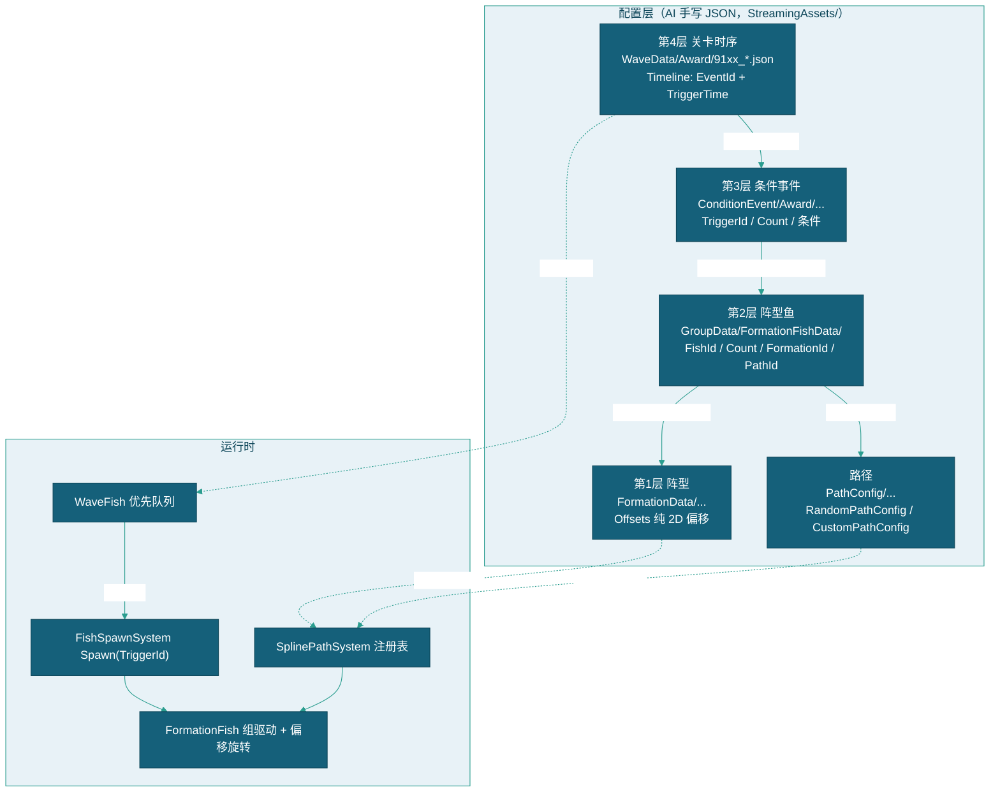

# 鱼潮阵型配置说明

> 本文档是 **91xx 鱼潮关卡的 JSON 编写规范**，面向各岗位 AI 开发人员与策划：明确四层 JSON（阵型/阵型鱼/条件事件/关卡时序）写什么、写在哪、怎么校验。字段全量定义以 [鱼与关卡数据配置说明](../鱼与关卡数据配置说明.md) 与 [关卡配置说明](../关卡配置说明.md) 为准，本文只写鱼潮场景的约定与补充。
> 现状定位：鱼潮阵型/事件的编辑载体已随三表 Luban 原生化迁移至 `.duowei` 编辑源 → xlsx → Luban 产物（本文 JSON 目录结构为概率制时代路径）；阵型设计规范、ID 段约定、坐标换算公式与断链校验政策仍为现行有效基准。关联模块 CloudModule 已退役（命中判定现由 DamageSystem 承担）。

---

## 一、定位与结论

1. **鱼潮阵型 = 纯 JSON 闭环，零代码改动**。图形阵型参数（`FishGroupConfig`：圆/椭圆/矩形/十字…）仅被编辑器工具（关卡编辑器「阵型」标签）消费以生成偏移；**运行时只认 `FormationData.Offsets`（纯 2D 偏移）**。因此 AI 开发人员手写点位 JSON 是一等公民路径。
2. **GUID 保留**：`FormationData.Id` / `EventId` / `PathId` 一律使用 32 位 hex GUID（全局唯一），不用可读 ID——为后续数据迁入数据库预留（数据库主键天然适合 GUID）。
3. **断链必须报错**：引用链断裂（阵型/路径/事件/鱼种引用不到）与 `Count ≠ Offsets 长度` 一律 `LogError` 醒目提醒，不允许静默降级（见 [七、断链与硬校验清单](#七断链与硬校验清单)）。

## 二、四层 JSON 总览



| 层 | 事实源目录 | 数据类 | 加载器 / 存储键 | 职责 |
|---|---|---|---|---|
| 1 阵型 | `FormationData/{形状|Custom}/`（可递归子文件夹） | `FormationData` | `SplinePathSystem.LoadConfigs` → 私有字典按 `Id` | 纯点位，与鱼种/路径解耦，跨群复用 |
| 2 阵型鱼 | `GroupData/FormationFishData/` | `FormationFishData` | `GameModel` → Cloud `"{Id}start"` | 阵型 + 鱼种 + 数量 + 路径 + 群速的组合 |
| 3 条件事件 | `ConditionEvent/Award/{关卡名}/` | `FishEvent` | `WaveSystem.LoadConditionEvents` → 按 `EventId` | 何时/何条件生成什么，跨关卡复用 |
| 4 关卡时序 | `WaveData/Award/` | `FishWaveData` | `GameModel` → Cloud `"{Id}start"` | 本关的时序排布（引用第 3 层 GUID） |

---

## 三、阵型 JSON（FormationData）

### 3.1 字段表

| 字段 | 类型 | JSON Key | 必填 | 说明 |
|------|------|----------|------|------|
| `Id` | string | `"Id"` | ✅ | 32 位 hex GUID，全局唯一（被 `FormationId` 引用，见 [八、ID 与命名约定](#八id-与命名约定)） |
| `Name` | string | `"Name"` | ✅ | 可读显示名，建议 `潮_{鱼种}_{图形}_{规格}`，如 `潮_小剑鱼_矩形环_20x12` |
| `Shape` | string | `"Shape"` | — | 形状描述（圆/椭圆/矩形/直线/V形/随机/十字/弧形），仅文档与编辑器分类用 |
| `Offsets` | Vector2[] | `"Offsets"` | ✅ | 纯 2D 位置偏移（相对锚点），**长度必须等于引用群的 `Count`** |

### 3.2 点位写作三件套

| 项 | 约定 | 依据 |
|----|------|------|
| **+X 基准** | 所有偏移按「左→右（+X）」行进方向书写 | 运行时 `PathUtility.RotateOffsets` 按 entry→exit 方向自动旋转整组偏移——任何入场方向（下→上、斜穿）自动转向，**不需要按行进方向手算** |
| **锚点** | 偏移相对「组锚点」= 基础路径当前采样点 `EvaluatePosition(t)`；成员 z = `m_GroupZ` | `FormationFish.ApplyFormationPosition` |
| **16:9 尺寸** | 屏幕为 16:9；场景半宽高 `BoundSize = (15, 8.5)`（30:17 ≈ 16:9）；活动区 `ActiveHalf = (13, 6.5)`；`ViewCenter = (0,0)`（多屏按布局配置） | `SplinePathSystem` Inspector：`BoundSize (15, 8.5)`、`ActiveMargin (-2, -2)` |

> 阵型整体外接范围建议 ≤ `ActiveHalf (13, 6.5)`；超出活动区仍会生成（偏移不做 clamp），但会贴边/出屏，属策划自行取舍。

### 3.3 坐标提取约定（SVG 权威）

策划 SVG 分两类，**提取点位只认阶段合成图**（负责人指示：以阶段中的图为准）：

| 图类 | 文件 | 坐标性质 |
|------|------|---------|
| 阶段合成图 | `910x_阶段N_*.svg` | **1:1 世界坐标**：带 30×17 场景虚框（= HalfSize(15, 8.5)），红色圆心 = 阵型中心。提取点位以此为准 |
| 单阵型图 | `双环同心.svg` 等 | 放大示意图，**各图倍率不一**（×1.25~×3），仅作图解，不得按像素坐标提取 |

- **y 轴翻转**：SVG y 轴向下；转 Offsets 时按 `(cx − 16, 9 − cy)` 换算。
- **与图鉴文本的关系**：阶段图优先。图鉴文本与阶段图不一致时（如双螺旋阵图鉴文本外径 6 vs 9102 阶段2图外径 8.4），取阶段图版本。
- 示例（9102 阶段2 双螺旋阵，阶段图外径 8.4、两臂各 20 点）：臂1 `(1.12,0) (-0.124,-1.498) (-1.861,0.31) … (8.4,0)`，臂2 = 臂1 逐点取反（180° 相对）。

### 3.4 约束与校验

- `Offsets.Length` **必须等于** 引用它的 `FormationFishData.Count`，不一致运行时报 `LogError`（见 [七](#七断链与硬校验清单)）。
- `Id` 全局唯一；同 `Id` 重复加载 `LogError` 且后加载覆盖先加载。
- 文件为顶层数组 `FormationData[]`，建议一文件一阵型；数组内多条也支持。
- 建议组织：按鱼潮关卡分文件夹（如 `FormationData/鱼潮/9101_龙宫鱼潮/`），加载器递归扫描任意子文件夹。

### 3.5 示例（横排 5 条，+X 基准）

```json
[
  {
    "Id": "a1b2c3d4e5f60718293a4b5c6d7e8f90",
    "Name": "潮_小剑鱼_横排5",
    "Shape": "直线",
    "Offsets": [
      { "x": -4, "y": 0 },
      { "x": -2, "y": 0 },
      { "x": 0, "y": 0 },
      { "x": 2, "y": 0 },
      { "x": 4, "y": 0 }
    ]
  }
]
```

---

## 四、阵型鱼 JSON（FormationFishData）

### 4.1 字段表

| 字段 | 类型 | JSON Key | 必填 | 说明 |
|------|------|----------|------|------|
| `Id` | string | `"Id"` | ✅ | 群体唯一标识，5000~6999 段；鱼潮阵型用 **64xx 段**（事实源：6401-6414 龙宫鱼潮、6421-6585 潮_系列）。被条件事件 `TriggerId` 引用 |
| `Name` | string | `"Name"` | ✅ | 群体名。含 `_` 会注册原型进对象池分组，**鱼潮阵型名建议含 `_`**（如 `潮_小剑鱼_横排5_左→右`）以精确生成 |
| `FishId` | string | `"FishId"` | ✅ | 鱼种 Id（1000~4999 个体鱼），必须存在于 `FishData/`；不存在启动注册时 `LogError` |
| `Count` | int | `"Count"` | ✅ | 群体数量，**必须等于 `FormationId` 指向的 `Offsets` 长度** |
| `KillMode` | int | `"KillMode"` | — | `0`=各自独立，`1`=任一死亡全群灭 |
| `PathId` | string | `"PathId"` | ✅ | 路径 GUID（`PathConfig/` 中 RandomPathConfig/CustomPathConfig）。空 = 回退默认随机边界。断链 `LogError` |
| `FormationId` | string | `"FormationId"` | ✅ | 阵型 GUID，引用 `FormationData.Id`。断链 `LogError` |
| `Speed` | float | `"Speed"` | — | 群驱动移动速度；`0` = fallback 2 |
| `Volume` | int | `"Volume"` | ✅ | CloudWater 基础字段（概率云命中单元价值），不可缺 |
| `Probability` | float | `"Probability"` | ✅ | CloudWater 基础字段（鱼潮关按 Timeline 点名生成不参与随机，但字段必填保证概率云注册完整） |
| `Level` | int | `"Level"` | ✅ | CloudWater 基础字段 |
| `Description` | string | `"Description"` | — | 描述，建议注明行进方向与出入口 |

### 4.2 约束

- 鱼潮阵型鱼 `Id` 使用 64xx 段，全局唯一；重复后加载覆盖先加载（Cloud 键相同）。
- 文件为顶层数组 `FormationFishData[]`，建议一关卡一文件（如 `GroupData/FormationFishData/9101_龙宫鱼潮.json`）。
- 同一条阵型鱼数据可被多个关卡的条件事件复用（`TriggerId` 直接填 `Id`）。

### 4.3 复合阶段共用路径约束

同 T 复合阶段（多个阵型鱼群同时生成拼成一个整体图形，如 9102 阶段③ 命运之轮 = 3 群、阶段④ 双龙戏珠 = 3 群）：

| 规则 | 说明 |
|------|------|
| **共用 PathId** | 同阶段所有群必须引用**同一条固定路径**（CustomPathConfig）。各群各自构建路径实例，但轨迹一致 |
| **共用 Speed** | 同阶段所有群 `Speed` 必须相同，否则行进中解体 |
| 原因 | FormationFish 组驱动 = 各自锚点沿各自路径推进 + 偏移刚性；路径/速度不同 → 组合图形行进中散架 |

> 现有固定路径可直接复用：`直线_左到右_(-30,0)`（GUID `5d86235505344f26b94c9a8abd8da415`，入口 x=-30 = 屏外 1 屏）。

### 4.4 示例

```json
[
  {
    "Id": "6491",
    "Name": "潮_小剑鱼_横排5_左→右",
    "FishId": "1001",
    "Count": 5,
    "KillMode": 0,
    "PathId": "5d86235505344f26b94c9a8abd8da415",
    "FormationId": "a1b2c3d4e5f60718293a4b5c6d7e8f90",
    "Speed": 2.0,
    "Description": "5 条小剑鱼横排，左→右",
    "Volume": 10,
    "Probability": 0.01,
    "Level": 6
  }
]
```

---

## 五、条件事件 JSON（FishEvent）

### 5.1 字段表（精简，全量见 [关卡配置说明](../关卡配置说明.md) 第四章）

| 字段 | JSON Key | 必填 | 鱼潮关用法说明 |
|------|----------|------|--------------|
| `EventId` | `"EventId"` | ✅ | 32 位 hex GUID 全局唯一，被关卡 `Timeline` 引用；同一事件可被多关复用 |
| `Name` | `"Name"` | — | 显示名，建议 `潮_{描述}` |
| `TriggerTime` | `"TriggerTime"` | — | 库中无效（被时序 `TriggerTime` 覆盖），填 `0` 即可 |
| `Loop` | `"Loop"` | — | 鱼潮波次一般 `false`（单次）；循环波填 `true` + `LoopInterval` |
| `TriggerId` | `"TriggerId"` | ✅ | 见 [5.2](#52-triggerid-语义) |
| `Count` | `"Count"` | — | 生成数。对群体 `TriggerId` 填 `1`（一条阵型鱼数据 = 整群） |
| `TriggerEventIds` | `"TriggerEventIds"` | — | 链触发目标 GUID；断链 `LogError` |
| 其余 | — | — | 条件字段（DataConditions/ListenEvents/EventDelay/StopOnCondition）鱼潮阵型波次一般不填 |

### 5.2 TriggerId 语义

| TriggerId 形式 | 含义 | 鱼潮关适用 |
|----------------|------|-----------|
| 数字 `1000~4999` | 个体鱼（FishData.Id） | 散鱼点缀 |
| 数字 `5000~6999` | 群体鱼（FishGroupData.Id，含 64xx 鱼潮阵型） | **阵型波次主用** |
| 非数字（预制体名） | 按名精确生成（如 `小剑鱼_Path` 排队鱼） | 排队波次用（见 [九](#九鱼潮排队波次预留)） |

### 5.3 组织与 GUID

- 鱼潮事件放 `ConditionEvent/Award/{鱼潮关卡名}/`，每波阵型集合一个 JSON（现状约定 `w1~w4.json`）。
- `EventId` 全局唯一；重复加载 `LogError` 且后加载覆盖先加载。
- 同一定义（同 TriggerId/条件/链）全库只保留一条，多关卡 `Timeline` 引用同一 GUID。

### 5.4 示例

```json
[
  {
    "EventId": "f60718293a4b5c6d7e8f90a1b2c3d4e5",
    "Name": "潮_小剑鱼_横排5_波次",
    "TriggerTime": 0,
    "Loop": false,
    "LoopInterval": 0,
    "StopOnCondition": false,
    "DataConditions": [],
    "ListenEvents": [],
    "EventDelay": -1,
    "TriggerId": "6491",
    "Count": 1,
    "TriggerEventIds": []
  }
]
```

---

## 六、关卡时序排布 JSON（FishWaveData）

### 6.1 字段表（精简，全量见 [关卡配置说明](../关卡配置说明.md) 第二章）

| 字段 | JSON Key | 鱼潮关用法说明 |
|------|----------|--------------|
| `Id` | `"Id"` | **91xx 段**（`WaveSystem.IsFishTideLevelId` 判定 9100~9999 为鱼潮关） |
| `Duration` | `"Duration"` | 关卡时长；鱼潮关一般有明确时长（如 73s） |
| `SceneId` | `"SceneId"` | 所属标准场景（如 `龙宫海域`），与 WaveScene 预制体匹配 |
| `NextLevelIds` | `"NextLevelIds"` | 白名单**必含所属标准关**（如 `["9001"]`），保证鱼潮结束回到标准关 |
| `Profile` | `"Profile"` | 鱼潮节奏：`Type=2`（FishTide 放分）+ `Intensity` + `TargetRaindropsOverride` |
| `Timeline` | `"Timeline"` | 时序条目数组：`{ EventId(GUID), TriggerTime }`。同一 EventId 可多次出现（不同时间各入队一份副本） |

### 6.2 鱼潮关约定

- 关卡文件放 `WaveData/Award/{关卡Id}_{关卡名}.json`（如 `9101_龙宫鱼潮.json`）。
- 波次节奏（间隔 ≥15s、屏外进出场等）属策划内容规范，见策划文档 `GamePlan/鱼关卡/鱼潮关卡/`；本文只约束机制格式。
- 时序引用的 `EventId` 在事件库中不存在时 `LogError` 并跳过该条目（见 [七](#七断链与硬校验清单)）。

### 6.3 示例

```json
[
  {
    "Id": "9101",
    "Name": "龙宫海域 · 鱼潮",
    "Duration": 73,
    "SceneId": "龙宫海域",
    "VolumeForNext": 0,
    "NextLevelId": "9001",
    "NextLevelIds": ["9001"],
    "UnlockConditions": [],
    "Profile": { "Type": 2, "Intensity": 2, "TargetRaindropsOverride": 3 },
    "Timeline": [
      { "EventId": "f60718293a4b5c6d7e8f90a1b2c3d4e5", "TriggerTime": 5 }
    ]
  }
]
```

---

## 七、断链与硬校验清单（LogError 政策）

> 断链告警政策：一律 `LogError`——引用链任何一环断裂都必须在 Console 醒目报错，不允许静默降级（各覆盖点见下表）。

| # | 校验项 | 检查点（代码位置） | 级别 |
|---|--------|-------------------|------|
| 1 | `Timeline.EventId` 在条件事件库不存在 | `Wave.LoadTimeline` | LogError，跳过该条目 |
| 2 | 时序条目缺 `EventId` | `Wave.LoadTimeline` | LogError，跳过该条目 |
| 3 | 链触发目标 `TriggerEventIds` 不存在 | `Wave.HandlePostExecute` | LogError，跳过链目标 |
| 4 | 条件事件库 `EventId` 重复 | `WaveSystem.LoadConditionEvents` | LogError，后加载覆盖 |
| 5 | `TriggerId` 数字不在 1000~6999 段 | `FishSpawnSystem.Spawn` | LogError，不生成 |
| 6 | `TriggerId` 预制体名未注册 | `FishSpawnSystem.SpawnByName` | LogError，停止本批生成 |
| 7 | `TriggerId` 指向的 FishGroupData 不存在 | `FishSpawnSystem.SpawnGroupById` | LogError，不生成 |
| 8 | 鱼群预制体/原型生成失败 | `FishSpawnSystem.SpawnGroupById` | LogError，不生成 |
| 9 | 个体鱼预制体未注册（首次生成失败） | `FishSpawnSystem.SpawnFishById` | LogError，停止本批生成 |
| 10 | `FishId` 鱼种不存在 | `FishSpawnSystem.RegisterFishGroupPrototypes` | LogError，该群不注册原型 |
| 11 | `FormationId` 在阵型注册表不存在 | `FormationFish.OnBeforeSpawnMembers` | LogError，回落全零偏移 |
| 12 | `Offsets.Length ≠ Count` | `FormationFish.OnBeforeSpawnMembers` | LogError，回落全零偏移 |
| 13 | `PathId` 在路径注册表不存在 | `SplinePathSystem.BuildPathById` | LogError，回落默认随机路径 |
| 14 | `FormationData`/路径配置 `Id` 重复 | `SplinePathSystem.LoadArrayFiles` | LogError，后加载覆盖 |

> 校验时机：`#1~#3` 在关卡加载/事件执行时；`#4、#10、#14` 在启动注册时；其余在生成/构建时。全部走 `Debug.LogError`，Console 过滤 `[Wave]` / `[FishSpawnSystem]` / `[FormationFish]` / `[SplinePathSystem]` / `[WaveSystem]` 即可定位。

---

## 八、ID 与命名约定

### 8.1 ID 段

| 对象 | 段 | 形式 | 说明 |
|------|----|------|------|
| 鱼潮关卡 | 9100~9999 | 数字 `"91xx"` | `WaveSystem.IsFishTideLevelId` 识别；切关候选池自动并入所属标准关白名单 |
| 鱼潮阵型鱼 | 64xx/65xx/66xx | 官方段规划：9101=6401-6414 + 新增 6415；9102-9110=6421-6585（每关 20 个）。~~9111=6591-6600~~（已随 9111 删除废弃） |
| 阵型 `FormationData.Id` | — | 32 位 hex GUID | 全局唯一，跨群复用 |
| 事件 `EventId` | — | 32 位 hex GUID | 全局唯一，跨关卡复用 |
| 路径 `PathId` | — | 32 位 hex GUID | 全局唯一，跨群复用 |

> ⚠️ **段复用**：6421-6585 段当前被旧「潮_」系列占用（`GroupData/FormationFishData/WaveFormationData.json` 6421-6585）。实施新设计时必须**先废弃删除旧条目再写入新数据**，否则 Cloud 键覆盖 + 重复告警。9101 的 6401-6414 为保留阵型（遗留项返工见任务笔记）。

### 8.2 GUID 约定（保留 GUID，不用可读 ID）

- **原因**：后续数据迁入数据库时 GUID 天然适合作主键/外键；可读 ID 在库表化时要再做映射，GUID 一步到位。负责人已确认此决策。
- **生成**：任意 32 位 hex 随机串（去横杠小写），可用关卡编辑器「添加条目」自动生成后复制，或 AI 自拟唯一 hex；唯一性由运行时重复检测兜底（LogError）。
- **可读性不丢**：GUID 只作机器引用，可读信息全部放在 `Name` / `Description` / 文件名里（下拉均显示 Name）。

### 8.3 命名建议

| 对象 | 建议格式 | 示例 |
|------|---------|------|
| 阵型 Name | `潮_{鱼种}_{图形}_{规格}` | `潮_小剑鱼_矩形环_20x12` |
| 阵型鱼 Name | `潮_{鱼种}_{图形}_{规格}_{方向}` | `潮_小剑鱼_横排5_左→右` |
| 事件 Name | `潮_{鱼种}_{图形}_{规格}` | `潮_小剑鱼_横排5_波次` |
| 文件名 | `{关卡Id}_{关卡名}` 或 `{关卡名}/w{n}` | `9101_龙宫鱼潮.json`、`龙宫海域鱼潮/w1.json` |

---

## 九、鱼潮排队波次（预留，暂不实施）

> 负责人决策：91xx 鱼潮关**当前只做阵型设计**（FormationFish 纯 JSON 闭环）。排队（队列鱼）相关内容仅作预留说明，供后续启用时参考。

| 对比项 | 标准关排队 | 鱼潮排队 |
|--------|-----------|---------|
| 穿帮要求 | 在意：屏外入场/出场、路径中心场景 1/4 区域 | **不在意穿帮**：可在场内生成/回收 |
| 预制体 | `{鱼种}_Path`（PathIds 随机） | `{鱼种}_Path_{路径}`（PathIds 仅指定路径）或直接复用 |
| 事件写法 | `TriggerId` 填预制体名，`Count`=队鱼数 | 同左 |

**分组池红线**：预制体名含 `_` 会被 `PawnModule.RegisterInternal` 归入分组池；若 `SpawnWeight > 0`，普通「XX鱼 循环」的随机生成会**抽中鱼潮队列预制体**乱入。因此鱼潮队列预制体必须 `SpawnWeight = 0`（精确 `Spawn("预制体名")` 不受影响）。启用时由工程师按此配置预制体。

---

## 十、工具与工作流

| 路径 | 适用 | 说明 |
|------|------|------|
| 关卡编辑器（`游戏配置/关卡编辑器`） | 负责人本人 | 四标签页可视化编辑关卡/条件事件/阵型/路径；自动生成 GUID、下拉引用、保存校验 |
| 角色编辑器（`游戏配置/角色编辑器`） | 负责人本人 | 编辑鱼种与三类鱼群数据 |
| **AI 手写纯 JSON** | 各岗位 AI 开发人员 | 按本文四层格式直接写文件，无需打开 Unity；由运行时 LogError 校验兜底 |

**Test 优先约定差异（注意）：**

| 目录 | Test 优先 |
|------|----------|
| `WaveData/`、`ConditionEvent/` | ✅ 有（`Test/` 子文件夹非空时仅加载 Test） |
| `FormationData/`、`PathConfig/` | ❌ 无（全量递归加载） |

> 因此 AI 测试新阵型/新路径时：直接用**新 GUID**，不要与线上同 `Id` 复用（重复会 LogError 覆盖）；测试文件用完即删，或放独立子文件夹管理。

---

## 十一、端到端最小示例（一次阵型波次）

四层 JSON 组合（上文 3.4 / 4.3 / 5.4 / 6.3 的贯通版）：

```
FormationData/鱼潮/9101_龙宫鱼潮/潮_小剑鱼_横排5.json
  └─ Id "a1b2..."（GUID） Offsets 5 点（+X 基准）
GroupData/FormationFishData/9101_龙宫鱼潮.json
  └─ Id "6491" Count 5 FormationId "a1b2..." PathId "5d86..." FishId "1001"
ConditionEvent/Award/龙宫海域鱼潮/w1.json
  └─ EventId "f607..." TriggerId "6491" Count 1
WaveData/Award/9101_龙宫鱼潮.json
  └─ Timeline: [{ EventId "f607...", TriggerTime 5 }]
```

运行时链路：`t=5s` → `WaveFish` 出队 → `FishSpawnSystem.Spawn("6491")` → 取 FormationFishData → `FormationFish` 生成 5 条小剑鱼 → 按 Offsets 摆横排 → 整组沿 PathId 路径推进（偏移自动旋转对齐行进方向）→ 路径走完整组回收。

---

## 十二、9102~9110 阶段图形重设计落地方案（供工程师执行）

> 依据：关卡策划 9 关文档 v2.12（§2.1 事件表 = 4 大阵 + §2.3 阶段 SVG 权威）+ 35 张 `阵型图/91xx_阶段N_*.svg`。任务：鱼潮9102-9110阶段图形重设计落地（GameDM）。**本方案只改 FormationData Offsets（点位）与 WaveFormationData Count/FishId（同步），不改事件时序/Profile/时长。**

### 12.1 ID 复用/新增清单（9 关 × 4 大阵）

**结论：全量复用既有 ID（6421-6585 段内，GUID 引用不变），无需新增 ID；仅当大阵含事件表未列出的新鱼种子阵时，在关段内空闲 ID 新增条目。**

| 关 | 段 | 4 大阵主 ID（事件表目标列） | 子阵 ID（w 文件内同波次） | 备注 |
|:--:|:--:|:--:|:--:|------|
| 9102 希腊神话 | 6421-6440 | 6421/6423/6424/6425 | 6422 星形、6426 椭圆填充、6427 十字辐条、6428 双龙下弧、6429 实心圆 | 6423 现仅小剑鱼；新设计 8 臂=小剑鱼 4 臂+蝴蝶鱼 4 臂 → **新增 6430（蝴蝶鱼 4 臂螺旋）**，6423 改小剑鱼 4 臂点位 |
| 9103 宝藏海域 | 6441-6460 | 6441/6443/6444/6447 | 6442 菱形、6445 星形、6446 椭圆填充、6448 实心圆 | — |
| 9104 水下遗址 | 6461-6480 | 6461/6463/6466/6465 | 6462 实心圆、6464 方阵、6467 横排右左 | 事件表顺序 6461/6463/6466/6465 |
| 9105 恐龙遗址 | 6481-6500 | 6481/6483/6484/6485 | 6482 实心圆、6487 椭圆填充 | — |
| 9106 幽海草地 | 6501-6520 | 6501/6503/6504/6505 | 6502 弧形括号、6506 菱形、6507 双排、6508 横排下 | — |
| 9107 朽木深渊 | 6521-6540 | 6521/6523/6526/6525 | 6522 菱形、6524 椭圆填充、6527 椭圆填充刺豚 | 事件表顺序 6521/6523/6526/6525 |
| 9108 海底宝藏 | 6541-6560 | 6542/6541/6543/6545 | 6544 斜辐、6546 菱形、6547 横排下 | 事件表顺序 6542/6541/6543/6545 |
| 9109 珊瑚浅海 | 6561-6580 | 6561/6566/6565/6564 | 6562 星形、6563 菱形、6567 实心圆、6568 双横排内 | — |
| 9110 水下遗址-景海 | 6581-6600 | 6581/6583/6584/6585 | 6582 实心圆r3、6586 椭圆填充、6587 实心圆r5 | — |

**跨关补充阵（刺豚）**：6402/6482/6506/6527/6542/6567 等"补充"事件 ID 为**跨关共用**（同一 ID 被多关 w 文件引用）——**点位不改、FishId 不改**，仅随所属主阵重设计保留（任务口径"事件时序不变"）。

### 12.2 坐标换算规则（SVG → Offsets）

- **权威公式（§3.3，9101 已按此落地验收）**：SVG 阶段合成图点位 `(cx, cy)`（30×17 虚框，红色圆心=阵型中心）→ Offsets `(cx − 16, 9 − cy)`（**y 轴翻转**：SVG y 向下、场景 y 向上）
- ⚠️ 任务笔记写作 `cx−16, cy−9` 与 §3.3 `(cx−16, 9−cy)` 的 **y 翻转方向相反**——按 §3.3 已验收公式执行（若按 `cy−9` 将上下镜像）；待关卡策划确认任务笔记为笔误（澄清项 A）
- **+X 基准**：Offsets 按左→右行进方向书写（运行时自动旋转，无需按入场方向手算）
- **图例鱼种色 → FishData Id（策划口径确认）**：蓝=蝴蝶鱼 1003 / 绿=神仙鱼 1006 / 橙=小剑鱼 1001 / 紫=凤尾鱼 1002 / 粉=刺豚 1010 / 青=海马 1004 / 黄=小丑鱼 1007（FishData Id 以 Normal.json 为准）

### 12.3 兼容性与约束（关键）

| # | 约束 | 说明 |
|:-:|------|------|
| 1 | `Offsets.Length` **必须 =** `WaveFormationData.Count`（§3.4 LogError 硬校验） | 新图形点数 = 新 Count，**同步更新 WaveFormationData 对应条目 Count** |
| 2 | 智能计算 Volume 自动跟随 | `GameModel.ResolveGroupVolume` 按 FishId×Count 加载时求和覆盖，**只依赖 FishId/Count，与 Offsets 无关**——改点位不影响 Volume 口径；6402 等补充阵不受影响 |
| 3 | FishId 与 SVG 图例一致 | 复用 ID 的 FishId 多数不变（9102 已验证 6421=1003/6422=1006/6423=1001/6424=1002/6425=1003 与事件名一致）；大阵构成变化导致鱼种变化时同步改 FishId（如 6423 新 4 臂小剑鱼保持 1001） |
| 4 | 事件引用不动 | w1~w4 JSON 的 TriggerId 全部保留；新增条目（如 6430）需在对应 w 文件**同波次追加 FishEvent**（同 TriggerTime，事件时序不变） |
| 5 | 点位间距 ≥1.0 | 既有豁免项（8臂螺旋内圈跨臂间距、星形内点间距等沿用实测豁免）；**旧 6423 双螺旋 0.80 豁免已废弃**；新 8 臂螺旋同半径相邻臂 ≥1.15 无豁免需要（可实测复核） |
| 6 | FormationData Id 为 GUID 不变 | 只改 Offsets 数组内容；文件名/Name/Shape 可同步更新为图形语义（非强制） |

### 12.4 工程师执行步骤

1. 逐关：按 §2.3 SVG 提取 4 大阵全部点位（§3.3 公式）→ 更新对应 FormationData 文件 Offsets（复用 ID 的 GUID 不变）
2. 逐条同步 WaveFormationData：Count = 新点数；FishId 按图例色对齐；**多鱼种大阵按鱼种拆子阵**：主阵型 ID 保留第 1 鱼种，其余鱼种在关段内空闲 ID 新增（GUID 新生成，如 9102 新增 6430 蝴蝶鱼 4 臂）并同步事件文件同波次追加 FishEvent（同 TriggerTime）
3. 删除被替换的旧点位（同一 Offsets 数组直接覆盖，无独立"删除"步骤）
4. 验证：Offsets.Length == Count（运行 LogError 兜底）；各关事件仍 4 事件（波次内子阵事件追加不影响事件数口径）；编译 0 错误；播放由负责人复核（图形/避让/鱼种）
5. 产出后由关卡策划（requester: plan-关卡）验收

### 12.5 澄清结案（策划预置口径）

| # | 澄清项 | 结案 |
|:-:|--------|------|
| A | 坐标公式 `cy−9` vs `9−cy`（y 翻转方向） | 按 §3.3 `(cx−16, 9−cy)` 已验收公式执行（9101 已落地验收；任务笔记 `cy−9` 视为笔误，如有异议策划可再提） |
| B | 多鱼种大阵条目构成 | **定案：按鱼种拆子阵**（每鱼种 1 个 FormationFishData + 1 个 FormationData，单条目单鱼种）；主阵型 ID 保留第 1 鱼种，其余鱼种段内新增 ID + 事件同波次追加。理由：FormationFishData 数据模型天然单鱼种（FishId+Count+FormationId），FormationData Offsets 无鱼种概念且无点位子集引用机制，"统一点位数组"不可行 |
| C | 跨关补充阵（刺豚 6402 等）保留 | 结案：保留不动（策划口径：9102~9110 时长/Profile/事件时序不变） |
| D | 豁免项 | 结案：既有实测豁免沿用；旧 6423 双螺旋 0.80 豁免废弃；新 8 臂螺旋同半径相邻臂 ≥1.15 无豁免需要（实测复核） |
| E | 范围 | 9101 不在本次范围（策划口径确认） |
