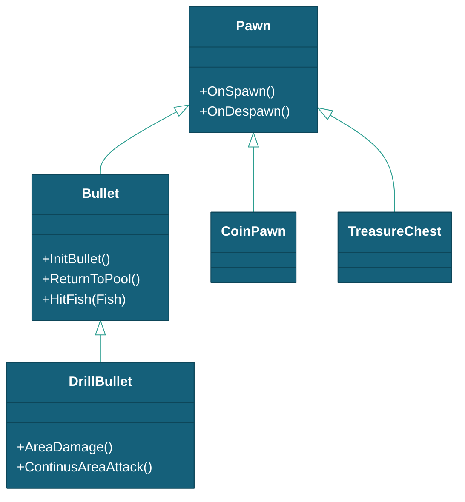
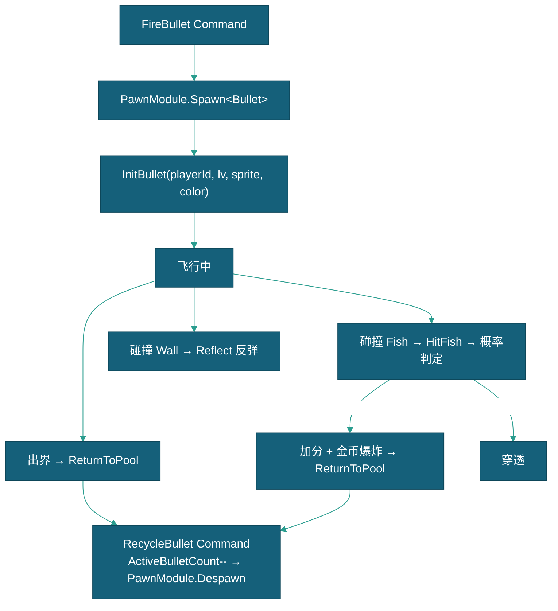

# 子弹

> 本文档描述 DragonBreakSea 中 Bullet（子弹）、DrillBullet（钻头子弹）及 CoinPawn（金币）等弹药实体的属性、状态和生命周期。玩家炮台实体（Gunner）见 [炮台](../炮台/炮台.md)。
> 现状定位：血量版命中判定由 DamageSystem 承担（`Bullet.HitFish → ApplyDamage`，见 [伤害系统实现设计](../../玩法系统/伤害系统/伤害系统实现设计.md)）；本文概率制时代的 Cloud 概率判定描述供溯源。

---

## 一、对象概述

### 1.1 继承链



---

## 二、Bullet — 子弹

`Bullet` 继承 `Pawn`，由 `BulletCommand.FireBullet` 通过 PawnModule 对象池分配。

### 2.1 发射命令链

```
Gunner.CannonLaunch()
  → SendCommand(BulletCommand.FireBullet)
    → 检查 Water >= level && ActiveBulletCount < MaxBullets
    → UsePoints (扣分)
    → PawnModule.Spawn<Bullet>(pawnName)
    → InitBullet(playerId, level, sprite, color) → 设置方向/速度/碰撞体
    → ActiveBulletCount++
    → SendEvent(BulletFiredEvent + ScoreRefreshEvent)
```

### 2.2 碰撞处理

| 碰撞层 | 行为 |
|--------|------|
| Fish 层 | `CloudModule.GetCloudWater(playerId, waterId, lv)` 概率判定 → 命中则 `fish.ChangeState(Killed)` → 加分 + 金币爆炸 |
| Wall 层 | `Vector2.Reflect(direction, normal)` 反弹 |
| Boss 层 | `fish.CompareTag("Boss")` → 绕过概率云，直接 Dead |

### 2.3 生命周期



---

## 三、DrillBullet — 钻头子弹

`DrillBullet` 继承 `Bullet`，由钻头炮发射。飞行阶段碰壁反弹（最多 30 次），减速后引爆范围伤害。

### 3.1 关键参数

| 字段 | 类型 | 默认值 | 说明 |
|------|------|--------|------|
| `initialSpeed` | float | 20 | 初始飞行速度 |
| `falloffSpeed` | float | 10 | 减速阶段速度 |
| `explodeTime` | float | 5 | 爆炸倒计时（秒） |
| `explodeRadius` | float | 7 | 爆炸检测半径 |
| `totalBounceCount` | float | 30 | 最大反弹次数 |
| `rotateSpeed` | float | 140 | 旋转速度（°/s） |
| `explodeAttackTimes` | int | 20 | 爆炸攻击次数（每次间隔 0.05s） |

### 3.2 行为流程

1. **飞行阶段**: 以 initialSpeed 飞行 + 旋转，碰壁反弹触发 CameraEffectView 震动
2. **减速阶段**: 速度降至 falloffSpeed，倒计时结束
3. **范围伤害**: `AreaDamage()` → 隐藏碰撞体 → 20 次范围检测 → 每次对半径内所有鱼调用 `HitFish(fish)` 概率判定

---

## 四、CoinPawn — 金币

金币粒子对象，用于 `BulletBreakCoin` 和 `CoinDropCollectEffect` 的金币爆炸回收动画。纯视觉实体，无独立行为。

---

## 五、交互规则

| 交互 | 触发条件 | 结果 |
|------|---------|------|
| 子弹发射 | `Gunner.CannonLaunch()` | 检查限制 → 扣分 → PawnModule.Spawn → 计数+1 |
| 子弹命中鱼 | `OnTriggerEnter2D` + Cloud 命中 | 鱼 Dead → 加分 + BulletBreakCoin 特效 |
| 子弹碰壁 | `OnTriggerEnter2D` Wall 层 | `Vector2.Reflect` 反弹 |
| 子弹出界 | 位置超出边界 | `ReturnToPool()` → `RecycleBullet` Command |
| 钻头引爆 | 倒计时归零 | 20 次范围伤害检测 |

---

## 六、相关文档

- [玩家流程](../../流程与视觉/流程/玩家流程/玩家流程.md)
- [炮台](../炮台/炮台.md)
- [伤害系统实现设计](../../玩法系统/伤害系统/伤害系统实现设计.md)
- [游戏参数配置说明](../../数据配置/游戏参数配置说明.md)
- [框架设计文档](../../框架设计文档.md)
