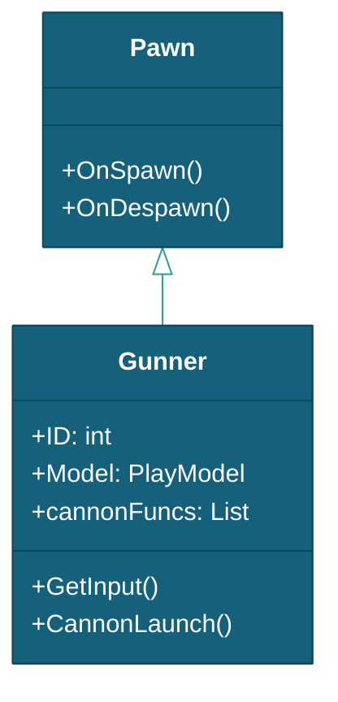

# 炮台

> 本文档描述 DragonBreakSea 中 Gunner（玩家炮台）实体的属性、状态和生命周期。子弹类实体（Bullet/DrillBullet/CoinPawn）见 [子弹](../子弹/子弹.md)。
> 现状定位：血量版炮等级固定 1 级、三资源校验与出票结算以 [总体设计](../../总体设计.md)（§五~§七）为准；本文概率制时代的投币/彩票结算描述供溯源。

---

## 一、对象概述

### 1.1 继承链



---

## 二、Gunner — 玩家炮台实体

`Gunner` 继承 `Pawn`（非 Character），不使用对象池生命周期，直接在场景中挂载。

### 2.1 核心字段

| 字段 | 类型 | 说明 |
|------|------|------|
| `ID` | `int` | 玩家 ID |
| `Model` | `PlayModel` | 玩家运行时数据模型 |
| `GameModel` | `GameModel` | 游戏全局配置 |
| `playerDevice` | `PlayerDevice` | 玩家输入设备 |
| `cannons` | `List<string>` | 炮台类型全名列表（Inspector 配置） |
| `cannonFuncs` | `List<ICannonFunc<Gunner>>` | 运行时创建的炮台实例 |
| `CurrentCannonIndex` | `int` | 当前使用的炮台索引（自动跳过 CanSwitch=false） |
| `LastCannonIndex` | `int` | 上次使用的炮台索引 |
| `CurrentRotation` | `float` | 炮台当前旋转角度 |
| `MaxRotationAngle` | `float` | 最大旋转角度（默认 75°） |
| `RotationSpeed` | `float` | 旋转速度（默认 65°/s） |
| `IsInputDisabled` | `bool` | 输入禁用状态 |
| `ViewCannon` | `ViewCannon` | 炮台视图引用 |
| `UI` | `ViewUI` | UI 视图引用（链式操作） |

### 2.2 初始化流程

```csharp
// GameFlow.OnStart() 中调用
Gunner.OnInit();
// 内部：
// 1. ViewModule.OpenView<ViewCannon>(ID) + GetView<ViewUI>(ID)
// 2. 遍历 cannons 列表 → Type.GetType → Activator.CreateInstance → ICannonFunc<Gunner>
// 3. 第一个炮台 OnSwitchIn()，其余 OnSwitchOut()
// 4. DeviceModule.P(ID) 获取 PlayerDevice
// 5. SendCommand<PlayerCommand.InitializeDevice>
```

### 2.3 输入处理

```csharp
// 每帧由 Game_Playing 状态调用
GetInput(out Vector2 stick, out bool isFire, out bool isChange, out bool outLottery);

// 正式模式（从 PlayerDevice 读取）：
//   stick = playerDevice.GetVector2("joystick")
//   isFire = playerDevice.GetButton("fire")
//   isChange = playerDevice.GetButton("energy")
//   outLottery = playerDevice.GetButton("lottery")

// 调试模式（TestInput=true，Editor 键盘）：
//   Horizontal/Vertical → stick, E → fire, F → isChange, R → outLottery
```

### 2.4 炮台旋转

```csharp
CurrentRotation += input.x * RotationSpeed * Time.deltaTime;
// 角度夹在 [-MaxRotationAngle, MaxRotationAngle]
// 通过 onRotateCannon 事件通知 ViewCannon 更新齿轮和炮管
```

### 2.5 炮台切换

`CallSwitchCannon(dstIndex)` 执行：旧炮台 `OnSwitchOut()` → 更新索引 → 新炮台 `OnSwitchIn()`。`CurrentCannonIndex` setter 自动跳过 `CanSwitch=false` 的炮台。向下摇杆双击触发切换。

### 2.6 投币与彩票

```csharp
// 投币
InsertCoin(num) → SendCommand<ThrowCoin>(ID, num) → Water += PointsRate * num

// 彩票
TicketOut() → SendCommand<PrintTickets>(ID)
  → lotteryCount = Water / PointToLotteryRate
  → P(ID).Control("lottery", count)
```

---

## 三、交互规则

| 交互 | 触发条件 | 结果 |
|------|---------|------|
| 炮台旋转 | `UpdateCannon` 摇杆输入 | `onRotateCannon` → ViewCannon 齿轮+炮管更新 |
| 投币 | `InsertCoin(num)` | `ThrowCoin` Command → 加水 + ScoreRefreshEvent |
| 彩票结算 | `TicketOut()` | `PrintTickets` Command → 串口发送 |

---

## 四、相关文档

- [玩家流程](../../流程与视觉/流程/玩家流程/玩家流程.md)
- [子弹](../子弹/子弹.md)
- [游戏参数配置说明](../../数据配置/游戏参数配置说明.md)
- [框架设计文档](../../框架设计文档.md)
