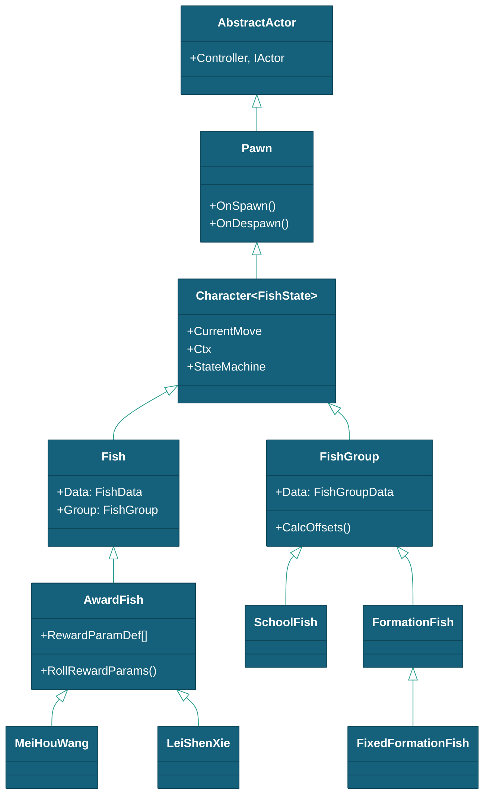
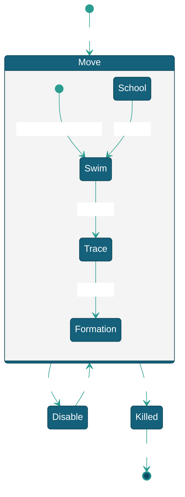

# 鱼

> 本文档描述鱼实体对象的属性、状态、行为和生命周期，以及支撑鱼对象运行的 SplinePath 路径系统、FishSpawnSystem 生成系统和 LayerManager Z 层管理。
> 现状定位：鱼对象体系（Fish/FishGroup/移动策略/生成与路径系统）现行有效；文中 Cloud 相关内容（§5.2 池控偏置、§7.4 CloudModule、交互规则的概率云命中链）已随 Cloud 内核退役失效——命中判定现由 Gameplay 模块 DamageSystem 承担（Cloud 退役清单见 [总体设计](../../总体设计.md) §1.3）。

---

## 一、对象概述

### 1.1 继承链



---

## 二、Fish — 个体鱼对象

### 2.1 核心字段

| 字段 | 类型 | 说明 |
|------|------|------|
| `Data` | FishData | 鱼种数据（速度/路径引用/动画），`SetData()` 注入 |
| `ZUnitSize` | float | Z 轴单位高度 |
| `LayerRange` | Vector2Int | Z 层级自定义范围，(0,0)=按 ID 前缀自动分配 |
| `LayerIndex` | int | Z 层级索引（-1=未分配） |
| `CannonReward` | bool | 击杀是否获得特殊炮 |
| `RewardCannonType` | string | 特殊炮类型全名 |
| `LastHitPlayerId` | int | 最后命中玩家 ID |
| `Group` | FishGroup | 所属群体引用 |
| `OnKilled` | Action\<Fish\> | 击杀回调 |
| `ShowPathGizmos` | bool | 调试路径显示 |

### 2.2 状态机



| 状态 | 说明 |
|------|------|
| `Move` | 活跃移动，进入时播放 Swim 动画，调用 `SetDefaultMovement()` |
| `Disable` | 禁用移动和碰撞体 |
| `Killed` | 死亡：Struggle 动画→翻转→OnKilled 回调→1 秒后 Despawn |
| `Idle` | 空闲（预留） |

### 2.3 生命周期

`Awake`（`InitMoveStrategies` + `BuildStateMachine`）→ `OnSpawn`（碰撞体复位）→ `SetData`（速度随机化 ±20%，出界边界按 PathId 对应 RandomPathConfig 解析）→ `ChangeState(Move)` → 每帧 `TickMove` → **路径走完（T≥1）/命中** → `ChangeState(Killed)` → 1s 延迟 → `OnDespawn`（清理引用 + 释放 Z 层）。

### 2.4 对象池分组随机

PawnModule 按名称前缀自动分组。预制体名含 `_` 后缀（如 `MeiHouWang_01`）时，以 `_` 前的基础名建立分组，`Spawn("基础名")` 精确匹配失败后组内随机选变体。

群阵同理。`GroupData/` 按数据子类分文件夹（`SchoolFishData/`、`FormationFishData/`、`FixedFormationFishData/`），每个文件内分两类条目：

| 类型 | Name 示例 | Count | 作用 |
|------|----------|-------|------|
| 组头 | `"刺豚群"` | 0 | 仅作数据索引键，不注册原型 |
| 变体 | `"刺豚群_标准"`, `"刺豚群_密集"` | 6, 10 | 注册到 PawnModule 原型池 |

```csharp
// FishSpawnSystem.RegisterFishGroupPrototypes():
//   Name 不含 "_" 且非 FixedFormationFishData → 跳过（组头不注册原型）
//   Name 含 "_" → pool.RegisterPawn<FishGroup>(data.Name, go, 1)
// 运行时按 data.GetType() 分发：SchoolFishData→SchoolFish，FormationFishData→FormationFish，
//   FixedFormationFishData→FixedFormationFish（is 顺序敏感，Fixed 在 Formation 前）
```

调度时 `Spawn("刺豚群")` → 无精确匹配 → 在分组 `{刺豚群_标准, 刺豚群_密集, 刺豚群_松散}` 中随机选一个。同一鱼种的多套配置（不同数量/阵形/密度）作为变体共存，关卡调度无需关心具体选哪个。

**特效鱼：** 特效鱼复用同一分组机制。基础鱼预制体改名 `{鱼名}_Default`，特效变体为 `{鱼名}_{Arrow/Boom/Rotate}`，归入同一分组 `{鱼名}`，`Spawn("CiTun")` 精确匹配失败后按 **SpawnWeight 加权随机**选变体（基础 `_Default` 权重远大于各特效变体，特效约 1/53 概率伴随出现）。特效鱼数据（`FishData/Effect/Effect{Arrow,Boom,Rotate}.json`，Id 11xx/12xx/13xx）与基础鱼字段一致，`Name` 复用基础名，运行时仍为 `Fish` 类 + 原有策略，仅外观/特效不同。当前已覆盖 9 种基础鱼：小剑鱼/凤尾鱼/蝴蝶鱼/海马/尖嘴鱼/神仙鱼/小丑鱼/刺豚/电鳗（乌贼仅有 `_Default`）。

**随机路线版：** 另有一组 `{鱼名}_Path` 预制体（`Fish/Normal/RandomPath/`，9 种基础鱼，无乌贼），挂载 `Fish` + `RandomPathSwim` 组件（`DefaultMoveStrategy="RandomPathSwim"`、`EnableRandomMoveStrategy=0`），用于**排队移动**场景。`Spawn("CiTun")` 随机到 `_Path` 变体时走 RandomPathSwim 随机自定义路线（见 [6.8 RandomPathSwim](#68-randompathswim--随机自定义路线排队稳定)）。

---

## 三、FishGroup — 群体鱼对象

### 3.1 三种模式（按数据子类分发，不再用 GroupType）

| 模式 | 数据子类 | 运行时类 | 移动方式 |
|------|---------|---------|---------|
| 群游 | `SchoolFishData` | `SchoolFish` | 基础路径 `DeformPath` 变形出各鱼变体路径，成员走 `FreeSwim` |
| 阵型 | `FormationFishData` | `FormationFish` | 共享基础路径 + `FormationData.Offsets` 偏移，组驱动（FishFreeMoveManager Job） |
| 固定阵 | `FixedFormationFishData` | `FixedFormationFish` | 预制体子级为鱼；`FormationId` 有则用 FormationData.Offsets，空则回退子级 localPosition |

路径统一由 `PathId` 引用（RandomPathConfig / CustomPathConfig），不再内联在群数据里。

### 3.2 路径与阵型来源

- **路径**：`FishGroupData.PathId` → `SplinePathSystem.BuildPathById()` → RandomPathConfig（内外边界+途经点数）或 CustomPathConfig（2D 点）。`CalcOffsets` 建路径后从首/末 knot 回填入口/出口，防止生成点错位。
- **阵型**：`FormationFishData.FormationId` → `SplinePathSystem.GetFormation()` → `FormationData.Offsets`（纯 2D 偏移，长度须与 Count 一致）。`FishGroupConfig` 图形参数仅编辑器工具用其生成 Offsets，不 Json 化。

| FormationShape | 名称 | 说明 |
|-------|------|------|
| Circle | 圆 | 圆形轮廓（编辑器生成 Offsets） |
| Ellipse | 椭圆 | 椭圆弧长均匀 |
| Rectangle | 矩形 | 矩形网格填充 |
| Line | 直线 | 直线排列 |
| VShape | V 形 | 尖端朝前 |
| Random | 随机 | 随机散布含最小间距 |
| Cross | 十字 | 十字/T 形 |
| Arc | 弧形 | 弧形多层可凹凸 |
| Spiral | 蚊香 | 阿基米德螺旋，从中心向外（半径∝角度）；可选等距（点沿弧长等距分布） |
| SineWave | 正弦 | 沿 X 轴起伏的正弦波 |

### 3.3 生命周期

`Spawn` → `OnSpawn`（`ResolveFullData` 按 Id 恢复完整子类数据）→ `CalcOffsets`（PathId 建路径回填出入口）→ `OnBeforeSpawnMembers`（计算阵型偏移/变体路径）→ `SpawnMembers`（`Spawn<Fish> × N`）→ `OnAfterSpawnMember`（摆放/旋转/层级）→ `SetupMovement` → 每帧 `TickMovement` → 路径走完/成员死亡 → 整组回收。

**GroupKill：** `TriggerGroupKill(playerId)` 快照全体成员 → 逐个 `ChangeState(Killed)`。

---

## 四、FixedFormationFish — 预制体固定阵

继承 `FormationFish`（组驱动锚点 + 阵型偏移）。子级是预制体的一部分，直接获取 Fish 组件，回收时只禁用/移除引用，不单独 pool.Despawn。

- **阵型偏移**：`FormationId` 配置了用 `FormationData.Offsets`（按成员顺序）；空则回退子级 `localPosition`（不旋转）。
- **OnSpawn 解析完整 JSON**：预制体 Data.Id 常为空，`ResolveFormationData()` 按 Id 或按预制体名匹配 JSON Name，加载 `PathId`/`FormationId`/`Speed` 等配置（否则路径会回退随机）。
- **路径**：走 `PathId` 引用或回退，组驱动，需 `RegisterTick`。

---

## 五、AwardFish — 奖励鱼对象

`AwardFish : Fish`。被击杀时按命名约定 `{Data.Name}Award` 创建 AwardEffect 特效。

| 方法 | 说明 |
|------|------|
| `RollRewardParams()` | 遍历 RewardParamDef 列表，均匀随机 + 池控偏置 |
| `BuildParamsDictionary()` | 构建参数字典，含 ScoreKeys 累加 |
| `GetPoolHealth()` | 从 `Cloud.GlobelModel.Gather/Release` 计算 0~1 池充裕度 |
| `CreateRewardEffect()` | Spawn Effect → ConfigureEffect → EnqueueEffect |

### 5.1 RewardParamDef

| 字段 | 类型 | 说明 |
|------|------|------|
| `Key` | string | 参数名，对应 AwardClipConfig 的 Key |
| `Min` / `Max` | int | 随机区间 |
| `Operation` | VolumeOp | Add / Subtract / Multiply / Divide |
| `ScoreKey` | string | 归属分数键（多参数可汇总到同一键） |
| `RolledValue` | int | 运行时滚值（HideInInspector） |

### 5.2 池控偏置

```csharp
float health = GetPoolHealth();
def.RolledValue = Random.Range(def.Min, def.Max + 1);
def.RolledValue = Mathf.RoundToInt(def.RolledValue * (0.5f + health * 0.5f));
// 池越充裕(health→1) → 值越接近上限
```

### 5.3 ScoreKeys 累加

`分数1 = sum(scoreKey="分数1")`，`分数2 = 分数1 + sum(scoreKey="分数2")`，依此类推。

### 5.4 Boss 鱼

| 鱼种 | 类 | 基类 |
|------|-----|------|
| 美猴王 | `MeiHouWang` | AwardFish |
| 雷神蟹 | `LeiShenXie` | AwardFish |
| 财神 | `GodWealth` | Fish |
| 天王 | `TianWang` | Fish |

Boss 鱼 Tag="Boss"，命中绕过概率云直接 Dead。

---

## 六、移动策略体系

所有策略文件位于 `Scripts/Controller/MoveStrategy/`，配置类位于 `Configs/` 子目录，Boss 专用策略位于 `BossMove/`。

### 6.1 FreeSwim — 自由贝塞尔游动

**文件：** `Scripts/Controller/MoveStrategy/FreeSwim.cs`，配置 `FreeSwimConfig : MoveConfig`（SegMin/SegMax/BendAngle，预制体上配置，不 Json 化）

- `OnEnter`：从 SplinePathSystem 分配路径。`PathId` 有 → `BuildPathById()`（Random/Custom）；空 → `BuildSpacedPath(Ctx.WaypointCount, SegMin, SegMax, BendAngle)`
- 出界边界：从解析到的 RandomPathConfig 取（无 PathId / 自定义路径不设，跳过出界检测）
- 每帧：`T += dt × Speed / Length`，经 FishFreeMoveManager（Job）采样位置和切线方向
- 出界条件：`T ≥ 1`（路径走完）
- 鱼直接落到路径起点，避免"场内生成→瞬移到边界外起点"的穿帮

**在场时间：** `T_path = Length / Speed`。`Length` 取决于 `WaypointCount × avg(SegMin, SegMax)`，受 `BendAngle` 弯曲程度和 `CenterPull` 中心拉力影响。实际波动约 ±30%。

| 参数 | 来源 | 说明 |
|------|------|------|
| Speed | `FishData.Speed`（或 JSON 覆盖）| 世界单位/秒，`SetData` 时 ±20% 随机化 |
| WaypointCount | `Ctx.WaypointCount`（移动上下文）| 途经点数量，越多越曲折、时间越长 |
| 内外边界 | `FishData.PathId` → RandomPathConfig | 已从 FishData 移入 RandomPathConfig |
| SegMin/SegMax | `FreeSwimConfig`（预制体）| 每段距离范围，值越大路径越长 |
| BendAngle | `FreeSwimConfig`（预制体）| 最大偏转角，越大越弯、路径越长 |

### 6.2 Dash — 分段冲刺

**文件：** `Scripts/Controller/MoveStrategy/Dash.cs`，配置 `DashConfig : PathConfig`

- `OnEnter`：同上生成 Spline 路径。`SegmentCount = BuildSpacedPath` 返回值
- 每段 = 一次冲刺，EaseOutQuad 速度曲线。`SegmentT += dt / SegmentDuration`
- 段走完 → `AdvanceToNextSegment`；全部段走完 → 出界回收
- 段时长：`SegmentDuration = AnimationDuration / AnimationSpeed`（开启随机则波动 `±RandomDurationRatio`）
- 动画：播到 `DashStartTime/AnimationDuration` 帧位后 `Animator.speed = AnimationDuration / SegmentDuration`

**在场时间：** `T_dash = SegmentCount × (AnimationDuration / AnimationSpeed)`。`SegmentCount` 由 `BuildSpacedPath(WaypointCount, SegMin, SegMax, BendAngle)` 决定。

| 参数 | 来源 | 说明 |
|------|------|------|
| AnimationDuration | 预制体配置 | 动画总时长（默认 2.667s） |
| AnimationSpeed | 预制体配置 | 播放速率，Speed 越高段时长越短 |
| EnableRandomDuration | 预制体配置 | 开启后段时长 ±RandomDurationRatio 波动 |
| SegMin/SegMax/BendAngle | 预制体配置 | 影响 SegmentCount |

### 6.3 CrabMove — 变速螃蟹移动

**文件：** `Scripts/Controller/MoveStrategy/CrabMove.cs`，配置 `CrabMoveConfig : PathConfig`

- `OnEnter`：`BuildSpacedPath` 带 `MidPoints` 候选列表 + `PoolPointCount` 随机选点
- 第一段末端 → 减速到 `SlowBase`（默认 0.3x）；过中点后 → 加速回原速。变速区间各占 `TransRatio`
- `m_T += dt × Speed × SpeedMul / Length`，SpeedMul 在 1 ↔ SlowBase 间缓动
- 缓动类型随机（均匀/起缓/起快）
- 动画：`Animator.speed = AnimSpeed × Lerp(1, SpeedMul, AnimSpeedFollow)`

**在场时间：** `T_crab = Length / (Speed × SpeedMul_avg)`。中点减速使实际时长比 FreeSwim 长约 30%~70%。

| 参数 | 来源 | 说明 |
|------|------|------|
| SlowBase | 预制体配置 | 最低速度倍率（默认 0.3） |
| TransRatio | 预制体配置 | 变速过渡占比（默认 0.1） |
| MidPoints/PoolPointCount | 预制体配置 | 候选中间点 |
| AnimSpeedFollow | 预制体配置 | 动画跟随速度变化的程度 |

### 6.4 StopAndGo — 断续青蛙跳

**文件：** `Scripts/Controller/MoveStrategy/StopAndGo.cs`

- 两阶段交替：`Waiting`（停顿，时长 `StopDuration`）→ `Moving`（跳跃，时长 `AnimationDuration / AnimationSpeed`）
- 移动阶段走一段 Spline，每次跳跃前进一段距离

### 6.5 ClothSwim — 布料游泳

**文件：** `Scripts/Controller/MoveStrategy/ClothSwim.cs`，配置继承 `FreeSwimConfig`

- 同 FreeSwim 移动逻辑，额外驱动 `VRMSpringBone` 布料风力模拟
- 风力 X = -3（自身坐标），Y 连续 `PerlinNoise` 变化

### 6.6 Boss 专用策略

| 策略 | 文件 | 移动方式 | 在场时间 |
|------|------|---------|---------|
| MonkeyKingMove | `BossMove/MonkeyKingMove.cs` | 三点路径（入口→横轴中点→对角出口），风力模拟 | 由动画时长决定 |
| MonkeyKingMoveAnimated | `BossMove/MonkeyKingMoveAnimated.cs` | 同上 + Animator 驱动 | 由动画时长决定 |
| MeiRenYuMove | `BossMove/MeiRenYuMove.cs` | 居中缩放（小→大→停留→缩小） | 由动画时长决定 |
| LongMove | `BossMove/LongMove.cs` | 居中不动 | `HoldDuration` 控制 |
| LongMoveAnimated | `BossMove/LongMoveAnimated.cs` | 动画驱动居中展示 | 由动画时长决定 |

### 6.7 策略选择

`SetDefaultMovement()` 优先级：`EnableRandomMoveStrategy=true`→随机 / `DefaultMoveStrategy` 非空→按类型匹配 / 否则用第一个。

### 6.8 RandomPathSwim — 随机自定义路线（排队稳定）

**文件：** `Scripts/Controller/MoveStrategy/RandomPathSwim.cs`，配置 `RandomPathSwimConfig : MoveConfig`

用于**排队移动**场景：同一波鱼依次沿同一路径行进。

**排队稳定缓存：**

1. 启用 `QueueStable` 时按**鱼名**（`Fish.Data.Name`）查静态路径缓存：刷新周期内同名鱼复用同一条完整路径（队形一致）；不同名鱼各自缓存条目（保留随机性）；
2. 刷新周期 `PathRefreshInterval` 基于 **WaveSystem 关卡时间**（`SceneData.ElapsedTime`）判定：推进超过间隔或关卡重置（时间回退）时清空缓存，下次生成重新随机；
3. 缓存条目只存最终点集、出界边界与本周期速度，每条鱼仍各自构建/注册/回收自己的 Spline（生命周期互不影响）；
4. **速度同周期稳定**：个体生成每条鱼 `Ctx.Speed` 含 ±20% 独立随机（`Fish.SetData` randomSpeed），周期内命中缓存时覆盖为条目速度，避免快鱼追慢鱼拉乱队形；刷新周期后随条目重新随机；
5. `QueueStable=false` 或 `PathRefreshInterval<=0` 时退化为每条鱼独立随机（旧行为）。

每条鱼生成时：
1. 从 `PathIds` 列表中**随机抽一条 CustomPathConfig** 作模板；
2. 按 `CenterRange` **随机取中心点**，路径先平移到该中心，再按 `RotationRange` 绕该中心**随机旋转**；
3. 可选 RandomStart/RandomEnd：在首/末段方向 ±MaxAngle 内随机**延伸** `ExtendRange` 距离（插入几何自适应过渡点，消除边界段过冲）；
4. 构建 Spline → 弧长表 → FishFreeMoveManager（Job 内二分映射匀速推进）。

| 参数 | 说明 |
|------|------|
| PathIds | 备选路径 GUID 列表（仅 CustomPathConfig），每次随机抽一条 |
| QueueStable | bool：true=按鱼名缓存路径（排队效果）；false=每条鱼独立随机 |
| PathRefreshInterval | 路径刷新周期（秒），基于 WaveSystem 关卡时间；到期清空缓存重新随机 |
| CenterRange | 随机中心点范围 ±(x,y)（场景 1/4 宽高），路径平移到该中心 |
| RotationRange | 模板绕随机中心点的旋转角度范围 [min, max]（度） |
| RandomStart | bool：是否随机起点 |
| RandomEnd | bool：是否随机终点 |
| StartMaxAngle | 起点偏离首段方向的最大夹角（度） |
| EndMaxAngle | 终点偏离末段方向的最大夹角（度） |
| ExtendRange | 起点/终点延伸距离范围 [min, max]（世界单位） |
| AnimationSpeed | 动画播放速度 |

**典型预制体配置（`Fish/Normal/RandomPath/CiTun_Path.prefab` 实际值）：** `QueueStable=1`、`PathRefreshInterval=30`、`AnimationSpeed=1`、`PathIds=3 条 CustomPathConfig`、`CenterRange=(7.5, 4.25)`（= 场景半宽高 15/8.5 的一半）、`RotationRange=(-180, 180)`、`RandomStart=1`、`RandomEnd=1`、`ExtendRange=(30, 30)`、`SegMin=6/SegMax=12/BendAngle=60`（路径基础参数）。

---

## 七、支撑系统

### 7.1 SplinePathSystem — 路径生成（System）

持有 **RandomPathConfig / CustomPathConfig / FormationData** 三个配置注册表（GUID Id，独立于 WaterDict）。

| 参数 | 说明 |
|------|------|
| `BoundSize` | 基准半宽高 (15, 8.5) |
| `ActiveMargin` | 活动边界缩进 |
| `CenterPull` | 中心拉力强度（0.6） |
| `DefaultSegMin/SegMax/Bend` | 随机路径的全局默认曲线参数 |

| 方法 | 说明 |
|------|------|
| `LoadConfigs()` | 加载 `PathConfig/` 与 `FormationData/` 下全部 JSON（GUID 入私有字典） |
| `GetRandomPath(id)` / `GetCustomPath(id)` / `GetFormation(id)` | 按 GUID 取配置 |
| `BuildPathById(c, pathId, ...)` | 统一构建：Random→`BuildSpacedPath`，Custom→`BuildPathFromKnots2D` |
| `TryGetRandomBounds(pathId, ...)` | 解析 RandomPathConfig 的内外边界（各移动策略用） |
| `BuildSpacedPath()` | 入口→中间点→出口完整路径 |
| `SteerPoint()` | 角度偏转+距离步进下一个路径点 |
| `EmitEndpoint()` | 终点生成到外边界带状区域 |
| `SplitSegment()` | 分割过长段 |
| `AllocateSplinePath()` / `RecycleSplinePath()` | 从 PawnModule 池取/还路径对象 |

### 7.2 FishSpawnSystem — 生成系统（System）

`Wave<FishEvent>.Execute` 调用此系统完成实际鱼生成。`Spawn(targetId, count)` 统一入口，惰性缓存 `FishData`。

- **群原型注册**：按 `data.GetType()` 分发——`FixedFormationFishData` 找同名预制体注册；`SchoolFishData`→`SchoolFish`；否则→`FormationFish`（is 顺序敏感，Fixed 在 Formation 前）。
- **出生点**：按鱼引用的路径配置取——Custom=首点，Random=配置边界，否则默认 HalfSize 边界。

### 7.3 LayerManager — Z 层管理

`LayerManager : Module`，维护 `bool[1000]` 分配表，线性扫描分配。个体鱼 400-800，群体鱼共享 Z。`Fish.LayerRange` 非零时覆盖前缀规则。

### 7.4 CloudModule — 概率云引擎

`CloudModule : Module`，C++ DLL 核心引擎。`GetCloudWater(playerId, waterId, lv)` 命中判定，`GenerateCloudCycle()` 云周期生成。

---

## 八、交互规则

| 交互 | 触发条件 | 结果 |
|------|---------|------|
| 子弹命中个体鱼 | `OnTriggerEnter2D` + Cloud 命中 | `ChangeState(Killed)` → 加分 + BulletBreakCoin |
| 子弹命中群体成员 | GroupKill 模式 | `TriggerGroupKill` → 全群 Dead |
| 路径走完 | `Ctx.T ≥ 1` | `Despawn`（独立鱼）/ 整组处理（群成员）。仅 `PathId` 引用 RandomPathConfig 时启用边界出界检测 |
| Boss 命中 | `CompareTag("Boss")` | 绕过概率云，直接 Dead → AwardEffect |
| 奖励鱼击杀 | AwardFish.OnKilled | 创建 `{Name}Award` 特效 |
| 携带武器奖励 | `CannonReward=true` | `AcquireCannon` 命令 |

---

## 九、相关文档

- [场景流程](../../流程与视觉/流程/场景流程/场景流程.md) — 关卡调度
- [鱼与关卡数据配置说明](../../关卡/鱼与关卡数据配置说明.md)
- [框架设计文档](../../框架设计文档.md)
