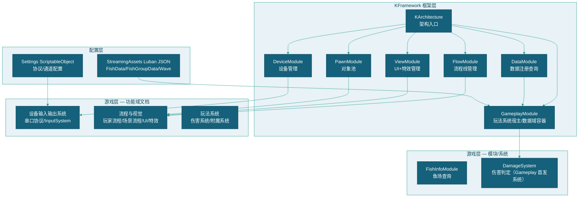
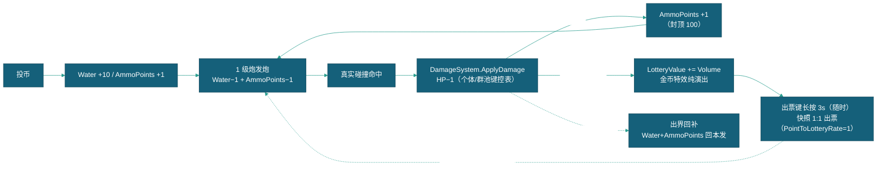

# 总体设计

> 本文档描述血量版（技巧制）产品线的整体架构设计：架构全景、模块依赖、核心数据流、目录结构，以及玩法落地基线（设计红线、三资源经济模型、彩票结算与断电持久化、数据链与数值基线）。
> 本工作区为血量版独立产品线（fork 自概率制主线），分支 `feat/hp_gamplay`，基线 tag `hp-baseline-20260829`；概率制结算内核（CloudModule / Cloud.dll / 概率参数）已全量退役，双版本玩法逻辑互不同步。
> 伤害判定与命中结算链见 [伤害系统实现设计](玩法系统/伤害系统/伤害系统实现设计.md)；Gameplay 玩法模块承载机制（框架层）见 [框架设计文档](框架设计文档.md) §4.7。

---

## 一、架构全景



### 1.2 模块/系统列表

| 名称 | 类型 | 位置 | 职责 |
|------|------|------|------|
| `KArchitecture` | 架构入口 | `KFramework/KArchitecture.cs` | QF 架构单例 |
| `DataModule` | Module | `KFramework/Module/DataModule.cs` | IData 注册查询 |
| `DeviceModule` | Module | `KFramework/Module/Device/` | 设备管理、PlayerDevice |
| `PawnModule` | Module | `KFramework/Module/Pawn/` | 对象池管理 |
| `ViewModule` | Module | `KFramework/Module/View/` | UI+特效管理 |
| `FlowModule` | Module | `KFramework/Module/FlowModule.cs` | FlowLine 收集注册 |
| `DebugModule` | Module | `KFramework/Module/DebugModule.cs` | Windows 控制台/日志捕获 |
| `Gameplay` | Module | `Packages/com.kframework/Runtime/Module/Gameplay/` | 玩法系统宿主+数据分发校验（多域路由/按需灌装） |
| ~~`CloudModule`~~ | Module | — | **已退役**（概率玩法下线，类与监控面板已删除；概率系统仅保留架构接入位，见 [框架设计文档](框架设计文档.md) §4.7） |
| `FishInfoModule` | Module | `Scripts/Module/FishInfoModule/` | 鱼场 Physics2D 查询 |
| `DamageSystem` | System | `Scripts/Module/GameplayModule/` | 伤害判定系统（Gameplay 首发系统：ApplyDamage 算法+HP 键控表） |
| `WaveSystem` | System | `Scripts/System/WaveSystem.cs` | 关卡加载/切换 |
| `FishSpawnSystem` | System | `Scripts/System/FishSpawnSystem.cs` | 鱼生成代理 |
| `SplinePathSystem` | System | `Scripts/System/SplinePathSystem.cs` | Spline 路径生成 |
| `SerialInputSystem` | System | `Scripts/Module/Device/Serial/` | 串口协议拆包 |
| `SerialControlSystem` | System | `Scripts/Module/Device/Serial/` | 串口发送队列 |
| `LayerManager` | Module | `Scripts/System/LayerManager.cs` | Z 层级分配 |

### 1.3 游戏层接入（血量域类映射）

| 类 | 现行基类 | 说明 |
|----|---------|------|
| `GameModel` | `GameplayConfig` | 玩家面主域；经 DataModule（preInitTypes）注册进架构，消费方一律 `GetModel<GameModel>()`；OnConfigInit 走 LubanTablesLoader→LubanDataMapper 灌装；玩家槽 P[0]=全局 + [1..11] 全 PlayModel；炮级恒 1（`PlayModel.FixedLevel`），无等级桩表灌装 |
| `PlayModel` | `PlayerData` | 三资源载体（见 §五）；`Water` 为 `base.Points` 的兼容别名 |
| `FishData` / `FishGroupData` / `FishWaveData` | `ActorData` | 鱼/群/关数据单元，模板入 TemplateDict、实例入 DataDict |

游戏层扩展：`Assets/Scripts/Module/GameplayModule/GameplayDataExt.cs`——`GetTemplate<T>(config, id)` 消费方模板读取统一入口（null 安全）。

**Cloud 退役清单（已完成）**：CloudModule / Cloud.dll / CloudNative.dll / 监控面板（CloudMonitorSystem）均已删除；SystemConfig 概率参数五字段（baseCoef/probExponent/targetRaindrops/warmingBudget/warmingMultiplier）已删；全库 ColorfulCloud 引用为 0（现存少量注释为历史说明）。观测由 DamageSystem Inspector 项承接（见 [伤害系统实现设计](玩法系统/伤害系统/伤害系统实现设计.md)）。

### 1.4 模块依赖

| 模块 | 依赖 | 说明 |
|------|------|------|
| DataModule | — | 最先初始化 |
| DeviceModule | DataModule | 设备配置依赖数据 |
| PawnModule | — | 仅依赖 Resources/Actor/ |
| ViewModule | PawnModule | Effect 走 PawnModule 池 |
| FlowModule | PawnModule, ViewModule | 流程需实体/UI |
| DebugModule | — | 可选，仅 Windows Player |
| Gameplay | DataModule（域注册先行） | GameplaySystem 域绑定依赖数据域注册 |
| FishInfoModule | — | Physics2D 独立 |

### 1.5 初始化顺序

| 顺序 | 模块 | 说明 |
|------|------|------|
| 1 | DataModule | 数据先行（GameModel 数据域注册+Luban 灌装） |
| 2 | Gameplay | 玩法系统宿主（须在 Data 后：域注册先于系统绑定；DamageSystem 域绑定+校验） |
| 3 | DeviceModule | 设备就绪 |
| 4 | PawnModule | 对象池创建 |
| 5 | ViewModule | UI 区域扫描 |
| 6 | DebugModule | 控制台/日志（可选） |
| 7 | FlowModule | FlowLine 收集 |
| 8 | FishInfoModule | 鱼场查询 |

### 1.6 模块影响面

| 类别 | 模块/系统 | 现状 |
|------|----------|------|
| 核心改造（已落地） | Gameplay 框架（包层）、DamageSystem、PlayModel 三资源、PlayerCommand/BulletCommand 命令层、Luban 数据链（Hp 列） | 已实现 |
| 保留沿用 | 鱼生成/移动/鱼群/阵型/路径（对象模块）、关卡时序/事件链/切关（WaveSystem）、GameFlow 流程、奖励特效演出体系（视觉）、设备串口 | 未动，血量版直接复用 |
| 已退役 | CloudModule/Cloud.dll/CloudNative.dll、监控面板、概率参数五字段、32 级倍率语义（桩表待清）、AwardFish 滚值（prefab 定值化）、击杀 Water 回流 | 已删除/停用 |

---

## 二、设计红线与架构原则

### 2.1 政策红线（违反即 FAIL）

1. **无概率决定结果**：命中、扣血、击杀全部由真实碰撞与玩家操作决定，禁止任何随机结算。
2. **无倍率投注**：禁止按键同步放大投入与收益；炮等级固定 1 级（`PlayModel.FixedLevel = 1`）。
3. **无奖励循环投入**：彩票值（结算奖励）禁止回流为游戏资源；三资源严格隔离。
4. **技巧必须决定结果**：瞄准、目标选择、发射时机、道具组合真实影响收益。

> 暴击属伤害强化层机制（基础暴击率 20%、暴击伤害 ×2，冰+火同存目标 40%），只放大扣血效率、不参与命中判定与奖励结算——归附魔道具体系（当前延后待重规划，见 [附魔系统](玩法系统/附魔系统/附魔系统.md)）。

### 2.2 架构原则

| # | 原则 | 现行落地 |
|:-:|------|---------|
| 1 | 数据先行 | HP/Volume 全部为配置期明码（Luban 表链），运行时无难度参数入口 |
| 2 | 结算单入口 | 扣血/击杀/归属/回炮弹积分收敛到 `DamageSystem.ApplyDamage` 统一算法入口，命中链三处调用同一 API |
| 3 | 框架承载玩法 | Gameplay 玩法模块落 `Packages/com.kframework`（框架层），游戏层以数据域（GameplayConfig 子类）+ 玩法系统（GameplaySystem 子类）接入 |
| 4 | 算法纯算 | DamageSystem 只返回 `DamageResult`；击杀演出（ChangeState / TriggerGroupKill）与经济结算（LotteryRevenue / PointsGain）归调用方 |
| 5 | 数据再组织 | 玩法数据经 GameplayConfig 聚合容器一站式取数（模板/实例双字典 + 类型索引），替代散落的字典链 |

---

## 三、核心数据流

```
串口 → SerialInputSystem → OperationMap → PlayerDevice
  → Gunner.GetInput → CannonLaunch → BulletCommand.FireBullet（Water≥1 且 AmmoPoints≥1）
    → PawnModule.Spawn → Bullet.OnTriggerEnter2D（真实碰撞）
      → DamageSystem.ApplyDamage（HP 键控扣减；HP≤0 → DamageResult.Killed/GroupWiped）
        → 击杀演出 + PlayerCommand.LotteryRevenue（彩票值 += KillVolume，不回流 Water）
        → 命中/出界 → PlayerCommand.PointsGain（回炮弹积分 ≥1/发，反弹必中上线前的护栏）
```

数据链源头 = .duowei 多维表格（`GameData/DuoWei/` 唯一编辑源 → xlsx → Luban → StreamingAssets/luban，全景见 §四，落地流程见 `GameData/README.md`）。

---

## 四、数据链与数值基线

### 4.1 数据链全景


| 环节 | 位置 | 说明 |
|------|------|------|
| 编辑源 | `DragonBreakSeaHPGamepaly/GameData/DuoWei/*.duowei`（11 表） | Obsidian 多维表格（duowei-table-pro 插件），JSON 结构（schemaVersion/fields/records/views）；鱼种表含 Hp 列（72/72 全量值）、群阵表含 Hp 列 |
| 中间态 | `GameData/Xlsx/*.xlsx` | duowei_sync.py 生成（三行表头 ##var/##type/## 红线结构），镜像至 `LubanPilot/Output/` |
| 生成 | `LubanPilot/Defines/defines.xml`（10 表，Luban XML 格式 module cfg） | Luban CLI：`dotnet Luban.dll -t client -c cs-newtonsoft-json -d json`；TbFishData 主键=RefName；Unity 菜单同步至 Generated 与 StreamingAssets |
| 校验 | `LubanPilot/Adapt/` | `duowei_fullchain.py`（sync→merge→gen→validate→Loader 冒烟，任一环红即中止）；`validate.py`（唯一性/断链/阵型间距等 8 项，0 FAIL 门禁）；`equivalence_check.py`（产物↔源逐字段等价） |
| 运行时 | `GameModel.OnConfigInit` | 唯一路径 = LubanTablesLoader.Load() → LubanDataMapper 灌装；Load 失败 LogError 直断（数据域空，不出鱼），无旧路径降级 |

> 飞书链路已退役（本地多维表格管线取代）；`_feishu_*` 系列脚本为历史遗留，不再使用。

### 4.2 Hp 承载与映射层灌装

Hp 只存在于**数据侧**（`FishData.Hp` / `FishGroupData.Hp` + `KillMode` 判型，判型规则表见 [伤害系统实现设计](玩法系统/伤害系统/伤害系统实现设计.md) §三）；`Fish`/`FishGroup` 组件零 HP 字段，运行时当前值由 DamageSystem 键控表跟踪。

**鱼种级兜底**：`FishData.Hp ≤ 0` → 加载进模板字典时取 `Volume` 作原始值（映射层执行；`Fish.SetData` 照旧取模板原始数据，不做二次判断）。

**LubanDataMapper 灌装（FillWaterDict）**：

| 步骤 | 内容 |
|------|------|
| 鱼循环 | 构建 FishData 模板：Name/Volume/Speed/Description/ImagePath/PathId/DeathRotationAngle 逐一映射 + `Hp = f.Hp > 0 ? f.Hp : f.Volume`（兜底①）+ 兜底命中计数；Probability/Level 不搬运（历史参考字段） |
| 群循环 | 三子类按 SubType 还原（School/Formation/FixedFormation）、FishRef/PathRef/FormationRef 名→GUID 反查、KillMode 映射、`Hp = g.Hp` 原样映射 |
| 关卡循环 | Timeline 从 TbWaveTimeline 聚合、UnlockHuman→DataCondition |
| 尾部·智能 Volume | 群 Volume = 鱼种 Volume × Count 覆盖 |
| 尾部·群 Hp 兜底 | 智能覆盖后仍 Hp≤0 且 Volume>0 → Hp=Volume；均≤0 → 不修数据 + LogWarning「强制独立血条」告警（占位行噪音已知，见 §4.5） |
| 尾部·抽样断言日志 | 首条鱼种实际 Hp + cfg 值对照 + 鱼种/群兜底命中计数 + 群 Hp>0 计数（验收核对用） |

游戏层组件（数据类均 `: ActorData`）：

- `FishData`：`public int Hp;` + `CopyFrom` 同步拷贝（漏抄 = 池复用实例 HP 串档事故点）；实例经 `Fish.SetData` 克隆（Data.Id += GUID 注册进 DataDict，OnDespawn 注销并剥 GUID 复位，Data 对象跨池复用）。
- `FishGroupData`：`public int Hp;` + 既有 `KillMode`；群数据不做实例复制，无 CopyFrom。

### 4.3 数值现状（编辑源实测）

- **72 鱼种 Hp 全量已灌**（`鱼种.duowei` 72/72 Hp>0）：1001 小剑鱼 Hp=3、1008 乌贼 Hp=16、4012 美猴王 Hp=162、Volume=120（R=120/162=0.741 落 D4 带；prefab 定值四段 20/30/30/40 Σ=120 与表内对账一致）、基础鱼 R=V/Hp 落 0.57~0.76。
- **特效鱼 11xx~13xx（27 条）**：首版容错值（Hp=同基础鱼），不参与 R 定价门禁（其 Volume 50~80 与容错 Hp 组合的 R 落带外属预期，语义定完再重定价）。
- **共享血池群**：全表 1060 群中 GroupKill 仅 1 条——6001 小剑鱼炸鱼（FishRef=小剑鱼×3），显配 Hp=9（=Σ成员鱼种 Hp），即「9 发群灭链」；其余 1059 条 Individual（Hp 不参与判型）。
- **R̄ 口径三层**（数值框架，配置期）：单鱼硬门禁 R∈[0.50,0.80]；档位带（D1~D4 分档）；全场 R̄（投放构成加权，非表内直加）目标带 [0.62,0.68]。R̄ 表不进运行时——切档 = 编辑层重算 Hp 列重新导出（防运行时切档入口）。

### 4.4 AwardFish 定值化

- 14 个 Award prefab 已落配：分值条目 `Min = Max`（条目即阶段、Σ定值 = Volume），倍率条目 13 条已清（倍率转演出内部参数或拆除）。
- `RollRewardParams` 滚值/池控偏置/运行时改写 `Data.Volume` 已禁用；多阶段演出参数为 prefab 定值（美猴王四段 20/30/30/40，Σ=120）。

### 4.5 管线已知风险

| # | 风险 | 现状 | 处置 |
|:-:|------|------|------|
| 1 | duowei_sync.py Hp 列 | 现行脚本鱼种/群阵行构建已含 Hp 列（`build_fish_rows`/`build_group_rows` + `sync_fish`/`sync_group` 列清单）；全链重跑 PASS，等价校验 32,414 项 0 差异（Hp 列已纳入比对） | 已消除 |
| 2 | Gen/data 与 StreamingAssets 同步 | 两处 72 条 Hp 逐条一致；以全链重跑产物为准（Unity 菜单同步前勿手改 Gen/data） | 已消除 |
| 3 | 24 条 Count=0 组头占位行 | 每次加载刷「强制独立血条」告警，噪音掩盖真实缺陷 | 占位行加标记跳过告警，或补 Count>0（待办） |

---

## 五、三资源经济模型

### 5.1 三资源隔离

| 资源 | 载体（PlayModel） | 获得 | 消耗 | 约束 |
|------|------------------|------|------|------|
| 游戏积分 | `Water`（= `base.Points` 别名） | 投币 +PointsRate(10)/币 | 发炮 −1/发 | 唯一弹药约束（10 发/币）；不作最终奖励领取 |
| 炮弹积分 | `AmmoPoints` | 投币 +1/币、有效命中回 ≥1/发 | 发炮 −1/发 | 0~PointsCap=100；正常游玩不可耗尽 |
| 彩票值 | `LotteryValue`（long） | 击杀 +Volume | 出票结算（只出不回） | 断电持久化；禁回流任何游戏资源 |

> 术语口径：策划终审单中的「炮弹能量/能量」即本设计「**炮弹积分**」——仅术语映射，机制一致（投币 +1/币、开炮 −1/发、命中回 ≥1/发、上限 100）。

### 5.2 关键参数面

| 参数 | 值 | 载体 |
|------|:--:|------|
| 1 币 → 游戏积分 | 10 | `GameModel.PointsRate` |
| 1 币 → 炮弹积分 | 1 | ThrowCoin 命令 |
| 每发消耗 | 1 游戏积分 + 1 炮弹积分 | `PlayModel.FixedLevel` |
| 炮等级 | 恒 1 级 | `PlayModel.FixedLevel = 1`（SwitchLevel 恒 1 化，广播统一 FixedLevel） |
| 命中回炮弹积分 | 1/发 | `PlayModel.PointsGainPerHit` |
| 炮弹积分上限 | 100 | `PlayModel.PointsCap` |
| 出票兑换 | 1 彩票值 = 1 票（1:1） | `GameModel.PointToLotteryRate`（=1） |

### 5.3 红线不变式

1. 彩票值不因炮等级/命中概率/暴击/池健康度/抽水/炒场/道具变化（配置期定价唯一变量）。
2. 游戏积分 → 彩票禁止（击杀路径已断——击杀走 LotteryValue，不回流 Water）。
3. 彩票 → 游戏积分/炮弹积分禁止（无任何逆向命令）。
4. 出票只出不回（快照扣减、扣票面值留余数）；出票对账恒等式：`Σ击杀Volume = Σ已出票面额 + LotteryValue 现值` 恒成立。
5. 出票不清/不转 Water 与 AmmoPoints——出票后凭剩余积分可继续游玩；全量清参仅 Game_Exit 退场流程（ResetStatus）。

### 5.4 核心循环



---

## 六、三资源命令层

### 6.1 PlayModel 字段（Assets/Scripts/Data/PlayerModel.cs，: PlayerData）

| 成员 | 类型/值 | 说明 |
|------|--------|------|
| `Water` | `=> Points`（别名） | 游戏积分；指向 `AbstractPlayerData.Points`（生存点数承接游戏积分），消费方经别名零改动；统一改名 .Points 列待办 |
| `AmmoPoints` | ConstraintsProperty\<int\> | 炮弹积分；约束 0~PointsCap（**越界拒绝写入而非截断**——回分路径必须显式 min 封顶） |
| `LotteryValue` | BindableProperty\<long\> | 彩票值；快照扣减结算源 |
| `FixedLevel` | const 1 | 炮等级/消耗值恒 1 |
| `PointsCap` | const 100 | 炮弹积分上限 |
| `PointsGainPerHit` | const 1 | 每次有效命中回炮弹积分数 |
| `TotalCoinIn` / `TotalTicketOut` | BindableProperty\<long\> | 现金流总账（玩家+全局 P[0] 双记，不随 ResetStatus 清零，换人保留） |
| `SessionActive` / `BeginSession` 等 | — | 会话统计（投币开启新会话，记录 Gather/Release 基线） |

### 6.2 命令表（PlayerCommand / BulletCommand）

| 命令 | 行为 |
|------|------|
| `ThrowCoin(id, n)` | `Water += PointsRate×n` + `AmmoPoints = min(AmmoPoints+n, PointsCap)` + Coins/TotalCoinIn 记账（玩家+全局）；无活跃会话则 BeginSession；发 ScoreRefreshEvent + AmmoPointsChangedEvent |
| `UsePoints(id)` | 防御校验后 `Water -= 1` + `AmmoPoints -= 1`；Gather/Release 记账按固定消耗 1（观测账本，随清理批次评估退役）；发双刷新事件 |
| `PointsGain(id, amount)` | 命中回炮弹积分：`AmmoPoints = min(+amount, PointsCap)`；发 AmmoPointsChangedEvent |
| `LotteryRevenue(id, volume, pos)` | 击杀入账（见 §7.1）：金币特效纯演出（ScoreToAdd=0）+ `LotteryValue += volume` + 持久化快照；发 LotteryValueChangedEvent |
| `PointsRevenue(id, volume)` | Water 回流（存量）：仅出界回补临时态在用（见 [伤害系统实现设计](玩法系统/伤害系统/伤害系统实现设计.md) §5.3） |
| `SwitchLevel(id, increment)` | 恒 1 化：Lv 恒钉 MinLv（s_Levels 索引 0），忽略 increment（兼容既有调用点保留）；广播 `BulletSwitchEvent` 值统一取 FixedLevel（防桩表倍率 10 导致 UI 跳变） |
| `PrintTickets(id)` | 见 §7.2 |
| `ResetStatus(id)` | 见 §7.4 |

> `PointsRevenueWithCoinEff`（击杀入账+金币特效耦合命令）已删除；演出侧 3 处调用已纯演出化（§7.6）。

### 6.3 事件面

| 事件 | 触发 | 消费 |
|------|------|------|
| `ScoreRefreshEvent` | Water 变动（投币/发炮/出界回补/清零） | 分数 UI |
| `AmmoPointsChangedEvent` | AmmoPoints 变动（投币/命中回分/发炮/弹尽/清零） | 炮弹积分显示（光球） |
| `LotteryValueChangedEvent` | LotteryValue 变动（击杀/出票/恢复/清零） | 彩票值 UI |
| `BulletSwitchEvent` | SwitchLevel / ResetStatus | 炮级 UI |

---

## 七、彩票结算与断电持久化（实现权威）

> 本章是彩票结算（击杀入账 / 出票快照 / 断电持久化 / 演出纯演出化）的**唯一实现权威**。伤害判定与命中链见 [伤害系统实现设计](玩法系统/伤害系统/伤害系统实现设计.md)；框架承载机制见 [框架设计文档](框架设计文档.md) §4.7；策划数值口径归 [[GamePlan/玩法系统/经济系统/经济系统]] §六与 [[GamePlan/实体/鱼/奖励鱼|奖励鱼]]。

### 7.1 击杀入账（LotteryRevenue）

- `LotteryValue += Volume`（单体 Data.Volume / 群 GroupData.Volume）；**不回流 Water**。
- 金币特效保留为纯演出：SpawnCount = clamp(Volume × 1.5, 5, 70)（无炮级除数），**ScoreToAdd = 0** 断开金币特效内置的 Water 回流（BulletBreakCoin 以 `ScoreToAdd > 0` 守卫结算）。
- 击杀后同步持久化快照（见 §7.5）。
- 群灭联动：调用方 `TriggerGroupKill(playerId)`——现有方法（置 LastHitPlayerId + 全群 ChangeState(Killed)），算法不掺表现。

### 7.2 出票流程（PrintTickets·快照结算）

```text
玩家按住出票键（Game_Playing 每帧调 Gunner.OutLotteryFunc）
  → 长按满 3s 首次达标：一次性闩锁触发（按住期间只触发一次，松手复位可再次长按）
  → Gunner.TicketOut() → PrintTickets：
      快照 = LotteryValue 现值
      出票数 = 快照 ÷ PointToLotteryRate（现行 1:1——快照即票数）；快照不足 1 票面值则不出票直接返回
      串口下发出票 + TotalTicketOut 记账（玩家+全局）
      扣票面值：LotteryValue -= 出票数 × rate（long 乘防溢出）
        1:1 下无余数；rate>1 时余数（< rate）留账累计下次出票
      Water / AmmoPoints 不动 → 凭剩余积分继续游玩
      持久化快照同步（消除断电后重复出票窗口）
```

- 出票数按**命令发出时刻快照**计，回执后扣减（设备层暂无回执 API，串口下发后即扣，防重复出票窗口；回执接线列联调）。
- 对账恒等式：`Σ击杀Volume = Σ已出票面额 + LotteryValue 现值` 全程成立（rate>1 时余数累计用例可验）。

### 7.3 出票 ≠ 退场（流程拆分）

- `Game_Playing` 中出票键只走 `TicketOut()`（快照结算），**不流转退场状态**。
- Playing → Exit 的唯一触发 = `cannonViewClosed`（`!Actor.IsCannonViewOpened`，机型布局关座等真正离场）。
- 长按就绪进度 UI：`TicketOut/TicketOutReady` 蒙版随 outLotteryTimer 驱动。

### 7.4 Game_Exit 退场流程

`OnEnter`：`CallSwitchCannon(0)` 强制切回普通武器 → 延时 1s 后 `TicketOut()`（结算余量彩票）+ `ResetStatus()`（出票后立即清参防中途返回携带）→ 播放开票指示。`ResetStatus` 全量清 Water/Coins/AmmoPoints/LotteryValue/Lv + 持久化快照清零 + 延时广播清零事件（四事件齐发）。

> 退场触发器缺口（待裁定，见 §八 #1）：当前仅炮台 View 关闭一条退场路径；换人场景（余票未出清即关座/重启）的彩票余数继承口径待负责人裁定。

### 7.5 断电持久化（LotteryValuePersistence）

`Assets/Scripts/Utility/LotteryValuePersistence.cs`（静态工具，persistentDataPath 单文件 JSON 快照）：

| 机制 | 实现 |
|------|------|
| 写入钩子（三命令） | LotteryRevenue（击杀入账）/ PrintTickets（出票结算）/ ResetStatus（退场清零）——低频命令路径直写，禁高频路径 IO |
| 原子写 | 先写 `.tmp` 临时文件再替换正式快照（写入中途断电只损坏临时文件） |
| 启动恢复（三步） | GameFlow 启动：①LoadPlayer 读快照（须先于 ResetStatus——其清零会覆写快照）→ ②ResetStatus 常规清参 → ③回写模型与快照（消除丢值窗口），UI 事件延后至清零事件冲刷后补发 |
| 容错 | 解析失败/版本不符/负值条目 → 安全默认 0，LogWarning 不抛出、不阻断启动 |
| 格式 | 版本号 + 最后写入时间 + 全玩家条目（读改写整文件，保留其他玩家） |

### 7.6 演出侧纯演出化

策划口径「击杀时按 Volume 一次性计入；多阶段演出只决定分几次表现，无数值变化」已全量落地：

| 位置 | 现行状态 |
|------|---------|
| `AwardEffectBase.OnAfterPlay` | 加分调用已删；`m_ScoreName` 总分键值仅供演出组件显示（终显对账：末位累计键 = Σ = Volume） |
| `AwardCaishenFrogSpin` | 两处分奖 SendCommand 已删；多人分奖数字为纯演出，实际入账 = 击杀者 Volume 全额 |
| `AwardLongZhuanPanEvent` | 乘法结算 SendCommand 已删（彩票值不随按键变化）；演出显示定值口径 |
| `AwardFishKill` 面值扣减 | 面值口径 = 彩票值；炮倍率废止（恒 1） |
| 入账唯一源 | 击杀主路径 `LotteryRevenue(KillVolume)`（§7.1）；Award/Boss 与普通鱼同按 HP 扣减击杀 |

### 7.7 现行验证要点（可复核清单）

1. **概率清零**：`grep GetCloudWater Assets/Scripts` 仅剩 DamageSystem 注释（对仗说明），无调用。
2. **回流清零**：击杀后 Water 不变、`LotteryValue += Volume`；演出侧 3 处加分调用 grep 零命中。
3. **资源模型**：投 1 币 Water=10 / AmmoPoints=1；连射至 Water=0 恰 10 发（炮弹积分经命中回分不耗尽）；AmmoPoints 永不 >100。
4. **HP 生效**：小剑鱼（Hp=3）三发死；同鱼种重复生成 DamageSystem 初始 HP 一致（池复用）；Fish/FishGroup 组件 grep 无 Hp/HpPool/IsPoolMode 字段。
5. **群灭链**：6001 共享血池 9 发全群灭（FixedFormationFish 显式注册路径）；Individual 群成员各自结算。
6. **击杀归属**：双人集火，彩票归扣空 HP 者；群击杀归扣空血池者。
7. **出票对账**：出票数 = 快照（1:1，PointToLotteryRate=1）；出票后 Water/AmmoPoints 保留可继续开炮；断电重启彩票值恢复（§7.5）。
8. **直断行为**：改名 luban 目录后启动，LogError 且不崩溃（无旧路径兜底，数据安全由管线等价断言承担）。

---

## 八、待决与剩余项

| # | 事项 | 说明 | 状态 |
|:-:|------|------|------|
| 1 | 退场触发器缺口 | 当前 Playing→Exit 仅 `cannonViewClosed`（炮台 View 关闭）一条路径；「换人时彩票余数是否由下一位继承」待负责人裁定 | 待裁定 |
| 2 | Water → Points 改名 | `Water`（=base.Points 别名）与全部消费方统一改 `.Points`，随清理批次执行 | 待办 |
| 3 | 32 级桩表清理 | `s_Levels`/MinLv/MaxLv/LvArr 及 SwitchLevel 兼容参数（increment），固定 1 级后可整体退役 | 待办 |
| 4 | 包版本 bump | KFramework 包（当前 0.1.8）随框架层 Gameplay 演进 bump + 双仓（血量版/概率制主线）manifest 同步纪律 | 待办 |
| 5 | 附魔道具体系 | 附魔道具体系（携带者/四道具/暴击组件/弹药盘）延后，待重规划立项 | 待重规划 |
| 6 | 子弹反弹必中 | 中期改造；现行为出界回补临时态（Bullet 出界回补 Water+AmmoPoints，见 [伤害系统实现设计](玩法系统/伤害系统/伤害系统实现设计.md) §5.3），反弹必中上线后清除 | 待办 |
| 7 | duowei 管线 Hp 列 | `duowei_sync.py` 鱼种/群行构建已含 Hp 列；全链重跑 PASS、Gen/data 与 StreamingAssets 逐条一致；validate.py 含 V-HP 六规则门禁 | 已解决 |
| 8 | 4012 美猴王击杀入账 | `鱼种.duowei` 4012 Volume=120、Hp=162（R=0.741 落 D4 带）；击杀入账 LotteryValue +=120，prefab 定值 Σ=120 与表内对账一致；validate「V=0 待裁定」WARN 消除 | 已解决 |

---

## 九、目录结构

```
Assets/
├── KFramework/          ← 框架层
├── Scripts/              ← 游戏层
│   ├── Actor/            鱼/Gunner/Wave/Cannon(5种炮台)
│   ├── Command/          命令层
│   ├── Controller/       MoveStrategy
│   ├── Data/             数据模型/属性/Config
│   ├── Effect/           特效
│   ├── Flow/             GameFlow/SceneFlow
│   ├── Module/           GameplayModule(DamageSystem)/FishInfoModule/Serial
│   ├── System/           系统层（含 LayerManager Module）
│   ├── Utility/          工具类（含 LotteryValuePersistence）
│   └── View/             UI
├── Settings/             配置资产
├── Resources/Actor/      预制体
└── StreamingAssets/      Luban JSON 数据（luban/cfg_*.json）
```

---

## 十、功能域索引

> 目录安排与 GamePlan 策划体系同构（GameDD=GamePlan 在代码视角的具体设计与实现）。

| 文档 | 目录 | 说明 |
|------|------|------|
| [框架设计文档](框架设计文档.md) | 根目录 | KFramework 框架层（含 GameplayModule 玩法模块 §4.7、玩法系统理论 §五） |
| [设备输入输出系统](设备输入输出系统/设备输入输出系统.md) | `设备输入输出系统/` | DeviceModule+串口输入输出系统+协议配置 |
| [玩家流程](流程与视觉/流程/玩家流程/玩家流程.md) | `流程与视觉/流程/玩家流程/` | GameFlow 玩家流程/Gunner/五种炮台/Command/Event |
| [场景流程](流程与视觉/流程/场景流程/场景流程.md) | `流程与视觉/流程/场景流程/` | SceneFlow 关卡循环/WaveSystem/切关 |
| [UI](流程与视觉/UI/UI.md) | `流程与视觉/UI/` | ViewBase UI 体系/炮台视图/屏幕布局 |
| [特效](流程与视觉/特效/特效.md) | `流程与视觉/特效/` | Effect 特效体系/AwardEffect Timeline/金币分发 |
| [伤害系统实现设计](玩法系统/伤害系统/伤害系统实现设计.md) | `玩法系统/伤害系统/` | DamageSystem 架构位/API/算法/命中结算链 |
| [附魔系统](玩法系统/附魔系统/附魔系统.md) | `玩法系统/附魔系统/` | 占位（延后重规划） |

### 系统文档索引

| 文档 | 所属域 | 说明 |
|------|---------|------|
| [WaveSystem系统](流程与视觉/流程/场景流程/WaveSystem系统.md) | 场景流程 | 关卡加载/切换/SubWave |
| [FishSpawnSystem系统](实体/FishSpawnSystem系统.md) | 实体/鱼 | 鱼/鱼群生成代理 |
| [SplinePathSystem系统](实体/SplinePathSystem系统.md) | 实体/鱼 | Spline 路径生成 |
| [SerialInputSystem系统](设备输入输出系统/SerialInputSystem系统.md) | 设备输入输出系统 | 串口协议拆包 |
| [SerialControlSystem系统](设备输入输出系统/SerialControlSystem系统.md) | 设备输入输出系统 | 串口发送队列 |

### 实体基础设施索引

| 文档 | 说明 |
|------|------|
| [对象模块](实体/对象模块.md) | PawnModule 对象池（双键索引/分组池） |
| [层级管理](实体/层级管理.md) | LayerManager Z 轴层级分配 |

## 十一、数据与配置索引

| 文档 | 目录 | 说明 |
|------|------|------|
| [鱼与关卡数据配置说明](关卡/鱼与关卡数据配置说明.md) | `关卡/` | FishData/FishGroupData/Wave 数据结构 |
| [关卡配置说明](关卡/关卡配置说明.md) | `关卡/` | FishWaveData/ConditionEvent/SceneEvent 字段详解与 JSON 示例 |
| [条件事件库](关卡/条件事件库.md) | `关卡/` | 统一事件表（GUID 映射，概率制时代参考快照） |
| [WaveTimeline与事件配置器设计概要](关卡/WaveTimeline与事件配置器设计概要.md) | `关卡/` | 关卡时间轴可视化编排工具设计 |
| [鱼潮阵型配置说明](关卡/鱼潮关卡/鱼潮阵型配置说明.md) | `关卡/鱼潮关卡/` | 91xx 鱼潮四层 JSON 手写规范+断链校验 |
| [游戏参数配置说明](数据配置/游戏参数配置说明.md) | `数据配置/` | GameModel/PlayModel |
| [设备协议配置说明](设备输入输出系统/设备协议配置说明.md) | `设备输入输出系统/` | 串口协议/通道映射 |

## 十二、实体对象索引

| 文档 | 继承 | 说明 |
|------|------|------|
| [鱼](实体/鱼/鱼.md) | Character | Fish/FishGroup/AwardFish/Boss+路径系统 |
| [炮台](实体/炮台/炮台.md) | Pawn | Gunner 玩家炮台实体 |
| [子弹](实体/子弹/子弹.md) | Pawn | Bullet/DrillBullet/CoinPawn |
| [特效对象说明](流程与视觉/特效/特效对象说明.md) | Effect | Effect/AwardEffect Timeline |

## 十三、相关文档

- [框架设计文档](框架设计文档.md)（KFramework 架构/GameplayModule 玩法模块）
- [开发管理](../GameDM/开发管理.md)
