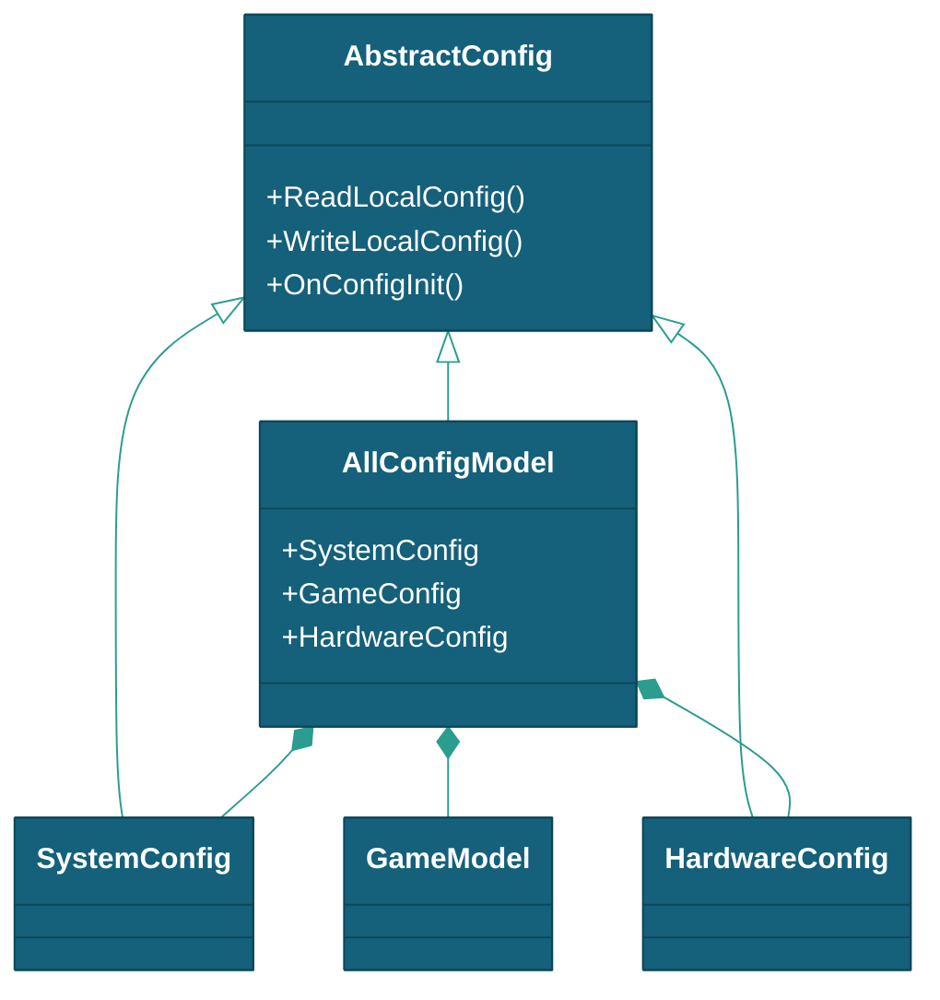
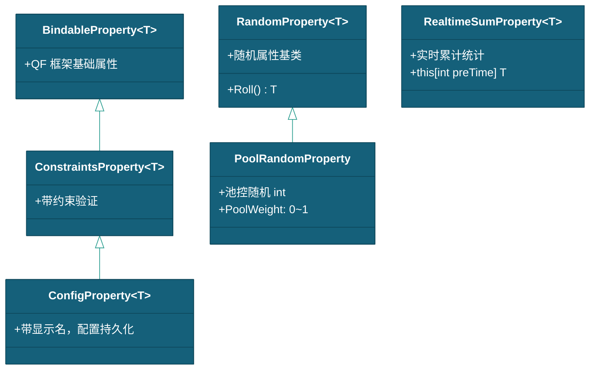

# 游戏参数配置说明

> 本文档描述 DragonBreakSea 的游戏参数配置，包括 GameModel、PlayModel 和 AllConfigModel 的数据结构与属性系统。
> 现状定位：GameModel/PlayModel/AllConfigModel 参数体系与属性系统现行有效；概率云参数已随 Cloud 内核退役删除（§4.2 的 `_targetRaindrops`/`_baseCoef`/`_probExponent`/`_warmingBudget`/`_warmingMultiplier` 与 §4.3 难度档表、§4.4 炒场预算档位仅作历史参考，Cloud 退役清单见 [总体设计](../总体设计.md) §1.3）。

---

## 一、所属

| 项目 | 内容 |
|------|------|
| 所属模块 | 玩家流程、Gameplay |
| 所属对象 | [炮台](../实体/炮台/炮台.md) |

---

## 二、GameModel — 游戏全局参数

`GameModel` 继承 `CloudConfig`，同时实现 `IData` 和 `IDataIndexer<PlayModel>`。通过 `DataModule.Set<T>()` 注册后，可通过 `this.GetModel<GameModel>()` 获取。

**文件位置：** `Scripts/Data/CloudWater/GameModel.cs`

```csharp
public class GameModel : CloudConfig, IData, IDataIndexer<PlayModel>
```

### 2.1 参数列表

| 字段 | 类型 | 默认值 | 说明 |
|------|------|--------|------|
| `PointsRate` | `BindableProperty<int>` | 10 | 几分一币 |
| `PointToLotteryRate` | `BindableProperty<int>` | 10 | 几分一票（彩票） |
| `NeedCoins` | `BindableProperty<int>` | 1 | 几币一玩 |
| `MinLv` | `ConstraintsProperty<int>` | 0 | 炮最低等级（受后台 LvArr 约束） |
| `MaxLv` | `ConstraintsProperty<int>` | 31 | 炮最高等级（受后台 LvArr 约束） |
| `MaxSwitchCooldown` | `BindableProperty<float>` | 0.01 | 炮转换冷却时间（秒） |
| `RotationSpeed` | `BindableProperty<float>` | 0.01 | 炮转动速度 |
| `FullAutoThreshold` | `BindableProperty<float>` | 1.0 | 全自动发射按住秒数 |
| `StandardFirerate` | `BindableProperty<float>` | 0.2 | 普通炮射速（秒） |
| `MachineGunFirerate` | `BindableProperty<float>` | 0.1 | 机枪炮射速（秒） |
| `LightningGunFirerate` | `BindableProperty<float>` | 0.25 | 电击炮射速（秒） |
| `FishWaters` | `Dictionary` | — | 所有云水数据（FishData/FishGroupData/FishWaveData） |
| `NeedPoints` | 计算属性 | — | `NeedCoins × PointsRate`，所需分值 |

### 2.2 初始化与数据加载

```csharp
public override void OnConfigInit()
{
    base.OnConfigInit();
    // 鱼种：FishData/ 文件夹递归加载（兼容根目录 FishData.json 回退）

    // GroupData：按子文件夹名分发（SchoolFishData/FormationFishData/FixedFormationFishData），
    // LoadGroupDir<T> 用 Newtonsoft 反序列化子类后手动注册进 WaterDict（InitCloudWater 会丢子类字段）
    foreach (string sub in Directory.GetDirectories(groupDir))
    {
        switch (Path.GetFileName(sub))
        {
            case nameof(SchoolFishData):         LoadGroupDir<SchoolFishData>(sub); break;
            case nameof(FormationFishData):      LoadGroupDir<FormationFishData>(sub); break;
            case nameof(FixedFormationFishData): LoadGroupDir<FixedFormationFishData>(sub); break;
            default: Debug.LogWarning($"[GameModel] 未知 GroupData 子文件夹: {sub}"); break;
        }
    }

    // WaveData：递归扫描；Test/ 文件夹有 JSON 时仅加载 Test，忽略其他子文件夹
    string testDir = Path.Combine(waveDir, "Test");
    if (Directory.Exists(testDir) && Directory.GetFiles(testDir, "*.json", SearchOption.AllDirectories).Length > 0)
        scanDir = testDir;   // 仅加载 Test 关卡
    foreach (string file in Directory.GetFiles(scanDir, "*.json", SearchOption.AllDirectories))
        InitCloudWater<FishWaveData>(file);
}
```

`InitPlayer()` 创建 1 个 GlobelModel + 11 个玩家 PlayModel（`PlayerCount = 11`），`GlobelModel.Raindrops` 变化时自动同步到所有玩家模型。

### 2.3 等级约束

- `MinLv` 约束：`≥ 0` 且 `< MaxLv`
- `MaxLv` 约束：`≥ MinLv` 且 `< CloudModel.s_Levels.Length`
- 任一变化时触发 `BulletRefreshEvent` 通知所有玩家刷新炮等级

---

## 三、PlayModel — 玩家运行时状态

`PlayModel` 继承 `CloudModel`，每个玩家独立一个实例。

```csharp
[Serializable]
public class PlayModel : CloudModel
```

| 字段 | 类型 | 说明 |
|------|------|------|
| `Coins` | `ConstraintsProperty<int>` | 投币数 |
| `InSkill` | `BindableProperty<bool>` | 技能动画播放中 |
| `ActiveBulletCount` | `ConstraintsProperty<int>` | 当前场上子弹数（上限 MaxBullets = int.MaxValue） |
| `TotalCoinIn` | `BindableProperty<long>` | 累计投币数（现金流总账，不随 ResetStatus 清零） |
| `TotalTicketOut` | `BindableProperty<long>` | 累计出票数（现金流总账，不随 ResetStatus 清零） |
| `Water` | 继承自 CloudModel | 当前水值（积分） |
| `level` / `Lv` | 继承自 CloudModel | 当前炮等级 |
| `Gather` | 继承自 CloudModel | 累计吸收值 |
| `Release` | 继承自 CloudModel | 累计释放值 |
| `Raindrops` | 继承自 CloudModel | 云状态值 |

**会话统计（Session）：** `PlayModel` 还包含会话级统计字段，用于监控每局入座后的现金流：

| 字段 | 类型 | 说明 |
|------|------|------|
| `SessionActive` | bool（计算属性） | 会话是否进行中（`Water > 0 \|\| Coins > 0`） |
| `SessionBaseGather` | long | 会话开始时的 Gather 快照 |
| `SessionBaseRelease` | long | 会话开始时的 Release 快照 |
| `SessionStartTime` | float | 会话开始时间（Time.time） |
| `SessionEarned` | long（计算属性） | 会话累计获得（Gather − SessionBaseGather） |
| `SessionSpent` | long（计算属性） | 会话累计消耗（Release − SessionBaseRelease） |
| `BeginSession()` | 方法 | 记录当前 Gather/Release 基线并开始新会话 |

---

## 四、AllConfigModel — 配置聚合入口

```csharp
public class AllConfigModel : AbstractConfig, IData
```

聚合系统配置、游戏配置和硬件配置。

| 子配置 | 类型 | 说明 |
|--------|------|------|
| `SystemConfig` | `SystemConfig` | 系统配置（音量 + 概率云参数，见下表） |
| `GameConfig` | `GameModel` | 游戏配置（CloudModule 初始化入口） |
| `HardwareConfig` | `HardwareConfig` | 硬件配置（预留） |

### 4.2 SystemConfig 参数表（实际默认值）

| 字段 | 类型 | 默认值 | 约束 | 说明 |
|------|------|--------|------|------|
| `_globeVolume` | `ConfigProperty<float>` | 100 | 0~100 | 总音量 |
| `_musicVolume` | `ConfigProperty<float>` | 100 | 0~100 | 背景音乐音量 |
| `_soundVolume` | `ConfigProperty<float>` | 100 | 0~100 | 音效音量 |
| `_targetRaindrops` | `ConfigProperty<int>` | 10 | 0< v ≤20 | 目标抽水点，控制全局概率云基线（关卡 Profile.TargetRaindropsOverride ≥ 0 时覆盖） |
| `_baseCoef` | `ConfigProperty<float>` | 0.54 | 0.1~2.0 | 基准概率系数（实测基准 0.54 / V^1.15）；难度档联动画查 §4.3 |
| `_probExponent` | `ConfigProperty<float>` | 1.15 | 0.5~2.0 | 概率衰减指数（实测基准） |
| `_warmingBudget` | `ConfigProperty<int>` | 5000 | ≥5000 | 炒场预算（分）**兜底默认**；实际按炮等级四档位评估下发（§4.4）。全局净赔付未超过时命中概率乘炒场倍率主动放水，超出后恢复 CanPour 罚因 |
| `_warmingMultiplier` | `ConfigProperty<float>` | 1.2 | 1.0~1.5 | 炒场倍率，炒场期内命中概率放大系数 |

### 4.3 难度-基准系数表（baseCoef 10 档，数值策划总纲 §1.4）

> 正切曲线（k=0.6）分 10 档，0.52~0.56 区间，相邻起伏 ≤1%；难度 10 = 0.5200 最难（吃分）→ 难度 1 = 0.5600 最易（送分）。关卡 Profile `DifficultyLevel` 查表（见[关卡配置说明](../关卡/关卡配置说明.md) §2.3）；无 Profile 时用 SystemConfig 全局默认 0.54。

| 难度 | baseCoef | 相对 0.54 偏差 | 语义 |
| :-: | :------: | :--------: | ------ |
| 1 | 0.5600 | +3.7% | 最易（送分） |
| 2 | 0.5547 | +2.7% | 偏易 |
| 3 | 0.5501 | +1.9% | 偏易 |
| 4 | 0.5459 | +1.1% | 略易 |
| 5 | 0.5420 | +0.4% | ≈基准（默认） |
| 6 | 0.5380 | −0.4% | ≈基准 |
| 7 | 0.5341 | −1.1% | 略难 |
| 8 | 0.5299 | −1.9% | 偏难 |
| 9 | 0.5253 | −2.7% | 偏难 |
| 10 | 0.5200 | −3.7% | 最难（吃分） |

### 4.4 炒场预算档位（云周期Profile方案 §3.2）

> 每场（切关）评估一次最高活跃炮等级 → 下发对应预算；保证任意档位 ≥20 发该档顶炮的放水覆盖。

| 档位 | 炮等级 | 预算（分） |
|:---:|:---:|:---:|
| 低 | Lv0~9 | 5,000 |
| 中 | Lv10~19 | 20,000 |
| 高 | Lv20~26 | 100,000 |
| 顶 | Lv27~31 | 200,000 |

### 4.1 配置体系继承



---

## 五、属性系统

### 5.1 属性继承体系



### 5.2 核心属性类型

| 属性 | 说明 | 使用场景 |
|------|------|---------|
| `BindableProperty<T>` | QF 基础可绑定属性，值变化自动通知 | GameModel 多数参数 |
| `ConstraintsProperty<T>` | 带约束验证，不满足约束时阻止设值 | ActiveBulletCount, MinLv/MaxLv, Water, Lv, Raindrops |
| `ConfigProperty<T>` | 带显示名，支持本地持久化 | SystemConfig 系统配置 |
| `RandomProperty<T>` | 随机属性基类，`Roll()` 取值 | 框架预留（当前业务未直接使用） |
| `PoolRandomProperty` | 池控随机（`PoolWeight` 偏置） | 框架预留（AwardFish 实际使用自有公式，见下） |
| `RealtimeSumProperty<T>` | 时间窗口累计统计 | CloudModel.Gather / Release |

### 5.3 AwardFish 池控滚值

> ⚠️ 当前 `AwardFish` 未使用 `PoolRandomProperty`，而是自带滚值实现（`RollRewardParams()`）。

```csharp
// AwardFish.RollRewardParams() —— SetData 时自动调用
def.RolledValue = Random.Range(def.Min, def.Max + 1);              // ① 均匀随机
def.RolledValue = Round(def.RolledValue * (0.5f + health * 0.5f)); // ② 池控偏置
switch (def.Operation) { Add/Subtract/Multiply/Divide }             // ③ 叠加到 Data.Volume
```

- `health` = `GetPoolHealth()`：`GlobelModel.Gather/Release` 计算 0~1 值
- 池子越充裕（health → 1），滚值越接近上限（×1.0）；越枯竭（health → 0），滚值越接近半值（×0.5）
- 详细配置见 [鱼与关卡数据配置说明 - 5.1 奖池滚值](../关卡/鱼与关卡数据配置说明.md#51-volume-价值计算)

---

## 六、ScriptableObject 配置

| 配置 | 位置 | 说明 |
|------|------|------|
| `SerialProtocolConfig.asset` | `Settings/` | 串口协议字节布局 |
| `OperationMapConfig.asset` | `Settings/` | 通道映射配置 |
| `HardwareActions.inputactions` | `Settings/` | Unity Input System 动作配置 |
| `LevelBackgroundData` | 动态创建 | 关卡背景资源（视频/图片） |

---

## 七、相关文档

- [鱼与关卡数据配置说明](../关卡/鱼与关卡数据配置说明.md)
- [设备协议配置说明](../设备输入输出系统/设备协议配置说明.md)
- [玩家流程](../流程与视觉/流程/玩家流程/玩家流程.md)
