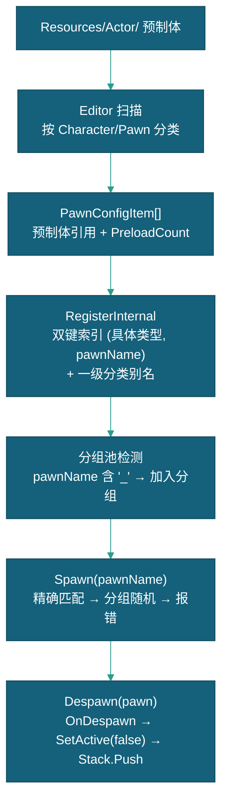
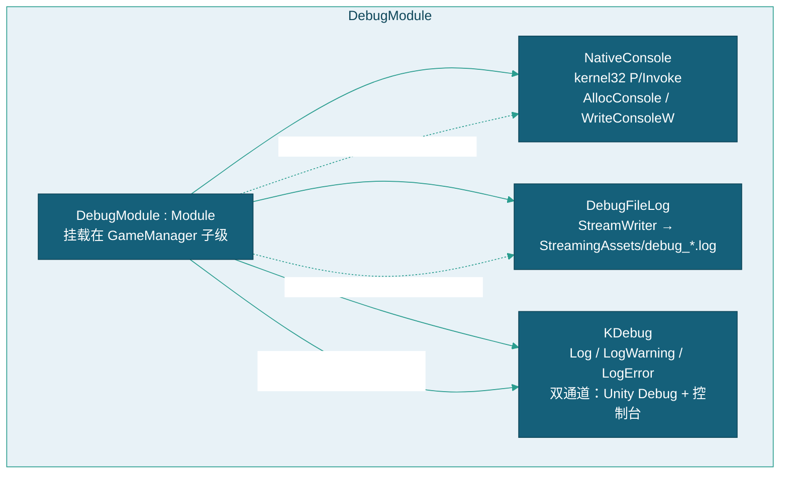
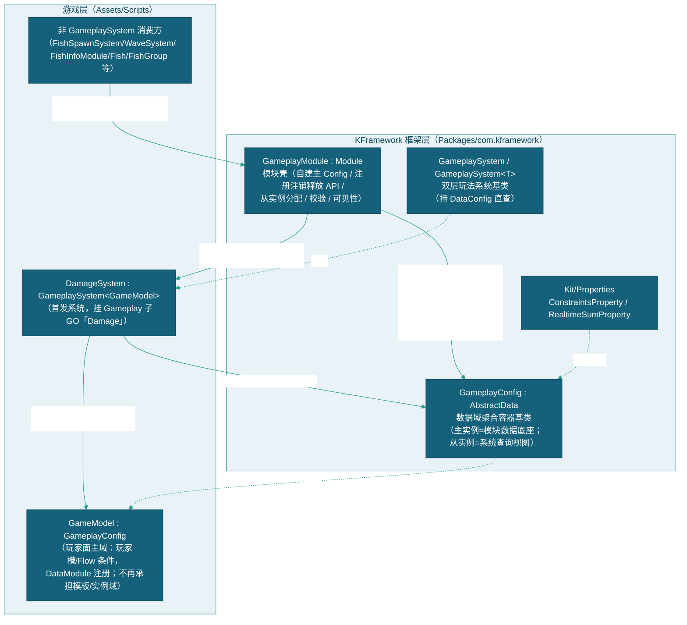
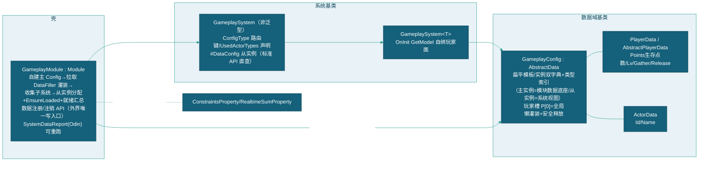
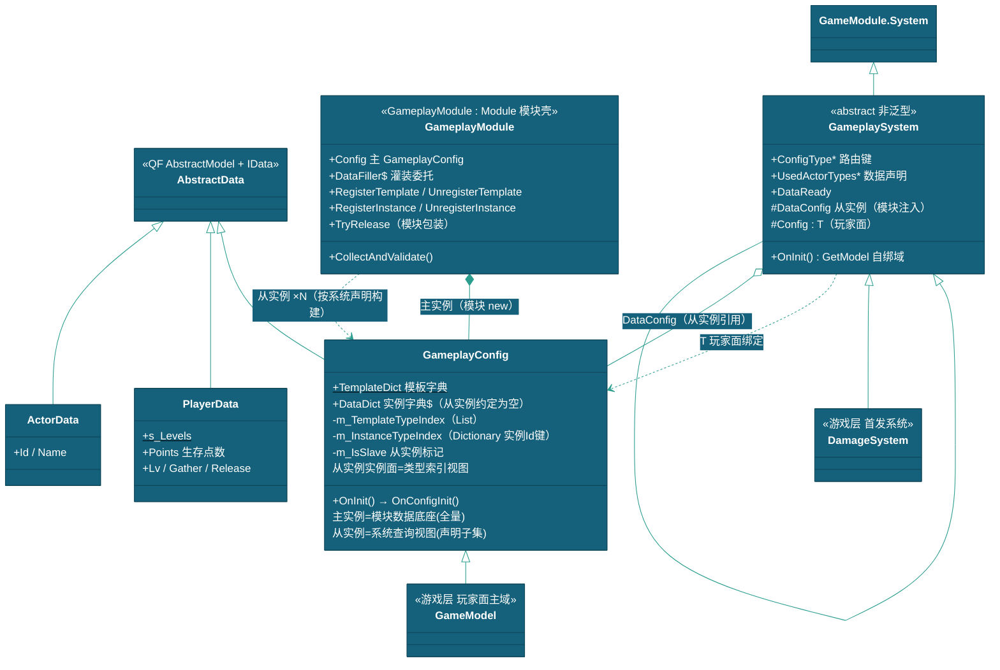
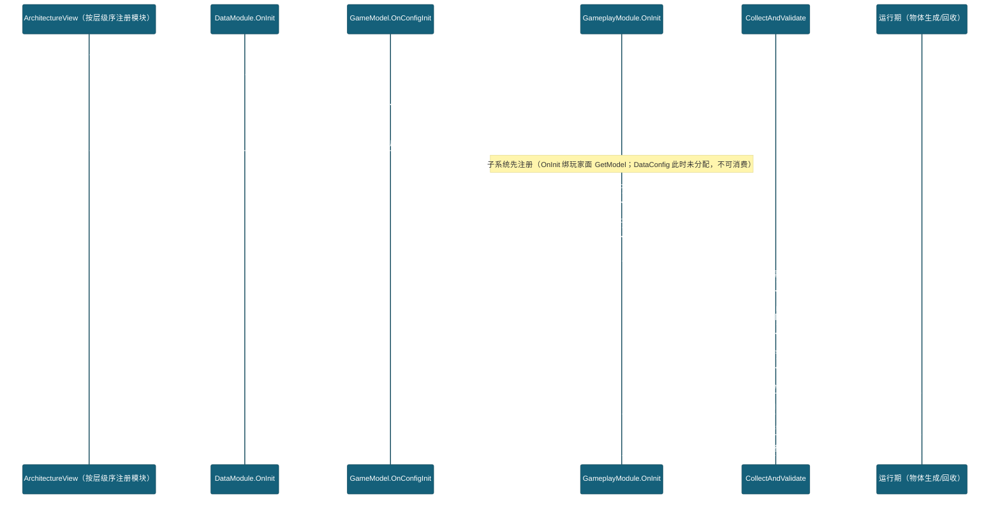
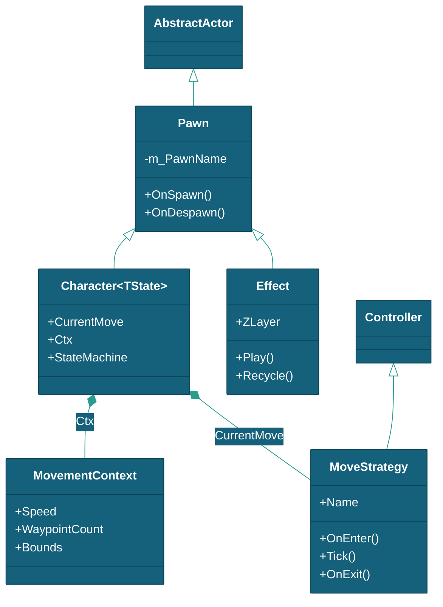
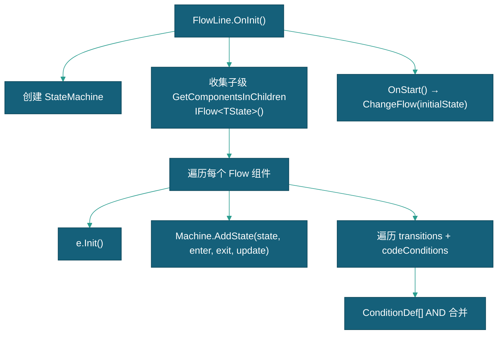
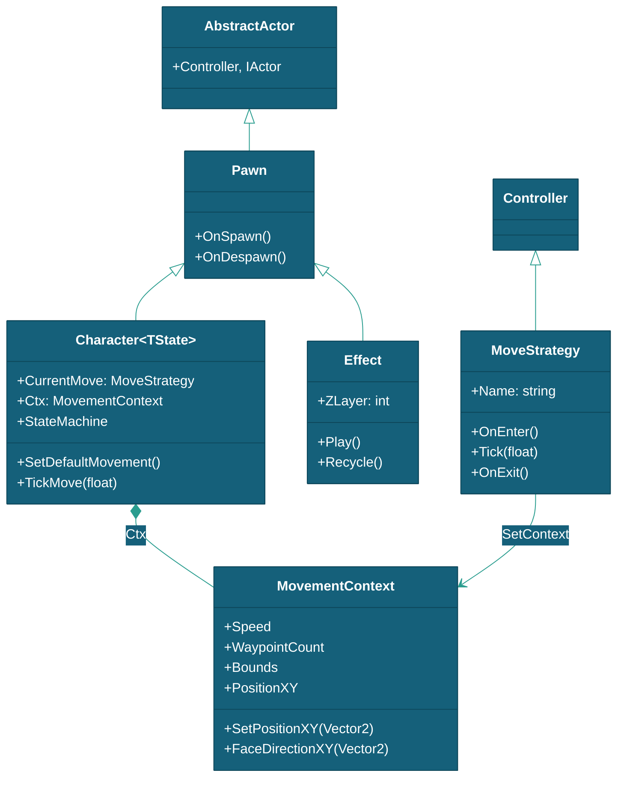

# 框架设计文档

> 本文档描述 KFramework 扩展层的架构设计，包含架构入口、模块/系统基类、玩法模块、玩法系统理论、对象池、流程线、条件系统和视觉模块等核心机制。
> 各模块的详细设计请参见对应的模块文档。

---

## 一、架构入口

### 1.1 KArchitecture

`KArchitecture` 继承 `QFramework.Architecture<KArchitecture>`，是框架的单例架构入口。`Init()` 保持空实现，实际模块注册由 `ArchitectureView` 通过反射完成。

```csharp
namespace KFramwork
{
    public class KArchitecture : Architecture<KArchitecture>, IKArchitecture
    {
        protected override void Init() { }
        public new T GetModule<T>() where T : class, IModule => base.GetModule<T>();
    }
}
```

| API | 说明 |
|------|------|
| `Interface`（静态属性） | 获取架构单例实例 |
| `GetModule<T>()` | 获取已注册的 Module |
| `GetFlowLine<T>()` | 语义化封装 `GetSystem<T>()`，限定 `ISystem` 类型 |

`IKArchitecture` 接口继承 `IArchitecture`，额外提供 `GetModule<T>()` 的显式声明。

### 1.2 ArchitectureView

`ArchitectureView` 继承 `Controller`，挂载在场景 `GameManager` 对象上。在 `OnEnable()` 阶段自动发现所有 `Module` 子类并通过反射注册到架构。

```csharp
private void OnEnable()
{
    IArchitecture arch = KArchitecture.Interface;
    Module[] modules = GetComponentsInChildren<Module>(true);
    foreach (Module module in modules)
    {
        genericMethod.MakeGenericMethod(module.GetType()).Invoke(arch, new[] { module });
    }
}
```

| 节点 | 模块 | 说明 |
|------|------|------|
| `GameManager` | `ArchitectureView` | 架构入口 |
| `├── Data` | `DataModule` | 数据模块（IData 注册，含 GameplayModule 数据域） |
| `├── Device` | `DeviceModule` | 设备模块 |
| `├── Pool` | `PawnModule` | 对象池模块 |
| `├── Gameplay` | `GameplayModule` | 玩法模块（玩法系统宿主+数据分发校验，子 GO 挂玩法系统；**Pool 之后 Flow 之前**） |
| `├── Flow` | `FlowModule` | 流程模块 |
| `├── View` | `ViewModule` | 视觉模块 |
| `├── Debug` | `DebugModule` | 调试模块（可选） |

### 1.3 ICanGetModule

`ICanGetModule` 在 QFramework 层定义，通过扩展方法调用 `IArchitecture.GetModule<T>()`：

```csharp
public interface ICanGetModule : IBelongToArchitecture { }

public static class CanGetModuleExtension
{
    public static T GetModule<T>(this ICanGetModule self) where T : class, IModule
        => self.GetArchitecture().GetModule<T>();
}
```

以下类型均可使用 `this.GetModule<T>()`：

| 类型 | 来源 |
|------|------|
| `Module` | 基类实现 `ICanGetModule` |
| `Controller` | 基类实现 `ICanGetModule` |
| `ISystem` | 接口包含 `ICanGetModule` |
| `ICommand` | 接口包含 `ICanGetModule` |
| `IQuery` | 接口包含 `ICanGetModule` |

---

## 二、模块系统

### 2.1 Module 基类

`Module` 继承 `MonoBehaviour` + `IModule` + `ICanGetModule`，挂载在场景中作为业务模块。初始化时自动扫描子级 `System` 组件并通过反射注册到架构。

```csharp
public abstract class Module : MonoBehaviour, IModule, ICanGetModule
{
    void ICanInit.Init()
    {
        var childSystems = GetComponentsInChildren<System>(true);
        foreach (var sys in childSystems)
        {
            var arch = ((IBelongToArchitecture)this).GetArchitecture();
            // 反射调用 RegisterSystem<T>(sys)
            arch.GetType().GetMethod("RegisterSystem", new[] { sys.GetType() })
                .MakeGenericMethod(sys.GetType()).Invoke(arch, new object[] { sys });
        }
        OnInit();
    }
}
```

| 成员 | 说明 |
|------|------|
| `OnInit()` | 子类初始化入口 |
| `Deinit()` / `OnDeinit()` | 反初始化 |
| `Initialized` | 标记已初始化 |

### 2.2 System 基类

`System` 继承 `MonoBehaviour` + `ISystem`，挂载在 Module 子级 GameObject 上。`OnInit()` 为抽象方法，子类必须实现。

```csharp
public abstract class System : MonoBehaviour, ISystem
{
    void ICanInit.Init() => OnInit();
    public void Deinit() => OnDeinit();
    protected virtual void OnDeinit() { }
    protected abstract void OnInit();
}
```

| 成员 | 说明 |
|------|------|
| `OnInit()` | 抽象方法，子类必须实现 |
| `Deinit()` / `OnDeinit()` | 可选清理 |

### 2.3 初始化顺序

`ArchitectureView` 使用 `GetComponentsInChildren<Module>()` 按 Hierarchy 顺序注册，父级模块优先。

| 顺序 | 模块 | 说明 |
|------|------|------|
| 1（最先） | `DataModule` | 提供数据服务（玩家面 GameModel 经 preInitTypes 注册，其 OnConfigInit 顺带注册 GameplayModule 灌装委托 `GameplayModule.DataFiller`） |
| 2 | `DeviceModule` | 提供设备服务 |
| 3 | `PawnModule` | 对象池创建 |
| 4 | `GameplayModule` | 玩法系统宿主——**Pool 之后、Flow 之前**（硬约束：须在 Data 之后——灌装委托注册先于模块 OnInit 拉取，玩家面 GetModel 先于系统绑定） |
| 5 | `FlowModule` | 管理流程线 |
| 6 | `ViewModule` | 管理 UI 和特效 |
| 7 | `DebugModule` | 可选，调试控制台（仅 Windows Player） |

---

## 三、Controller 基类

```csharp
public class Controller : MonoBehaviour, IController, ICanSendEvent, ICanGetModule
{
    public IArchitecture GetArchitecture() => KArchitecture.Interface;
    public T GetFlowLine<T>() where T : class, ISystem => this.GetSystem<T>();
}
```

| API | 说明 |
|------|------|
| `this.GetModule<T>()` | 获取已注册的模块 |
| `this.GetSystem<T>()` | 获取已注册的 System |
| `this.GetModel<T>()` | 获取已注册的数据模型 |
| `this.SendCommand()` | 发送 Command |
| `this.SendEvent()` | 发送事件通知 |

**约束规则：**
- Controller 不能直接修改 Model，应通过 `SendCommand()` 发送 Command
- Controller 通过事件监听响应 Model 变更
- Module 可获取其他 Module/System/Model
- 上层可获取下层，下层不能获取上层

---

## 四、各模块设计

### 4.1 DataModule

数据注册与查询中心。将 `IData` 实例同时注册到 QF 架构层，使 `IController` / `ISystem` 可通过 `this.GetModel<T>()` 获取。

```csharp
public class DataModule : Module, IDataModule
{
    public void Set<T>(T _data) where T : class, IData;   // 注册数据
    public T Get<T>() where T : class, IData;              // 获取数据
    public bool SetByType(Type type);                      // 运行时 Type 注册
    public IData GetByType(Type type);                     // 运行时 Type 获取
}
```

**预加载配置**: Inspector 中 `preInitTypes` 列表，按顺序通过反射创建并注册 `IData` 实例。下拉列表自动扫描当前 AppDomain 中所有实现 `IData` 的非抽象类。

**IData 接口**:

```csharp
public interface IData : IModel { }

public abstract class AbstractData : AbstractModel, IData
{
    public virtual object GetSubModel(string index) => null;
    public virtual Type GetSubModelType() => null;
}
```

`IDataIndexer<T>` 接口提供索引器支持，用于 ConditionDef 的数据绑定：
```csharp
public interface IDataIndexer<T> { T GetItem(string index); }
```
ConditionDef 的索引路径（`propertyPath` 以 `*` 后缀标记，如 `GameModel*.Water`）经 FlowTransition **按方法名反射 `GetItem`** 重定向到子数据对象——实现类可不声明 IDataIndexer 接口，但被条件路径引用时必须提供同名公有方法。

### 4.2 DeviceModule

输入/输出设备管理模块。收集子级 `BaseInputSystem` / `BaseControlSystem`，按 `DeviceType` 汇总设备需求，创建并派发 `IDevice` 实例。

```csharp
public class DeviceModule : Module, IDeviceModule
{
    public PlayerDevice P(int playerId);          // 获取玩家输入包装器
    public IReadOnlyList<IDevice> GetDevices(DeviceType type);
    public T GetInputSystem<T>() where T : BaseInputSystem;
    public T GetControlSystem<T>() where T : BaseControlSystem;
}
```

**核心类型：**

| 类型 | 说明 |
|------|------|
| `IDevice` | 设备接口（DeviceType, Connect/Disconnect, IsConnected） |
| `DeviceBase` | 设备抽象基类 |
| `BaseInputSystem<TDevice>` | 输入系统泛型基类 |
| `BaseControlSystem<TDevice>` | 控制系统泛型基类 |
| `PlayerDevice` | 玩家输入包装器（GetButtonDown/GetVector2/OnHold） |
| `DeviceType` | 设备类型枚举（当前仅 Serial） |

**PlayerDevice API：**

| API | 说明 |
|------|------|
| `GetButtonDown(name)` | 当前帧按下 |
| `GetButton(name)` | 按住中 |
| `GetButtonUp(name)` | 当前帧释放 |
| `GetVector2(name)` | 读取 Vector2 轴值 |
| `GetAxis(name)` | 读取 float 轴值 |
| `OnPerformed(name, callback)` | 注册 InputAction 回调 |
| `OnHold(name, duration, onHold, onCancel)` | 长按检测 |
| `Control(channelName, data)` | 发送控制命令 |

### 4.3 PawnModule

对象池管理模块。提供基于双键索引 `(Type, pawnName)` 的对象池系统，管理所有 `Pawn` 和 `Character` 子类的实例化与回收。



| API | 说明 |
|------|------|
| `RegisterPawn<T>(prefab, preloadCount)` | 注册预制体到对象池 |
| `Spawn<T>(pawnName)` | 从池中分配实例，调用 OnSpawn |
| `Spawn<T>()` | 分配默认命名实例 |
| `Despawn(pawn)` | 回收实例到对象池，调用 OnDespawn |
| `GetRegisteredPawns()` | 遍历所有已注册预制体 |

**双键索引与分类注册：** 每个预制体以 `(具体子类类型, prefab.name)` 为主键注册。同时以一级分类类型（继承链中第一个继承 Pawn/Character 的类名，如 `TianWang` → `Fish`）注册别名池，共享同一底层池。

**分组池（Group Pooling）：** 包含 `_` 后缀的预制体名（如 `MeiHouWang_01`）自动建立分组。`Spawn<Fish>("MeiHouWang")` 精确匹配失败后在分组中随机选取变体。

**PawnPool 内部实现：** 基于 `Stack<GameObject>`，后进先出。`Allocate()` 时 `SetActive(true)`，`Recycle()` 时 `SetActive(false)`。构造函数中按 `preloadCount` 预创建实例。

### 4.4 ViewModule

视觉管理模块。管理 UI 组件（ViewBase）和特效（Effect）的创建与生命周期。

```csharp
public class ViewModule : Module, IViewModule
{
    public T CreateEffect<T>() where T : Effect;
    public T CreateEffect<T>(string effectName) where T : Effect;
    public T OpenView<T>(int playerId) where T : ViewBase;
    public void CloseView<T>(int playerId) where T : ViewBase;
    public T GetView<T>(int playerId) where T : ViewBase;
    public bool IsViewOpen<T>(int playerId = 0) where T : ViewBase;
}
```

**Hierarchy 区域约定：**

| 区域 | playerId | 说明 |
|------|----------|------|
| `View/Global` | 0 | 全局 UI |
| `View/P1` ~ `View/P10` | 1~10 | 各玩家 UI |

`OnInit()` 时扫描子级 Transform，按 `P`+数字 解析 playerId，扫描区域内 `ViewBase` 组件并缓存。特效通过 `PawnModule` 池化分配。

**ViewBase 生命周期：**

| 方法 | 触发时机 |
|------|----------|
| `OnOpen()` | `OpenView()` 且当前关闭 |
| `OnShow()` | `OpenView()` 且当前已打开 |
| `OnClose()` | `CloseView()` 且当前打开 |
| `OnHide()` | `CloseView()` 且当前已关闭 |

**AwardEffect 队列：** ViewModule 维护 `Queue<AwardEffect>`，在 `Update()` 中按序播放。`EnqueueEffect()` 将特效入队并隐藏，前一个播放完毕后自动出队并激活下一个。

### 4.5 FlowModule

流程线收集管理模块。扫描子级 `IFlowLine` 组件，按 Type 分类存储，同时注册到 QF 架构。

```csharp
public class FlowModule : Module
{
    public List<IFlowLine> GetFlowlines<T>();
    public T GetFlowline<T>() where T : class;
}
```

`OnInit()` 中扫描 `GetComponentsInChildren<IFlowLine>()`，按类型注册到字典，同时调用 `arch.RegisterSystem(line)` 注册到 QF 架构。

### 4.6 DebugModule

调试模块。仅在 **Windows Player 打包运行时**生效，Editor 下自动禁用。提供三个独立子系统：Native 控制台窗口、全局日志捕获、文件日志落盘。

**子系统架构：**



**三个子系统：**

| 子系统 | 类 | 说明 |
|--------|-----|------|
| Native 控制台 | `NativeConsole` | Windows kernel32 P/Invoke：`AllocConsole` / `FreeConsole` / `WriteConsoleW` / `SetConsoleTextAttribute`。不依赖 `System.Console`，兼容 IL2CPP |
| 文件日志 | `DebugFileLog` | `StreamWriter` 写入 `StreamingAssets/debug_{yyyyMMdd_HHmmss}.log`，`AutoFlush = true` |
| 调试 API | `KDebug` | `Log()` / `LogWarning()` / `LogError()` 及格式化变体。始终走 `Debug.Log`；控制台开启且未开全局捕获时，额外同步写 NativeConsole |

**DebugModule 配置字段：**

| 字段 | 类型 | 默认值 | 说明 |
|------|------|--------|------|
| `openConsoleOnWindows` | bool | false | Windows 打包运行时自动弹出命令行窗口 |
| `enableCKeyToggle` | bool | true | 按 `C` 键开关控制台窗口 |
| `useGlobalCapture` | bool | true | 为 true 时通过 `Application.logMessageReceived` 捕获所有 `Debug.Log` 输出到控制台和日志文件；为 false 时仅 `KDebug` 的调用输出到控制台 |
| `enableFileLog` | bool | true | 开启后将所有日志同步写入 `StreamingAssets/debug_*.log` |

**运行时快捷键（仅 Windows Player）：**

| 按键 | 功能 |
|------|------|
| `C` | 开关控制台窗口 |
| `V` | 切换全局捕获模式（`useGlobalCapture` 开关，控制台打开状态下可用） |

**日志输出格式：**

```
[HH:mm:ss.fff] 普通日志内容               ← 灰色
[HH:mm:ss.fff W] 警告内容 + 堆栈           ← 黄色
[HH:mm:ss.fff E] 错误内容 + 堆栈           ← 红色
```

**NativeConsole 颜色常量：**

| 常量 | 值 | 颜色 |
|------|-----|------|
| `Gray` | `0x07` | 默认灰白 |
| `Yellow` | `0x0E` | 警告黄 |
| `Red` | `0x0C` | 错误红 |
| `Green` | `0x0A` | 成功绿 |
| `Cyan` | `0x0B` | 信息青 |

**焦点管理：** `AllocConsole` 会抢占前台窗口焦点。`DebugModule` 在分配控制台前调用 `SaveForegroundWindow()` 保存句柄，成功后调用 `RefocusUnityWindow()` 将焦点归还 Unity 窗口。

**防重入保护：** `OnLogMessageReceived` 使用 `m_InLogCallback` 标记防止 `Debug.Log` 内部再次触发回调导致无限递归。

**初始化和销毁：**

| 阶段 | 行为 |
|------|------|
| `OnInit()` | Editor 下直接禁用；Windows Player 下按 `openConsoleOnWindows` 决定是否弹出控制台 |
| `Update()` | 检测 C/V 键，处理控制台开关和全局捕获模式切换 |
| `OnDeinit()` | 调用 `CloseConsole()`：移除 `logMessageReceived` 回调 → 关闭文件日志 → `FreeConsole` → 重置句柄 |

**打包建议：** DebugModule 为纯调试用途，正式发布时可移除该组件或设置 `openConsoleOnWindows = false` 且 `enableCKeyToggle = false`。`DebugFileLog` 仅在控制台开启时创建文件，关闭时自动销毁。

### 4.7 GameplayModule

**玩法分两层**（设计理念，概念定义见 §五、玩法系统理论）：

| 层        | 数据流                        | 承载                                                                                                        |
| -------- | -------------------------- | --------------------------------------------------------------------------------------------------------- |
| **主动玩法** | 玩家信号 → 游戏物体（单向）            | **FlowModule / GameFlow**（§4.5）：按发炮键 → 子弹发射；按能量键 → 炮等级/道具切换；投币、出票、状态流转（Preview→Playing→Exit）——玩家直接驱动的操作响应 |
| **被动玩法** | 玩家 ↔ 主动影响物体 ↔ 被动影响物体（三方引用） | **GameplayModule**（本节）：被玩家影响过的物体与其他物体产生的影响——子弹碰撞鱼引发的伤害判定、未来概率玩法/其他玩法判定等                                      |

GameplayModule = 被动玩法的**交互动作中枢 + 数据再组织中枢**：承载一切「玩家操作 → 游戏世界响应」的被动玩法交互，并以聚合容器统一持有玩家数据/物体数据/全局数据供玩法系统一站式取数（替代散落的 GetModel/Command 链）。主动玩法因单向简单流在 GameFlow 流程中以信号驱动即可；被动玩法因三方数据引用且非单向而复杂——本模块以数据域聚合容器（玩家槽+物体注册表+全局）+ 玩法系统插件化（多域路由）解决其数据流通道路问题。零游戏层引用：框架层只提供壳/容器/基类，具体数据灌装经静态委托反转（`GameplayModule.DataFiller`），玩法系统在游戏层经子 GO 挂载接入。

#### 4.7.1 架构位置



#### 4.7.2 组成与文件结构



**位置**：`Packages/com.kframework/Runtime/Module/Gameplay/`（KFrameworkPackage.git main `3c7c0eb`，当前包版本 0.1.8）。框架层零游戏层引用。

```
Packages/com.kframework/Runtime/Module/Gameplay/
├── Gameplay.cs          ← 模块壳：OnInit 收集子系统 → 域绑定检查 + 声明类型
│                          EnsureLoaded 按需灌装 + 就绪校验；SystemDataReport
│                          （Odin Inspector 可见）；CollectAndValidate 可重跑
├── GameplayConfig.cs    ← 聚合容器基类（扁平结构）：
│                          TemplateDict / DataDict 双字典（无类目层、无 start 键后缀、
│                          无 Substring 分配与双层哈希）+ 模板/实例双类型索引 +
│                          玩家槽位（P[0]=全局）+ OnInit→OnConfigInit 生命周期接线 +
│                          按需灌装（RegisterLazyFill/EnsureLoaded）+ 安全释放（TryRelease）
├── PlayerData.cs        ← AbstractPlayerData（Points 生存点数/Lv/Gather/Release）
│                          + PlayerData（派生指标，s_Levels 桩表）
├── ActorData.cs         ← 物体数据单元（Id/Name）
└── GameplaySystem.cs    ← 双层系统基类：非泛型 GameplaySystem（BoundConfig/
                           ConfigType 路由键/UsedActorTypes 数据声明/DataReady）
                           + GameplaySystem<T>（OnInit 经 GetModel 自绑域）
Packages/com.kframework/Runtime/Kit/Properties/ ← ConstraintsProperty（拒绝写入）
                                                    / RealtimeSumProperty（时序快照）
```

游戏层接入：`GameModel : GameplayConfig`（玩家面主域——玩家槽位/Flow 条件，经 DataModule preInitTypes 注册，不再承担模板/实例数据域）+ `DamageSystem : GameplaySystem<GameModel>`（首发系统，挂 Gameplay 子 GO「Damage」，实现见 [伤害系统实现设计](玩法系统/伤害系统/伤害系统实现设计.md)）。

#### 4.7.3 关键依赖

| 依赖 | 方向 | 用途 |
|------|------|------|
| DataModule（IData 预加载链） | 玩家面注册 | GameModel 经 preInitTypes 注册（玩家槽位/Flow 条件）；其 OnConfigInit 顺带注册灌装委托（`GameplayModule.DataFiller`） |
| QF Architecture | GetModel/GetSystem/GetModule | 系统 OnInit 自绑玩家面；非系统消费方 GetModule 取模块主 Config |
| Module 基类自动扫描 | 系统注册 | GameplayModule 壳 Init 扫描子级 GameplaySystem 组件注册（无需手写注册代码） |

**时序约束**：Gameplay GO 在场景层级中位于 **DataModule 宿主之后**（硬约束）——灌装委托注册（GameModel.OnConfigInit，随 DataModule.OnInit）先于 GameplayModule OnInit 拉取；玩家面 GetModel 自绑也依赖此序。灌装与模块就绪的先后由此闭环，无死锁无空窗（初始化顺序见 §2.3，时序推演见 §4.7.6）。

#### 4.7.4 继承关系



#### 4.7.5 公开 API

**GameplayConfig（数据域聚合容器，主从双角色）**

| API | 面 | 说明 |
|-----|-----|------|
| `OnInit()`（生命周期接线） | — | 框架内 `OnInit() → OnConfigInit()`（仅 QF 注册的实例走此链，如 GameModel 玩家面；模块主/从实例不经 QF 注册，不触发） |
| `InitPlayer()`（protected virtual，单点） | 玩家 | 玩家槽位创建：`PlayerData[0]`=全局、`[1..PlayerCount]`=玩家——**全系统共享同一批，不做按系统分发** |
| `this[int index]` | 玩家 | 玩家槽位访问（[0]=全局） |
| `InitData<C[]>()` / `RegisterTemplate(data)` | 模板 | 批量/单个模板注册（同步维护类型索引；覆盖时旧模板移出；**从实例拒绝写入**） |
| `UnregisterTemplate(id)` | 模板 | 注销单个模板（含类型索引维护；从实例拒绝写入）——供模块转发 |
| `GetTemplate(id)` / `GetTemplate<T>(id)` / `TryGetTemplate` / `HasTemplate(id)` | 模板 | 模板访问（缺失抛 KeyNotFound / 泛型与 bool 形态 null 安全 / 判存）——**主从实例语义一致**（从实例经扁平字典 O(1)，仅含声明类型（含子类）条目） |
| `this[string id]` | 实例 | 实例读写（物体生成注册；从实例拒绝写入；读为主实例语义——从实例 DataDict 约定为空，实例按 Id 查询仅主实例支持（经模块 Config/API），从实例实例面=类型索引视图） |
| `UnregisterInstance(id)` | 实例 | 实例注销（物体回收；实例字典 + 索引内层 Dictionary 按 Id 移除均 O(1)；从实例拒绝写入） |
| `HasAny<TActor>()` / `GetTemplates<TActor>()` | 类型 | 模板面类型查询（走类型索引，含子类匹配）——从实例索引含声明键与可见数据的具体子类键（Sync 口补挂，口径与主实例对齐） |
| `GetAll<TActor>()` | 类型 | 实例面类型查询（场上活物体；索引内层为 Dictionary（实例 Id→实例）且主从共享同引用桶——从实例与主实例同口径自动一致） |
| `RegisterLazyFill<TActor>(fill)` | 按需灌装 | 注册懒灌装器（注册不执行；首次 EnsureLoaded 执行一次） |
| `EnsureLoaded<TActor>()` | 按需灌装 | 确保已灌装（模块校验在主实例上执行，在从实例构建之前） |
| `TryRelease<TActor>()` | 安全释放 | 清模板+空桶回收；活实例拒绝+告警；从实例拒绝调用（会清共享列表）；主实例侧释放经模块 `TryRelease` 包装（同步推送从实例扁平移除） |

主从角色：**主实例**（模块 new）= 全量数据底座，公共 API 全量可用；**从实例**（internal `CreateSlave` 工厂）= 系统查询视图——模板索引内层 List 与主实例同引用（含 Sync 口补挂的可见子类桶）、模板扁平字典由模块按声明类型（含子类）过滤同步推送；**实例索引内层 Dictionary（实例 Id 键）与主实例同引用、分配时刻按「声明含子类」一次挂全，实例扁平字典（DataDict）约定保持空（从实例实例面=类型索引视图，实例按 Id 查询仅主实例支持——经模块 Config/API）**；**写口全部拒绝**（LogError；直写会绕过主实例且污染共享索引）。

**GameplaySystem 双层基类**

| API | 说明 |
|-----|------|
| `GameplaySystem`（非泛型） | 壳的枚举/校验/分发点：`ConfigType`（路由键，typeof(T)）、`UsedActorTypes`（数据声明）、`DataReady`（校验结果）、`DataConfig`（protected，模块分配注入的从实例） |
| `DataConfig`（protected） | 本系统从实例——**标准 GameplayConfig API 直查**（GetTemplate(id) O(1)、GetTemplates/GetAll 走索引）；仅含声明类型及其子类；未分配（注册前/释放后）取用 → 一次性 Warning + null。**时序陷阱：不得在系统 OnInit 消费**——模块收集（CollectAndValidate）必然晚于系统 OnInit（Module.Init 先扫描注册子级系统再跑模块自身 OnInit），最早可用点=模块收集完成后（Start/首个查询） |
| `GameplaySystem<T> : GameplaySystem` | `OnInit()` 经 `GetModel<T>()` 自绑**玩家面**（T=玩家数据域类型；模板/实例数据不再经 T 承载） |
| `UsedActorTypes`（public virtual） | 系统的数据依赖面声明——壳据此构建从实例（索引含声明类型及其子类；模板扁平同步含子类；实例扁平约定为空——从实例实例面=类型索引视图）+ 按需灌装 + 启动期校验 + 调试可见性 |

**GameplayModule 模块壳**

| API | 说明 |
|-----|------|
| `Config`（public 只读） | 模块自建主 GameplayConfig（唯一数据底座）——非 GameplaySystem 消费方共享只读面（`GetModule<GameplayModule>().Config`）；**主实例写入口（注册/注销/释放）一律经模块 API，禁直调**（直调无从实例同步，必然主从分叉） |
| `DataFiller`（public static） | 灌装委托静态注册点（游戏层在模块 OnInit 前注册，如 GameModel.OnConfigInit）；模块 OnInit 拉取执行一次即清空 |
| `RegisterTemplate(data)` / `UnregisterTemplate(id)` | 模板注册/注销（外界唯一写入口）：主 Config 转发 + 从实例扁平字典同步推送（含子类口径，可见子类桶补挂） |
| `RegisterInstance(id, data)` / `UnregisterInstance(id)` | 实例注册/注销（物体生成/回收挂接）：主 Config 写入/移除（实例字典 + 类型索引内层 Dictionary 均 O(1)），**从实例零参与**——实例索引桶主从同 Dictionary 引用（分配时刻已按声明含子类挂全）自动可见/不可见，无扇出无扁平推送；从实例 DataDict 约定为空 |
| `TryRelease<TActor>()` / `TryRelease(Type)` | 模板释放模块包装（玩法退场唯一入口）：主 Config 转发（活实例拒绝 + 懒灌标记复位）+ 按主侧实际移除的 Id 集推送各从实例扁平移除 |
| `OnInit()` | 自建主 Config → 拉取执行 DataFiller（一次即清）→ `CollectAndValidate()` |
| `CollectAndValidate()`（public 可重跑） | 收集子级系统 → 声明类型 EnsureLoaded 按需灌装（**在从实例构建之前**）→ 每系统**重建从实例**（模板索引引用分配 + 实例索引按「声明含子类」一次挂全 + 模板含子类扁平初始化同步）→ 注入 DataConfig → 就绪汇总 |
| `OnDeinit()` | 模块注销：释放全部子系统 DataConfig（注销即释放三路之一，见 §4.7.6） |
| `SystemDataReport`（Odin） | 每系统一行：`DamageSystem | 就绪（2 类型）` / `缺数据: ...` |

#### 4.7.6 主从 Config 数据分发机制（模块自建 + 从实例同步）

**数据分发规则**：

| 分发面 | 规则 |
|--------|------|
| 玩家数据 | **不分发**——全系统共享同一批；`Config[index]` 直达，P[0]=全局；玩家槽位创建收敛于 `InitPlayer` 单点 |
| 物体数据 | **类型声明 + 拉取**——系统以 `UsedActorTypes` 声明依赖面 → 壳按声明 EnsureLoaded + 启动期就绪校验（缺数据启动即报）+ 调试可见性；数据获取走标准 API（`GetTemplate(id)` / `GetAll<TActor>()`）拉取，不推实例 |
| 多域路由 | 泛型 `T` 即路由键（每玩法域 = 一个 GameplayConfig 子类）；系统 `GameplaySystem<T>` OnInit 自绑域；非泛型基类作壳的枚举点 |
| 玩法切换 | 激活集变化 → 重跑 `CollectAndValidate`；退场域 `TryRelease`（仅模板，存在活实例时拒绝）；懒灌装标记复位可重灌 |
| 装配 | 数据域实例化/注册走 **DataModule preInitTypes IData 链**，壳不做装配；约束 = Gameplay GO 在层级上位于 Data 宿主之后 |

**主实例（数据底座）**：模块 `OnInit` 自建 `new GameplayConfig()`（**纯框架实例**：不经 QF 注册、不触发 OnConfigInit——无玩家槽位副作用），作为全模块唯一数据底座：模板/实例双扁平字典 + 类型索引全量（实例索引内层 Dictionary，实例 Id 键）。数据灌装经 `DataFiller` 委托拉取（时序见下）；运行期写（模板回写/实例注册注销/退场释放）经模块 API 转发（主实例写入口一律经模块 API，禁直调；实例注册/注销转发为主实例 O(1) 操作）。

**从实例（系统查询视图）**：系统注册进模块时（`CollectAndValidate`），壳按 `UsedActorTypes` 为每系统构建一个从实例（`GameplayConfig.CreateSlave`）并注入 `DataConfig`：

| 特性 | 说明 |
|------|------|
| 索引同引用 | 从实例 m_TemplateTypeIndex 内层 List = **主 Config 对应类型条目的同 List 引用**（GetOrAdd 预建占位空列表，后续灌装/注册复用同一列表）；m_InstanceTypeIndex 内层 **Dictionary（实例 Id→实例）** = 主 Config 同 Dictionary 引用——主侧索引增删**自动可见**，无同步无快照无分叉 |
| 扁平同步推送（仅模板面） | 从实例扁平字典不含主字典引用（protected 各自独立），由模块在**模板数据注册/注销/释放时遍历已分配系统清单推送**：条目 = 同 ActorData 引用，声明类型（含子类）过滤在 SyncTemplate 口内执行（索引键集中存在声明类型 t 使 t.IsAssignableFrom(数据具体类型) 即可见）——保 `GetTemplate(id)` O(1) 且从实例即时可见。**实例面无扁平推送**——从实例 DataDict 约定保持空（实例按 Id 查询仅主实例支持，经模块 Config/API），从实例实例面=类型索引视图（GetAll 走共享桶） |
| 子类桶补挂 | 模板面：可见数据的具体类型桶若未挂（声明的是基类、数据是子类，如 FishGroupData 声明下的 SchoolFishData），Sync 口即时从主实例补挂该具体类型的**同 List 引用**桶——从实例 `GetTemplates<子类>` 与主实例语义一致，索引与扁平两口径同含同删。**实例面补挂在分配环节**：分配时刻按「声明含子类」一次挂全（声明类型 + 其全部具体子类的同 Dictionary 引用桶，GetOrAdd 预建主侧占位空桶），运行期注册不补挂——封闭集假设：实例具体类型=编译期静态（ActorData 派生类均为静态代码/Luban 生成类型，运行期无动态类型生成；新增类型=重编译=域重载=重收集重分配） |
| 初始化同步 | 从实例分配时对主实例**现存模板条目**做一次扁平初始化填入（同含子类过滤同引用；EnsureLoaded 在构建之前执行，灌装产物一并吃到）。实例面不做扁平初始化（DataDict 约定为空，实例可见性全部走共享索引桶） |
| 声明隔离 | 索引+模板扁平**均含声明类型及其子类**（IsAssignableFrom 口径，与主实例 HasAny/GetTemplates/GetAll 契约对齐）：声明外类型 GetTemplate 返回 null/GetTemplates/GetAll 遍历不到，天然隔离；声明基类时其子类数据可见（DamageSystem 声明 FishGroupData 可见 School/Formation/FixedFormation 三子类）；实例面同口径（分配时刻挂全声明+全部具体子类桶） |
| 只读视图 | 从实例写口全部拒绝并 LogError——**五个直接写口**（RegisterTemplate/UnregisterTemplate/实例索引器 set/UnregisterInstance/TryRelease）**+ 一个批量口**（InitData 亦拒绝）——直写会绕过主实例（主从分叉）且污染共享索引 |
| 多系统并存 | 多系统声明同一类型时共享同一内层容器引用（同源，无冲突）；每系统从实例扁平字典独立同步，互不影响 |

**查询口径**：

| 规则 | 行为 |
|------|------|
| 系统 DataConfig 查询 | 标准 GameplayConfig API：`GetTemplate(id)`/`GetTemplate<T>(id)` 走模板扁平字典 O(1)；`GetTemplates<T>`/`HasAny<T>` 走模板类型索引（共享 List，含子类匹配）；`GetAll<T>` 走实例类型索引（共享 Dictionary 桶，含子类匹配）。**实例按 Id 查询（`this[string]` get）仅主实例支持**——从实例 DataDict 约定为空，按 Id 查实例的消费方走主实例（`GetModule<GameplayModule>().Config` 或模块 API） |
| DataConfig 未分配 | 注册进模块前/释放后取用 → 一次性 Warning + null（防高频刷屏） |
| 非 GameplaySystem 消费方 | `GetModule<GameplayModule>().Config` 只读直查（主实例全量面，约定级软隔离） |
| 空声明系统（纯玩家数据玩法） | 类型查询全拒（索引无键），一切物体数据不可见 |

**灌装时序**（无死锁无空窗）：



要点：

- **灌装早于模块就绪的处理**：灌装触发点（GameModel.OnConfigInit，随 DataModule.OnInit）先于 GameplayModule OnInit——故灌装**改经静态委托注册**（`GameplayModule.DataFiller`），模块 OnInit 拉取执行（执行一次即清空，防重复灌装与委托残留）；框架层零游戏层引用（委托反转）。委托缺失时模块 LogWarning + 校验报缺数据（可见失败，不崩不空转）
- **DataConfig 不得在系统 OnInit 消费**：模块收集（CollectAndValidate）必然晚于系统 OnInit——Module.Init 先扫描注册子级系统（触发其 OnInit）再执行模块自身 OnInit，系统 OnInit 时刻从实例尚未分配（取用只得缺配 Warning + null）；**最早可用点 = 模块收集完成后（Start/首个查询）**
- **EnsureLoaded 在从实例构建之前执行**（主 Config 侧）——懒灌装 fill() 写主实例后，从实例扁平字典初始化同步才能吃到；若后置则共享索引桶「索引可见」而扁平字典错过初始化填入（两口径分叉且休眠到下一次注册推送才补上）
- **运行期注册晚于从实例分配**：无需关心先后——模板面：分配前灌的数据走「扁平初始化同步」进入从实例，分配后注册的数据走「模块推送」（索引同引用+扁平同步双路径，均含子类口径），两路收敛一致；实例面：可见性全部走共享索引桶（分配时刻已按声明含子类挂全），注册/注销只写主实例即全从实例即时一致，无先后问题

**释放（注销即释放，三路幂等，从实例整体丢弃即可——共享 List 不动）**：

| 释放路径 | 触发时机 |
|---------|---------|
| 重收集 | 重跑 `CollectAndValidate` 时为每系统**重建**从实例（旧实例整体丢弃换新） |
| 系统 OnDestroy | `protected virtual` → 自释放 DataConfig（置 null）；**派生类 override 须调 `base.OnDestroy`** |
| 模块 OnDeinit | GameplayModule 壳注销 → 释放全部子系统 DataConfig |

系统销毁后的残留清单条目由模块在下次数据推送时顺手清除（Unity 假 null 判定；推送仅模板面触发——残留清单只影响模板同步目标集，实例面从实例零参与无影响，清除时机推迟到下一次模板操作无害）。

#### 4.7.7 约定条目

- **系统内物体数据取数一律走 DataConfig**（标准 GameplayConfig API；仅声明类型及其子类可见，防跨系统串档）
- **数据注册/注销/释放一律经模块 API**（RegisterTemplate/UnregisterTemplate/RegisterInstance/UnregisterInstance/TryRelease）——直接调主/从 Config 写入口无同步保障（从实例侧直接拒绝；主实例侧直调漏从实例同步，禁止）
- **非 GameplaySystem 消费方**（FishSpawnSystem/WaveSystem/FishInfoModule/Fish/FishGroup/FixedFormationFish/LightningCannonFunc 等，现存约 19 处）经 `GetModule<GameplayModule>()` 走模块：查询用 `.Config` 只读面，鱼实例登记/注销用模块 RegisterInstance/UnregisterInstance（Actor/System/Module 层 GetModule 合法）
- **HasAny 未声明类型静默 false**：与 GetTemplate 的 Warning 口径差异为有意设计（就绪判据高频轮询不刷屏）
- **从实例实例面 = 类型索引视图**：从实例 DataDict 约定为空，实例按 Id 查询（`this[string]` get）仅主实例支持（经模块 Config/API）——需按 Id 查实例的消费方走主实例；从实例 GetAll 走共享桶与主实例同口径（当前零按 Id 实例查询消费方，DamageSystem 键控自己的 m_FishHp/m_GroupHp）
- **RemoveFromIndex 清空后保留空容器条目**：模板桶保留空列表 / 实例桶保留空字典（实例键=Id，O(1) 移除）——防该类型再次注册时新建容器导致从实例侧引用断链；所有消费方均按 Count 判定，公共行为不变
- **DamageSystem 参照**：无模板直查（数据经 Fish/FishGroup.Data 实例携带），DataConfig 管线自动生效零迁移

#### 4.7.8 生命周期

| 阶段 | 行为 |
|------|------|
| 玩家面注册（DataModule.OnInit，preInitTypes） | `RegisterModel(GameModel)` → QF Init → `OnConfigInit()`：玩家槽创建 + Luban 表加载 + 注册灌装委托（`GameplayModule.DataFiller`） |
| 模块注册（ArchitectureView 按 Hierarchy 顺序） | GameplayModule 壳注册；`Module.Init` 扫描子 GO 系统组件 → `RegisterSystem`（注册即 Init）→ 系统 `OnInit` 自绑玩家面（GetModel；**DataConfig 此刻未分配，不得消费**） |
| 壳 OnInit | 自建主 Config → 拉取灌装委托（一次即清）→ `CollectAndValidate`：声明类型按需灌装（在从实例构建之前）→ 从实例分配（索引同引用+含子类扁平初始化同步）→ 就绪汇总 |
| 运行时 | 实例注册/注销随物体生成回收经模块 API（四挂接：Fish.SetData/OnDespawn、模板回写 FishSpawnSystem.BuildFishDataCache）——主 Config O(1) 写入/移除、从实例零参与（共享索引桶自动可见）；模板注册/注销/释放经模块 API 时推送同步各从实例模板扁平字典 |
| 玩法退场 | 模块 `TryRelease`（主 Config 转发 + 从实例扁平移除推送；活实例拒绝）；重进 `CollectAndValidate` 重建从实例 + `EnsureLoaded` 重灌 |
| 注销 | DataConfig 释放三路幂等（重收集重建/系统 OnDestroy/模块 OnDeinit，见 §4.7.6） |

#### 4.7.9 配置与数据

- **数据灌装链时序**：GameModel.OnConfigInit（LubanTablesLoader.Load）→ 注册 `GameplayModule.DataFiller` 委托 → GameplayModule.OnInit 拉取 → `LubanDataMapper.FillTemplates(tables, 主Config)`（.duowei 唯一编辑源管线，见 GameData/README）；模板键=数据 Id（Id 前 4 位仅为格式约定，不参与键结构）。WaveSystem（事件库）/SplinePathSystem（路径+阵型）仍各自直连 LubanTablesLoader 填自有注册表（不经模块数据域）。
- **属性基建**：`Kit/Properties/ConstraintsProperty`（约束写入=拒绝语义）/`RealtimeSumProperty`（时序累计+窗口查询），复刻自 Cloud 源工程，KFramwork namespace，供数据域基类与游戏层共用。
- **GameModel 职责**：仅玩家槽位/GetItem/NeedPoints 等游戏面（继承 GameplayConfig 保留——玩家面在基类侧），不承担模板/实例数据域。

#### 4.7.10 扩展指南

**新玩法系统接入四步**（以 DamageSystem 为参照）：

```csharp
// ① 玩法系统：继承泛型基类 + 声明数据依赖面，挂 Gameplay 子 GO
public class MySystem : GameplaySystem<GameModel>   // T=玩家面域（GetModel 绑定）
{
    public override System.Type[] UsedActorTypes => new[] { typeof(FishData) };
    protected override void OnInit() { /* base 已绑玩家面 Config；DataConfig 由壳分配（晚于本 OnInit，勿在此消费） */ }

    void SomeQuery(string id)
    {
        var tpl = DataConfig.GetTemplate<FishData>(id);   // 标准 API 直查从实例（声明类型内 O(1)）
    }
}

// ②（可选）玩家面新域=新 GameplayConfig 子类，系统换泛型参数即完成路由
// ③ 数据注册/注销走模块 API（勿直写 Config）
this.GetModule<GameplayModule>()?.RegisterInstance(data.Id, data);
// ④ 非系统消费方共享读：GetModule<GameplayModule>().Config.GetTemplate<...>(...)
```

- **玩法切换**：激活集变化重跑 `CollectAndValidate`（重建从实例）；退场域走模块 `TryRelease`（安全约束防拆活数据；禁直调主 Config TryRelease——漏从实例同步）。
- **取数口径**：系统内物体数据（模板/实例）取数一律走 DataConfig（标准 API，仅声明类型及其子类可见）；非 GameplaySystem 消费方经模块 `.Config` 共享读（约定级软隔离，见 §4.7.7）。
- **禁止**：直写主/从 Config（从实例写直接拒绝——五直接+一批全部拦截；主实例直写绕过同步推送）；在系统 OnInit 消费 DataConfig（模块收集晚于系统 OnInit）；在框架层引用游戏层类型（红线）。
- **概率系统保留位**：架构上玩法系统位预留概率系统（CloudSystem，与 `DamageSystem.ApplyDamage` 对仗的算法集合概念，当前代码中无此类；波 4 降级接入位——`CloudSystem : GameplaySystem<CloudGameModel>` 子 GO 挂载即路由到玩家面域）。概率玩法属辅助玩法，本版不接入任何概率玩法控制。

**数据分发定案**：玩家共享（同一批槽位）· 物体数据=类型声明+拉取 · 多域并存（QF 按类型注册）· 按需灌装（未声明类型永不灌装）· 安全释放（活实例拒绝）。

---

## 五、玩法系统理论

> 玩法系统的概念模型与因果骨架：界定玩家操控主体、玩家流程、主动玩法、被动玩法、玩法链、反馈、特效实体等基本概念及其影响方向。GameplayModule 主动/被动两层划分（§4.7）及流程、特效机制均以本节概念为依据。

### 5.1 概念定义

| 概念 | 定义 |
|------|------|
| 玩家操控主体 | 主动玩法的宿主；主体承载玩法，主体变化则玩法变化 |
| 玩家流程 | 玩家在设备上经历的流程阶段；不同流程对应不同的玩法系统集合 |
| 主动玩法 | 由设备信号触发、作用于玩家操控主体的玩法 |
| 被动玩法 | 由玩法触发的玩法：被玩家影响过的物体与其他物体产生的影响 |
| 玩法链 | 主动玩法 → 被动玩法 → 被动玩法……形成的触发链路 |
| 反馈 | 玩法链完成计算后反向影响玩家主体，通常表现为数值变化 |
| 特效实体 | 反馈中的特殊实体：由玩法反馈数值触发、形成视觉反馈，链路称反馈链（特性见 §5.3） |

- **主体与玩法**：主动玩法以操控主体为宿主，主体变化则其承载的玩法随之变化；玩法归属以操控主体判定（本项目玩家操控主体为炮台）
- **流程与玩法集合**：玩家流程决定当前生效的玩法系统集合，流程切换即玩法集合切换；设备信号在当前流程内触发主动玩法
- **框架承载**：主动玩法由流程层承载（FlowModule/具体流程，§4.5）；被动玩法由 GameplayModule 承载（§4.7）；特效实体由 ViewModule 承载（§4.4，特性见 §5.3）

### 5.2 因果骨架

主链：玩家操控主体 → 玩家流程 → 设备信号 → 主动玩法 → 被动玩法（→ 被动玩法，构成玩法链）→ 完成计算 → 反馈 → 主体数值；旁路：反馈数值触发特效实体 → 反馈链 → 玩家视觉。

```mermaid
%%{init: {'theme': 'base', 'themeVariables': {'primaryColor': '#15607A','primaryBorderColor': '#0D4659','primaryTextColor': '#ffffff','lineColor': '#2A9D8F','secondaryColor': '#F0F7FA','secondaryBorderColor': '#2A9D8F','secondaryTextColor': '#0D4659','tertiaryColor': '#FFF3D6','tertiaryBorderColor': '#D4A843','tertiaryTextColor': '#0D4659','clusterBkg': '#E8F2F7','clusterBorder': '#2A9D8F','edgeLabelBackground': '#ffffff'}}}%%
%% 玩法系统因果链：主链（主体→流程→设备信号→主动玩法→玩法链→完成计算→反馈→主体数值）与特效旁路（反馈→特效实体→反馈链→视觉）
graph LR
    M["玩家操控主体"]
    F["玩家流程<br/>不同流程 = 不同玩法系统集合"]
    S["设备信号"]
    A["主动玩法"]
    P1["被动玩法"]
    P2["被动玩法"]
    C["玩法链完成计算"]
    FB["反馈"]
    FX["特效实体"]
    RC["反馈链"]
    V["玩家视觉"]

    M --> F
    F --> S
    S -->|触发| A
    A -.->|作用于主体| M
    A -->|触发| P1
    P1 -->|再触发| P2
    P2 --> C
    C -->|反向影响| FB
    FB -->|通常数值变化| M
    FB -.->|"旁路：反馈数值触发"| FX
    FX --> RC
    RC -.->|"只作用于视觉"| V
```



### 5.3 特效实体特性

特效实体是反馈中的特殊实体，与玩法链中的玩法实体严格区分：

| 特性 | 约定 |
|------|------|
| 触发方式 | 由玩法反馈的数值触发，形成视觉反馈；该链路称反馈链 |
| 作用面 | 只作用于玩家视觉，不作用于玩家主体 |
| 反馈主体 | 触发特效前的实体（反馈数值的来源实体），不是玩家主体 |
| 数据域 | 不设——特效实体无自有数据，所需数据全部来自玩法实体 |
| 影响方向 | 玩法实体 → 特效实体单向，不存在特效反向影响玩法实体 |

框架落位：特效实体经 ViewModule/PawnModule 池化分配与播放（§4.4、§6.1、§7.6），不注册 GameplayConfig 数据域；表现参数由玩法侧在触发时传入（`Play()` 重载参数 / `OnSpawn()` 初始化）。

### 5.4 待实现

特定流程下，子级实体（如特效主体）可升为游戏主体承接设备输入，形成**子级主动玩法**：该流程状态中玩家主体输入禁用，设备信号转由子级实体承接，驱动交互式特效/动画。

| 项 | 说明 |
|----|------|
| 欠缺形式 | 子级实体升为游戏主体承接输入（子级主动玩法），框架流程层尚未实现 |
| 现状 | 由特效侧代偿实现 |
| 实现方向 | 制作一个特殊的具体流程基类——具体流程继承该基类后，即可用该方式实现子级玩法 |

---

## 六、核心机制

### 6.1 对象池



- **Pawn**: 可池化实体基类。`m_PawnName` 内部字段用于回收时定位池。`OnSpawn()`/`OnDespawn()` 对应分配/回收。
- **Character\<TState\>**: 角色基类，拥有自己的 `StateMachine<TState, Character<TState>>` 和移动策略管理。`InitMoveStrategies()` 扫描组件策略，`SetDefaultMovement()` 按配置选择。
- **Effect**: 特效基类，`Play()` 多重重载支持链式调用，`Recycle()` 回收到 PawnModule。

### 6.2 流程线



`FlowLine<TState>` 自动收集子级 `IFlow<TState>` 组件，构建 `StateMachine<TState, FlowLine<TState>>`。`FlowLine<TState, TActor>` 扩展版额外持有 Actor 上下文和 `StateMachine<TState, TActor>`。

状态转换条件由 Inspector 配置的 `FlowTransition.conditions`（ConditionDef 数组，AND 逻辑）与代码条件 `GetTransitionConditions()` 合并判断。

**迁移使用约束：**

- Inspector 配置的自动迁移必须至少配置一个数据条件——`GetTransitionConditions()` 默认实现要求首条迁移配置过条件，未配置数据条件的迁移恒不成立，自动迁移不会发生且无告警（静默失效）
- 无条件切换（时序/事件驱动的立即切换）一律在代码中调用 `ChangeFlow(targetState)` 直接切换目标状态，不经迁移条件判断
- 纯代码条件迁移通过重写 `GetTransitionConditions()` 提供（与 transitions 同下标，AND 合并 Inspector 条件）

### 6.3 条件系统

`ConditionDef` 是 Inspector 驱动的数据绑定条件类。通过反射绑定到 `IData` 中的 `BindableProperty<T>.Value`，支持比较运算符。

```csharp
public class ConditionDef
{
    public bool useIndex;           // 是否使用索引器
    public string index;            // 索引器参数
    public string propertyPath;     // "TypeName.PropertyName"，* 标记启用索引器
    public CompareOp op;            // >=, >, =, <, <=, !=
    public bool useReference;       // 是否引用另一个数据字段
    public string referencePath;    // 引用字段路径
    public float compareValue;      // 直接比较值
}
```

| CompareOp | 含义 |
|-----------|------|
| `GreaterEqual` | ≥ |
| `Greater` | > |
| `Equal` | =（使用 Mathf.Approximately） |
| `Less` | < |
| `LessEqual` | ≤ |
| `NotEqual` | ≠ |

`IsMet()` 运行时通过反射：
1. 解析 `propertyPath` 获取类型名和属性名
2. 通过 `DataModule.GetByType(type)` 获取数据实例
3. 如启用索引器，调用 `GetItem(index)` 获取子对象
4. 绑定到 `BindableProperty<T>.Value`
5. 生成 `Func<bool>` 委托用于运行时比较

### 6.4 状态机

```csharp
public class StateMachine<TState, TContext> where TState : struct, IConvertible
```

| 方法 | 说明 |
|------|------|
| `AddState(TState, enter, exit, update, lateUpdate, fixedUpdate)` | 注册状态及其回调 |
| `AddTransition(from, to, condition)` | 注册状态转换条件 |
| `AddGlobalTransition(to, condition)` | 全局转换（任意状态均可跳转） |
| `ChangeState(TState)` | 立即切换（先 Exit 当前，后 Enter 目标） |
| `Update()` | 先检查全局转换 → 状态转换 → 执行当前状态 Update |
| `LateUpdate()` / `FixedUpdate()` | 仅执行当前状态回调，不检查转换 |

---

## 七、Pawn / Character / Effect 层级

### 7.1 类继承关系



### 7.2 Pawn

可交互物件基类，所有需要对象池管理的实体继承此类。

| 成员 | 说明 |
|------|------|
| `m_PawnName` | 所属名称标识（内部），PawnModule 分配时设置 |
| `OnSpawn()` | 从池中分配后调用，子类初始化参数 |
| `OnDespawn()` | 回收前调用，子类清理状态 |

### 7.3 Character\<TState\>

在 Pawn 基础上添加移动策略管理和独立状态机。

| 成员 | 说明 |
|------|------|
| `CurrentMove` | 当前激活的 MoveStrategy 组件 |
| `Ctx` | MovementContext 运行时上下文 |
| `StateMachine` | 角色级状态机 `StateMachine<TState, Character<TState>>` |
| `DefaultMoveStrategy` | Inspector 下拉选择默认策略 |
| `EnableRandomMoveStrategy` | 开启后每次生成随机选策略 |
| `InitMoveStrategies()` | Awake 中调用，扫描 MoveStrategy 组件 |
| `SetDefaultMovement()` | 按配置选择默认/随机策略 |
| `TickMove(float)` | 每帧驱动当前策略，检测 IsCompleted |
| `SetStrategy<T>()` | 切换策略组件（先 Exit 旧，后 Enter 新） |
| `CleanupMove()` | OnDespawn 时清理策略状态 |

### 7.4 MoveStrategy

挂载在 Character 预制体上的移动策略组件。

```csharp
public abstract class MoveStrategy : Controller
{
    public abstract string Name { get; }
    public virtual float CurrentSpeedMultiplier => 1f;
    public virtual bool IsCompleted => false;
    public abstract void OnEnter();
    public abstract void Tick(float deltaTime);
    public virtual void OnExit() { }
}

public abstract class MoveStrategy<TConfig> : MoveStrategy where TConfig : class
{
    [InlineProperty, HideLabel] protected TConfig m_Config;
}
```

| 调用阶段 | 说明 |
|---------|------|
| `SetStrategy()` | 旧策略 `OnExit()` → 新策略 `SetContext()` → `OnEnter()` |
| 每帧 | `Tick(deltaTime)` |
| `IsCompleted == true` | 非群组鱼自动回收（`PawnModule.Despawn`） |
| 出界检测 | `Ctx.Bounds.IsOutOfBounds()` → 回收 |

### 7.5 MovementContext

策略读写的唯一通道。通过 `SetContext()` 注入。

| 成员 | 说明 |
|------|------|
| `Speed` | 移动速度（来自 FishData） |
| `WaypointCount` | 路径途经点数 |
| `Bounds` | 出界检测边界 |
| `PositionXY` / `SetPositionXY(xy)` | 读取/设置位置 |
| `FaceDirectionXY(dir)` | 设置朝向 |
| `OnOutOfBounds` | 出界回调 |

### 7.6 Effect

特效抽象基类。预制体放在 `Resources/Actor/`，PawnModule 扫描后自动注册。

| 成员 | 说明 |
|------|------|
| `ZLayer` | Z 轴层级，`Play(Vector3)` 时固定 Z 坐标 |
| `OnSpawn()` | 池分配后初始化参数 |
| `OnDespawn()` | 回收前清理，触发 `OnUnspawn()` |
| `OnUnspawn()` | 子类清理特效状态 |
| `Recycle()` | 播放完毕后回收到 PawnModule |
| `Play()` | 多重重载：无参/Transform/位置/位置+旋转/位置+旋转+缩放 |

---

## 八、相关文档

- [总体设计](总体设计.md)
- [开发管理](../GameDM/开发管理.md)
- 各功能域文档：[设备输入输出系统](设备输入输出系统/) · [流程与视觉](流程与视觉/) · [实体](实体/) · [玩法系统](玩法系统/) · [关卡](关卡/) · [数据配置](数据配置/)
- 玩法系统实现：[伤害系统实现设计](玩法系统/伤害系统/伤害系统实现设计.md)；游戏层经济与彩票结算（Gameplay 玩法承载的现行落地）见 [总体设计](总体设计.md)
- 数据管线：`GameData/README.md`（.duowei→xlsx→Luban→游戏）
