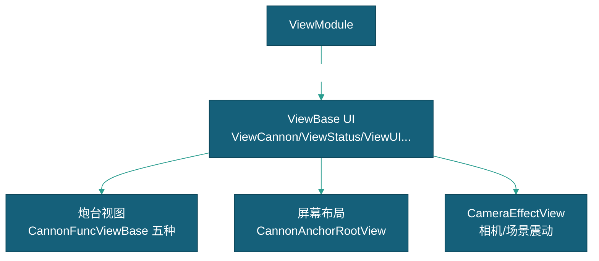

# UI

> 本文档描述 ViewBase UI 体系的设计，包含玩家 UI 区域约定、各类视图组件、炮台视图、相机震动与屏幕布局。玩家游戏提示/机器提示/判定文字由 `ViewUI`、`ViewTip` 等 ViewBase 组件直接承载；特效体系见 [特效](../特效/特效.md)。

---

## 一、系统概述

### 1.1 架构位置

### 1.2 关键依赖

| 依赖项 | 类型 | 说明 | 获取方式 |
|--------|------|------|---------|
| `ViewModule` | Module | UI 管理入口（OpenView/GetView） | `this.GetModule<ViewModule>()` |

---

## 二、ViewBase UI 体系

ViewModule 按 Hierarchy 区域约定管理 UI：`Global`（playerId=0）、`P1`~`P10`（玩家 UI）。

| ViewBase 类 | 说明 |
|-------------|------|
| `ViewCannon` | 炮台视图（旋转、齿轮、计分板染色） |
| `ViewStatus` | 玩家分数显示（TextMeshPro） |
| `ViewUI` | 链式 UI 操作（`Do("path").DoActive/D oTransform/D oChange`） |
| `ViewBackground` | 关卡背景（视频/图片/Shader 过渡） |
| `ViewBoundary` | 墙壁边界开关 |
| `ViewTip` | 提示文本 |
| `CannonRootView` | 炮台容器（定位到锚点） |
| `CannonAnchorRootView` | 锚点布局（根据 CannonPattern 自动分配） |

---

## 三、炮台视图

| 视图 | 对应炮台 | 特点 |
|------|---------|------|
| `CannonFuncViewBase` | 普通炮 | 基础 Animator（fireTrigger/resetTrigger） |
| `MachineCannonView` | 机枪炮 | Animator Float 参数控制旋转速度 |
| `LaserCannonView` | 激光炮 | 禁用齿轮旋转，锁定炮管方向 |
| `DrillCannonView` | 钻头炮 | 开火时隐藏钻头模型 |
| `LightningCannonView` | 电击炮 | LineRenderer 电光链 + 目标选择滚动 UI |

---

## 四、CameraEffectView

相机/场景震动：`SetCameraShake(duration, type, direction)` 单次位移复位 / `SetSceneShake(duration, type, direction)` 持续抖动。枚举 `ShakeType { Once, Shake }`、`ShakeDirection { Any, Left, Right, Top, Bottom }`。

---

## 五、屏幕布局

`CannonPattern` 枚举：平板_8人（横屏）、平板_10人、竖屏_6人。`CannonAnchorRootView` 监听 `FishGlobalConfig.Pattern` 变化，自动为每个玩家分配炮台锚点位置和朝向。

---

## 六、相关文档

- [玩家流程](../流程/玩家流程/玩家流程.md)
- [特效](../特效/特效.md)
- [炮台](../../实体/炮台/炮台.md)
- [框架设计文档](../../框架设计文档.md)
