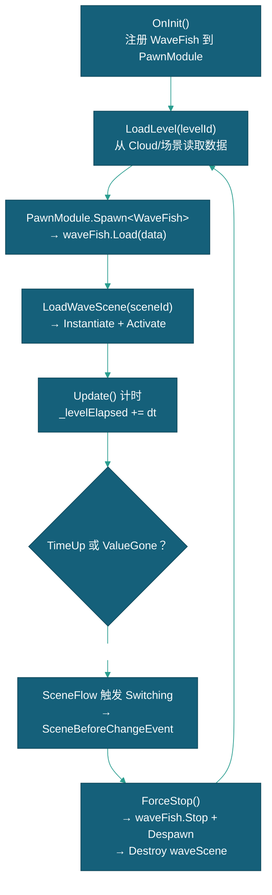

# WaveSystem 关卡系统

> 本文档描述 WaveSystem 关卡系统的设计，包含条件事件库注册表、关卡加载/切换、WaveFish/WaveScene 生命周期管理和事件调度。

---

## 一、系统概述

### 1.1 所属 Module

| 项目 | 内容 |
|------|------|
| 所属 Module | FlowModule |
| 挂载位置 | FlowModule 子级 GameObject |
| 获取方式 | `this.GetSystem<WaveSystem>()` |

### 1.2 关键依赖

| 依赖项 | 类型 | 说明 | 获取方式 |
|--------|------|------|---------|
| `PawnModule` | Module | WaveFish 对象池 | `this.GetModule<PawnModule>()` |
| `CloudModule` | Module | Cloud.Model 数据读取 | `this.GetModule<CloudModule>()` |

---

## 二、公开 API

| API | 返回类型 | 说明 |
|------|---------|------|
| `LoadLevel(string levelId)` | void | 加载关卡（JSON Id 或场景 WaveFish 名） |
| `LoadLevel(FishWaveData data)` | void | 直接用数据加载关卡 |
| `ForceStop()` | void | 强制停止当前关卡并回收资源 |
| `PickNextLevel()` | string | 从可用关卡中随机选取下一关 Id |
| `SwitchToNextLevel()` | void | 切换至下一关（`PickNextLevel()` + `LoadLevel()` 组合，执行切关流程） |
| `LockTransition()` | void | 锁定关卡切换（引用计数） |
| `UnlockTransition()` | void | 解锁关卡切换（引用计数） |
| `DeductLevelValue(int volume)` | void | 扣除关卡总价值 |
| `PlayExitAnimation()` | void | 播放当前 WaveScene 的 `Loading` 子物体 "InLoading" 退出动画 |
| `RefreshLevelPool()` | void | 强制刷新关卡池（新增关卡 JSON 后调用） |
| `GetConditionEvent<TEvent>(string eventId)` | `TEvent?` | 从条件事件库统一查询事件定义（Fish/Scene 双 bucket），供 WaveFish/WaveScene 时序/链/循环解析 |
| `ConditionEventCount` | int | 条件事件库条目总数（Fish + Scene 桶，调试用） |
| `CurrentLevel` | FishWaveData | 当前关卡数据（只读） |
| `IsTransitionLocked` | bool | 切换是否被锁定 |
| `TimeUp` | bool | 关卡时长已到 |
| `ValueGone` | bool | 关卡价值耗尽 |

---

## 三、核心实现

### 3.1 关卡加载来源

| 来源 | `useSceneLevels` | 说明 |
|------|-----------------|------|
| JSON | false | 从 `Cloud.Model[levelId + "start"]` 读取 FishWaveData |
| 场景 WaveFish | true | 从子级 `WaveFish` 组件读取，同时注册到 Cloud |

### 3.1.1 条件事件库

`OnInit` 时加载生成条件事件注册表（双 bucket，统一 `GetConditionEvent<TEvent>` 查询）：

| 桶     | 定义来源                                       | 加载方式                                                                                 |
| ----- | ------------------------------------------ | ------------------------------------------------------------------------------------ |
| Fish  | `StreamingAssets/ConditionEvent/**/*.json` | `LoadConditionEvents()`：Newtonsoft 读入 `Dictionary<string, FishEvent>`（Test 优先），按 EventId(GUID) 索引，跨关卡复用 |
| Scene | WaveScene 预制体内联 `SceneEvent[]`             | `RegisterSceneConditionEvents()`：从 `waveScenes` 聚合进 `Dictionary<string, SceneEvent>` |

`WaveFish.Load(data)` 按时序 `Timeline` 从 Fish 桶解析 EventId(GUID) 入队；`WaveScene` 保持内联加载，链/循环经 `ResolveEventFromSource` 从 Scene 桶解析。

配置在 `游戏配置/关卡编辑器` 菜单（`LevelConfigWindow`，四标签页：关卡/条件事件/阵型/路径；条件事件用 GUID + Name，下拉显示 Name 存 GUID）。

### 3.2 关卡切换条件

`SceneFlow.Scene_Generating` 中每帧检查：`TimeUp`（Duration 超时）或 `ValueGone`（Volume 归零）。切换时 `SceneFlow` 发送 `SceneBeforeChangeEvent`，3 秒后进 Loading。

### 3.3 生命周期

### 3.4 调试

`showDebug=true` 时左上角 `OnGUI` 显示：当前关卡信息、WaveFish/WaveScene 队列状态、下一事件倒计时。

---

## 四、数据来源

| 数据          | 来源                               | 说明           |
| ----------- | -------------------------------- | ------------ |
| `FishWaveData` | `Cloud.Model[levelId + "start"]` | JSON 方式（`WaveData/` 文件夹） |
| `FishWaveData` | 子级 `WaveFish.waveData`           | 场景方式         |
| `FishEvent`  | `StreamingAssets/ConditionEvent/` | 条件事件库（JSON，WaveSystem 加载） |
| `SceneEvent` | WaveScene 预制体内联 `Events`       | 聚合进 Scene 桶 |
| `WaveScene` | Inspector `waveScenes` 列表        | 按 SceneId 匹配 |

---

## 五、相关文档

- [游戏流程](场景流程.md)
- [FishSpawnSystem系统](../../../实体/FishSpawnSystem系统.md)
- [鱼](../../../实体/鱼/鱼.md)

