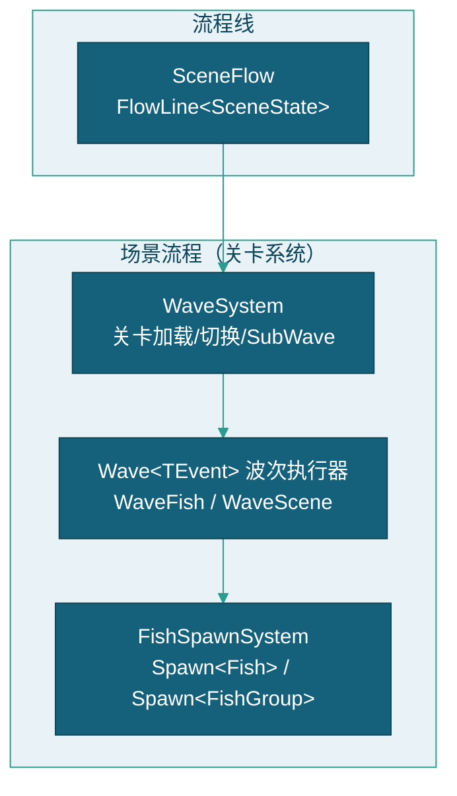
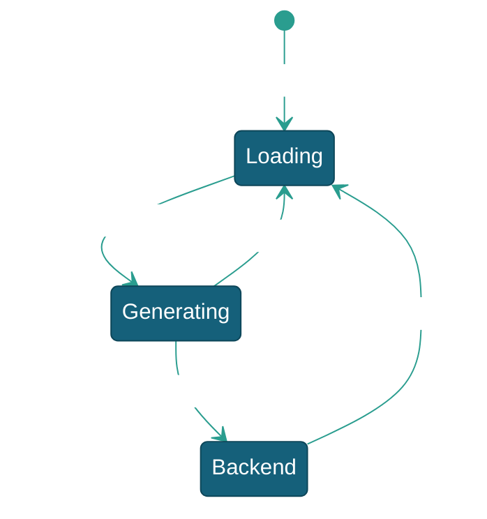

# 场景流程

> 本文档描述 SceneFlow 场景流程（关卡系统）的设计，包含关卡循环状态机、WaveSystem 关卡管理、Wave\<TEvent\> 波次执行器、FishSpawnSystem 生成链与 LayerManager Z 层分配。玩家侧流程（GameFlow/Gunner/炮台系统）见 [玩家流程](../玩家流程/玩家流程.md)。

---

## 一、系统概述

### 1.1 架构位置



---

## 二、SceneFlow — 场景流程与关卡系统

`SceneFlow : FlowLine<SceneState>`，驱动关卡循环。关卡管理由 `WaveSystem`（System）完成，波次执行由 `Wave<TEvent>`（Pawn 对象）承载。

### 2.1 关卡循环



| 状态 | 类 | 说明 |
|------|-----|------|
| `Loading` | `Scene_Loading` | 显示加载界面 → 回收场上鱼 → 5 秒冷却 |
| `Generating` | `Scene_Generating` | 打开边界 → 运行 WaveSystem → 监听切换条件 |
| `Backend` | `Scene_Backend` | 后台设置模式，禁用玩家输入 |

**SceneFlow 事件注册（OnStart）：** `BulletFiredEvent`→更新炮台能量、`BulletSwitchEvent`→更新等级显示、`ScoreRefreshEvent`→更新分数显示、锁定机制→`WaveSys.LockTransition()`。

### 2.2 WaveSystem — 关卡管理（System）

```csharp
public class WaveSystem : KFramwork.GameModule.System
```

| API | 说明 |
|------|------|
| `LoadLevel(string)` / `LoadLevel(FishWaveData)` | 加载关卡（JSON Id 或场景 Wave 名） |
| `ForceStop()` | 强制停止当前关卡 |
| `PickNextLevel()` | 按 Volume 概率选取下一关 |
| `LockTransition()` / `UnlockTransition()` | 锁定/解锁关卡切换（钻头爆炸期间锁定） |
| `DeductLevelValue(int)` | 扣除关卡总价值 |

**关卡切换条件（满足任一）：** `Duration > 0` 且超时 / `Volume > 0` 且价值归零。

系统级详细设计见 [WaveSystem系统](WaveSystem系统.md)。

### 2.3 Wave\<TEvent\> — 波次执行器（Pawn 对象）

```csharp
public abstract class Wave<TEvent> : Pawn where TEvent : struct, IConditionEvent
```

基于优先队列的时序事件系统，支持延迟、循环、链式触发和条件监听。

| 子类 | 说明 |
|------|------|
| `WaveFish : Wave<FishEvent>` | 个体鱼/群体鱼生成波次 |
| `WaveScene : Wave<SceneEvent>` | 场景事件波次（动画/层级控制） |

### 2.4 FishSpawnSystem — 鱼生成系统（System）

`Wave<FishEvent>.Execute` 调用此系统完成实际生成。

```csharp
public class FishSpawnSystem : KFramwork.GameModule.System
```

| API | 说明 |
|------|------|
| `Spawn(string targetId, int count)` | 统一生成入口（1000~4999=鱼, 5000~6999=鱼群） |
| `BuildFishDataCache()` | 惰性构建鱼数据缓存 |
| `RegisterFishGroupPrototypes()` | 注册群体原型到 PawnModule |

**生成链路：** `WaveFish` → `FishSpawnSystem.Spawn(targetId, count)` → `PawnModule.Spawn<Fish>(name)` → `SetData` → `LayerManager.AllocateLayer`。

系统级详细设计见 [FishSpawnSystem系统](../../../实体/FishSpawnSystem系统.md)。

### 2.5 LayerManager — Z 层级分配（System）

`LayerManager : Module`，维护 `bool[1000]` 分配表，线性扫描分配 Z 层（个体鱼 400-800，群体鱼共享 Z）。详见 [层级管理](../../../实体/层级管理.md)。

---

## 三、相关文档

- [玩家流程](../玩家流程/玩家流程.md)
- [WaveSystem系统](WaveSystem系统.md)
- [关卡配置说明](../../../关卡/关卡配置说明.md)
- [鱼](../../../实体/鱼/鱼.md)
- [框架设计文档](../../../框架设计文档.md)
