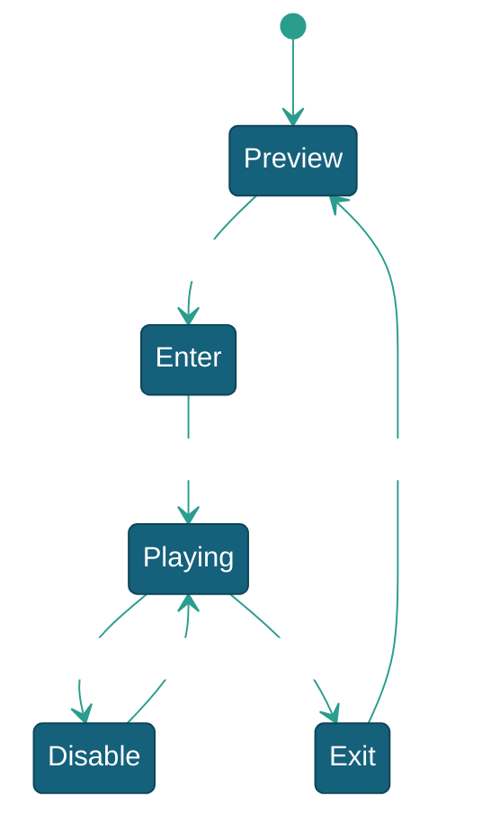

# 玩家流程

> 本文档描述玩家侧核心玩法流程设计，包含 GameFlow（玩家流程五状态）、Gunner 玩家实体、炮台系统（五种炮台/子弹命令链）、Command/Event 系统。SceneFlow 场景流程（关卡系统）见 [场景流程](../场景流程/场景流程.md)。

---

## 一、系统概述

### 1.1 架构位置

```mermaid
%% 玩家流程架构位置
%%{init: {'theme': 'base', 'themeVariables': {
    'primaryColor': '#15607A','primaryBorderColor': '#0D4659','primaryTextColor': '#ffffff',
    'lineColor': '#2A9D8F','secondaryColor': '#F0F7FA','secondaryBorderColor': '#2A9D8F',
    'secondaryTextColor': '#0D4659','tertiaryColor': '#FFF3D6','tertiaryBorderColor': '#D4A843',
    'tertiaryTextColor': '#0D4659','clusterBkg': '#E8F2F7','clusterBorder': '#2A9D8F',
    'edgeLabelBackground': '#ffffff'
}}}%%
graph TD
    subgraph "流程线"
        GF["GameFlow<br/>FlowLine&lt;GunnerState, Gunner&gt;"]
    end
    subgraph "玩家流程"
        GF --> Gunner["Gunner 炮台实体<br/>GetInput / CannonLaunch"]
        Gunner --> Dev["DeviceModule.P(ID)"]
        Gunner --> Cmd["PlayerCommand → PlayModel"]
    end
    subgraph "炮台"
        Gunner --> Funcs["ICannonFunc&lt;Gunner&gt;[]<br/>Standard/Machine/Laser/Drill/Lightning"]
        Funcs --> Fire["BulletCommand<br/>→ PawnModule.Spawn"]
    end
    subgraph "UI"
        Cmd -->|Event| UI["ViewUI / ViewTip<br/>提示/判定文字"]
    end
```

### 1.2 关键依赖

| 依赖项 | 类型 | 说明 | 获取方式 |
|--------|------|------|---------|
| `FlowModule` | Module | 流程线注册管理 | `this.GetModule<FlowModule>()` |
| `DeviceModule` | Module | 玩家输入 | `this.GetModule<DeviceModule>().P(id)` |
| `ViewModule` | Module | UI+特效 | `this.GetModule<ViewModule>()` |
| `PawnModule` | Module | 子弹/鱼对象池 | `this.GetModule<PawnModule>()` |

---

## 二、GameFlow — 玩家流程

`GameFlow : FlowLine<GunnerState, Gunner>`，5 状态。



| 状态 | 类 | 说明 |
|------|-----|------|
| `Preview` | `Game_Preview` | 打开炮台/状态 UI，等待投币 |
| `Enter` | `Game_Enter` | 初始化设备 → 切 Playing |
| `Playing` | `Game_Playing` | 主循环：GetInput→UpdateCannon→检测退出 |
| `Disable` | `Game_Disable` | 输入禁用，零输入更新 |
| `Exit` | `Game_Exit` | 切回普通炮→TicketOut→回 Preview |

**OnStart 注册：** 投币回调、BulletRefresh/AcquireCannon 事件、PlayerInputStatus 锁定（`RegisterLock<GameFlow>`）、计分板染色、炮台旋转回调、积分恢复器（`AtomicReadWriter` + `BackendSerializer`）。

---

## 三、Gunner — 玩家炮台实体

`Gunner : Pawn`，场景挂载，不参与对象池。`OnInit()` 由 `GameFlow.OnStart()` 调用。

### 3.1 核心字段

| 字段 | 类型 | 说明 |
|------|------|------|
| `ID` | int | 玩家 ID |
| `Model` | PlayModel | 运行时数据 |
| `playerDevice` | PlayerDevice | 输入包装 |
| `cannons` | List\<string\> | Inspector 配置的炮台类型全名 |
| `cannonFuncs` | List\<ICannonFunc\<Gunner\>\> | 运行时 `Activator.CreateInstance` 创建 |
| `CurrentCannonIndex` | int | 当前炮台（自动跳过 CanSwitch=false） |
| `CurrentRotation` | float | 旋转角度（±75°） |
| `RotationSpeed` | float | 旋转速度（65°/s） |
| `IsInputDisabled` | bool | 输入禁用标记 |

### 3.2 输入与操作

`GetInput(out stick, isFire, isChange, outLottery)` — 正式模式走 `PlayerDevice`，调试模式走键盘。
`InsertCoin(num)` → `ThrowCoin` Command → `Water += PointsRate × num`。
`TicketOut()` → `PrintTickets` Command → 串口出票。

---

## 四、炮台系统

### 4.1 接口与基类

```csharp
public interface ICannonFunc<TActor> where TActor : class, IActor
{
    bool CanSwitch { get; }
    void OnInit(int playerID, TActor actor, Action onFire);
    void OnSwitchIn();     // OpenView + OnActivate
    void OnSwitchOut();    // OnDeactivate + CloseView
    void Update(Vector2 input, bool fire);
    void ResetFullAuto();
}
```

`CannonFuncBase<Gunner, TView>` 提供 ViewModule 缓存、`FireWithFullAuto()` 四态状态机、标准切入/切出流程。炮台精灵资源由各炮台视图（`CannonFuncViewBase` 子类）直接管理。

### 4.2 五种炮台

| 炮台 | 可切换 | 攻击 | 特点 |
|------|--------|------|------|
| 普通炮 | 是 | `FireBullet` 单发 | 射速 0.2s |
| 机枪炮 | 是 | `FireBullet` 高速 | 射速 0.1s，Animator 变速 |
| 激光炮 | **否** | `DirectHitFish` 扇形扫描 | 10 次攻击，2s 后自动切回 |
| 钻头炮 | **否** | `DirectHitFish` + DrillBullet | 碰壁反弹+范围爆炸，1s 切回 |
| 电击炮 | 是 | `DirectHitFish` 锁定 | 普通/精英模式，LineRenderer 电光链 |

### 4.3 全自动射击

`FireWithFullAuto()` 状态机：Idle → Charging（按住计时）→ Charged（达 FullAutoThreshold）→ AutoFire → FiringBurst。阈值由 `GameModel.FullAutoThreshold` 配置。

### 4.4 子弹命令链

| 命令 | 说明 |
|------|------|
| `BulletCommand.FireBullet` | 检查限制→扣分→Spawn→InitBullet→计数+1 |
| `BulletCommand.DirectHitFish` | 绕过物理子弹直接概率判定（可选免扣分） |
| `BulletCommand.RecycleBullet` | 计数-1→Despawn |

### 4.5 炮台切换

`CallSwitchCannon(dstIndex)`：旧 `OnSwitchOut()` → 更新索引（跳过 CanSwitch=false）→ 新 `OnSwitchIn()`。摇杆向下双击触发。

---

## 五、Command/Event 系统

### 5.1 PlayerCommand 命令集

| 命令 | 说明 |
|------|------|
| `ThrowCoin` | 投币加分 |
| `UsePoints` | 扣分（发射消耗） |
| `SwitchLevel` | 炮等级循环 |
| `PointsRevenue` | 加分结算 |
| `PointsRevenueWithCoinEff` | 加分 + BulletBreakCoin |
| `AcquireCannon` | 获取炮台 + 特效 |
| `InitializeDevice` | 清除故障 |
| `PrintTickets` | 彩票出票 |
| `ResetStatus` | 清零状态 |
| `PlayerInputStatus` | 锁定/解锁输入 |

### 5.2 关键事件

| 事件                                         | 说明       |
| ------------------------------------------ | -------- |
| `ScoreRefreshEvent`                        | 分数更新     |
| `BulletSwitchEvent` / `BulletRefreshEvent` | 炮等级切换/刷新 |
| `BulletFiredEvent`                         | 子弹发射     |
| `AcquireCannonEvent`                       | 获取炮台     |
| `PlayerInputStatusEvent`                   | 输入状态切换   |
| `FishKilledEvent`                          | 鱼击杀记录    |

---

## 六、玩家提示 UI

玩家游戏提示/机器提示/判定文字由 `ViewUI`、`ViewTip` 等 ViewBase 组件直接承载（见 [UI](../../UI/UI.md)）。

---

## 七、架构入口 — ArchitectureView

场景架构入口由 `ArchitectureView`（继承 `Controller`）承担，挂载在场景根 `GameManager` GameObject 上。在 `OnEnable()` 阶段自动发现子级所有 `Module` 组件并通过反射注册到 `KArchitecture`。**原 `GameManager.cs`（MonoSingleton 版）已随代码整理移除**，加载界面/音量绑定等职责已拆散或移除。

```csharp
// ArchitectureView.OnEnable() —— 自动发现并注册所有 Module
IArchitecture arch = KArchitecture.Interface;
Module[] modules = GetComponentsInChildren<Module>(true);
foreach (Module module in modules)
    genericMethod.MakeGenericMethod(module.GetType()).Invoke(arch, new[] { module });
```

---

## 八、配置与数据

| 数据 | 说明 |
|------|------|
| `GameModel.PointsRate / PointToLotteryRate / NeedCoins` | 积分/彩票/投币比例 |
| `GameModel.FullAutoThreshold` | 全自动触发阈值 |
| `GameModel.StandardFirerate / MachineGunFirerate / LightningGunFirerate` | 各炮台射速 |
| `PlayModel.Water / level / Coins / ActiveBulletCount` | 玩家运行时状态 |

---

## 九、相关文档

- [场景流程](../场景流程/场景流程.md)
- [设备输入输出系统](../../../设备输入输出系统/设备输入输出系统.md)
- [炮台](../../../实体/炮台/炮台.md)
- [子弹](../../../实体/子弹/子弹.md)
- [伤害系统实现设计](../../../玩法系统/伤害系统/伤害系统实现设计.md)
- [游戏参数配置说明](../../../数据配置/游戏参数配置说明.md)
