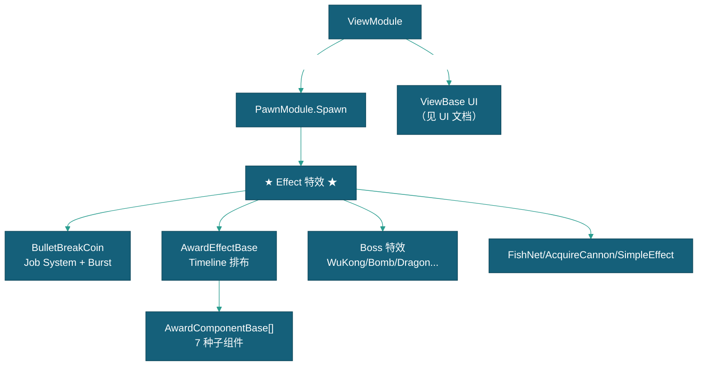

# 特效

> 本文档描述视觉表现系统中 Effect 特效体系的设计，包含 AwardEffect Timeline 排布、金币爆炸回收、Boss 特效与相机震动。UI 画面表现（ViewBase 体系/炮台视图/屏幕布局）见 [UI](../UI/UI.md)；特效对象属性与生命周期见 [特效对象说明](特效对象说明.md)。

---

## 一、系统概述

### 1.1 架构位置



### 1.2 关键依赖

| 依赖项 | 类型 | 说明 | 获取方式 |
|--------|------|------|---------|
| `ViewModule` | Module | 特效创建入口 + UI 管理 | `this.GetModule<ViewModule>()` |
| `PawnModule` | Module | 对象池管理 | ViewModule 内部调用 |

---

## 二、Effect 特效体系

### 2.1 生命周期

```
ViewModule.CreateEffect<T>() → PawnModule.Spawn<T>()
  → OnSpawn() 初始化 → Play(pos/rot/scale) 播放
  → 运行中 → 播放完毕 → Recycle() → OnDespawn() → OnUnspawn()
  → 回到对象池
```

### 2.2 主要特效

**BulletBreakCoin — 金币爆炸回收：** 两阶段（掉落弹跳 + 直线回收），Unity Job System + Burst Compiler 高性能驱动。支持 Auto/Bottom/Top/Left/Right 方向坐标系。

**AwardEffectBase — Timeline 奖励特效：** `PlayableDirector` + `AwardComponentBase[]` 帧触发体系。`AwardClipConfig` 按 TriggerFrame 配置参数触发，无需编写子类代码。ViewModule 维护播放队列 `EnqueueEffect()` 按序播放。

**AwardComponentBase 子组件：** TotalScore（滚分动画）、ComboNum（连击数）、BoomScore（炸分）、MultipleNum（倍率）、TimeNum（时间）、TimeHide（隐藏控制）、EffectSettleScore（结算）、AwardFishKill（批量击杀）、ScreenShake（震动）、SoundEffect（音效）、RollerSpin/TurntableSpin/WheelSpin（旋转动画）。

**Boss 特效：** WuKongEffect（美猴王三段式）、BombEffect、DragonDescendsEffect、GemTableEffect、GodWealthEffect、LonghornEffect、MermaidEffect、TianWangEffect。

**其他特效：** FishNetSpawner（渔网）、CoinDropCollectEffect（金币贝塞尔收集）、AcquireCannonEff（炮台获取 DOTween）、SimpleEffect（通用）、Turntable（转盘）。

---

## 三、金币特效分发

**金币收集流程：** 子弹命中鱼 → `BulletCommand.DirectHitFish` → 命中成功发送 `PlayerCommand.PointsRevenueWithCoinEff` → 命令内直接创建 `BulletBreakCoin` 特效并设置回收目标/分数 → 特效播放完成后结算加分。

```csharp
// PlayerCommand.PointsRevenueWithCoinEff（现行实现）
BulletBreakCoin coinEff = viewMod.CreateEffect<BulletBreakCoin>("Coin Explode coin");
coinEff.CoinData.RecyclePoint = viewMod.GetView<ViewCannon>(Id).coinReceivePoint;
coinEff.CoinData.SpawnCount = Mathf.Clamp((int)(Volume / Model.level * 1.5f), 5, 70);
coinEff.PlayerID = Id;
coinEff.ScoreToAdd = Volume;
coinEff.Play(fishPos);
```

---

## 四、扩展指南

### 创建新特效

```csharp
public class MyEffect : Effect
{
    public override IEffect Play() { /* 动画 */ return this; }
    private void Finish() { Recycle(); }
}
```

预制体放 `Resources/Actor/`，PawnModule 扫描后自动注册。通过 `ViewModule.CreateEffect<MyEffect>()` 创建。

### 创建新 AwardComponent

```csharp
public class MyComponent : AwardComponentBase
{
    public override void OnAwardTrigger(AwardClipConfig config)
    {
        SetActiveRoot(true);
        // 使用 config.Value / FloatVal / StringVal
    }
}
```

---

## 五、相关文档

- [玩家流程](../流程/玩家流程/玩家流程.md)
- [UI](../UI/UI.md)
- [特效对象说明](特效对象说明.md)
- [框架设计文档](../../框架设计文档.md)
