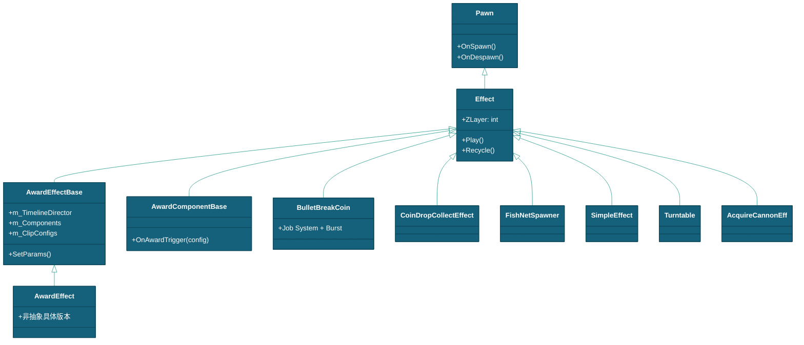
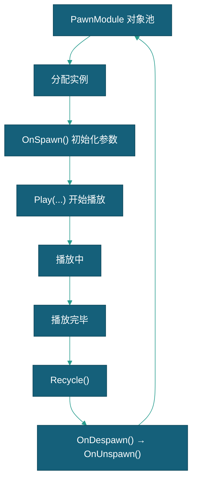
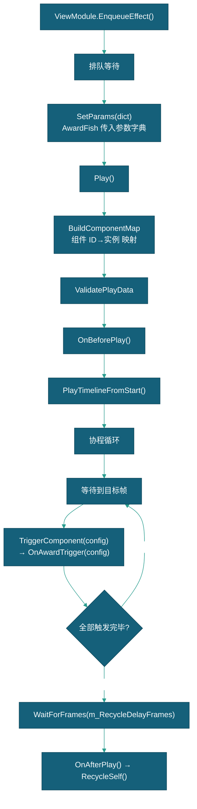

# 特效对象说明

> 本文档描述 DragonBreakSea 中 Effect 特效体系的对象属性、生命周期和 Timeline 排布机制。
> 现状定位：Effect 特效体系为现行视觉表现基准，仍然有效；frontmatter 所属「奖池与概率云」模块（Cloud）已退役，涉概率/奖池的交互链路以 Gameplay 模块 DamageSystem 现状为准（Cloud 退役清单见 [总体设计](../../总体设计.md) §1.3）。

---

## 一、对象概述

### 1.1 继承链



### 1.2 用途

特效系统覆盖金币爆炸回收、Boss 奖励动画、子弹击中反馈、场景震动等全部视觉表现。所有特效通过 `ViewModule.CreateEffect<T>()` 从 PawnModule 对象池分配，播放完毕后 `Recycle()` 回收。

> **⚠️ 特效鱼与特效体系的边界：** 「特效鱼」（FishData 11xx/12xx/13xx，`{鱼名}_Arrow/Boom/Rotate` 预制体）是**鱼的外观变体**——运行时复用 `Fish` 类 + 原有移动策略（FreeSwim 等），箭头/爆裂/旋转为预制体上的材质与子特效表现，**不走 Effect 继承链、不经 ViewModule 分配回收**，由 PawnModule 对象池分组加权随机生成（见 [鱼 §2.4](../../实体/鱼/鱼.md)）。本文档的 Effect 体系不覆盖特效鱼。

---

## 二、Effect 基类

### 2.1 核心字段

| 成员 | 说明 |
|------|------|
| `ZLayer` | Z 轴层级，`Play(Vector3)` 时自动固定 `position.z = ZLayer` |
| `OnSpawn()` | 池分配后初始化参数 |
| `OnDespawn()` | 回收前清理，触发 `OnUnspawn()` |
| `OnUnspawn()` | 子类重写以清理特效状态 |
| `Recycle()` | 播放完毕后回收到 PawnModule |

### 2.2 Play() 重载链

| 方法签名 | 内部调用链 |
|---------|-----------|
| `Play()` | 核心播放逻辑 |
| `Play(Transform target)` | `Play(target.position, target.rotation)` |
| `Play(Vector3 position)` | `position.z = ZLayer` → `Play()` |
| `Play(Vector3 position, Quaternion rotation)` | `rotation = Quaternion.Euler(0,0,rotation.z)` → `Play()` |
| `Play(Vector3 position, Quaternion rotation, Vector3 scale)` | 额外设置缩放 → `Play()` |

### 2.3 生命周期



---

## 三、AwardEffectBase — Timeline 奖励特效

### 3.1 核心设计

每个奖励特效由 `PlayableDirector`（Timeline）+ 多个 `AwardComponentBase` 子组件组成。通过 `AwardClipConfig` 配置各子组件在哪个帧触发、传入什么参数，无需编写子类代码。

```csharp
public abstract class AwardEffectBase : Effect
```

### 3.2 核心字段

| 字段 | 类型 | 说明 |
|------|------|------|
| `m_TimelineDirector` | `PlayableDirector` | Timeline 播放器 |
| `m_Components` | `List<AwardComponentBase>` | 子奖励组件列表 |
| `m_ClipConfigs` | `List<AwardClipConfig>` | 排布配置列表（按 TriggerFrame 升序） |
| `m_DefaultParams` | `List<ParamEntry>` | 测试默认参数 |
| `m_RewardParams` | `Dictionary<string, object>` | 运行时奖励参数字典 |
| `m_RecycleDelayFrames` | `int` | 额外延迟帧数 |

### 3.3 播放流程



### 3.4 AwardClipConfig 排布配置

| 字段 | 类型 | 说明 |
|------|------|------|
| `m_ComponentID` | `string` | 目标组件 ID（如 TotalScore_1） |
| `m_TriggerFrame` | `int` | 触发帧（60fps 基准） |
| `m_Params` | `List<ClipParam>` | 参数列表（Key + Type） |
| `m_HideFrame` | `int` | 结束帧（到达后自动隐藏） |

**Param 取值规则：** 从 `m_RewardParams` 字典按 Key 取值 → 找不到则从 `m_DefaultParams` 取 → 都找不到返回默认值（0/""）。

### 3.5 AwardComponentBase 子组件

| 组件 | 用途 |
|------|------|
| `TotalScore` | 总分框（含 TweenScore 滚分动画），每个特效必须有一个 |
| `ComboNum` | 连击数字显示 |
| `BoomScore` | 炸分特效（多个 Text 显示 "+N"） |
| `MultipleNum` | 倍率滚动 |
| `TimeNum` | 时间显示 |
| `TimeHide` | 入场隐藏控制 |
| `EffectSettleScore` | 结算分数 |
| `AwardFishKill` | 按鱼 ID 前缀批量击杀 |
| `AwardScreenShake` | 屏幕震动 |
| `AwardSoundEffect` | 音效播放 |
| `AwardRollerSpin` | 滚轮旋转动画 |
| `AwardTurntableSpin` | 转盘旋转动画 |
| `AwardWheelSpin` | 轮盘旋转动画 |

---

## 四、主要特效子类

### 4.1 BulletBreakCoin — 金币爆炸回收

两阶段动画，使用 Unity Job System + Burst Compiler 高性能并行计算。

| 阶段 | 行为 |
|------|------|
| 掉落弹跳 | 金币从鱼位置散开 + 弹跳 + 放大（BounceCount/BounceHeight 控制） |
| 直线回收 | 金币飞向玩家回收点 + 缩小 |

**方向坐标系：** 支持 Auto / Bottom / Top / Left / Right，通过坐标系旋转使金币运动对齐回收方向。

### 4.2 CoinDropCollectEffect — 金币掉落收集

金币从生成点掉落，沿贝塞尔曲线飞向回收点。内部独立对象池（非 PawnModule），方向感知粒子旋转。

### 4.3 Boss 特效

| 特效 | Boss | 特点 |
|------|------|------|
| WuKongEffect | 美猴王 | 三段式 Timeline 特效（290/730/1710 帧触发） |
| BombEffect | 炸弹鱼 | 爆炸动画 |
| DragonDescendsEffect | 龙鱼 | 降龙特效 |
| GemTableEffect | 宝石鱼 | 宝石桌 |
| GodWealthEffect | 财神 | 财神特效 |
| LonghornEffect | 长角鱼 | 长角特效 |
| MermaidEffect | 美人鱼 | 美人鱼特效 |
| TianWangEffect | 天王 | 天王特效 |

### 4.4 其他特效

| 特效 | 用途 |
|------|------|
| `FishNetSpawner` | 渔网命中视觉效果，自动管理 Animation/Animator |
| `AcquireCannonEff` | 获取炮台飞行特效（DOTween Sequence：弹跳→飞行→完成回调） |
| `SimpleEffect` | 通用一次性特效 |
| `Turntable` | 转盘小游戏特效 |
| `CameraEffectView` | 相机震动/场景震动（通过 ViewModule 打开，非 Effect 子类） |

---

## 五、特效创建与使用

### 5.1 创建方式

```csharp
// 从 PawnModule 分配
var effect = this.GetModule<ViewModule>().CreateEffect<FishNetSpawner>("prefabName");
effect.Play(position);

// AwardEffect 走队列（ViewModule.EnqueueEffect）
this.GetModule<ViewModule>().EnqueueEffect(awardEffect);
```

### 5.2 注册

预制体放在 `Resources/Actor/`，点击 PawnModule「从 Resources/Actor 扫描并分类」自动注册。

---

## 六、交互规则

| 交互 | 触发条件 | 结果 |
|------|---------|------|
| 鱼击杀 | `BulletCommand.DirectHitFish` 成功 | `PointsRevenueWithCoinEff` → BulletBreakCoin 爆炸 |
| Boss 击杀 | AwardFish.OnKilled | `CreateRewardEffect()` → AwardEffect 入队播放 |
| 炮台获取 | `AcquireCannon` Command | AcquireCannonEff 飞行特效 |
| 钻头引爆 | DrillBullet 倒计时归零 | 范围检测 + FishNetSpawner 渔网特效 |
| 投币 | `InsertCoin` | BulletBreakCoin 金币爆炸回收特效（PointsRevenueWithCoinEff 驱动） |
| 屏幕震动 | 激光炮/钻头炮发射 | `CameraEffectView.SetSceneShake/SetCameraShake` |

---

## 七、相关文档

- [特效](特效.md)
- [框架设计文档](../../框架设计文档.md)
