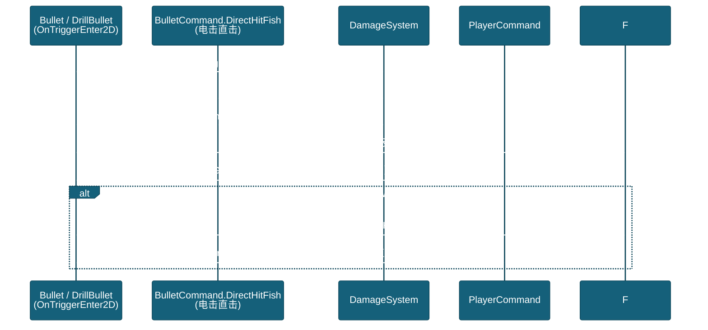

# 伤害系统实现设计

> DamageSystem 伤害判定系统的实现设计：架构位、公开 API、算法流程、生命周期挂接与命中结算链（血量版技巧制现行实现），DamageSystem 相关章节以本文为唯一权威。
> 框架承载机制（GameplayConfig 数据域容器/GameplaySystem 双层基类/多域路由）见 [框架设计文档](../../框架设计文档.md) §4.7；三资源经济与彩票结算（击杀入账/出票/持久化）见 [总体设计](../../总体设计.md) §五~§七。

---

## 一、架构位置

- **定位**：血量玩法控制——玩家操作数值对游戏物体（特别是血量）影响的**算法集合**；本版着重完成的主玩法。
- **位置**：游戏层 `Assets/Scripts/Module/GameplayModule/DamageSystem.cs`，继承 `GameplaySystem<GameModel>`（OnInit 经 GetModel 自绑血量域）；场景挂 Gameplay GO 子级「Damage」（GameManager_Damage.prefab，`Module.Init` 自动扫描注册）。`UsedActorTypes = { FishData, FishGroupData }`（壳据此按需灌装 + 就绪校验）。
- **数据声明**：Hp 只存在于**数据侧**（`FishData.Hp` / `FishGroupData.Hp` + `KillMode` 判型）；`Fish`/`FishGroup` 组件零 HP 字段，运行时当前值由 DamageSystem 键控表跟踪。

---

## 二、公开 API

```csharp
/// <summary>
/// 伤害算法唯一入口（命中链调用；调用形态与概率版 GetCloudWater 对仗）。
/// </summary>
/// <param name="target">被击目标（判型经其 Group.Data.KillMode + 群池在册状态）</param>
/// <param name="playerId">伤害来源玩家（击杀归属=扣空者；灼烧跳传施加者）</param>
/// <param name="damage">本次伤害（基础 1；火弹/暴击在调用侧算好传入）</param>
public DamageResult ApplyDamage(Fish target, int playerId, int damage);

/// <summary>个体注册/注销（Fish.SetData / Fish.OnDespawn 一行挂接；重复注册=重置初始 HP）</summary>
public void RegisterFish(Fish fish);
public void UnregisterFish(Fish fish);

/// <summary>群注册/注销（FishGroup.OnSpawn / CleanupGroup；注册按兜底链记池初值）</summary>
public void RegisterGroup(FishGroup group);
public void UnregisterGroup(FishGroup group);

/// <summary>联调查询：个体当前 HP / 群池当前值（验收用）</summary>
public bool TryGetFishHp(Fish fish, out int hp);
public bool TryGetGroupHp(FishGroup group, out int hp);
```

```csharp
/// <summary>
/// 伤害算法结果（算法纯算；演出与结算由调用方按结果执行）。
/// </summary>
public struct DamageResult
{
    public bool IsValid;     // 是否有效命中（已入账；已死鱼/伤害≤0 为 false）
    public bool Killed;      // 个体血条本次扣空
    public bool GroupWiped;  // 共享血池本次扣空（全群灭，调用方触发 TriggerGroupKill）
    public int KillVolume;   // 击杀彩票基数（单体 Data.Volume / 群 GroupData.Volume）
}
```

---

## 三、算法流程（ApplyDamage 内部）

1. **前置拒绝**：target/Data null 或 damage ≤ 0 → 全 false 返回。
2. **共享血池路径**：目标所属群 KillMode=GroupKill 且群池在册 → 池值扣减；>0 更新入账返回；≤0 移除群池条目、`GroupWiped=true`、`KillVolume=GroupData.Volume`、TotalKills++。
3. **群 miss 一次性告警**：判型 GroupKill 但群池未在册（疑似漏 RegisterGroup；群灭后击空冗余碰撞也走此分支属正常）→ 静态标记只告警一次，落个体路径兜底。
4. **个体血条路径**（单体鱼/独立血条群成员/强制独立）：未注册则懒注册（初始 = Data.Hp，≤0 取 Volume 兜底）；hp≤0（已击杀后的冗余命中）→ 无效返回；扣减后 >0 更新 + `LastHitPlayerId=playerId`；≤0 移除条目、`Killed=true`、`KillVolume=Data.Volume`。

**键控表**：`m_FishHp`（Fish 实例→当前 HP）+ `m_GroupHp`（FishGroup 实例→当前池值）；键=实例引用，击杀即移除（冗余碰撞天然无效）。

**击杀归属**：最后一击全奖——个体路径每次有效扣减写 `Fish.LastHitPlayerId`；群路径由调用方 `TriggerGroupKill(playerId)` 置归属。多玩家竞食天然成立。

**判型规则表（KillMode + 配置状态 → 承载方式）**：

| # | KillMode | 群 Hp / 智能 Volume† | 承载方式 | HP 初值 |
|:-:|---------|---------------------|---------|--------|
| 1 | GroupKill | Hp > 0 | 共享血池 | 池初值 = `GroupData.Hp`（群级绝对值） |
| 2 | GroupKill | Hp ≤ 0 且 Volume > 0 | 共享血池 | 池初值 = 智能 Volume（兜底） |
| 3 | GroupKill | Hp ≤ 0 且 Volume ≤ 0 | 强制独立血条 | 每鱼 = `Data.Hp`；不共享、TriggerGroupKill 不触发（数据缺陷防线 + 加载告警） |
| 4 | Individual | —（不参与判定） | 独立血条 | 每鱼 = `Data.Hp` |

> †智能 Volume = LubanDataMapper 尾部循环按「鱼种 Volume × Count」覆盖群 Volume（ΣVolume 口径）。群 Hp 兜底判定挂在智能 Volume 循环**之后**。鱼种级兜底：`FishData.Hp ≤ 0` → 模板入典时取 `Volume` 作原始值（映射层执行）。

---

## 四、生命周期挂接（现行）

| 挂接点 | 调用 | 说明 |
|--------|------|------|
| `Fish.SetData(...)` 末尾 | `RegisterFish(this)` | 每次生成注册（含池复用重生成，重复注册重置初值） |
| `Fish.OnDespawn()` | `UnregisterFish(this)` | 回收注销，防池复用串档 |
| `FishGroup.OnSpawn` | `RegisterGroup(this)` | 基类挂接（ResolveFullData 之后；KillMode≠GroupKill 静默不注册） |
| `FishGroup.CleanupGroup` | `UnregisterGroup(this)` | 基类注销 |
| `FixedFormationFish.OnSpawn/OnDespawn` | `RegisterGroup/UnregisterGroup` | 覆盖者不经基类 OnSpawn，**显式挂接**（Data 已解析为 Luban 群模板，池初值=GroupData.Hp；6001 共享血池 9 发群灭链即此路径） |
| ApplyDamage 懒注册 | 个体路径内置 | 防漏注册不阻断战斗 |

### Inspector 联调观测项

| 属性 | 说明 |
|------|------|
| `AliveFishCount` | 场上注册个体数（数枪验证） |
| `TotalKills` | 累计击杀（个体+群灭） |
| `LastHit` | 最近一次有效命中明细（鱼种/剩余 HP/来源玩家/群灭记录） |

---

## 五、命中结算链（现行）

### 5.1 命中链路（三入口统一）



三个命中入口（`Bullet.HitFish` / `DrillBullet.HitFish` / `BulletCommand.DirectHitFish.HitFish`）统一模式：前置校验 → ApplyDamageTween → `ApplyDamage(fish, playerId, 1)` → `PointsGain`（IsValid 时）→ 击杀则演出 + `LotteryRevenue`。伤害=基础 1（暴击/火弹加伤属附魔体系，调用侧算好传入——预留）；灼烧/DOT 预留同一入口（跳伤传施加者 Id，击杀归属天然正确）。

### 5.2 击杀结算（LotteryRevenue）

- `LotteryValue += Volume`（单体 Data.Volume / 群 GroupData.Volume）；**不回流 Water**。结算细节（入账唯一源/出票快照/断电持久化/演出纯演出化）见 [总体设计 §七](../../总体设计.md)。
- 击杀后同步持久化快照。
- 群灭联动：调用方 `TriggerGroupKill(playerId)`——现有方法（置 LastHitPlayerId + 全群 ChangeState(Killed)），算法不掺表现。

### 5.3 出界回补（临时态）

`Bullet.Update` 出界分支（含 6 人拓展屏分支）：`PointsRevenue(playerId, BulletLevel)`（回补本发 Water）+ `PointsGain(playerId, PointsGainPerHit)`（回补本发的炮弹积分）后 `ReturnToPool()`。

- **定位**：中期「子弹反弹必中」上线前的护栏——未命中出界的发只退 Water 不回炮弹积分会净扣，几发打空即卡死发射门；回补后「每币恒 10 发」不变式成立。
- **清除条件**：反弹必中上线后本分支整体退役（`PointsRevenue` 命令届时全库零调用，一并删）。

### 5.4 发射前置校验（弹尽）

`FireBullet` / `DirectHitFish`：删炮等级回退循环；校验 `Water ≥ FixedLevel && AmmoPoints ≥ FixedLevel`，不满足 → 发 `ScoreRefreshEvent` + `AmmoPointsChangedEvent`（弹尽表现归表现层）后返回；通过则 `UsePoints` 扣双资源、以 FixedLevel=1 发弹。`UsePoints` 命令内防御性再校验（双资源任一不足不扣，防负值）。

---

## 六、相关文档

- [总体设计](../../总体设计.md)（设计红线/三资源经济模型/彩票结算与断电持久化/数据链与数值基线/待决项）
- [框架设计文档](../../框架设计文档.md) §4.7（GameplayModule 框架承载机制）
- [游戏参数配置说明](../../数据配置/游戏参数配置说明.md)（GameModel/PlayModel 参数体系）
- [鱼](../../实体/鱼/鱼.md)（Fish/FishGroup 生命周期）
- 数值权威：[[GamePlan/玩法系统/伤害系统/数值框架]]（分档表/定价公式）
