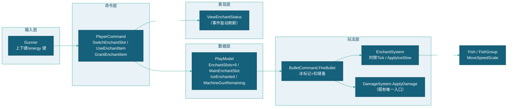
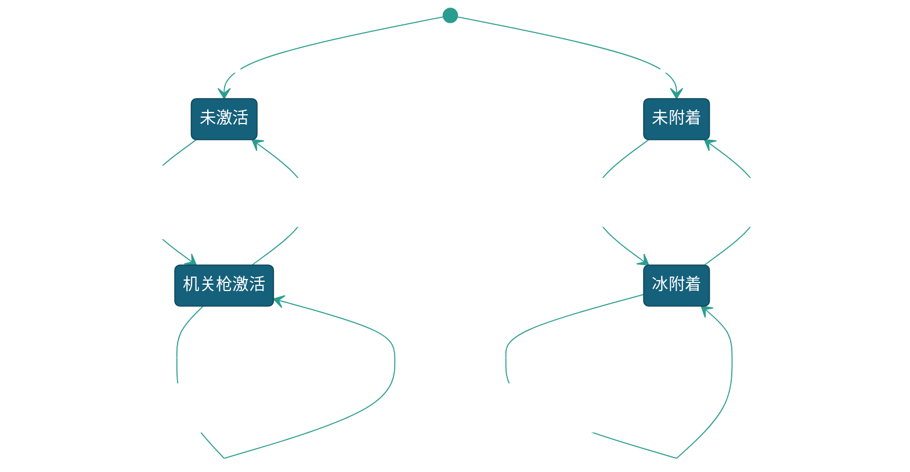

# 附魔系统

> 附魔系统首版（M1）实现设计：**机关枪 + 冰** 两道具的玩家侧数据、槽位输入、效果挂接与临时 UI。
> 设计依据 = 策划权威 [[GamePlan/玩法系统/附魔系统/附魔系统]] v6.1（§九 接入面：机关枪=发射节奏层、冰缓=目标状态层走 `ApplyDamage` 同入口）+ 负责人 2026-09-05 立项拍板（任务笔记 `GameDM/任务/附魔系统立项-M1首版.md`：首版范围、6 槽位交互、机关枪时限 **10 秒**、双击下键切炮类型退役、道具数据过渡形态入 GameModel）。策划文档 v6.2 按拍板同步中，交互与数值口径以本文为准。
> 红线对齐：附魔不改变单发消耗（仍 1 积分 + 1 炮弹积分）、不改击杀彩票值（LotteryValue 只随固定 Volume）、全链路无随机（[总体设计](../../总体设计.md) §2.1）。

---

## 一、系统定位与首版范围

### 1.1 定位

附魔系统管理**附魔道具的槽位存储、主槽位选择与主炮叠加**——玩家经上下键选择主槽位、按 energy 键使用主槽位道具，把附魔效果叠加到主炮（发射节奏 / 子弹标记），命中后经伤害链既有入口生效。效果算法归 `EnchantSystem`（GameplayModule 子系统），数据归 `PlayModel`（玩家侧），输入归 `Gunner`，显示归 `ViewEnchantStatus`（临时信息 UI）。

### 1.2 首版范围

| 项 | 首版（本文） | 后续版本 |
|----|------------|---------|
| 道具类型 | 机关枪（时限制 10s）、冰（储备制） | 火、追踪（枚举预留） |
| 道具获取 | `GrantEnchantItem` 命令（调试/联调入口） | 携带者击杀必掉（实体 prefab + .duowei 两表回补） |
| 交互 | 上下键环形切换主槽位、energy 键使用主槽位道具 | — |
| 效果 | 机关枪=射速提升 10s；冰=子弹命中减速 | 灼烧跳伤、制导必中、冰火暴击 |
| UI | `ViewEnchantStatus`（关卡信息 UI 风格：6 槽 + 主炮叠加） | 炮台弹药盘正式视觉 |
| 数据 | 道具数据类在 PlayModel（过渡形态，不落盘） | 道具实体化 + 附魔道具/携带者 .duowei 表 |
| 切炮 | 双击下键切炮类型**已退役**，无炮台切换玩法 | — |

### 1.3 架构位置与数据流



---

## 二、数据设计

### 2.1 附魔类型与道具数据类

新增 `Assets/Scripts/Data/Enchant/`：

```csharp
/// <summary>
/// 附魔道具类型（首版实装 Ice/MachineGun，Fire/Tracking 枚举预留）。
/// </summary>
public enum EnchantType
{
    None = 0,
    Ice = 1,
    MachineGun = 2,
    Fire = 3,
    Tracking = 4,
}

/// <summary>
/// 附魔道具数据（过渡形态：玩家数据内数据类，非池化实体）。
/// 字段语义对齐策划 §9.1 表 A（附魔道具表），.duowei 回补时同字段直出映射。
/// </summary>
[Serializable]
public class EnchantItemData
{
    /// <summary>道具类型。</summary>
    public EnchantType Type;

    /// <summary>剩余储备发数（储备制=冰；时限制道具恒 0）。</summary>
    public int Reserve;

    /// <summary>储备上限（储备制适用；到顶再获得=溢出损失）。</summary>
    public int ReserveLimit;

    /// <summary>单次掉落发数（携带者必掉配置值，M1 供发放命令使用）。</summary>
    public int DropCount;

    /// <summary>时限秒（时限制=机关枪 10；储备制为 0）。</summary>
    public float DurationSeconds;

    /// <summary>冰缓减速比例（0~1，仅冰；数值基线 0.5）。</summary>
    public float SlowRatio;

    /// <summary>冰缓持续秒（仅冰；数值基线 5）。</summary>
    public float SlowDurationSeconds;

    /// <summary>Boss 减速折扣系数（仅冰；终审确认项 0.4）。</summary>
    public float BossSlowFactor;
}
```

### 2.2 PlayModel 玩家侧新增（[PlayerModel.cs](../../../Assets/Scripts/Data/PlayerModel.cs)）

| 字段 | 类型 | 说明 |
|------|------|------|
| `EnchantSlotCount` | `const int = 6` | 槽位数 |
| `EnchantSlots` | `List<EnchantItemData>`（6 元素，空槽=null） | 6 槽位容器（构造函数初始化） |
| `MainEnchantSlot` | `BindableProperty<int>`（默认 0） | 主槽位索引（0~5，UI 高亮源） |
| `IceEnchanted` | `BindableProperty<bool>`（默认 false） | 冰附魔是否附加在主炮（炮台状态，期间所有普通炮子弹生效） |
| `IceSourceSlotIndex` | `int`（默认 -1） | 冰附魔来源槽（扣储备定位用，非通知面） |
| `MachineGunRemaining` | `BindableProperty<float>`（默认 0） | 机关枪剩余秒（>0=激活中；激活时刷新至道具 DurationSeconds=10） |

### 2.3 主炮附魔状态模型

主炮可同时持有**一个节奏类（机关枪）+ 一个状态类（冰）**附魔（不同层次可叠加，对齐策划 §4.5 组合口径；同类互斥）：



- 机关枪时限与主槽位选择**解耦**：激活后独立倒计时（无「切走冻结」场景，首版不引入选择冻结）。
- 冰附着与主槽位选择**解耦**：附着后切换主槽不影响附着；储备耗尽自动回落普通弹并清空来源槽道具。

### 2.4 GameModel 既有参数引用（零新增）

| 参数 | 现值 | 用途 |
|------|------|------|
| `StandardFirerate` | 0.2s | 经典发射间隔（策划基线 200ms） |
| `MachineGunFirerate` | 0.1s | 机关枪发射间隔（策划基线 100ms） |
| `FullAutoThreshold` | 1s | 全自动阈值（不动） |

机关枪时限秒、冰缓三参数均随 `EnchantItemData` 承载（每道具自带，对齐表 A 语义），GameModel 不加全局副本。

---

## 三、输入改造（Gunner 信号链）

### 3.1 现行信号链定位（改造对象）

`Gunner.GetInput` 每帧读设备：`joystick`（Vector2）/ `fire` / `energy` / `lottery`；`Game_Playing.OnUpdate → Actor.UpdateCannon(input, isFire, isChange)` 内含三个输入区域：

| 区域 | 现行行为 | 改造 |
|------|---------|------|
| Cannon Switch Tip | 普通炮持有 3s 后显示 `ChangeCannonTip`（双击切炮教学提示） | **移除**（玩法退役，提示失效） |
| Cannon Level Switching | `energy` 键（isChange）长按连续/短按单次触发 `SwitchCannon()→PlayerCommand.SwitchLevel`（炮级恒 1，仅广播链） | **移除输入路径**（energy 改供附魔使用；`SwitchLevel` 命令保留供 GameFlow 初始化刷新链） |
| Cannon Switching | 摇杆向下（`input.y < -0.5`）双击检测 → `CallSwitchCannon()` 切炮类型 | **整体移除**（炮台切换玩法退役） |

保留项：`CallSwitchCannon(int/Type)` 公开 API 不删（`Game_Exit` 强制切回 0 号炮、`AcquireCannonEvent` 奖励炮获取两条路径继续使用）；`SwitchCannon()/SwitchCannonRoutine`（切级协程）随 energy 输入路径一并移除。

### 3.2 新输入规格（UpdateCannon 内新增「附魔槽位切换」与「使用」区域）

| 输入 | 信号 | 行为 |
|------|------|------|
| 上 | `input.y > +0.5` 按下沿 | `SendCommand(PlayerCommand.SwitchEnchantSlot(ID, -1))`：主槽索引 −1 环形（(i+5)%6） |
| 下 | `input.y < -0.5` 按下沿 | `SendCommand(PlayerCommand.SwitchEnchantSlot(ID, +1))`：主槽索引 +1 环形（(i+1)%6） |
| 使用 | `playerDevice.GetButtonDown("energy")` 按下沿 | `SendCommand(PlayerCommand.UseEnchantItem(ID))`：使用主槽位道具 |

- **边沿触发**：摇杆进入阈值区触发一次，回到中性区（\|y\| < 0.5）后才允许下一次触发（复用 `LightningCannonFunc.typeSwitchState` 同款状态锁；阈值 `SlotSwitchThreshold = 0.5f` 常量化）。
- 环形遍历**全部 6 槽（含空槽）**：空槽可停留（energy 无效），保持位置感；主槽位只是选择器，不影响已激活的机关枪时限/冰附着。
- `energy` 取按下沿：`GetInput` 内 isChange 改读 `GetButtonDown("energy")`；testInput 调试分支对应 `Input.GetKeyDown(KeyCode.F)`，上下沿用 `GetAxisRaw("Vertical")` 同轴。
- `Game_Disable.OnUpdate` 以 `UpdateCannon(Vector2.zero,false,false)` 驱动——签名不变，禁用期间附魔输入随零输入自然冻结。

### 3.3 UseEnchantItem 命令分派（校验储备/时限）

```text
主槽道具 = EnchantSlots[MainEnchantSlot]
空槽 / Type=None        → 无操作
Type=Ice                → 未附着且 Reserve>0：IceEnchanted=true、IceSourceSlotIndex=主槽（附加到主炮）
                          已附着且来源槽=主槽：IceEnchanted=false（取消附魔，储备不动）
Type=MachineGun         → MachineGunRemaining = 道具.DurationSeconds（10s，重复使用刷新不叠加）
                          消耗道具：来源槽置空
Type=Fire/Tracking      → 首版未实装，无操作
每次有效变更后 SendEvent 对应附魔事件（§七）
```

---

## 四、效果挂接

### 4.1 机关枪 = 发射节奏层（不进伤害判定）

挂接点：`StandardCannonFunc.Update` 的发射间隔参数化（现行 `launchCD = GameModel.StandardFirerate` 硬取普通射速）：

```csharp
// 机关枪激活期间取高速间隔，结束自动回落经典节奏
bool machineGunActive = Actor.Model.MachineGunRemaining.Value > 0f;
launchCD = machineGunActive
    ? Actor.GameModel.MachineGunFirerate.Value
    : Actor.GameModel.StandardFirerate.Value;
```

- 时限驱动：`EnchantSystem` 每帧 `MachineGunRemaining.Value -= deltaTime`（归零钳 0 + `EnchantStateChangedEvent`）；输入禁用期间**冻结不扣**（§6.2）。
- 奖励炮（激光/钻头/电击）不做机关枪加速——射速参数化仅落在 `StandardCannonFunc`（主炮）。
- 数值边界：单发消耗仍 1 积分 + 1 炮弹积分（`FireBullet` 既有双资源校验，机关枪不耗任何弹药）。

### 4.2 冰 = 目标状态层（ApplyDamage 同入口，不改伤害数值）

**弹侧（炮台状态期间所有普通炮子弹生效）**：

1. `Gunner.CannonLaunch`：当前炮为普通炮（`CurrentCannonIndex == 0`）且 `IceEnchanted` → 向 `BulletCommand.FireBullet` 传入 `EnchantType.Ice`（奖励炮弹不带附魔标记）。
2. `BulletCommand.FireBullet.OnExecute`：冰标记时校验来源槽储备——`Reserve < 1` 自动回落普通弹（`IceEnchanted=false` + 清槽 + 事件，**不阻塞发射**）；否则 `Reserve -= 1`，`blt.InitBullet` 附带 `enchantType`；储备扣至 0 的下一发前自动回落（耗尽回落，对齐策划 §三）。
3. `Bullet.HitFish`：`ApplyDamage(fish, playerId, 1)` 返回 `result.IsValid`（有效命中，无论是否击杀）后调用 `EnchantSystem.ApplyIceSlow(fish)`——与伤害链同入口同条件（[伤害系统实现设计](../伤害系统/伤害系统实现设计.md) §5.1 三入口口径；首版附魔载体仅普通炮 Bullet，电击直击/钻头弹不带标记）。

**鱼侧（减速状态施加与生效）**：

```csharp
/// <summary>
/// 施加冰缓：重复命中只刷新时长不叠加强度；Boss 按折扣系数生效（实际减速=比例×折扣）。
/// 减速状态落目标实例字段，死亡/离场回收自然消失。
/// </summary>
public void ApplyIceSlow(Fish fish)
{
    float ratio = 槽位道具 SlowRatio;                     // 基线 0.5
    if (fish.Data != null && fish.Data.Id.Length > 0 && fish.Data.Id[0] == '4')
        ratio *= 槽位道具 BossSlowFactor;                  // Boss 判定=Id 首位 '4'（LightningCannonFunc 同口径），折扣 0.4
    var target = fish.TickMoveEnabled == false && fish.Group != null
        ? 减速挂群（共享路径约束，见下） : 减速挂鱼;
    target.SlowFactor = ratio;                             // 只刷新时长：Factor 覆写同值
    target.SlowUntil = Time.time + 槽位道具 SlowDurationSeconds;   // 基线 5s
}
```

减速生效挂点（乘法因子，两处收敛）：

| 目标形态 | 挂点 | 说明 |
|---------|------|------|
| 独立移动鱼（单体/群游 SchoolFish/独立血条阵型成员/Boss） | `Character.TickMove`（框架层）新增 `MoveSpeedScale`（默认 1）：`CurrentMove?.Tick(deltaTime * MoveSpeedScale)` | 框架层通用字段，不含游戏语义；鱼每帧在 Move 状态 update 里按 `SlowUntil` 刷新（过期回 1） |
| 群组驱动成员（阵型 FormationFish / 队列 QueueFish，`TickMoveEnabled=false` 共享路径 t） | `FishGroup` 新增 `SlowFactor/SlowUntil/MoveSpeedScale`，子类 `TickMovement` 的 step 乘 `MoveSpeedScale`（基类 `OnUpdate` 先刷新过期） | 共享路径无法单鱼减速——命中任一成员=整组减速（与共享血池「打任一成员=打整体」对称；群游/独立血条阵型不受此口径影响） |

- 减速下限：`MoveSpeedScale = Mathf.Max(1f - SlowFactor, 0.05f)`——基线 50% 减速→0.5 倍速；Boss 50%×0.4=20% 减速→0.8 倍速；完全静止不开放。
- 结冰视觉（鱼身变色/动画）：首版不做，表现层任务后续挂接（可复用 `Fish.damageRenderers` 材质通道）。

---

## 五、临时 UI（ViewEnchantStatus，关卡信息 UI 风格）

### 5.1 结构与挂载

新增 `Assets/Scripts/View/ViewEnchantStatus.cs : ViewBase`（对齐 `ViewStatus` 轻量信息 UI 模式）：

- 预制体节点放各玩家 View 区（与 ViewStatus 同级，`ViewModule.ScanViewZones` 自动按 P{n} 注册）；`Game_Preview.OnEnter` 与 ViewStatus 一并 `OpenView<ViewEnchantStatus>(Actor.ID)`。
- 显示面：**6 槽位**（道具图标 + 储备数/时限参数；空槽置灰）+ **主槽高亮** + **主炮叠加状态**（冰附着标记 + 机关枪激活标记与剩余秒）。

### 5.2 数据驱动刷新（System 禁直接操作 UI，全事件/直读模型）

| 刷新源 | 载体 | UI 动作 |
|--------|------|---------|
| `EnchantSlotChangedEvent` | `SceneFlow.OnStart` 注册（对齐 ScoreRefreshEvent→ViewStatus 既有模式） | 重绘对应槽位（图标/发数/空灰） |
| `EnchantMainSlotChangedEvent` | 同上 | 迁移主槽高亮 |
| `EnchantStateChangedEvent` | 同上 | 冰/机关枪标记显隐 |
| `MachineGunRemaining` | 视图 `Update` 直读模型（GetModel→PlayModel，每帧读 float 无事件风暴） | 机关枪倒计时秒数显示 |

---

## 六、时序与边界

### 6.1 断电恢复

附魔数据（槽位储备/时限/附着）首版**无持久化载体，断电即失**（Points 走 AtomicReadWriter、LotteryValue 走 LotteryValuePersistence，附魔不入两链）。设计决策（待负责人确认）：储备型弹药后续随积分恢复口径回补，时限/附着不恢复。

### 6.2 禁用操作期间（输入锁/大奖演出强切）

`EnchantSystem` 订阅 `PlayerInputStatusEvent` 记录每玩家禁用态：**机关枪时限冻结**（默认实现=冻结，待确认）；冰减速状态为场上鱼实例态，随鱼生命周期自然过期，不参与冻结。

### 6.3 出票 / 退场 / 切关 / 换人

| 时机 | 现状 | 附魔清理口径 |
|------|------|-------------|
| 游玩中出票（PrintTickets 快照结算） | 只扣 LotteryValue，留存 Points/AmmoPoints | 不清任何附魔状态（出票≠退场） |
| 退场（Game_Exit → ResetStatus） | 只清 LotteryValue | **扩展 ResetStatus**：清 `MachineGunRemaining=0`、`IceEnchanted=false`（演出态附魔不跨会话）；**槽位储备保留**（对齐游玩数值留存口径，待确认） |
| 切关（SceneChange/Wave 清场） | 玩家输入禁用 | 玩家附魔状态保留（时限靠 §6.2 冻结护住）；场上鱼清空→鱼减速状态自然消失 |
| 换人（SessionActive 翻转） | 走 ResetStatus 同链 | 同退场口径 |

---

## 七、命令与事件清单

### 7.1 PlayerCommand 新增（PlayersCommand 嵌套，改 Model + SendEvent）

| 命令 | 签名 | 职责 |
|------|------|------|
| `SwitchEnchantSlot` | `(int id, int delta)` | 主槽索引环形 ±1（钳 0~5），发 `EnchantMainSlotChangedEvent` |
| `UseEnchantItem` | `(int id)` | 按 §3.3 分派使用/取消/激活，发对应事件 |
| `GrantEnchantItem` | `(int id, EnchantType type)` | 发放道具：找空槽或同类槽（储备 min 封顶 ReserveLimit，溢出损失）；M1 调试/联调入口，后续携带者击杀走同一命令 |
| `ResetStatus`（扩展） | 既有 | 追加清时限与冰附着（§6.3），广播 `EnchantStateChangedEvent` |

### 7.2 新增事件（`Assets/Scripts/Event/`）

| 事件 | 字段 | 触发 |
|------|------|------|
| `EnchantSlotChangedEvent` | `PlayerId, SlotIndex` | 槽位内容变更（发放/消耗/清空） |
| `EnchantMainSlotChangedEvent` | `PlayerId, SlotIndex` | 主槽位切换 |
| `EnchantStateChangedEvent` | `PlayerId, IceEnchanted, MachineGunActive` | 冰附着变化 / 机关枪激活与结束 |

---

## 八、实现拆解（worker 开发步骤）

> 依赖顺序：步骤 1→2→3 可串行打底，4/5/6 依赖 1-2，7 依赖 3-6，8 收尾验证。框架层改动仅步骤 6 的 `Character.MoveSpeedScale`（通用字段，无游戏层引用）。

| # | 步骤 | 文件 | 内容 | 验证点 |
|:-:|------|------|------|--------|
| 1 | 数据类 | 新增 `Assets/Scripts/Data/Enchant/EnchantType.cs`、`EnchantItemData.cs` | §2.1 两类型 | 编译过；Inspector 可见 |
| 2 | 玩家数据 | `Assets/Scripts/Data/PlayerModel.cs`（PlayModel） | §2.2 字段 + 构造函数初始化 6 槽 | 槽位计数=6、主槽默认 0 |
| 3 | 命令/事件 | 新增 `Assets/Scripts/Event/EnchantEvents.cs`；`Command/PlayerCommand.cs` 增三命令 + 扩展 ResetStatus | §7 全部 | Grant→槽位点亮；ResetStatus 后 IceEnchanted=false、MachineGunRemaining=0 |
| 4 | 输入改造 | `Assets/Scripts/Actor/Gunner.cs` | 移除三区域（§3.1）+ `SwitchCannon/SwitchCannonRoutine`；新增上下键边沿检测与 energy 按下沿（§3.2）；`GetInput` isChange 改 `GetButtonDown`（testInput 用 `Input.GetKeyDown(F)`） | 双击下键无切炮；上下键主槽环形移动；energy 触发一次/按 |
| 5 | EnchantSystem | 新增 `Assets/Scripts/Module/GameplayModule/EnchantSystem.cs`；`Assets/Prefab/LTPH.prefab` Gameplay 子级挂「Enchant」组件 | 机关枪时限 Tick（禁用冻结，订阅 PlayerInputStatusEvent）+ `ApplyIceSlow`（§4.2：刷新时长/Boss 折扣/挂鱼或挂群判 `TickMoveEnabled`） | 时限 10s 归零回落；禁用期间不倒计时 |
| 6 | 发射链与减速 | `Command/BulletCommand.cs`（FireBullet 冰校验扣储备+传标记）、`Actor/Cannon/StandardCannonFunc.cs`（间隔参数化 §4.1）、`Effect/Bullet.cs`（EnchantType 字段+InitBullet 参数+HitFish 后 ApplyIceSlow）、`Actor/Gunner.cs`（CannonLaunch 判定传参）、框架 `Packages/com.kframework/Runtime/Module/Pawn/Character.cs`（MoveSpeedScale）、`Actor/Character/Fish.cs`（SlowFactor/SlowUntil+Move 刷新+OnDespawn 清）、`Actor/Character/Group/FishGroup.cs`（群级减速字段+OnUpdate 刷新）、`Group/FormationFish.cs`/`QueueFish.cs`（step×MoveSpeedScale） | 冰弹命中普通鱼减速 50%、Boss 80% 减速（50%×0.4）；重复命中只刷新时长；阵型/队列整组减速；储备耗尽自动回落普通弹；机关枪期间 0.1s/发、结束回 0.2s/发 |
| 7 | 临时 UI | 新增 `Assets/Scripts/View/ViewEnchantStatus.cs` + 玩家 View 区预制体节点；`Flow/GameFlow/Game_Preview.cs`（OpenView）；`Flow/SceneFlow.cs`（注册三事件） | §5 全部 | 发放/切换/激活/结束全状态 UI 实时一致；倒计时秒直读 |
| 8 | 回归验证 | — | 双资源口径（附魔弹仍 1+1）、彩票值不受附魔影响、退场/切关/断电时序走查 | 红线自查（总体设计 §2.1）全过 |

---

## 九、待负责人确认决策

| # | 决策项 | 本文默认（worker 按此实现） | 备选 |
|:-:|--------|---------------------------|------|
| 1 | 附魔储备断电恢复 | 首版不恢复（无持久化载体）；后续回补按「储备随积分恢复、时限不恢复」 | 储备也不恢复 |
| 2 | 禁用操作期间机关枪时限 | 冻结（EnchantSystem 不扣减） | 不冻结（演出期间白烧） |
| 3 | 群组驱动鱼（阵型/队列）冰缓口径 | 命中任一成员=整组减速（共享路径约束，与共享血池语义对称） | 群组驱动鱼免疫冰缓 |
| 4 | ResetStatus 清理范围 | 清时限+冰附着，槽位储备保留（对齐游玩数值留存） | 储备一并清（换人防携带） |
| 5 | 冰附着后再次 energy（同槽） | 取消附魔（储备不动，toggle 语义） | 无操作（只能耗尽回落） |
| 6 | 主槽位环形范围 | 全 6 槽含空槽（位置感优先） | 跳过空槽 |
| 7 | 机关枪时限与主槽位选择的关系 | 解耦：激活后独立倒计时，不因切槽冻结（切炮玩法已退役，无「切走冻结」场景） | 时限跟随道具选中态（选中才倒数） |

---

## 十、相关文档

- [伤害系统实现设计](../伤害系统/伤害系统实现设计.md)（ApplyDamage 唯一入口与命中链 §5.1）
- [总体设计](../../总体设计.md)（设计红线 §2.1、三资源经济 §五~§七）
- [炮台](../../实体/炮台/炮台.md)（Gunner/炮台功能/输入处理）
- [子弹](../../实体/子弹/子弹.md)（Bullet 命中链）
- 策划权威：[[GamePlan/玩法系统/附魔系统/附魔系统]]（§三主动面/§四被动面/§九接入面）
- 任务笔记：`GameDM/任务/附魔系统立项-M1首版.md`（负责人拍板）
