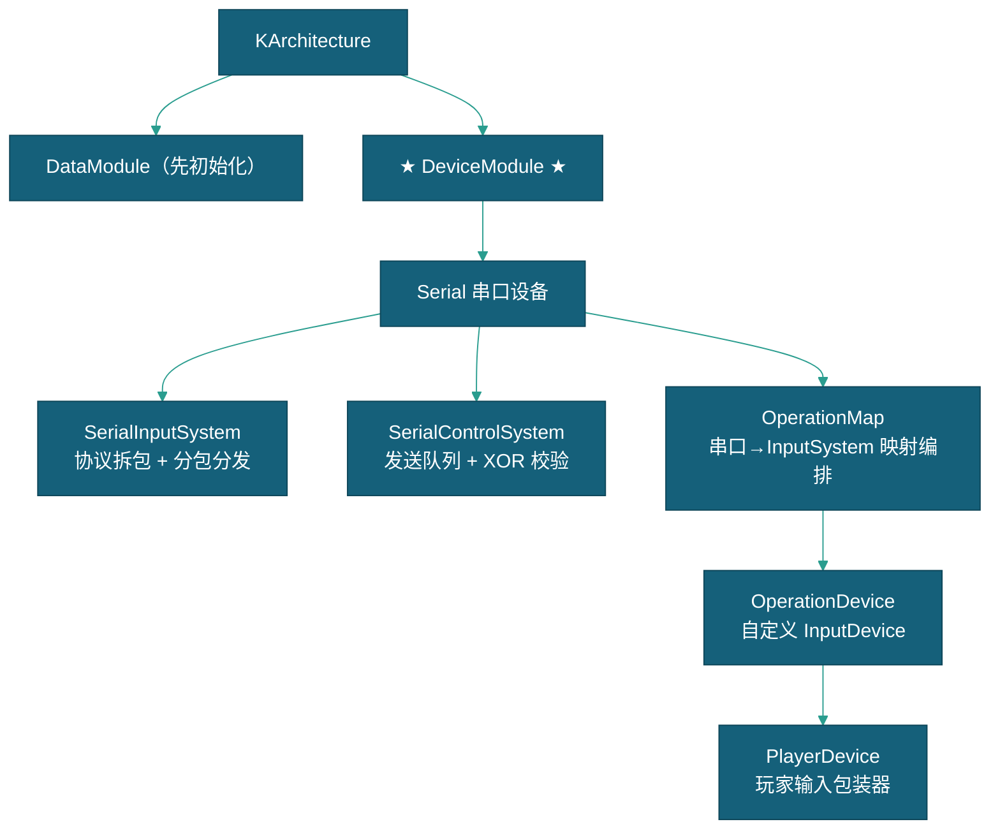

# 设备输入输出系统

> 本文档描述设备输入输出系统（DeviceModule + 串口输入输出系统）的设计，包含 KFramework 层设备管理框架和游戏层串口设备的具体实现。
> DeviceModule 管理 IDevice 实例，提供 PlayerDevice 玩家输入包装器。

---

## 一、系统概述

### 1.1 架构位置



### 1.2 关键依赖

| 依赖项 | 类型 | 说明 | 获取方式 |
|--------|------|------|---------|
| `DataModule` | Module | 数据服务先于设备初始化 | `this.GetModule<DataModule>()` |
| `DeviceModule` | Module | 所属框架模块 | 架构自动注册 |

---

## 二、DeviceModule — 设备管理框架

挂载在 `GameManager/Device`。`OnInit()` 流程：
1. `CollectSystems()` — 收集子级 `BaseInputSystem` / `BaseControlSystem` 组件
2. 汇总所需 DeviceType → 通过反射工厂 `CreateDevice(type, index)` 创建 `IDevice` 实例
3. 按 `deviceName` / `deviceIndex` 分配设备到各系统
4. 依次调用各系统的 `OnInit()`

### 2.1 核心 API

| API | 说明 |
|------|------|
| `P(int playerId)` | 获取 PlayerDevice，`PlayerDevice.Get(playerId)` 带静态缓存 |
| `GetDevices(DeviceType)` | 获取指定类型的所有设备 |
| `GetInputSystem<T>()` | 按类型查找输入系统 |
| `GetControlSystem<T>()` | 按类型查找控制系统 |
| `AddDevice(IDevice)` / `RemoveDevice(IDevice)` | 热插拔管理 |

### 2.2 设备接口层次

| 类型 | 说明 |
|------|------|
| `IDevice` | 设备接口：`DeviceType`, `Connect()`/`Disconnect()`, `IsConnected`, `OnConnectionStateChanged` 事件 |
| `DeviceBase` | 抽象基类 |
| `BaseInputSystem<TDevice>` | 输入系统泛型基类，持有 `DeviceClassType` + `StrongDevice` |
| `BaseControlSystem<TDevice>` | 控制系统泛型基类 |
| `DeviceType` | 枚举（当前仅 `Serial`） |

---

## 三、串口设备实现

### 3.1 SerialDevice

串口硬件包装器，基于 SerialPortUtilityPro 插件。通过静态工厂 `Create(int index, string name)` 创建。

**参数：** `OpenMethod`(USB)、`BaudRate`(115200)、`ReadProtocol`(BinaryStreaming)、`VendorID`/`ProductID`。

### 3.2 SerialInputSystem — 输入系统

继承 `BaseInputSystem<SerialDevice>`。接收串口原始字节流，按 `SerialProtocolConfig` 协议格式拆包分发。

**数据流：**
```
串口硬件 → SerialPortUtilityPro
  → SerialDevice.OnReadComplete()
    → SerialInputSystem.ParsePackets()
      → 扫描包头(headerHex) → 按协议拆包
      → DispatchPacket()
        → 命令区间(Id=-1) → OperationMap.OnCommandData()
        → 玩家区间(Id=0~9) → OperationMap.OnPlayerData(pid, data)
          → ChannelParser.Parse() 每个通道
          → OperationDevice.UpdateControl()
        → OperationDevice.EndBatch() → InputSystem.QueueStateEvent()
```

**协议包结构：** `[包头] + [命令段] + [玩家段×10] + [固定段] + [校验段]`

### 3.3 SerialControlSystem — 输出系统

继承 `BaseControlSystem<SerialDevice>`。维护发送队列，每帧发送一包。

**发送流程：** `Enqueue(byte[])` 入队 → `Update()` 出队 → 组包（包头 + 数据 + XOR 校验）→ `SerialDevice.Send(packet)`。

**输出命令：** lottery(0x01)、clear fault(0x02)、clear fault to lottery(0x03)、clear coin fault(0x04)、clear coins(0x80)。

### 3.4 OperationMap — 映射编排器

继承 `Controller`。负责串口数据段 → Unity InputSystem 的通道映射。

**初始化：** `Start()` → 读取 `OperationMapConfig.inputChannels` → 注册 ChannelParser → 绑定 InputAction → 注册自定义解析委托(`SerialCustomParsers.Init`)。

### 3.5 OperationDevice

继承 `UnityEngine.InputSystem.InputDevice` 的自定义设备。状态结构体 `OperationState`（64 字节，16 按钮 + 8 float + 4 int）。`InputSystem.QueueStateEvent()` 注入状态，`InputUser` 配对隔离玩家。

---

## 四、PlayerDevice — 玩家输入包装

```csharp
var p = this.GetModule<DeviceModule>().P(playerId);
```

### 4.1 轮询 API

| API | 说明 |
|------|------|
| `GetButtonDown(name)` | 当前帧按下 |
| `GetButton(name)` | 按住中 |
| `GetButtonUp(name)` | 当前帧释放 |
| `GetVector2(name)` | 读取 Vector2 轴值 |
| `GetAxis(name)` | 读取 float 轴值 |

### 4.2 事件 API

| API | 说明 |
|------|------|
| `OnStarted(name, callback)` | 注册 started 回调（延迟绑定，SharedAsset 就绪后重试） |
| `OnPerformed(name, callback)` | 注册 performed 回调 |
| `OnCanceled(name, callback)` | 注册 canceled 回调 |
| `OnHold(name, duration, onHold, onCancel)` | 长按检测（每帧 `Tick()` 计时） |

### 4.3 输出控制

```csharp
P(playerId).Control("lottery", new LotteryControlData { count = 50 });
```

`ControlHandler` 静态委托由 OperationMap 注入，路由到 SerialControlSystem。**玩家 ID 由框架自动注入。**

---

## 五、配置与数据

| 配置 | 位置 | 说明 |
|------|------|------|
| `SerialProtocolConfig` | `Settings/` | 字节布局（包头hex/命令长度/玩家长度/校验方式/心跳） |
| `OperationMapConfig` | `Settings/` | 通道映射（channelName/type/byteOffset/bitIndex/isGlobal） |
| `HardwareActions.inputactions` | `Settings/` | Unity Input System 动作定义，ActionMap 命名 `P1`~`P10` |

详见 [设备协议配置说明](设备协议配置说明.md)

---

## 六、扩展指南

### 添加新输出命令

在 `OperationMapConfig.asset` 的 `outputChannels` 中加一条，修改 `fixedData` 操作码即可，无需写代码。

### 自定义输入解析

```csharp
// SerialCustomParsers.Init() 中注册
ChannelParser.CustomParserRegistry["layout/channel"] = (data, last) =>
{
    // data 为按 byteOffset/byteCount 切出的字节数组
    // 返回 bool → Button, int → Value, Vector2 → Vector2
};
```

### 自定义输出序列化

```csharp
// 委托签名: (ControlData data, int playerId) => byte[]
ControlSerializer.CustomSerializerRegistry["layout/channel"] = (data, playerId) =>
{
    var d = (MyControlData)data;
    return new byte[] { /* 自定义字节序列 */ };
};
```

---

## 七、相关文档

- [框架设计文档](../框架设计文档.md)
- [设备协议配置说明](设备协议配置说明.md)
- [玩家流程](../流程与视觉/流程/玩家流程/玩家流程.md)
