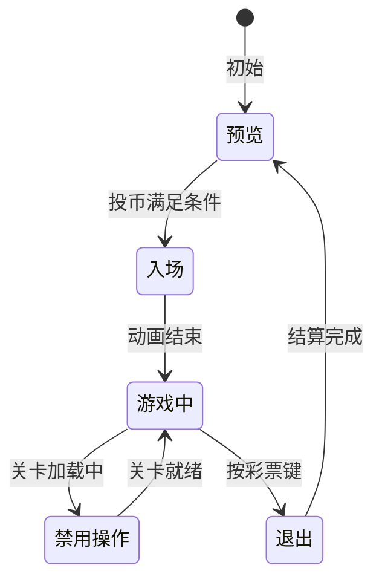

# 游戏策划规范及约束

> **职责边界（多会话协作）**：本目录为**策划层**，本规范只约束 `GamePlan/` 下的策划文档。
> 设计文档规范见 `LTPHDoc/GameDD/AGENTS.md`；代码规范见项目根 `AGENTS.md` 与技能 `kf-code`；
> 状态同步：frontmatter `状态` 为跨会话唯一权威，流转 `策划中 → 开发中 → 已实现 ⇄ 修复中`（任意状态可标已废弃）。
> 改文档必须同步更新状态/版本/更新日期；文档只写现状，不写 `[变更]` 留痕行/修订记录段（历史一律看 git）。

> 基于 KFramework 框架的游戏项目通用策划文档体系规范。
> 适用于策划人员编写需求文档，也适用于 AI 助手解析策划内容并生成开发指引。
>
> 策划文档围绕框架核心概念组织——**流程、系统、实体、数据、界面（视觉）**，实现需求描述到框架开发的自然衔接。

---

## 一、定位与目标

本规范面向使用 KFramework 框架开发的街机/休闲游戏项目，定义策划文档的目录结构、编写格式和内容约定。

**设计原则：**

1. **人机双用**：格式同时适合人类策划编写阅读和 AI 解析
2. **框架对齐**：策划概念能找到对应的框架实现层
3. **需求驱动**：文档以游戏需求为核心，不包含代码细节。AI 根据框架约定自动将需求映射为开发任务
4. **渐进细化**：从总体策划 → 域文档（系统/实体/关卡/流程）→ 具体文档，逐层深入

---

## 二、文档体系（血量版现行结构）

### 2.1 目录结构

```
GamePlan/
  AGENTS.md                   ← 策划规范及约束（本文件）
  总体策划.md                   ← 项目总纲（血量版定位 + 目录导览 + GameData 三表协作约定 + 流程总览）
  templete/                         ← 策划模板
    ├── 总体策划模板.md
    ├── 玩法系统策划模板.md        ← 系统策划（主动/被动两面结构）
    ├── 实体策划模板.md           ← 实体（基础实体+派生+清单同构）
    ├── 关卡策划模板.md
    ├── 数据策划模板.md
    └── 模块策划模板.md           ← 设备输入输出等模块型文档
  设备输入输出系统/                ← 各种设备的输入输出操作（串口/投币器/出票器/摇杆/切炮键…）
    └── 设备系统.md
  流程与视觉/
    ├── UI/                     ← xxUI：各具体 UI 的策划说明（如 Boss 出现提示）
    │   └── UI总览.md
    ├── 特效/                   ← xx：xxActor 的特效具体表现说明 + 此种特效清单（可被具体实体引用）
    │   └── 特效总览.md           ← 后续按 Actor 拆分为独立特效文档
    └── 流程/
        ├── 场景流程.md           ← 场景加载→生成→后台 + 切关要点
        └── 玩家流程/            ← 主动玩法载体：每个具体流程包含对应的视觉交互
            ├── preview.md       ← 预览
            ├── playing.md       ← 游玩（进入游戏/游戏中/禁用操作）
            └── exit.md          ← 退出（彩票结算）
  关卡/                       ← 「xx关卡」第一个实例 = 鱼关卡（可扩展其他关卡域）
    ├── 关卡设计总纲.md           ← 总体目标/表现/类型/交互/数值计算方式（含数值节）
    ├── 通用件/                  ← 事件表 / 触发链 / 关卡对比分析
    ├── 标准关卡/                ← xx类型关卡：设计规范 + 具体关卡（宝藏海域等 10 关）
    │   ├── 标准关卡设计规范.md
    │   └── xxx.md
    └── 鱼潮关卡/                ← 91型/92型/93型（各型设计规范+具体关卡）+ 阵型图鉴等通用件
        ├── 阵型图鉴.md
        ├── 91型/ 92型/ 93型/
        ├── 阵型图/ 关卡资产/ tools/
        └── …
  实体/                         ← Actor 实体，同构：基础实体 + 派生实体 + 清单
    ├── 鱼/
    │   ├── 鱼.md               ← 基础实体（FishActor）
    │   ├── 奖励鱼.md            ← 派生实体（带奖励特效的鱼）
    │   └── 鱼清单.md            ← 全实体清单（可引用多维表格数据——鱼种.duowei）
    ├── 炮台/
    │   └── 炮台.md
    └── 子弹/
        └── 子弹.md
  玩法系统/                     ← 玩法系统文档域（定位口径见 玩法系统分析方法论.md：伤害=主动+被动、经济=主动、附魔=实体+主动+被动）；奖励不构成系统（=特效实体，实体侧见 实体/鱼/奖励鱼.md，击杀彩票数值归 经济系统.md）
    ├── 玩法系统分析方法论.md      ← 玩法系统域策划规范（概念体系/因果骨架/系统定位总表）
    ├── 伤害系统/               ← 打鱼玩法链主干（发射炮台子弹=主动、子弹-鱼伤害判定=被动）+ 数值设计（HP/Volume/R̄ 口径）
    │   ├── 伤害系统.md
    │   └── 数值框架.md
    ├── 经济系统/               ← 主动玩法（经济数值属炮台）：三资源隔离/投币兑换/出票结算/断电保护
    │   └── 经济系统.md
    └── 附魔系统/               ← 实体 + 主动 + 被动
        └── 附魔系统.md        ← 附魔道具=实体（炮台背包存储）；使用道具=主动玩法；附魔子弹对鱼的效果=被动玩法
```

### 2.2 文档层级关系

```
总体策划（总纲：定位/导览/流程/三表约定）
  ├── 引用 → 域文档（设备输入输出 / 流程与视觉 / 玩法系统）
  ├── 引用 → 实体文档（基础实体 + 派生实体 + 清单）
  ├── 引用 → 关卡文档（总纲 + 各类型关卡规范 + 具体关卡 + 通用件）
  └── 引用 → 数据文档（多维表格引用说明、清单）
```

### 2.3 域语义约定

| 域 | 判定口径 |
|----|---------|
| **主动玩法**（流程与视觉/流程；玩法系统/中经济等主动定位系统） | 由设备输入信号触发的玩家主动行为（发射炮台子弹、切换附魔、投币、按彩票键结算），挂在操控主体（炮台）上、在具体流程中进行 |
| **被动玩法**（玩法系统） | 由主动玩法（或上游被动玩法）触发、规则自动生效的系统行为（子弹-鱼伤害判定、击杀结算、状态施加），玩家不直接操作 |
| **实体** | 场景中的 Actor（鱼/炮台/子弹…），目录同构：`[实体名].md`（基础）+ 派生实体 + `[实体名]清单.md`（可引用 `[实体名].duowei` 多维表格数据） |
| **关卡** | 「xx关卡」域的第一个实例为鱼关卡（`关卡/`）；扩展其他关卡域时平级新建目录 |
| **设备输入输出** | 硬件输入信号 → 玩法映射，输出指令（出票/退币）下发 |

---

## 三、通用编写规范

### 3.1 文档信息

每份策划文档必须在文件顶部标注文档信息，格式如下：

```yaml
---
类型: 总体策划 | 模块策划 | 系统策划 | 流程策划 | 实体策划 | 关卡策划 | 数值策划 | 数据策划 | 视觉策划 | 策划规范
关联模块: [模块A, 模块B]
关联系统: [系统A, 系统B]
关联数据: [数据模型A, 数据模型B]
状态: 策划中 | 开发中 | 修复中 | 已实现 | 已废弃
版本: 1.0
更新日期: 2026-09-01
---
```

| 字段 | 说明 | 必填 |
|------|------|------|
| `类型` | 文档类型（系统策划=玩法系统域；流程策划=流程域；视觉策划=UI/特效域；策划规范=域规范/方法论文档） | ✅ |
| `关联模块` | 此策划涉及的游戏功能模块 | 推荐 |
| `关联系统` | 此策划涉及的具体业务系统 | 推荐 |
| `关联数据` | 此策划涉及的配置表或数据（含 `.duowei` 多维表格） | 推荐 |
| `状态` | 策划/实现状态（统一枚举，修复中=bug 返工，修完回已实现） | ✅ |
| `版本` | 版本号 | ✅ |
| `更新日期` | 最后更新日期 | ✅ |

### 3.2 命名约定

| 元素   | 规则              | 示例                   |
| ---- | --------------- | -------------------- |
| 文件名  | 中文描述 + `.md`（玩家流程等流程文档可用英文文件名）    | `炮台系统.md`、`preview.md`            |
| 章节标题 | `## 编号、中文标题`    | `## 一、实体属性`          |
| 表格列名 | 中文优先，公认的英文术语可保留 | `速度`, `ID`, `血量(HP)` |
| 文档链接 | `[[路径/文件名]]`（路径相对 GamePlan 根，Obsidian 后缀解析）    | `[[实体/炮台/炮台]]` |
| 框架概念 | 用中文名称           | 模块、系统、实体、流程状态、数据模型   |

### 3.3 表格规范

策划数据表应遵循以下约定：

- **类型列**：标注数据类型（整数/小数/文本/选项/坐标/是否）
- **默认值列**：未填写时的回退值
- **说明列**：补充策划意图、取值范围、与其他字段的关联
- 复杂嵌套结构用子表格或结构示意块表示
- **数值事实源**：实体数值字段（HP/Volume/Speed 等）以 `GameData/*.duowei` / 运行时 JSON 为唯一事实源，文档不重复维护数值总表，只做策划注解与分档口径

### 3.4 状态机表示

流程和实体状态必须用状态图（mermaid）表示：



状态图下方标注每个状态的含义和对应的框架流程节点（玩家流程五状态文档见 `流程与视觉/流程/玩家流程/`）。

### 3.5 操作/事件表

描述玩家操作或系统事件时，使用以下格式：

| 操作 | 触发条件 | 影响的数据 | 发出的事件 |
|------|---------|-----------|-----------|
| 投币 | 玩家投入硬币 | 游戏积分+10、炮弹能量+1 | 积分刷新事件 |
| 开炮 | 按发射键 | 游戏积分扣除 | 子弹发射事件 |
| 击中目标 | 子弹碰撞判定 | 鱼 HP−伤害 | 命中反馈事件 |

---

## 四、框架概念与策划语言的对应

策划在文档中使用的概念，与框架实现层有自然的对应关系。AI 根据这些对应自动完成需求到代码的映射。

| 策划概念   | 框架中的位置     | 说明                               |
| ------ | ---------- | -------------------------------- |
| 游戏全局功能 | 模块         | 如：设备模块、流程模块、界面模块。一个模块管理一大类游戏功能。  |
| 具体业务逻辑 | 系统         | 如：炮台系统、特效系统、伤害系统。系统是模块内部的子单元。    |
| 可交互的物体 | 实体         | 如：鱼、子弹、炮台。实体在场景中出现和消失由框架自动处理。 |
| 实体的行为  | 移动策略       | 如：自由游动、冲刺、转圈。策略决定了实体在场景中如何移动。    |
| 玩家输入   | 设备模块       | 如：摇杆方向、按钮按下。设备模块将硬件输入统一封装为输入信号。   |
| 界面元素   | 界面         | 如：炮台视图、状态栏、背景层。界面按玩家分区域管理。       |
| 视觉表现   | 特效实体       | 如：金币爆炸、Boss 奖励特效、转盘。特效也是实体，自动复用。 |
| 流程控制   | 流程线→流程状态   | 如：预览→入场→游戏中→退出。流程线串联多个状态节点。      |
| 状态切换条件 | 条件定义       | 当玩家分数或时间等数据满足条件时自动切换状态。          |
| 数据存储   | 数据模型       | 如：玩家状态、鱼配置表、关卡参数。数据模型全局可访问。      |
| 状态变更   | 操作         | 如：投币操作、开炮操作。操作是修改数据的唯一入口。        |
| 通知传播   | 事件         | 如：彩票值变更事件、鱼被击杀事件。事件通知所有相关方。       |
| 配置表    | 多维表格（`.duowei`）→ xlsx → Luban JSON（StreamingAssets/luban/） | 如：鱼种表、关卡时序。配置表在游戏启动时加载。 |

具体的编写格式和示例，详见 [[玩法系统策划模板]]、[[实体策划模板]]、[[关卡策划模板]]。

---

## 五、模板文件

| 模板 | 用途 |
|------|------|
| [[总体策划模板]] | 项目总纲：定位、体系文档清单、流程总览、实体/关卡清单、数据源（三表协作约定） |
| [[玩法系统策划模板]] | 玩法系统（含主动/被动两面结构）：定位、规则、操作/事件、参数面、合规自查 |
| [[实体策划模板]] | 游戏实体（基础实体+派生+清单同构）：属性（含 HP/Volume 血量制字段）、状态机、行为策略、交互规则 |
| [[关卡策划模板]] | 场景关卡：参数、生成时序、触发规则、背景层配置 |
| [[数据策划模板]] | 数据配置表：字段定义、示例数据、约束规则 |
| [[模块策划模板]] | 模块型文档（如设备输入输出）：职责、能力、事件、配置项 |

---

## 六、策划到开发的工作流

```
策划提出需求
    │
    ▼
┌──────────────────────────────────────────────────────┐
│ 确定影响范围                                           │
│  - 涉及哪个域（设备输入输出/流程与视觉/关卡/实体/玩法系统）？  │
│  - 是否需要新增实体/派生实体？需要新增流程状态？              │
│  - 是否需要新增数据（.duowei 多维表格）？操作/事件？         │
    │  - 玩法系统文档统一落玩法系统域（含经济等主动定位系统）；奖励不构成系统（=特效实体）；口径见 玩法系统分析方法论.md │
├──────────────────────────────────────────────────────┤
│ 编写策划文档                                            │
│  - 使用对应模板                                          │
│  - 填写文档信息（类型、关联模块、状态、版本）                │
│  - 绘制状态图（mermaid）                                 │
│  - 填写数据配置表（数值事实源在 .duowei，文档只写口径）      │
│  - 用策划语言描述，不写代码                                │
├──────────────────────────────────────────────────────┤
│ AI 解析策划文档                                          │
│  - 读文档信息 → 确定影响范围                                │
│  - 读状态图 → 匹配已有流程状态或判断需要新增                 │
│  - 读数据表 → 生成数据模型声明或配置指引                  │
│  - 读系统/实体描述 → 定位需修改的模块                      │
├──────────────────────────────────────────────────────┤
│ AI 生成开发指引                                           │
│  - 输出：需修改/新增的文件清单                             │
│  - 输出：操作定义 / 事件定义 / 数据声明                    │
│  - 输出：实体配置指引                                     │
├──────────────────────────────────────────────────────┤
│ 开发实现                                                 │
│  - 按规划编写代码                                         │
│  - 将实体加入游戏                                       │
│  - 配置状态转换条件                                       │
│  - 测试流程流转                                          │
└──────────────────────────────────────────────────────┘
```

---

## 七、AI 辅助规则

1. **策划文档优先**：开发前必须先读取对应策划文档，策划描述为准
2. **信息不全时追问**：策划文档中未指明所属域、关联系统、数据来源时，AI 应先确认再动手
3. **实体定义三要素**：新增实体前，确认——属于哪个模块？有哪些状态？有哪些交互行为？（同构落位：基础实体+派生+清单）
4. **数据先行**：先理清数据结构（.duowei 三表协作：策划写名称与需求，主程对应代码模型设计），再定义操作和事件
5. **状态完整**：每个流程状态必须明确——进入时做什么、持续时做什么、退出时做什么、能切换到哪些状态

---

## 八、文件创建约定

1. 从 `templete/` 选择对应模板
2. 填写文档信息（`类型`、`关联模块`、`状态`、`版本`、`更新日期`）
3. 标注关联模块、关联系统、关联数据
4. 使用 Wiki-link 链接关联文档（路径相对 GamePlan 根）
