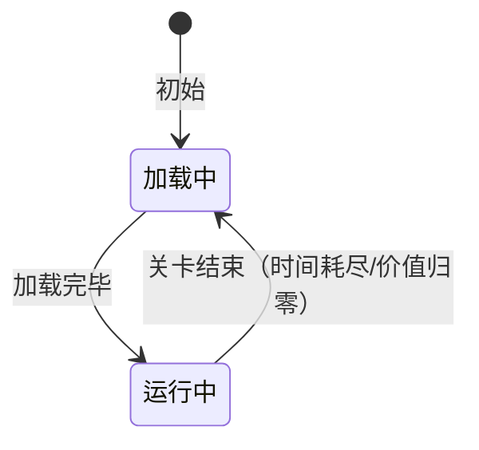

# [关卡名]策划

## 〇、新架构说明（必读）

> **关卡 JSON 与事件定义已分离**：
> - 关卡 JSON（`WaveData/`）只存 **`Timeline: FishTimelineEntry[]`**（`EventId` + `TriggerTime`），不内联事件
> - 事件定义统一存**条件事件库**（`ConditionEvent/`），按 **EventId(GUID)** 索引、跨关卡复用
> - 本文档的事件表为**策划可读层**：从事件库解析回填，另附 **EventId(GUID)↔行号 映射表** 供开发对照
> - 字段权威见开发文档 [关卡配置说明](关卡配置说明.md)

---

## 一、关卡参数

| 参数 | JSON Key | 类型 | 值 | 说明 |
|------|----------|------|-----|------|
| 编号 | `Id` | string | `"90xx"` | 唯一标识。**标准关 90xx，鱼潮/Award 关 95xx**（无独立 91xx/92xx 段） |
| 名称 | `Name` | string | `"[主题名]"` | 关卡显示名称 |
| 持续时间 | `Duration` | float | `300` | 秒，`0`=不限时 |
| 总价值 | `Volume` | int | (可选) | 关卡初始总价值（CloudWater 继承） |
| 价值阈值 | `VolumeForNext` | int | `>0` | 价值归零强制切关，`0`=不启用 |
| 指定下一关 | `NextLevelId` | string | `""` | 空=从关卡池随机选取；可指定（如鱼潮→`"9001"`） |
| 场景背景 | `SceneId` | string | `""` | 匹配 WaveScene 预制体 SceneId |
| 云周期 | `Profile` | object | (可选) | `{Type, Intensity, TargetRaindropsOverride}` |

### Profile 子字段

| 参数 | JSON Key | 类型 | 默认值 | 说明 |
|------|----------|------|--------|------|
| 节奏类型 | `Type` | int | `0` | `0`=Standard, `1`=Variation, `2`=FishTide |
| 程度 | `Intensity` | float | `1.0` | 0.1~3.0 |
| 抽水覆盖 | `TargetRaindropsOverride` | int | `-1` | `-1`=用全局默认，`≥0`=覆盖 |

---

## 二、场景层级

| 层级 | 内容 | 说明 |
|------|------|------|
| 上层 | 玩家界面 | 炮台、分数、状态栏 |
| 中层 | 游戏实体层 | 鱼群、道具 |
| 底层 | 背景层 | 图片/视频，随关卡切换 |

---

## 三、流程状态



---

## 四、生成时序（事件表）

> 每行 = 关卡 `Timeline` 中的一个条目，经事件库解析回填。**7 列覆盖常规字段，条件/停止/延迟/链触发等特殊情况在 `说明` 列中用标注语法表达**（见表 4.3）。
> 完整 JSON 字段定义见 [[条件事件库]]。

### 4.1 表头

```
| # | 事件ID | 触发(s) | 循环 | 间隔(s) | 目标ID | 数量 | 说明 |
```

### 4.2 列 ↔ 数据来源

| 列 | 来源 | 说明 |
|----|------|------|
| `#` | Timeline 下标+1 | 行号，GUID 映射表以此对应 |
| `事件ID` | 事件库 `Name` | 可读名；同名事件附短 GUID 尾消歧（如 `紫金葫芦 循环(B)`） |
| `触发(s)` | **Timeline.TriggerTime** | 首次触发时间（覆盖事件库内的占位值）。`1000`=等待链触发接管 |
| `循环` | 事件库 `Loop` | `1`=循环，`0`=单次 |
| `间隔(s)` | 事件库 `LoopInterval` | 循环间隔(秒) |
| `目标ID` | 事件库 `TriggerId` 解析 | 鱼ID(1001-4999) / 鱼群ID(5000-6999)，解析为中文名+Vol |
| `数量` | 事件库 `Count` | 生成数量。**`0`=哨兵**（不生成实体） |
| `说明` | — | 策划描述 + 特殊标注（见 4.3） |

### 4.3 说明列的标注语法

> `说明` 列中除策划描述文字外，可用标注表达特殊配置。**未标注的字段取默认值**。多个标注逗号分隔。

| 标注 | 设置 JSON 字段 | 示例 |
|------|---------------|------|
| `停=1` | `StopOnCondition=1`（条件满足后停止循环） | `停=1` |
| `FK("Xxx")` | `ListenEvents=[{eventName:"FishKilledEvent", compares:[{propertyPath:"FishName", op:2, compareValue:"Xxx"}]}]` | `FK("PangXie")` |
| `DC("path",op,val)` | `DataConditions=[{propertyPath:"path", op:N, compareValue:"val"}]` | `DC("SceneData.ElapsedTime",0,200)` |
| `or` | `isOr=true`（与/或组合，标注在 FK/DC 后） | `FK("Xxx"),or` |
| `延迟Ns` | `EventDelay=N` | `延迟60s` |
| `链→evName` | `TriggerEventIds=["evId"]`（解析为目标事件名） | `链→螃蟹 15秒` |
| `哨兵` | `Count=0`（不生成实体） | `哨兵` |
| `🎲` | 无（AwardFish 动态滚值） | `🎲` |

> ⚠️ `FK()` 中的鱼名必须用 **FishData.Name（PascalCase）**：`"PangXie"` ✅ / `"螃蟹"` ❌
> ⚠️ `DC()` 的 propertyPath 用 **IData 类型名.属性名**（如 `"SceneData.ElapsedTime"`），不带 `.Value` 后缀。op 取值：`0`=≥, `1`=>, `2`==, `3`=<, `4`=≤, `5`=≠。

### 4.4 EventId(GUID) ↔ 行号 映射表（每关必备）

> 供开发对照：`事件ID` 列的可读名 → 关卡 JSON Timeline 中实际引用的 GUID。

```
### [n].x EventId(GUID) ↔ 行号 映射
| 行号 | EventId (32hex) | 事件名 | 源文件 |
|---|-----------------|--------|--------|
| 1 | 33d04b69ec5df98a3ba35bbccccbc329 | 黄金龟 循环 | ConditionEvent/Stand/3xxx.json |
```

> 映射表为**生成快照**（标注生成日期），改事件库后需重新生成。

### 4.5 格式示例

| # | 事件ID | 触发(s) | 循环 | 间隔(s) | 目标ID | 数量 | 说明 |
|---|--------|---------|------|---------|--------|------|------|
| 1 | | 0 | 1 | 26 | `"3001"` 黄金龟(Vol=20) | 1 | |
| 2 | | 10 | 1 | 26 | `"3001"` 黄金龟(Vol=20) | 1 | |
| 3 | 螃蟹 15秒 | 15 | 1 | 15 | `"3013"` 螃蟹(Vol=54) | 1 | 停=1, FK("PangXie") |
| 4 | 螃蟹 60秒惩罚 | 0 | 1 | 15 | `"3013"` 螃蟹(Vol=54) | 0 | 哨兵, FK("PangXie"), 延迟60s, 链→螃蟹 15秒 |
| 5 | 紫金葫芦 循环 | 0 | 1 | 15 | `"3011"` 紫金葫芦(Vol=40) | 1 | 停=1, FK("ZiJinHuLu"),or, DC("SceneData.ElapsedTime",0,200),or |
| 6 | 美猴王 循环 | 700 | 1 | 60 | `"4012"` 美猴王(Vol=0,🎲) | 1 | 停=1, FK("MeiHouWang"),or, DC("SceneData.ElapsedTime",0,200),or |

### 4.6 关卡 JSON 与事件库 JSON 对照

关卡 JSON（`WaveData/Startand/[关卡名].json`，只存 Timeline）：

```json
[
  {
    "Id": "90xx", "Name": "[主题名]", "Duration": 300, "SceneId": "",
    "VolumeForNext": 0, "NextLevelId": "", "Profile": null,
    "Timeline": [
      { "EventId": "33d04b69ec5df98a3ba35bbccccbc329", "TriggerTime": 0 },
      { "EventId": "796f6256ddc900e011c23b0d281d8525", "TriggerTime": 15 }
    ]
  }
]
```

事件定义（`ConditionEvent/Stand/3xxx.json`、`Chain/螃蟹.json`，存于事件库）：

```json
[
  { "EventId": "33d04b69ec5df98a3ba35bbccccbc329", "Name": "黄金龟 循环",
    "TriggerTime": 0, "Loop": 1, "LoopInterval": 26, "StopOnCondition": 0,
    "DataConditions": [], "ListenEvents": [],
    "EventDelay": -1, "TriggerId": "3001", "Count": 1, "TriggerEventIds": [] }
]
```

> 事件库中 `TriggerTime` 仅占位，实际触发时间由关卡 Timeline 覆盖；`Name` 仅显示用，链/时序引用一律用 EventId(GUID)。

---

## 五、触发规则

| 规则 | 说明栏标注 | 行为 |
|------|-----------|------|
| 定时循环 | 仅描述文字 | 每间隔(s)秒生成数量条 |
| 单次定时 | `循环=0` | 触发(s)时执行一次 |
| 条件停止 | `停=1, FK("Xxx")` | 按时循环直到条件满足 |
| 条件门控 | `哨兵, FK("Xxx"), 链→target` | 等条件→链触发目标 |
| 延迟惩罚 | `哨兵, FK("Xxx"), 延迟Ns, 链→target` | 等条件→延迟N秒→链触发 |
| 链式触发 | `链→evName` | 执行后将目标事件重新入队 |
| 与/或组合 | `FK("Xxx"),or` / `DC(...),or` | isOr=true 时任一条件满足即触发 |

---

## 六、实体群配置（如适用）

| 群编号 | 名称 | 类型 | 成员实体 | 数量 | 阵形 | 击杀模式 |
|--------|------|------|---------|------|------|---------|
| [编号] | [名称] | 群游/阵型/固定阵 | [实体ID] | [数量] | [阵形] | 独立/群杀 |

> 类型对应数据子类：`SchoolFishData`（群游）/ `FormationFishData`（阵型）/ `FixedFormationFishData`（固定阵）。

---

## 七、背景层配置

| 状态 | 内容 | 资源 | 触发条件 |
|------|------|------|---------|
| 常态 | 图片 | [背景图名] | 默认显示 |
| 进场 | 动画/视频 | [进场资源] | 关卡切换进入 |
| 退场 | 动画/视频 | [退场资源] | 关卡切换退出 |
