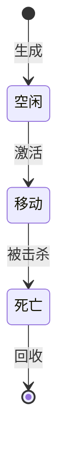

# [实体名]策划

> 实体域（`实体/[实体类]/`）文档同构约定：**基础实体**（`[实体名].md`，本模板）+ **派生实体**（如 `奖励鱼.md`，只写派生差异）+ **清单**（`[实体名]清单.md`，全实体清单，可引用多维表格数据如 `鱼种.duowei`）。

## 一、实体类型

- **实体类型**：普通实体 / 角色实体 / 特效实体 / 奖励实体
- **实体标识**：`"[名称]"`（Actor 名称）
- **说明**：[实体在游戏中的作用]

## 二、属性

> 数值字段以对应多维表格 / 运行时 JSON 为唯一事实源，模板仅列策划口径。

| 属性 | 类型 | 默认值 | 范围 | 说明 |
|------|------|--------|------|------|
| 编号(Id) | 文本 | "" | — | 唯一标识 |
| 速度(Speed) | 小数 | 3 | 1-10 | 移动速度 |
| 血量(HP) | 整数 | 1 | ≥1 | 击杀所需命中数（血量制，见 [[../玩法系统/伤害系统/数值框架]]） |
| 彩票值(Volume) | 整数 | 1 | ≥0 | 击杀后固定获得的彩票值（血量制语义） |
| [自定义属性] | [类型] | [默认] | [范围] | [说明] |

## 三、状态机



每个状态标注对应的框架状态名称。

## 四、行为/移动策略

| 策略 | 参数 | 说明 |
|------|------|------|
| [策略名] | [关键参数及含义] | [策略行为描述] |

策略选择规则：[默认策略 / 随机策略 / 按条件切换]

## 五、交互规则

| 交互 | 触发条件 | 效果 |
|------|---------|------|
| [交互名] | [触发方式] | [产生效果] |

## 六、数据格式

```json
{
    "编号": "1001",
    "名称": "[实体名]",
    "价值": 4,
    "速度": 3,
    "路径点数量": 20
}
```

## 七、特效关联

| 时机 | 特效 | 参数 | 说明 |
|------|------|------|------|
| 被击杀 | [特效名] | [参数] | [说明] |
| 生成 | [特效名] | [参数] | [说明] |
