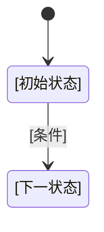

# [项目名称]策划

## 一、游戏定位

[一句话描述游戏是什么，核心玩法循环]

## 二、体系文档清单

| 域 | 职责 | 策划文档 | 状态 |
|---------|------|---------|------|
| [设备输入输出系统 / 流程与视觉 / 鱼关卡 / 实体 / 玩法系统] | [一句话职责] | [[对应域/系统策划文档]] | 策划中 |

## 三、流程总览

每个状态下标注对应的框架流程节点名称（玩家流程见 `流程与视觉/流程/玩家流程/`，场景流程见 `流程与视觉/流程/场景流程`）。

## 四、实体清单

| 实体类别 | 实体类型 | 策划文档 | 说明 |
|---------|---------|---------|------|
| [类别] | 基础实体/派生实体 | [[实体/[类别]/[实体名]]] | [简要说明] |

## 五、关卡清单

| 关卡 | 编号 | 策划文档 | 说明 |
|------|------|---------|------|
| [关卡名] | [编号] | [[鱼关卡/[类型关卡]/[关卡名]]] | [简要说明] |

## 六、数据源清单（GameData 三表协作约定）

| 数据源 | 格式 | 说明 |
|--------|------|------|
| `GameData/游戏数据.duowei` | 多维表格 | DataModule 全局数据 |
| `GameData/游戏事件.duowei` | 多维表格 | 可用事件清单 |
| `GameData/[实体名].duowei`（如 `鱼种.duowei`） | 多维表格 | [实体名]Actor 数据——策划写名称与需求，主程对应代码模型设计 |
