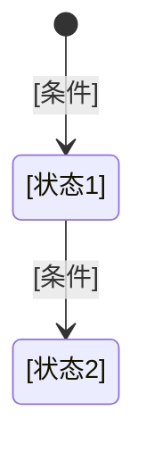

# [模块名]模块策划

## 一、模块职责

- **模块名称**：[模块名称]
- **一句话描述**：[模块负责什么功能]

## 二、内部系统

| 系统 | 职责 | 状态 |
|------|------|------|
| [系统名] | [职责描述] | 已实现 / 策划中 |

## 三、管理的数据

| 数据名称 | 来源 | 说明 |
|---------|------|------|
| [数据名] | JSON配置 / 运行时 / 配置表 | [说明] |

## 四、提供的能力

| 能力 | 输入 | 输出 | 调用方 | 说明 |
|------|------|------|--------|------|
| [能力名] | [参数描述] | [返回值描述] | [谁在什么场景调用] | [说明] |

## 五、事件

| 事件 | 发送时机 | 监听方 | 用途 |
|------|---------|--------|------|
| [事件名] | [什么时候触发] | [谁需要知道] | [做什么] |

## 六、配置项

| 参数 | 类型 | 默认值 | 范围 | 说明 |
|------|------|--------|------|------|
| [参数名] | 整数/小数/文本 | [默认值] | [最小-最大] | [说明] |

## 七、关联操作

| 操作 | 触发场景 | 效果 |
|------|---------|------|
| [操作名] | [什么情况下执行] | [产生什么结果] |

## 八、状态机（如有）

每个状态标注对应的框架流程节点名称。
