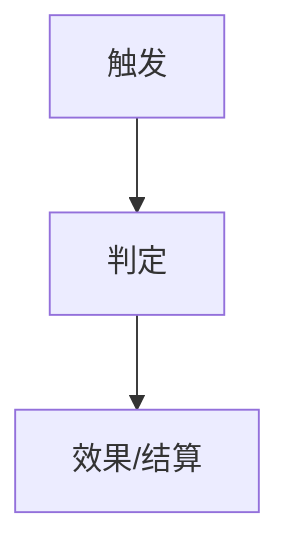

# [系统名]策划

> 玩法系统域（`玩法系统/[系统名]/`）文档模板。**被动玩法**系统（规则自动生效，如伤害/奖励/经济）；含主动交互面的系统（如附魔）须分**主动玩法 / 被动玩法**两面组织——主动 = 玩家利用输入信号使用/触发系统的交互与数据；被动 = 系统对实体/结算产生的效果与数值。

## 一、系统定位

- **所属模块**：[模块名] → [一句话职责]
- **主动/被动属性**：[被动玩法 / 主动+被动两面]
- **政策定位**：[对照政策红线（无概率/无倍率/无回流/技巧决定）的边界声明]

## 二、核心规则

| 规则 | 内容 |
|------|------|
| [规则名] | [需求语义] |

## 三、主动玩法（如有输入信号交互）

| 操作 | 输入信号 | 规则 | 详细文档 |
|------|---------|------|---------|
| [操作名] | [设备/按键] | [交互规则] | [流程/实体文档] |

## 四、被动玩法（效果与数值）

| 效果 | 触发条件 | 数值 | 说明 |
|------|---------|------|------|
| [效果名] | [如子弹碰撞鱼] | [固定值/待数值] | [语义] |

## 五、流程/状态机

## 六、操作/事件表

| 操作 | 触发条件 | 影响的数据 | 发出的事件 |
|------|---------|-----------|-----------|
| [操作名] | [条件] | [数据变化] | [事件名] |

## 七、参数面（数值建模入口）

| # | 参数 | 类型 | 建议范围 | 约束说明 |
|:-:|------|------|---------|---------|
| 1 | [参数名] | 整数/小数 | [范围] | [约束] |

## 八、政策合规自查

| # | 政策红线 | 本系统对照 | 结论 |
|:-:|---------|-----------|:--:|
| 1 | 无概率决定结果 | [对照] | ✅ |

## 九、关联文档

- [[相关流程/实体/关卡/数值文档]]
