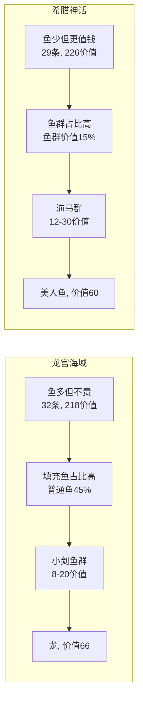

# 关卡对比分析

> [变更] v1.3 9111 金色龙宫海域已裁定删除（2026-08-18 负责人确认）。
> [变更] v1.2 鱼 ID 对齐 JSON 权威：电鳗 2004→1009（详见 [[玩法系统/伤害系统/数值框架]]）。

> [[龙宫海域]] vs [[希腊神话]]，逐维度对比两关的设计差异与平衡数据。另附 9003-9010 系列与 9101 鱼潮的差异说明。

---

## 一、事件差异一览

### 1.1 普通鱼

| 鱼种 | 龙宫(9001) | 希腊(9002) | 差异 |
|------|:---:|:---:|:--:|
| 小剑鱼(1001) | 3条/16s | — | ❌ 移除 |
| 海马(1004) | — | 3条/9s | 🆕 新增，密度支柱 |
| 凤尾鱼(1002) | 5条/16s | 4条/16s | ↓ |
| 蝴蝶鱼(1003) | 3条/16s | 2条/16s | ↓ |
| 尖嘴鱼(1005) | 4条/16s | 3条/16s | ↓ |
| 神仙鱼(1006) | 3条/16s | 2条/16s | ↓ |
| 刺豚(1010) | 4条/16s | 2条/16s | ↓ |

> 希腊整体缩减普通鱼数量（15 条/轮 vs 龙宫 22 条/轮），用海马替代小剑鱼呼应主题。

### 1.2 特效鱼

| 鱼种 | 龙宫(9001) | 希腊(9002) | 差异 |
|------|:---:|:---:|:--:|
| 虾(2005) | 2条/20s | 2条/20s | — |
| 狂战先锋(2009) | 2条/20s | 2条/20s | — |
| 电鳗(1009) | 3条/16s | 2条/16s | ↓ |
| 食人鱼(2007) | 1条/25s | 2条/25s | **↑ 翻倍** |

> 食人鱼产出加倍是关键变化——从 1 条在场变 2 条，价值贡献 +15。

### 1.3 奖励鱼

完全相同：黄金龟、金蟾、金墨鱼、金鲨鱼、聚宝盆。保证跨关卡奖励体验一致。

### 1.4 Boss & 鱼群

| 类别 | 龙宫(9001) | 希腊(9002) |
|------|:---:|:---:|
| 常驻 Boss | 龙(4009), 价值66 | 美人鱼(4010), 价值60 |
| 鱼群主题 | 小剑鱼系列(价值8-20) | 海马系列(价值12-30) |
| 条件事件 | 螃蟹链 + 葫芦↔猴王链 | 完全相同 |

---

## 二、密度对比

> 存活时间公式：**存活(s) ≈ 路径点数 × 5 ÷ 速度**（近似估算，权威公式见 [[实体/鱼/鱼#四、移动方式（策划语义）|游鱼系统 §四]]）。

### 2.1 逐类在场数据

| 类别 | 龙宫在场数 | 希腊在场数 | 龙宫在场价值 | 希腊在场价值 |
|------|:---:|:---:|:---:|:---:|
| 普通鱼 | 14.5 | 11.5 | 56.5 | 41.5 |
| 特效鱼 | 6.3 | 6.8 | 82.5 | 93.3 |
| 奖励鱼 | 1.7 | 1.7 | 37.2 | 37.2 |
| Boss | 0.3 | 0.3 | 17.6 | 20.0 |
| 原有鱼群 | 8.8 | 8.3 | 24.3 | 34.4 |
| 🆕 新阵群 | **31.7** | **31.7** | **179.6** | **99.0** |
| **合计** | **~64** | **~61** | **~398** | **~325** |

### 2.2 效率指标

| 维度 | 龙宫海域 | 希腊神话 | 解读 |
|------|:---:|:---:|------|
| 场上鱼数 | 64 条 | 61 条 | 龙宫略密，均达50+目标 |
| 场上价值 | 398 | 325 | 龙宫价值高出22% |
| 每条平均价值 | 6.2 | 5.3 | 龙宫单鱼价值更高 |
| 新阵群占比(条) | 50% | 52% | 新阵群贡献过半密度 |
| 新阵群价值占比 | 45% | 30% | 龙宫刺豚阵拉高价值 |

---

## 三、价值流对比（每分钟）

| 类别 | 龙宫/min | 希腊/min | 差异 |
|------|:------:|:------:|:--:|
| 普通鱼 | 300 | 236 | -21% |
| 特效鱼 | 294 | 300 | +2% |
| 奖励鱼 | 157 | 157 | — |
| Boss | 53 | 48 | -9% |
| 原有鱼群 | 286 | 332 | +16% |
| 🆕 新阵群 | **926** | **847** | **龙宫+79** |
| **总计** | **~2016** | **~1920** | -5% |

> 新阵群使总产出翻倍。龙宫因刺豚阵群价值高(+79/min)。

---

## 四、设计模式总结

| 设计策略  | 龙宫海域      | 希腊神话        |
| ----- | --------- | ----------- |
| 核心思路  | **以量取胜**  | **少而精**     |
| 视觉密度  | 高（32条）    | 中（29条）      |
| 玩家关注点 | 瞄准零散个体鱼   | 追踪高价值鱼群     |
| 特色鱼   | 龙（全场最高66） | 美人鱼 + 食人鱼翻倍 |
| 难度    | 基础        | 略高（鱼群价值更高）  |

---

## 五、全关卡差异速查

| 关卡           | Duration | Boss      | 与 9002 模板的差异                          |
| ------------ | :------: | --------- | ------------------------------------- |
| 9001 龙宫海域    |   600s   | 龙(4009)   | 鱼群用 小剑鱼系列（5993-6018）                  |
| 9002 希腊神话    |   600s   | 美人鱼(4010) | **基准模板**（海马系列）                        |
| 9003 宝藏海域    |   600s   | 海盗(4008)  | 基准模板（**Duration 已修正为 600s**）            |
| 9004 水下遗址    |   600s   | 鳄鱼(4006)  | 标准模板（含 ElapsedTime 条件）                |
| 9005 恐龙遗址    |   600s   | 天王(4005)  | 仅 Boss 不同                             |
| 9006 幽海草地    |   600s   | 凤凰(4014)  | 仅 Boss 不同                             |
| 9007 朽木深渊    |   600s   | 凤凰(4014)  | 仅 Boss 不同（同9006）                      |
| 9008 海底宝藏    |   600s   | 海盗(4008)  | 仅 Boss 不同                             |
| 9009 珊瑚浅海    |   600s   | 美人鱼(4010) | 仅 Boss 不同                             |
| 9010 水下遗址-景海 |   600s   | 鳄鱼(4006)  | 仅 Boss 不同                             |
| 9101 龙宫鱼潮    |   73s    | —         | 完全独立（17事件/6401-6414/Profile FishTide/NextLevelId=9001） |

> 9111 金色龙宫海域已裁定删除（2026-08-18，见 [[玩法系统/伤害系统/数值框架]] §五）。

## 六、关联文档

- [[龙宫海域]] — 龙宫海域完整配置
- [[希腊神话]] — 希腊神话完整配置
- [[实体/鱼/鱼清单]] — 鱼种属性一览（含存活时间）
- [[实体/鱼/鱼清单]] — 全部鱼族索引
