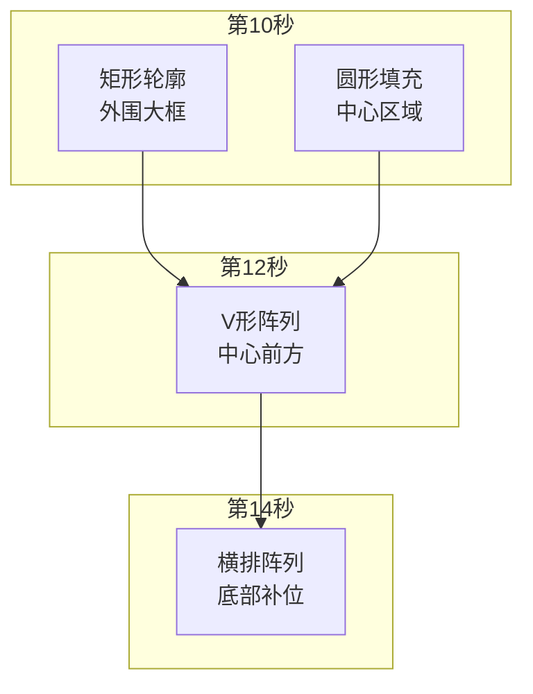
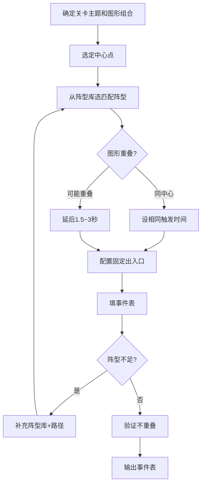

# 鱼潮关卡设计规范

> [变更] v2.20 §3.1 豁免清单扩容至 **618 对基线全命中**（Luban 退役 Step 1 体检，2026-08-22）：92xx 十关合并新增 82 对——A 类同构豁免 +68（螺旋6圈/X形/椭圆环类）、B 类维持 +12（B5-B8，d≥0.99）、B9 负责人裁定·重复点保留 +2（9206-1-蝴蝶鱼 d=0，负责人定夺维持现状，2026-08-22 登记后不再 WARN）；三文件同步（维护源/Output 豁免 31 阵型 596 对/B类明细 22 对），模拟 validate 618/618 全命中。

> [变更] v2.19 新增**§2.4 体型口径与占位规则**（负责人 2026-08-22 口径澄清：小/中/大型=价值分类；小鱼 1×1 / 中型 2×2 / 金灯笼 2×2 / 金鲨 4×2；中-小 ≥1.7、中-中 ≥2.4、金鲨矩形禁区；保护结构模板 A/B/C/D，金色居中被保护，禁止为放而放）——9205-9210 点集按此重做。

> [变更] v2.18 §3.1 间距清单**口径修正**（2026-08-22）：全量重扫闭合 536 对 = A 豁免 526 + B 维持 10（原 519/17 为分类加总笔误，已修正；B 类工程师2 复核确认维持）。

> [变更] v2.17 §3.1 新增**间距校验豁免清单**（Luban 536 对分类裁定，2026-08-22）。

> [变更] v2.16 §2.3 导出目录**按 stage 自动定位**（9202 误存 9201 目录教训，2026-08-22）：首次选 Unity `FormationData/鱼潮/` 根目录并记忆，导出时按点集 stage 自动进入/创建 `920N/` 子目录——杜绝跨关误存。

> [变更] v2.15 §2.3 固化 **阵型 Name 必须含 `_`**（9201 运行时「FishGroup 未注册」根因：无 `_` 被注册过滤；规则 `920N-M-鱼种_左→右`，编辑器已默认加后缀，2026-08-21）。

> [变更] v2.14 §2.3 点集文件按关卡归集：`关卡资产/920N/`（json+svg 同目录，保存即同步 SVG），编辑器同步按钮与文档引用随改（2026-08-21）。

> [变更] v2.13 §2.3 嵌入插件改为 **Custom Frames**（负责人已装，2026-08-20）。

> [变更] v2.12 §2.3 补充 **Obsidian 嵌入方案①**（HTML Reader 整页打开；保存闭环不变），工具作者确认（2026-08-20）。

> [变更] v2.11 新增 **§2.3 点集流程约定**（P1，工作流优化交付）：点集 JSON 为唯一事实源、参数化生成、编辑器微调闭环、工具路径与格式。

> [变更] v2.10 系列文档归档（91型/92型/93型 子目录），引用同步（2026-08-18）。`n> [变更] v2.9 ①9111 金色龙宫海域废弃（RTP 验算 §3.4 负责人裁定删除），ID 占用与关联文档清理；②9 关供给对标补齐方案产出（鱼潮9关供给补齐方案（已撤销），总价值 1500+，复用刺豚系阵型）。
> [变更] v2.8 规范-实现对账（9102-9110 实测落地后）：①§8.1 穿越时间按速度 2.5 重估；②§8.2 横排 ≤22/屏 + 双横排 44；③§8.3 阵间节奏改为实测节奏（间隔 5~13s、总时长 45~60s，实测为准）；④阶段鱼量补「对冲双排拆分豁免」（按双排合计 44 计）；⑤排队波次（§4.2/§五/排队稳定/验证清单）标注暂缓至 93xx；⑥关卡 ID 占用更新（9102-9110 已实现）。
> [变更] v2.7 负责人实测豁免（点位不重叠规则例外登记）：①9102 6423 双螺旋阵两臂 180° 相对，内圈跨臂最小间距 0.80；②9103 6445 星形 y 翻转变体，最小间距 0.77——两处经负责人实测接受，不再返工；图鉴按实现几何回写。
> [变更] v2.6 横排容量再修正（负责人实测裁定）：横排 ≤30 → **≤22 条/屏**；双横排 = 两排各 22 共 **44 条**。
> [变更] v2.5 按负责人裁定回写：①速度统一 3→**2.5**（实测）；②波次间隔规则改为「策划初版 ≥15s，**负责人实测为准**，实测值回写文档」；③新增 **PathId 共用**规则（同 T 同路径强制共用同一 PathId，双向对冲反向路径等例外）。
> [变更] v2.4 新增**阶段鱼量**硬规则：91 类鱼潮每个阶段的大阵型总鱼量 ≥30 条（同阶段复合阵型按合计计）。
> [变更] v2.3 新增两条硬规则：**点位不重叠**（未经策划特殊说明，阵型内鱼位不得重叠，相邻鱼位间距 ≥ 鱼体长度）与**屏幕容量**（满屏横排 ≤30 条、竖排 ≤15 条；鱼为扁平体、面朝行进方向）。
> [变更] v2.2 与总纲 v2.4 对齐：事件规则区分阵型/排队波次；补云周期与结束切关；实操经验子节编号修正。

> [变更] v2.1 新增**排队波次**类型（§五）：鱼沿固定图形路径排队行进，与阵型波次并列。

> [变更] v2.0 重构为**纯策划规范**：只定义鱼潮关卡的设计约束（图形编排/阵型选用/节奏），不含实现细节（数据字段/配置格式见设计文档 [[关卡配置说明]]）。

> 鱼潮关卡与标准关卡的核心区别：**全部使用固定出入口的鱼群波次**，按触发时间编排成复合图形，单次生成不循环，总时长 30 秒~1 分钟。波次形态：**阵型波次**（整组同时生成，面状图形）；**排队波次**（逐条入场沿图形路径行进，线状流动）**暂缓至 93xx**（91xx 已全阵型化）。
> **速度规范**：鱼潮内所有阵型波次与排队波次的速度**统一为 2.5**（世界单位/秒，负责人实测裁定）。

### 关卡 ID 规则

- 鱼潮关 ID = 所属标准关 ID **百位 +1**（如 9001→9101、9002→9102…9010→9110）
- 百位 1~9 可用（91xx~99xx），**每个场景/标准关最多 9 种变体关卡**
- 当前占用：9001→9101、9102-9110（均已实现，见 [[鱼潮关卡设计]]）；9111 金色龙宫海域已废弃（2026-08-18）

---

## 一、核心规则

| 规则 | 说明 |
|------|------|
| **固定出入口** | 所有波次经预设路径进出，不随机生成路径 |
| **指定阵型** | 阵型波次使用具体阵型（精确编排），不用组头随机 |
| **时间编排** | 同一视觉中心的多个波次使用相同触发时间 |
| **不重叠** | 不同图形错开时间，保证视觉清晰 |
| **点位不重叠** | 未经策划特殊说明，阵型内鱼位坐标不得重叠；相邻鱼位间距 ≥ 鱼体长度（横 ≈1.0、竖 ≈1.13）；**负责人实测可豁免**（豁免登记于文档变更记录） |
| **屏幕容量** | 满屏上限：横排 ≤22 条/屏、竖排 ≤15 条/屏；双横排 = 两排各 22 共 44（鱼为扁平体、面朝行进方向，实测裁定） |
| **阶段鱼量** | 91 类鱼潮每个阶段的大阵型总鱼量 ≥30 条（同阶段复合阵型按合计计）；**错时拆分的对冲双排按双排合计 44 计**（豁免单波不足 30） |
| **波次间隔** | 策划初版相邻波次 ≥15s；**负责人实测为准**，实测值回写文档 |
| **PathId 共用** | 同 T 且路径相同的阵型必须共用同一 PathId；双向对冲（反向路径）等实测需要除外 |
| **不循环** | 每个事件按时间触发一次即结束 |
| **仅用已定义阵型** | 引用的阵型必须已在阵型库中配置 |
| **排队稳定** | （暂缓，93xx 队列类启用）排队波次内同种鱼复用同一路径同一速度，队形一致（见 §五） |
| **云周期** | 放水节奏（高回报 ≈97%），强度 2.0、目标回报点数 3 |
| **结束切关** | 候选池**必含所属标准关**（见 [[鱼关卡/关卡设计总纲#22-切换规则|总纲 §2.2]]），候选池内随机 |

---

## 二、图形编排规则

1. **同中心点**：共享同一视觉中心的阵型 → 相同触发时间（视觉上"圆在矩形中心"等复合效果）
2. **不同图形错开**：中心相同但形状可能重叠时，后一个延后 **1.5~3 秒**
3. **嵌套**：外层图形先触发，内层同时间或略延后



### 2.3 点集流程约定（P1，2026-08-18）

> 解决痛点：图形微调耗 token / SVG→JSON 落地偏差。工具已交付：[[阵型图鉴]] 与 `tools/阵型点集编辑器.html`（对话内「阵型点集编辑器」亦可直接使用）。

1. **点集 JSON 为唯一事实源**：阵型点集以 JSON 为准——格式 `{name, stage, groups:[{fishId, name, color, points:[[x,y]...]}]}`（坐标=游戏单位、中心原点、**y 向上**）；SVG 仅作 Obsidian 展示图（由工具导出），**不再手写/手改 SVG**
2. **策划生成走参数化**：描述阵型用参数（半径/层数/间距/角度/行数/点数等），AI 按几何公式计算点位，**不逐点编造**
3. **微调闭环**：负责人微调意见 → 阵型点集编辑器拖拽/参数微调 → 导出点集 JSON（+SVG）→ AI 仅落盘；**禁止 AI 全量重绘已有阵型 SVG**
4. **工具与格式**：编辑器路径 `tools/阵型点集编辑器.html`；点集 JSON 即上格式，落地 WaveFormationData 时按 `(x, y)` 游戏坐标直接转换（y 向上，无翻转）；SVG 导出保持现有文件名兼容（`91xx_阶段N_*.svg`）
5. **阵型 Name 必须含 `_`（v2.15 固化，9201 运行时踩坑）**：FishSpawnSystem 注册阵型原型时**过滤不含 `_` 的 Name**（设计上区分"组头配置"）。92xx 阵型 Name 一律 `920N-M-鱼种_左→右`（连字符关-波 + 下划线方向后缀，如 `9201-1-小剑鱼_左→右`）；编辑器已默认追加 `_左→右` 后缀；**禁止导出无后缀 Name**，否则事件触发报「未注册，分组也无匹配」
6. **Obsidian 嵌入（负责人 2026-08-20 定案，v2.14 路径更新）**：文档侧查看/轻调用 **Custom Frames 插件整页打开** `tools/阵型点集编辑器.html`（负责人已装 Custom Frames；HTML Reader 亦可）；**保存闭环**——编辑器内点集文件按关卡归集于 `关卡资产/920N/`（json+svg 同目录），保存 JSON 自动同步 SVG 到同目录，文档图引用 `![[关卡资产/920N/xxx.svg]]` 自动更新；日常微调主用**对话内卡片**（同格式同逻辑，磁盘事实源唯一）
```

### 2.4 体型口径与占位规则（92xx 重策划，2026-08-22 负责人口径，v2.19）

> **小/中/大型指价值分类，体型按下表占位**（负责人 2026-08-22 澄清：以小鱼点位为 1 单位基准）。中型/金色鱼不得「为放而放」：必须有编队语义（护卫/前锲/两翼等），金色奖励鱼居阵型几何中心**被小鱼/中型保护**。

| 分类 | 鱼种 | 价值 | 体型（单位） | 占位半径 |
|------|------|-----|------------|---------|
| 小鱼 1xxx | 小剑鱼/凤尾鱼/蝴蝶鱼/海马/小丑鱼/神仙鱼/刺豚 | 2~7 | 1×1 | 0.5 |
| 中型鱼 2xxx | 虾 2005 / 食人鱼 2007 / 狂战先锋 2009 | 12~16 | **2×2（4 单位）** | 1.0 |
| 金灯笼鱼 3006 | — | 36 | **2×2（同中型）** | 1.0 |
| 金鲨鱼 3004 | — | 60 | **4×2（8 单位横条）** | 横 2.0 / 纵 1.0 |

**占位间距规则**（点集生成/校验口径，矩形不重叠下限 + 视觉间隙）：

| 关系 | 下限 | 设计基准 |
|------|-----|---------|
| 小-小 | ≥1.0（既有） | ≥1.0 |
| 中-小 / 金灯笼-小 | ≥1.5（0.5+1.0 贴边） | **≥1.7**（留 0.2 间隙） |
| 中-中 / 中-金灯笼 | ≥2.0（1.0+1.0 贴边） | **≥2.4** |
| 金鲨-小 | \|dx\|≥2.5 或 \|dy\|≥1.5（矩形禁区±2.5/±1.5） | 同左（椭圆护卫环取 3.6/2.4 参数） |
| 金鲨-中 | \|dx\|≥3.0 或 \|dy\|≥2.0 | 同左 |

**保护结构模板**（92xx 每阶段中型/金色布置，差异化轮换）：

- **A 核心内卫环**：金色 @ 几何中心；中型卫环 4~6 只环绕（半径 2.6~2.8）；可配前锲
- **B 前锲+两翼**：中型前锲 3 只（运动方向前端楔形）+ 两翼/头尾卫 2 只；金色居中
- **C 双列护航**：中型双列纵队 4 只（中线两侧）+ 外哨 2 只；金色在列间中心
- **D 金鲨核心**：金鲨 @ 中心（4×2）；**贴身护卫环**（小鱼 8 只，椭圆 3.6/2.4）；中型上下卫 4 + 左右卫 2

> 校验：点集生成后全对间距校验（按本表体型规则），违规点剔除或重排；中型/金色落位后，落入其禁区的小鱼点必须剔除。9205-9210 按 v2.19 重做（9203/9204 同批问题待负责人确认后整改）。

---

## 三、阵型选用约束

- 阵型来源：鱼群配置中的**阵型群**，必须用**具体阵型**（如 `小剑鱼阵_横排`），不能用组头
- 阵型不足时：在**鱼潮阵型库**中补充所需阵型（鱼种 + 形状 + 尺寸），并为其配置固定出入口路径，再在事件表中引用新阵型
- 路径：全部固定出入口，不随机

### 3.1 间距校验豁免清单（Luban validate，v2.17 修正 → v2.20 扩容 618 对）

> Luban 间距检查（<1.0 WARN 不阻塞）全库 **618 对**（92xx 十关合并后基线，FormationData 全量扫描）。分类裁定：**A 类豁免 594 对**（91xx 526 + 92xx 同构新增 68）+ **B 类维持 24 对**（B1-B4 原 10 + B5-B8 阈值边界 12 + B9 负责人裁定·重复点保留 2）= **618 全命中**。原 91xx 基线：536 对 = A 526 + B 10。

**A. 豁免（固有几何 / 既有先例，594 对 = 91xx 526 + 92xx 同构 68）**

| 图形类别 | 涉及文件 | 对数 | 豁免理由 |
| ------- | ------- | :-: | ------- |
| 椭圆密集点阵 | 形状库 椭圆_62/50/37/27/20 条 | 199 | 椭圆饱满度需要，短轴方向点距小（min 0.57），91xx 形状库既有 |
| 螺旋 6 圈 | 9105/9106/9108/9110 螺旋阵_6圈 | 144 | 螺旋相邻圈间距 <1.0 为螺旋特性（min 0.9） |
| 椭圆环/椭圆填充 | 9107 椭圆三环(24)/椭圆填充(17)、9105 外圈椭圆环(8) | 49 | 椭圆环相邻环间距（min 0.8），91xx 已验收 |
| 星形 | 9102/9103 星形 | 30 | 星形内点交叉（min 0.88），既有图形 |
| 双螺旋/4臂螺旋 | 9102 双螺旋(12)/4臂螺旋(12) | 24 | 螺旋臂交叉点（min 0.79），既有图形 |
| 双龙弧 | 9102 上双层弧/下双层弧 | 24 | 双层弧复合交叉（min 0.75），既有图形 |
| X 形 | 9105/9110 X形_16 | 24 | X 形交叉点（min 0.85），既有图形 |
| 双正弦/弧形括号 | 9107 双正弦(8)、9109 弧形括号(8) | 16 | 波形交叉点，既有图形 |
| 同心圆环宝珠 | 9201-4 神仙鱼（d=0.93） | 8 | 与 91xx 宝珠（6429）同构：相邻环对角点，先例豁免 |
| 实心圆宝珠 | 9102 宝珠_35 | 8 | d=1.0 阈值边界，91xx 既有 |
| **92xx 螺旋6圈** | 9205-2 小丑鱼(19)/9206-2 海马(10)/9210-2 小丑鱼(13) | 42 | 同「螺旋 6 圈」固有几何（min 0.9），2026-08-22 复算 |
| **92xx X形** | 9205-1 凤尾鱼(12) | 12 | 同「X 形」交叉点（min 0.849），2026-08-22 复算 |
| **92xx 椭圆环类** | 9206-3 凤尾鱼(2)/9207-4 蝴蝶鱼(12) | 14 | 同「椭圆环/椭圆三环」相邻环（min 0.796），2026-08-22 复算 |

**B. 维持（阈值边界/网格对角，22 对 = B1-B4 原 10 + B5-B8 新增 12）—— 工程师2 口径 d≥0.96 视觉无差**

| 阵型 | 对数 | 间距 | 说明 |
| ---- | :-: | :-: | ---- |
| 9202-1 小剑鱼 | 4 | d=1.0 | 光芒 8 臂对角端点，阈值边界浮点 |
| 9202-3 小剑鱼 | 4 | 0.96~0.98 | 矩形环相邻列对角点，网格步长 1.0 的对角 |
| 9202-3 神仙鱼 | 1 | 0.97 | 中心填充相邻点 |
| 9202-4 小剑鱼 | 1 | 0.99 | 上三排相邻列对角 |
| 9203-1 小剑鱼（B5） | 4 | d=1.0 | 光芒 8 臂对角端点，同 B1 先例 |
| 9203-3 小剑鱼（B6） | 2 | 0.99 | 三环矩形环相邻列对角，同 B2 先例 |
| 9203-3 神仙鱼（B7） | 2 | d=1.0 | 中心填充相邻点，同 B3 先例 |
| 9208-1 蝴蝶鱼（B8） | 4 | d=1.0 | 光芒 8 臂对角端点，同 B1 先例 |
| 9206-1 蝴蝶鱼（B9） | 2 | **d=0** | **负责人裁定·重复点保留**（[0]=[9]/[4]=[5]，2026-08-22 定夺维持现状；Output 豁免清单同步登记，不再 WARN） |

> B 类结论（工程师2 2026-08-22）：实测 10 对全部 d≥0.96，浮点边界/视觉无差；微调需重导出且负责人红线不改点位 → **维持零改动**。B5-B8（92xx 新增 12 对，2026-08-22）d≥0.99 同口径维持。

**C. 结论（v2.20 基线 618 对全闭合）**：92xx 十关合并后全库 <1.0 共 **618 对** = **A 类豁免 594**（91xx 526 + 92xx 同构新增 68：螺旋6圈×42〔9205/9206/9210 螺旋圆〕、X形×12〔9205 方框X圆〕、椭圆环类×14〔9206 外围双环/9207 椭圆三环〕）+ **B 类维持 24**（B1-B4 原 10 + B5-B8 阈值边界 12 + **B9 负责人裁定·重复点保留 2**：9206-1-蝴蝶鱼 [0]=[9]、[4]=[5] d=0，2026-08-22 负责人定夺维持现状不改点位，已登记 Output 豁免清单不再 WARN）。**618 对全命中**（模拟 validate 终验 618/618）。后续新增阵型若产生 <1.0 对，需对照本清单同类图形确认或新增豁免条目。

---

## 四、事件规则

> 波次按形态区分事件配置；可用事件目录见 [[鱼关卡/通用件/事件表]]（含 6401-6414 鱼潮阵型）。

### 4.1 阵型波次事件

| 字段 | 取值 | 说明 |
|------|------|------|
| 目标 | 具体阵型（非组头） | 阵型库中的阵型 |
| 触发时间 | 按图形编排设定的秒数 | 同中心点用相同时间 |
| 单次数量 | 1 | 每次一组 |
| 循环 | 否 | 不循环 |
| 事件标识 | 有意义的名称 | 便于维护，如 `w1_矩形轮廓` |

> **同阵型可复用**：同一阵型可在不同触发时间重复使用（如横排阵 T=14/15/16 连续 3 排），减少阵型库条目。

### 4.2 排队波次事件（⏸ 暂缓，93xx 队列类启用；91xx 不适用）

| 字段 | 取值 | 说明 |
|------|------|------|
| 目标 | 排队鱼配置（如 `小剑鱼_Path`） | 排队波次专用配置 |
| 触发时间 | 按图形编排设定的秒数 | 队列入场起始 |
| 单次数量 | 3~8 条 | 队列长度 |
| 循环 | 否 | 队列入场完毕后结束 |
| 事件标识 | 有意义的名称 | 便于维护，如 `w5_螺旋鱼浪` |

---

## 五、排队波次（沿固定图形排队行进）

> ⏸ **本节暂缓**：91xx 已全阵型化（无排队波次），本节规范在 **93xx 队列类**启用（负责人规划）；内容保留作参考。

> 🆕 新增波次形态：鱼沿**固定图形路径**依次入场排队行进，形成线状流动图形（游行/漩涡/鱼浪效果）。与阵型波次（面状、整组同现）互补。

### 5.1 核心机制

| 规则 | 说明 |
|------|------|
| **固定图形路径** | 从预设图形路径库选一条（圆/螺旋/正弦），路径起点在屏外，鱼依次滑入 |
| **排队稳定** | 同一波次内，同种鱼复用**同一条路径、同一速度**，前鱼与后鱼严格跟随同一轨迹，队形整齐 |
| **刷新周期** | 队列按固定周期刷新（周期到则更换/重新随机路径），周期内队形保持一致 |
| **摆位随机** | 路径在场景活动范围（约 1/4 屏）内随机摆位、随机旋转，保证每轮视觉不完全重复 |
| **不循环** | 排队波次整体按时间触发一次，队列入场完毕后结束 |

### 5.2 可用图形路径

| 图形 | 规格 | 视觉表现 |
|------|------|---------|
| **圆** | 半径 3 × 1.5 / 2.5 / 3.5 圈 | 绕圈游行，圈数越多旋转越久 |
| **等距螺旋** | 2 / 3 / 4 / 5 圈 × 内-外 / 外-内 | 从中心旋出（外扩）或从外旋入（内收） |
| **正弦波** | 0.5 / 1 周 | 波浪式前进 |

### 5.3 队列编排

- **入场节奏**：同种鱼按固定间隔依次入场；间隔越小队列越密集，越大越疏散
- **队列长度**：单波队列建议 3~8 条鱼，过短无队形感，过长占屏久
- **混合排队**：可两种鱼交替入场（如 小剑鱼→蝴蝶鱼→小剑鱼…），增加视觉层次；交替时速度需一致，否则队形断裂
- **耗时估算**：排队波次总耗时 ≈ 图形路径行走时间 + 队列入场总时长，编排时计入鱼潮总时长约束（30s~1min）

### 5.4 与阵型波次对比

| 维度   | 阵型波次             | 排队波次               |
| ---- | ---------------- | ------------------ |
| 生成形态 | 整组同时生成（面）        | 逐条入场（线/流）          |
| 轨迹   | 全体共享一条直线路径（平移穿过） | 逐鱼沿图形路径行进（圆/螺旋/正弦） |
| 队形来源 | 阵型偏移（同时摆位）       | 排队稳定（同路径同速跟随）      |
| 视觉感受 | 图形阵列瞬间成型         | 图形由队列“画”出，流动感强     |
| 典型效果 | 矩形环/椭圆环/实心圆      | 漩涡、龙卷、鱼浪、绕圈游行      |

### 5.5 设计注意

- 排队波次与阵型波次**错开触发**（建议 ≥2s），避免流动队列与静态图形重叠
- 鱼种选择：优先小体型鱼（线条感强）；中心填充类高价值鱼也可用螺旋内收队列制造“目标感”
- 入口同样需**外扩至少 1 屏**（同 §8.1），保证滑入自然
- 相邻两波排队若共用图形，建议更换圈数/旋向/摆位，避免视觉重复

---

## 六、图形组合模板

| 模板 | 组合 | 触发 |
|------|------|------|
| 堡垒阵型 | 外围矩形轮廓 + 中层圆轮廓 + 内层圆填充 | 全部同时间 |
| 箭矢阵型 | 前方 V 形 + 后方矩形填充 | V 形先，矩形延后 2s |
| 环形阵列 | 外环大圆 + 内环小圆 + 中心十字 | 全部同时间 |
| 雁行阵列 | 前排横排 + 中排横排 + 后排 V 形 | 依次延后 2s |

---

## 七、设计流程



---

## 八、实操经验

### 8.1 入口偏移（必选）

阵型出入口**必须外扩至少 1 屏（30 单位）**，否则阵型在屏幕边缘突然出现、视觉生硬：

| 阵型尺寸 | 建议入口偏移 | 估算穿越时间(速度2.5) |
|---------|:---------:|:---:|
| 小阵型（≤10 单位） | +0.5 屏（~23） | ~18s |
| 大阵型（10~20 单位） | +1 屏（~30） | ~24s |
| 超大阵型（>20 单位） | +1.5 屏（~37） | ~30s |

### 8.2 排布方向

"横排"= 水平线（适合左→右/右→左，≤22 条/屏）；"双横排"= 上下两排各 22（共 44），对冲双排用反向路径（上排左→右 / 下排右→左）；"竖排"= 垂直线（适合上→下/下→上，≤15 条/屏）；鱼扁平、面朝行进方向，间距按鱼体长度。

### 8.3 阵间节奏

```
实测节奏（9102-9110 实测回写，负责人裁定实测为准）：
开场 T=0（同 T 复合同开）
阶段间间隔 约 5~13s
总时长 45~60s（9103=60s；9102/9105-9109=50s；9104=47s；9110=45s）
```

### 8.4 鱼种选择

聚焦 **2~4 种鱼**：外围轮廓用小体型多数量鱼（小剑鱼/蝴蝶鱼），中心填充用高价值鱼（刺豚/神仙鱼）；**不用 Boss 与奖励鱼**（鱼潮是阵型秀，不是 Boss 战）。

### 8.5 云周期

鱼潮关卡用**放水节奏**（高回报，≈97%），强度 2.0、目标回报点数 3。

### 8.6 阵型 ID 段规划

鱼潮专用阵型集中存放，每关预留一段（如 6401-6414 用满后，下一关从 6421 起、每关预留 20 个）。

### 8.7 测试流程

```
1. 配置阵型 + 固定出入口路径
2. 配置关卡事件（先用测试关卡验证）
3. 运行观察：阵型是否出现、方向是否正确、间距是否合适
4. 调参（尺寸/数量/触发时间/入口偏移）→ 重测（预计 5~10 轮）
5. 满意后移入正式关卡
```

---

## 九、验证清单

| 检查项    | 标准                        |
| ------ | ------------------------- |
| 目标     | 阵型波次为具体阵型（非组头）；91xx 无排队波次 |
| 循环     | 全部为否                      |
| 同中心阵型  | 触发时间完全相同                  |
| 可能重叠图形 | 触发时间至少差 1.5s（排队与阵型波次 ≥2s） |
| 出入口    | 固定，非自动生成（入口外扩 ≥1 屏）       |
| 点位不重叠  | 阵型内任意两鱼位间距 ≥ 鱼体长度（横 ~1.0 / 竖 ~1.13） |
| 屏幕容量   | 横排 ≤22 条/屏、竖排 ≤15 条/屏；双横排 44 |
| 阶段鱼量   | 每阶段大阵型总鱼量 ≥30 条（复合阵型合计；对冲双排按合计 44 豁免） |
| 速度统一   | 全部阵/队速度 = 2.5 |
| PathId    | 同 T 同路径共用同一 PathId；双向对冲例外 |
| 单次数量   | 阵型波次为 1 组（91xx）   |
| 排队队形   | （暂缓，93xx）同种鱼同路径同速度；混合队列速度一致        |
| 波次类型   | 91xx 全部为阵型（无排队配置）             |

---

## 十、关联文档

- 策划层：
  - [[关卡设计总纲]] — 关卡总规则（§2.2 切换/§四 鱼潮规则）
  - [[触发链]] — 触发链清单（鱼潮关可配链，如刺豚高频）
  - [[事件表]] — 可用事件目录（含鱼潮阵型事件）
  - [[9101_龙宫鱼潮]] — 9101 示例
- 设计层（实现细节）：
  - [[关卡配置说明]] — 数据结构/字段规范
