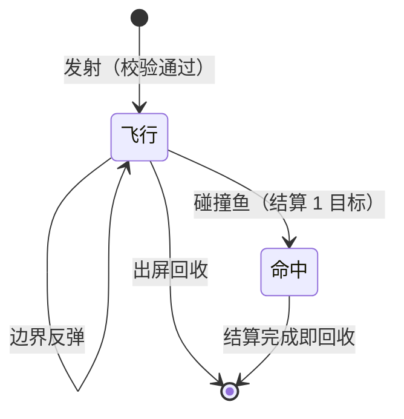

# 子弹（基础实体）

> 炮弹实体（Bullet Actor）的需求语义：由炮台发射（发射操作见 [[实体/炮台/炮台]]），真实碰撞命中鱼并结算伤害（判定规则见 [[玩法系统/伤害系统/伤害系统]]）。附魔派生（冰/火/追踪/机关枪弹）的效果归 [[玩法系统/附魔系统/附魔系统]]。

---

## 一、实体属性（普通炮弹 · 默认）

| 属性 | 值 | 说明 |
|------|:--:|------|
| 单发伤害 | 1 | 命中目标 HP − 1（火弹另有固定加伤，见附魔文档 §4.2） |
| 攻击目标数 | 1 | 一发炮弹**最多结算 1 个目标**（攻击判定范围 ≠ 多目标） |
| 击中规则 | 真实碰撞 | 无命中概率判定；炮弹碰撞体接触鱼即命中 |
| 飞行 | 直线 | 撞击边界后**反弹**（反弹次数上限待数值，现行为无限次/出屏回收） |
| 场上上限 | 30 发/玩家 | 单玩家同屏最多 30 发（现值，待数值确认） |

> 边界反弹保留理由：反弹提供瞄准技巧空间（利用反弹打击刁钻角度），与概率无关，合规。

---

## 二、生命周期

| 状态 | 需求行为 |
|------|------|
| **飞行** | 直线飞行；碰边界反弹；追踪弹为制导飞行（见附魔文档 §4.3） |
| **命中** | 对碰撞目标结算伤害（HP − 伤害）；命中回能（炮弹能量 +回能，见 [[玩法系统/经济系统/经济系统]] §三）；单发结算后回收 |

---

## 三、派生：附魔炮弹

四类附魔炮弹（冰/火/追踪/机关枪）与普通弹**共用飞行与碰撞规则**，差异两面：

| 派生 | 附加到子弹的主动面 | 子弹对鱼的效果面 |
|------|------|------|
| 冰弹 | 储备消耗（每发−1 冰弹弹药） | 命中施加**冰缓**（移速降低） |
| 火弹 | 储备消耗（每发−1 火弹弹药） | 单发加伤 + 命中施加**灼烧**（持续跳伤） |
| 追踪弹 | 储备消耗 + 摇杆锁定前置 | **制导必中**锁定目标 |
| 机关枪 | 时限激活（6s，不耗弹药） | **射速提升**（发射间隔缩短，单位时间命中数 ×2） |

> 完整切换/消耗/时限规则与效果数值见 [[玩法系统/附魔系统/附魔系统]] §三（主动）/ §四（被动）。

---

## 四、退役弹种

| 弹种 | 原行为 | 处置 |
| --- | ------------ | -------- |
| 电光 | 锁定目标按频率概率结算 | 改造为**追踪弹**载体（确定性制导，无概率） |
| 激光 | 直线上所有鱼触发死亡概率 | **首版移除**（直线多段 = 多目标伤害，属首版暂移出项；且概率制残留） |

---

## 五、关联文档

- [[实体/炮台/炮台]] — 发射操作、消耗与弹尽（§六 炮弹 / §七）
- [[玩法系统/伤害系统/伤害系统]] — 子弹-鱼伤害判定（血量制）
- [[玩法系统/附魔系统/附魔系统]] — 附魔弹两面规则与数值
- [[流程与视觉/流程/玩家流程/playing]] — 游玩中的发射交互
