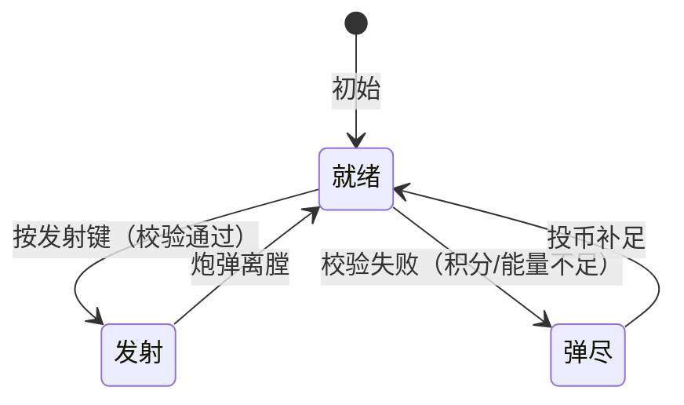

# 炮台（血量制 · 1 级炮）

> 实体域文档：炮台（Turret/Cannon Actor）的实体属性与操作语义；子弹实体见 [[实体/子弹/子弹]]，玩家侧流程见 [[流程与视觉/流程/玩家流程/playing]]。

---

## 一、系统定位

- **所属模块**：炮台系统 → 管理炮台、炮弹与附魔切换
- **一句话职责**：炮台是玩家唯一的输出口——消耗积分与能量发射炮弹，真实命中目标逐点扣血；附魔道具通过炮台切换生效
- **政策定位**：炮台**不再有任何倍率语义**——单发消耗固定、单发伤害固定、奖励不随任何按键放大

---

## 二、1 级炮基础属性（首版唯一炮等级）

| 属性     |   值    | 说明                               |
| ------ | :----: | -------------------------------- |
| 单发伤害   |   1    | 对命中目标 HP − 1（火弹另有固定加伤，见附魔文档）     |
| 单发积分消耗 |   1    | —                                |
| 单发能量消耗 |   1    | —                                |
| 攻击目标数  |   1    | 一发炮弹**最多结算 1 个目标**（命中容错范围 ≠ 多目标） |
| 击中规则   |  真实碰撞  | 无命中概率判定；炮弹碰撞体接触鱼即命中              |
| 炮等级    | 固定 1 级 | 无等级切换、无倍率（高等级炮见 §十二 遗留）          |

**「范围攻击」的准确语义**：炮弹有攻击判定范围（命中容错），但一次最多只结算 1 个目标，不是一发多杀。

---

## 三、基础操作

### 3.1 瞄准（沿用）

| 操作 | 规则 |
|------|------|
| 左右旋转 | 炮台角度左右自由旋转，限制在 [-75°, 75°] |
| 锁定 | 摇杆长按下锁定**精英及以上**鱼类；下压同时左右操作在同类间切换；摇杆回正/上推解除。追踪附魔激活时锁定范围放宽至进阶鱼及以上（见 [[玩法系统/附魔系统/附魔系统]] §4.3） |

### 3.2 开炮（沿用经典节奏）

| 形态 | 规则 |
|------|------|
| 单发 | 按一次发射键发射一发 |
| 长按连射 | 长按按固定间隔连发，松手停止（间隔待数值，现值参考 150~300ms） |
| 自动连射 | 长按发射键达 3 秒以上松开进入自动连射，再按一次取消；长按不足 3 秒松开即停 |
| 高速节奏 | 选中机关枪附魔时连发间隔缩短（见 [[玩法系统/附魔系统/附魔系统]] §3.3）——**机关枪已从独立炮台形态改为附魔道具** |

### 3.3 发射前置校验

```text
开炮条件：游戏积分 ≥ 1 且 炮弹能量 ≥ 1
任一不足 → 不发射，进入弹尽提示（§七）
```

---

## 四、炮台部件视觉语义（血量制新语义）

> 部件外观沿用既有清单，语义按血量制重定义：

| 炮台部件   | 新语义                 | 表现要求                                                   |
| ------ | ------------------- | ------------------------------------------------------ |
| 炮管     | 当前瞄准方向              | —                                                      |
| 光球     | **炮弹能量显示**          | 能量充足常亮；不足闪烁/变灰                                         |
| 光球前数字  | 当前炮等级（首版**固定显示 1**） | —                                                      |
| 齿轮     | 炮台运行与**蓄能表现**       | 开炮/投币时转动反馈（蓄能满值升级表现属高等级炮，首版仅演出预留）                      |
| 左轮式弹药盘 | **附魔道具储备**          | 四格对应冰/火/追踪/机关枪；冰/火/追踪格显示剩余发数，机关枪格显示剩余时限(秒)（时限制），当前选中格高亮，空格置灰（详见 [[玩法系统/附魔系统/附魔系统]] §3.2） |

---

## 五、切炮键（energy 键）新语义

**废止**：原 `energy` 键的炮等级/倍率调节语义（政策红线②：按键同步放大投入与收益 = 倍率投注）。

**新语义**：切换**当前附魔道具**（附魔选择），循环规则：

```text
普通弹 → 冰 → 火 → 追踪 → 机关枪 → 普通弹（跳过未持有/已耗尽项）
```

完整切换与消耗规则见 [[玩法系统/附魔系统/附魔系统]] §3.1。

---

## 六、炮弹

### 6.1 普通炮弹（默认）

| 属性   |                      值                      |
| ---- | :-----------------------------------------: |
| 伤害   |              1（真实碰撞命中，HP − 1）               |
| 飞行   | 直线；撞击边界后**反弹**（反弹次数上限待数值，现行为无限次/出屏回收，需数值定稿） |
| 场上上限 |           单玩家同屏最多 30 发（现值，待数值确认）            |

> 边界反弹保留理由：反弹提供瞄准技巧空间（利用反弹打击刁钻角度），与概率无关，合规。

### 6.2 附魔炮弹

四类附魔炮弹（冰/火/追踪/机关枪）的效果、参数与获取见 [[玩法系统/附魔系统/附魔系统]]；本系统只承载其**发射与切换**。附魔弹共用普通弹的飞行与碰撞规则（追踪弹增加制导）。

### 6.3 退役弹种

| 弹种  | 原行为          | 处置                                       |
| --- | ------------ | ---------------------------------------- |
| 电光  | 锁定目标按频率概率结算  | 改造为**追踪弹**载体（确定性制导，无概率）                  |
| 激光  | 直线上所有鱼触发死亡概率 | **首版移除**（直线多段 = 多目标伤害，属首版暂移出项；且概率制残留） |

---

## 七、发射消耗与弹尽

### 7.1 消耗规则

```text
普通弹：1 积分 + 1 能量
储备型附魔弹（冰/火/追踪）：1 积分 + 1 能量 + 1 发对应附魔弹药
时限型附魔弹（机关枪·6s 时限）：激活期间每发仅 1 积分 + 1 能量（不耗弹药）
```

### 7.2 弹尽表现

| 情形        | 表现                  | 引导    |
| --------- | ------------------- | ----- |
| 能量不足      | 光球变灰/闪烁 + 「弹药耗尽」提示音 | 降低炮等级 |
| 积分不足（能量足） | 分数区提示「积分不足」         | 引导投币  |
| 附魔弹药耗尽    | 弹药格置灰 + 自动回落普通弹     | 无需干预  |

> 兑换率已定（1 币 = 10 积分 + 1 能量，见 [[玩法系统/经济系统/经济系统]] §三）；能量经必中回能不可耗尽，实际弹尽节奏由积分约束决定（积分 10 发/币为唯一弹药约束）。

---

## 八、操作/事件表

| 操作   | 触发条件            | 影响的数据                | 发出的事件                 |
| ---- | --------------- | -------------------- | --------------------- |
| 瞄准   | 摇杆左右            | 炮台角度                 | —                     |
| 锁定   | 摇杆长按下           | 锁定目标引用               | 锁定变更事件                |
| 切换附魔 | 按切炮键            | 当前附魔类型               | 附魔切换事件                |
| 开炮   | 按发射键且积分≥1 且能量≥1 | 积分−1、能量−1（储备型附魔弹再−1 弹药；机关枪时限内不耗弹药） | 子弹发射事件                |
| 命中   | 炮弹真实碰撞鱼         | 鱼 HP − 伤害            | 命中反馈事件                |
| 击杀   | 鱼 HP ≤ 0        | 彩票值 + Volume（击杀者）    | 鱼击杀事件（彩票入账见 [[玩法系统/经济系统/经济系统]] §四） |

---

## 九、状态机（炮台发射流程）



| 状态 | 含义 |
|------|------|
| 就绪 | 可发射；等待输入 |
| 发射 | 扣除消耗、生成炮弹（普通/附魔） |
| 弹尽 | 无法发射；提示并引导投币 |

---

## 十、参数面汇总（待数值）

| # | 参数 | 类型 | 建议范围 | 约束说明 |
|:-:|------|------|---------|---------|
| 1 | 经典连发间隔(毫秒) | 整数 | 150 ~ 300 | 与机关枪间隔（附魔文档参数 16/17）联动定稿 |
| 2 | 单玩家同屏炮弹上限(发) | 整数 | 30（现值） | 影响机关枪节奏价值 |
| 3 | 炮弹边界反弹次数上限 | 整数 | 0 ~ 3 | 0 = 不反弹；现行为需确认后定稿 |
| 4 | 炮台旋转角度限制(度) | 整数 | ±75（现值） | 沿用 |
| 5 | 自动连射触发时长(秒) | 小数 | 3（现值） | 沿用 |
| 6 | 弹尽提示音/闪烁频率 | — | 待数值 | 表现层参数 |

---

## 十一、政策合规自查

| # | 政策红线 | 本系统对照 | 结论 |
|:-:|---------|-----------|:--:|
| 1 | 无概率决定结果 | 命中 = 真实碰撞；无任何命中概率判定 | ✅ |
| 2 | 无倍率投注 | 炮等级固定 1；energy 键改道具切换；单发消耗/伤害/奖励全固定 | ✅ |
| 3 | 无奖励循环投入 | 炮台只消耗积分/能量/附魔弹药，不消耗彩票值 | ✅ |
| 4 | 技巧决定结果 | 瞄准角度、锁定时机、连射节奏、附魔切换全部由操作决定 | ✅ |
| 5 | 无抽水/暗控 | 无难度/池参数介入炮台行为 | ✅ |
| 6 | 内容安全 | 沿用现有炮台外观审核结论 | ✅ |

---

## 十二、退役与遗留

| # | 项 | 处置 |
|:-:|----|------|
| 1 | 炮等级 32 级表（cannonLevels 10~10000） | 首版弃用（仅 1 级）；表结构保留待高等级炮重定义 |
| 2 | 「最小/最大发能量」「加炮幅度」等倍率参数 | 概念废止（无倍率语义） |
| 3 | 激光弹 | 首版移除（§6.3） |
| 4 | 高等级炮（2~10 级伤害/消耗/蓄能/临时等级） | 延后（已定方向：本局临时等级） |
| 5 | 出界子弹退款 | 随概率制废止；边界反弹机制下重新定义为碰撞行为（§6.1） |

---

## 十三、关联文档

- 玩法总纲：[[总体策划]]（血量制核心循环与政策红线）
- 附魔细化：[[玩法系统/附魔系统/附魔系统]]（道具效果/切换/弹药盘）
- 子弹实体：[[实体/子弹/子弹]]（炮弹实体属性）
- 结算规则：[[玩法系统/伤害系统/伤害系统]]（击杀判定）与 [[玩法系统/经济系统/经济系统]]（彩票入账与出票）
- 交互对象：[[实体/鱼/鱼]]（鱼 HP 与被击中行为）
