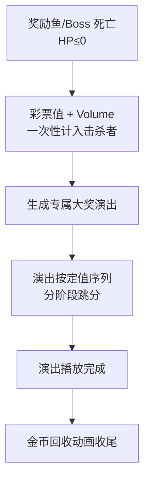

# 奖励鱼（派生实体）

> 鱼的**派生实体**：带奖励特效（大奖演出）的鱼。基础实体语义（种类/生命周期/移动方式/鱼群）继承 [[实体/鱼/鱼]]，本文件只定义派生差异——奖励演出与击杀价值表现。

---

## 一、实体定位

| 项 | 说明 |
|----|------|
| 实体类别 | 鱼派生实体（FishActor 奖励分支：3xxx 奖励鱼/奇物、4xxx Boss） |
| 派生差异 | 被击杀时触发**专属大奖演出**（多阶段跳分/爆分/转盘等），普通鱼只有金币回收特效 |
| 数值语义 | 击杀彩票值 = 固定 **Volume**（双语义字段定义见 [[玩法系统/伤害系统/伤害系统]] §2.2）；HP 同样按分档定价（[[玩法系统/伤害系统/数值框架]] §四） |
| 移动策略 | 冲刺 / 断续 / 变速 / Boss 专属演出（居中驻留、居中缩放、动画展示、屏顶驻留等，逐鱼见 [[实体/鱼/鱼清单]]） |

> Boss（4xxx）同为「带奖励演出的鱼」，适用本文件规则；旧「Boss 命中绕过概率云直接死亡」行为已作废——血量制下 Boss 同样按 HP 扣减击杀（Boss HP 高，是火/机关枪组合的核心目标）。

---

## 二、死亡流程

- 击杀归属 = **最后一击全奖**（灼烧致死的最后一跳视为施加者的最后一击）
- 演出不改变总额：各阶段定值之和恒等于 Volume

---

## 三、多阶段定值序列（原奖励参数）

奖励鱼/Boss 预制体配置一组**奖励参数条目**，决定演出「分几次表现、每段跳多少分」：

| 配置项 | 说明 |
|--------|------|
| 参数名（Key） | 如「连击1」「连击2」「爆分数量」，对应演出组件取值的键名（ScoreKeys 累加：分数1→分数2→分数3 依次累计） |
| 定值 | 每阶段固定整数（Min = Max = 定值；原随机范围与 Mul 倍率语义已退役） |
| 运算 | 全部为加法累进（原 Mul 倍率条目已按定值占位改造，值 1~2 仅作演出键连续性，非倍率语义） |
| 总额约束 | 各阶段定值之和 = 该鱼 Volume（配置期校验闭合） |

**各鱼定值序列总表**（prefab 落配完毕，已验收：14 个 prefab、46 条分值条目，Min=Max 定值、Operation 全 Add、逐鱼 Σ=Volume 全闭合）：

| 鱼（Id） | Volume | 分段定值序列（Σ=Volume） |
|------|:--:|------|
| 聚宝盆（3007） | 40 | 底分 19 + 目标分 19 + 倍率条目 2 |
| 龙转盘（3008） | 40 | 底分 40（「最高倍数」倍率条目已拆除） |
| 密码桶（3009） | 30 | 12 条目：11 条各 1 + 四阶段底分 19 |
| 雷神蟹（3015） | 54 | 连击1 = 54（单条目直配） |
| 岩浆鲨（4013） | 60 | 连击1 59 + 倍数2 1 |
| 财神爷（4007） | 37 | 连击 = 37（单条目直配） |
| 凤凰（4014） | 62 | 连击1 31 + 倍数2 1 + 连击3 30 |
| 海盗（4008） | 56 | 连击1 24 + 连击2 31 + 倍数1 1 |
| 龙（4009） | 66 | 连击数1 65 + 倍率1 1 |
| 美猴王（4012） | 120 | 爆分数量 20 + 连击数1 30 + 连击数2 30 + 连击数3 40（两变体同值，终审 #9 拍板） |
| 美人鱼（4010） | 60 | 爆分1 26 + 连击数1 33 + 倍率1 1 |
| 天王（4005） | 60 | 连击1 15 + 连击2 20 + 连击3 24 + 倍数1 1 |
| 武则天（4011） | 58 | 连击1 21 + 连击2 2 + 连击3 35 |

- **倍率条目处置结论**：原 `Operation=Multiply` 条目 13 条——12 条改造为定值占位（保留 Key 写入者，演出不断链），1 条拆除（龙转盘「最高倍数」，转盘停位改控制演出内部参数）
- 各预制体当前实际参数以设计层 [鱼与关卡数据配置说明](鱼与关卡数据配置说明.md) 与预制体 Inspector 为唯一权威

---

## 四、与普通鱼的差异对照

| 维度 | 普通鱼（基础实体） | 奖励鱼 / Boss（本派生实体） |
|------|------|------|
| 击杀表现 | 金币回收特效（金币阻尼跳动 → 贝塞尔曲线飞向玩家） | 专属大奖演出（转盘/连击/爆分/倍率演出） |
| 击杀彩票值 | 固定 Volume | 固定 Volume（多阶段定值序列表现） |
| 触发链参与 | 常规生成 | 参与触发链（固定 Boss 循环 / 葫芦⇄猴王互斥 / 条件 Boss 等，见 [[触发链]]） |
| 数值档位 | D1/D2 | D3/D4（高 HP 高 R 档，见 [[玩法系统/伤害系统/数值框架]] §3.2） |

---

## 五、关联文档

- [[实体/鱼/鱼]] — 基础实体（生命周期/移动/鱼群/交互）
- [[实体/鱼/鱼清单]] — 全实体清单（逐鱼移动策略与价值）
- [[玩法系统/伤害系统/伤害系统]] — 击杀结算判定（固定 Volume → 彩票值入账）
- [[玩法系统/经济系统/经济系统]] — 彩票值资源定义、出票结算与政策红线
- [[流程与视觉/特效/特效总览]] — 大奖特效清单（JP 特效逐个表现说明）
- [[触发链]] — Boss/奖励鱼生成触发链
