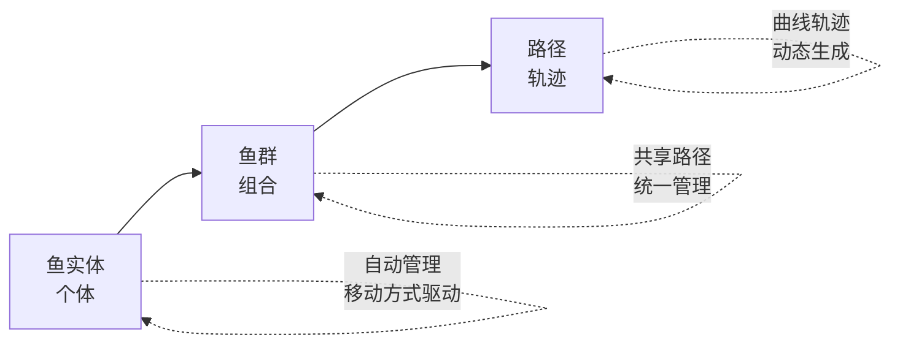
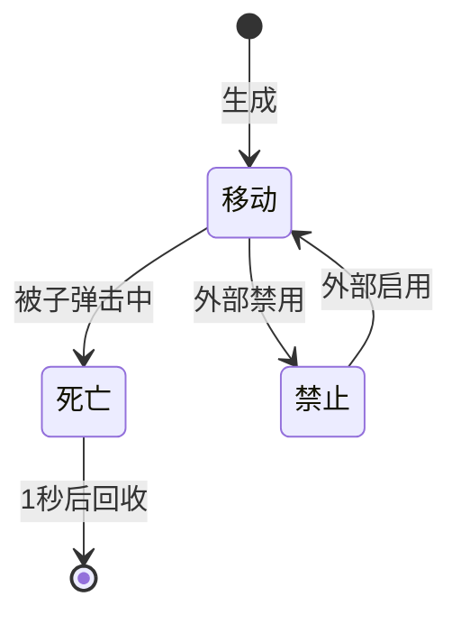
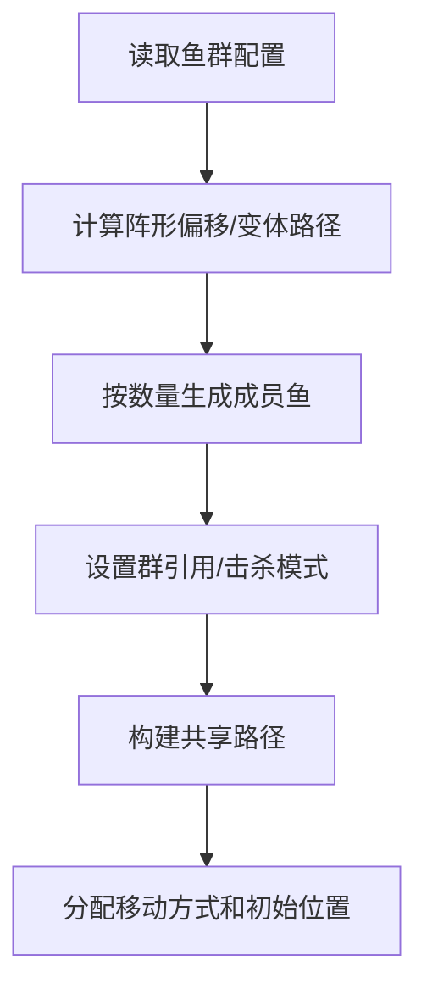
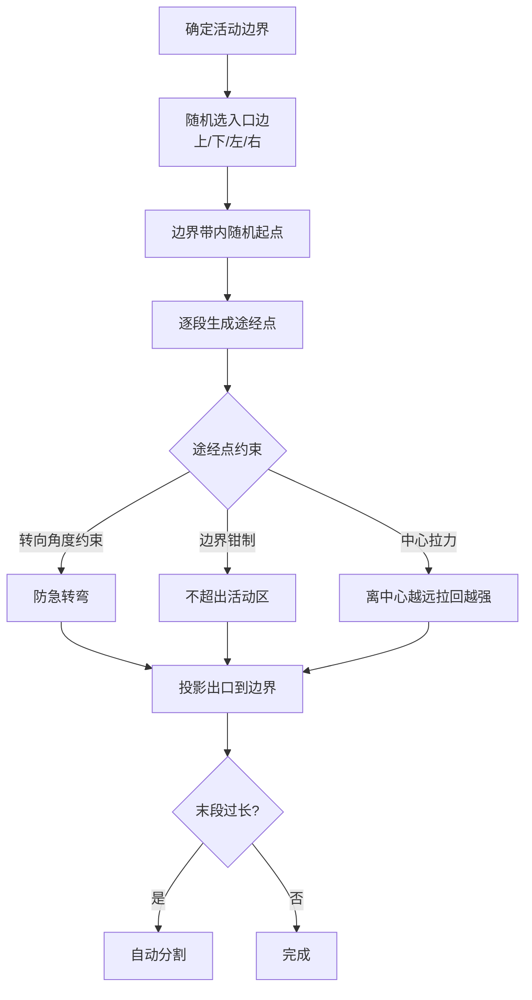
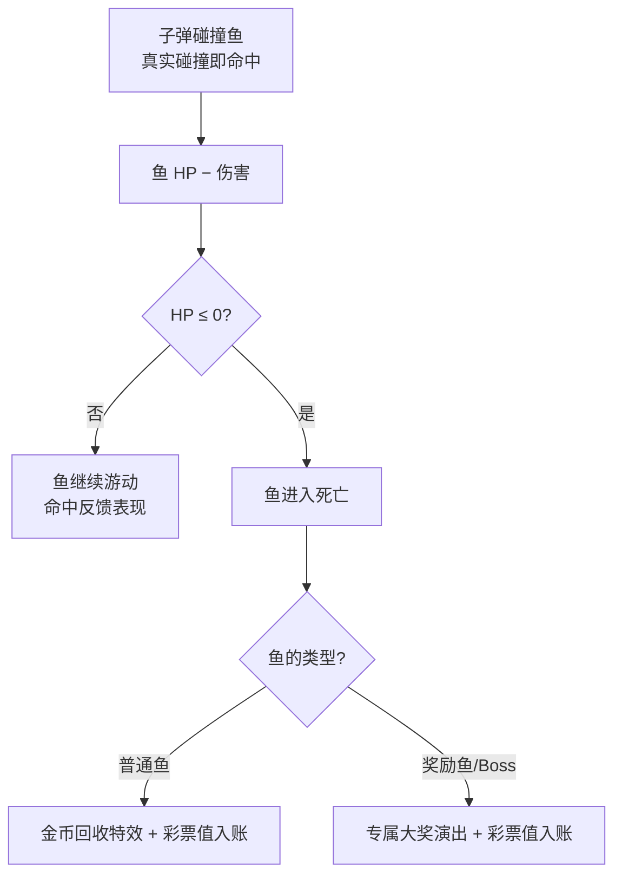

# 鱼（基础实体）

> 实体域文档：鱼（FishActor）**基础实体**的需求语义——种类、生命周期、移动方式、特效变体、鱼群、路径与被击交互。派生实体见 [[实体/鱼/奖励鱼]]；全实体清单见 [[实体/鱼/鱼清单]]（含权威 ID 表与多维表格数据源说明）。
> 只写需求语义；实现细节（代码模块、数据字段、配置格式）归设计层（GameDD），详见 [[../../../GameDD/实体/鱼/鱼]] 与 [[鱼与关卡数据配置说明]]。

---

## 一、实体概述

鱼是游戏的核心交互实体（被击打目标），由**生成、移动、交互与回收**全程托管，分三个层面：

---

## 二、鱼的种类

| 类别 | 标识段 | 说明 |
| :---: | :------: | --------------- |
| 普通鱼 | 1xxx | 价值固定，默认自由游动（小剑鱼、凤尾鱼、蝴蝶鱼、海马、尖嘴鱼、神仙鱼、小丑鱼、乌贼、刺豚） |
| 进阶鱼 | 2xxx | 价值带较高，含特效表现（电鳗、虾、食人鱼、岩浆鲨、狂战先锋） |
| 奖励鱼 / 奇物 | 3xxx | 金色系，高价值，可触发大奖特效（黄金龟、金蟾、聚宝盆、紫金葫芦、螃蟹等） |
| Boss | 4xxx | 大型鱼，专属移动演出和入场特效（龙、美人鱼、美猴王、天王等） |
| **特效鱼** | 11xx-13xx、21xx-23xx | 普通鱼的视觉特效变体（Arrow/Boom/Rotate），见 [六、特效鱼](#六特效鱼) |
| 鱼群 | 5xxx-6xxx | 多鱼组合，见 [七、鱼群系统](#七鱼群系统) |

> 每种鱼的完整说明（价值/速度/种群类型）见 [[实体/鱼/鱼清单]]。

---

## 三、鱼的生命周期

| 状态 | 需求行为 |
|------|------|
| **移动** | 激活：播放游动动画，按移动方式沿路径移动，**路径走完自动回收** |
| **禁止** | 碰撞关闭、移动停止（关卡切换等场景使用） |
| **死亡** | 关闭碰撞 → 停移动 → 挣扎动画 → 鱼身翻转（默认 60°）→ 触发加分/特效 → 1 秒后消失 |

> **回收规则**：鱼沿路径走到终点即回收（不再按出界回收）；随机路径场景下额外检测出界。

---

## 四、移动方式（策划语义）

> 鱼的移动方式决定"怎么动"；实现细节（组件/参数）由设计层维护。

### 4.1 路径类型

| 路径 | 策划语义 | 用途 |
|------|---------|------|
| **随机路径** | 在指定活动范围内随机生成曲线（可调边界与途经点数）或直线穿越 | 个体鱼生态移动 |
| **固定直线路径** | 8 方向（上/下/左/右/四对角）× 通道偏移 | 鱼群/阵型固定出入口 |
| **固定形状路径** | 圆（圈数可调）、正弦波、等距螺旋（圈数/内外旋向） | 特殊演出、特效鱼 |
| **超长直线路径** | 入口在屏外、横穿全场 | 鱼潮阵型 |

**默认引用**：普通鱼用 5 点随机曲线；小剑鱼/凤尾鱼用 7 点长曲线（存活久）；**特效鱼用 2 点短曲线（快速通过展示特效）**；随机阵型群用超长直线（全程可见）。

### 4.2 移动方式

| 移动方式         | 需求语义                                                  |   路径依赖   |
| ------------ | ----------------------------------------------------- | :------: |
| **自由游动**（默认） | 沿路径匀速游动，走完回收                                          |    需要    |
| **冲刺**       | 分段加速冲刺，段间平滑转向                                         |    需要    |
| **变速**       | 路径中段减速再加速（笨重鱼）                                        |    需要    |
| **断续**       | 静止等待→跳跃移动交替                                           |    需要    |
| **蛇形**       | 沿基方向正弦摆动                                              | 不需要（程序化） |
| **转圈**       | 绕圆心圆周运动                                               | 不需要（程序化） |
| **布料飘动**     | 自由游动 + 布料物理飘动（柔体鱼）                                    |    需要    |
| **特效路径**     | 沿路径移动但自身不转向（特效装饰体）                                    |    需要    |
| **随机路线+排队**  | 从预设路线库随机抽一条并随机摆位；支持**排队稳定**：一段时间内同名鱼复用同一路线同一速度，形成整齐队形 | 需要（预设路线） |
| **鱼身晃动**     | 游动中身体正弦摆动（附着在其他移动方式上）                                 |    附加    |

### 4.3 Boss 移动演出

| 移动方式 | 需求语义 |
|---------|---------|
| **三点飞行** | 入口→横轴中点→对角出口，带风力摆动（美猴王） |
| **动画展示** | 固定位置 + 动画驱动四阶段：进入→停留→游动→退出（美猴王/龙） |
| **居中缩放** | 居中由小变大→停留→缩小，远→近幻觉（美人鱼） |
| **居中驻留** | 居中不动，靠入场特效演出（龙） |
| **屏顶驻留** | 屏顶固定 + 待机动画循环（凤凰） |

> 移动方式选择规则：每条鱼可配置多种移动方式，生成时按"随机 / 指定 / 默认"选取其一；游动速度 ±20% 浮动。
> **存活时间 ≈ 路径长度 ÷ 速度**（±30% 波动），近似估算：`存活(s) ≈ 路径点数 × 5 ÷ 速度`。

---

## 五、奖励鱼（派生实体）

奖励鱼是鱼的派生实体（带奖励特效的鱼），被击杀时触发**大奖演出**——击杀彩票值为固定 Volume，多阶段演出按定值序列跳分（各段之和恒等于 Volume）。

> 派生实体的完整规则（定值序列与总表、演出跳分、死亡流程）见 [[实体/鱼/奖励鱼]]。

---

## 六、特效鱼

特效鱼是普通鱼的**视觉特效变体**：外观带箭头（Arrow）/ 爆裂（Boom）/ 旋转（Rotate）特效，行为与基础鱼一致，仅外观/特效不同。

| 项         | 说明                                                                                         |
| --------- | ------------------------------------------------------------------------------------------ |
| **ID 规则** | Arrow=基础 Id+100、Boom=+200、Rotate=+300（如小剑鱼 1001 → 1101/1201/1301；电鳗 1009 → 1109/1209/1309） |
| **出现方式**  | **伴随基础鱼小概率随机出现**：基础鱼与特效变体归为同一组，生成基础鱼时按权重随机，可能带出特效变体（各特效约 1/53）                             |
| **价值**    | 特效变体击杀价值高于基础鱼（如小剑鱼 2 → 50、刺豚 7 → 80），完整表见 [[实体/鱼/鱼清单#五特效鱼11xx12xx13xx21xx22xx23xx]]         |
| **适用范围**  | 已覆盖 9 种基础鱼（小剑鱼/凤尾鱼/蝴蝶鱼/海马/尖嘴鱼/神仙鱼/小丑鱼/刺豚/电鳗）；其余鱼种暂无特效变体                                    |

> ⚠️ 特效鱼目前**未被任何关卡事件直接引用**，完全依赖基础鱼生成时的随机出现；数值定位（击杀价值）后续可能随投放调整。

---

## 七、鱼群系统

鱼群是多条鱼组成的集合：**共享移动路径、统一生命周期**。按形态分三类：

| 形态 | 行为 |
|------|------|
| **群游** | 多鱼围绕同一路径散布游动（成员间保持间距，路径可变形出变体） |
| **阵型** | 多鱼按**阵形偏移**排布，共享基础路径整体行进 |
| **固定阵** | 预制体直接摆放成员位置（子级即鱼），特殊阵型使用 |

### 阵形选项

圆形、椭圆、矩形、直线、V形、随机、十字、弧形、螺旋、正弦（按鱼种与尺寸配置偏移，群通过阵形标识引用）。

### 击杀模式

| 模式 | 规则 |
|------|------|
| **独立击杀** | 每条鱼单独判定击杀 |
| **群杀** | 击中任一成员 → 全群进入死亡 |

### 路径结束行为

- **全群回收**：路径走完后整组统一回收（当前唯一行为）

### 组头随机

每个鱼族按"**组头 + 变体**"组织：组头是随机索引（不直接生成），关卡引用组头时**随机选取该族的一个变体**（如"小剑鱼阵"→ 随机出横排/纵队/圆/十字等 72 种之一）。每种鱼的种群类型集合见 [[实体/鱼/鱼清单]]。

### 群生成流程

---

## 八、路径规则

路径系统动态生成**曲线轨迹**（随机路径），并持有固定路径/阵型配置。

### 随机路径生成过程

### 关键参数

| 参数 | 默认值 | 说明 |
|------|--------|------|
| 场景半宽/半高 | (15, 8.5) | 基础活动范围 |
| 活动边界缩进 | (-2, -2) | 中间点活动范围 = 半尺寸 + 缩进 |
| 中心拉力 | 0.6 | 途经点向中心靠拢的强度 |
| 默认段距 | 6 ~ 12 | 每段路径距离范围 |
| 默认弯曲角 | 60° | 每段最大偏转角 |

> 路径类型与引用规则见 §4.1；配置存储与数据格式由设计层维护。

---

## 九、交互规则（被子弹击中）

### 命中与伤害判定（血量制）

- 击杀 = 真实碰撞扣血至 HP ≤ 0，无任何命中概率判定；伤害与击杀结算规则见 [[玩法系统/伤害系统/伤害系统]]，数值（HP/Volume 分档）见 [[玩法系统/伤害系统/数值框架]]。
- 击杀彩票值 = 该鱼固定 Volume，归属最后一击玩家（灼烧致死视为施加者最后一击），见 [[玩法系统/伤害系统/伤害系统]] §2.1。
- 附魔弹命中附加状态效果（冰缓/灼烧）或制导必中，见 [[玩法系统/附魔系统/附魔系统]] §四。

### 出界 / 路径走完

鱼沿路径走完 → 自动回收（个体）/ 整组回收（鱼群）。

### 群杀

阵型群中任一成员被击中 → 若开启群杀 → 全群进入死亡。

---

## 十、实体管理

所有实体遵循统一的生成与回收规则：

- **生成**：创建 → 初始化 → 激活
- **回收**：失活 → 清理 → 消失
- **预加载**：启动时预先创建常用实体，避免游戏进行中卡顿
- **变体分组**：同名不同后缀的资源（如 `鱼名_Default`、`鱼名_Path`、`鱼名_Arrow/Boom/Rotate`、`鱼名_01`、`鱼名_fly`）视为一组，生成时按权重随机选取

---

## 十一、关联文档

- 策划层：
  - [[实体/鱼/奖励鱼]] — 奖励鱼派生实体
  - [[实体/鱼/鱼清单]] — 每种鱼说明 + 种群类型 + 权威 ID 表
  - [[玩法系统/伤害系统/伤害系统]] — 子弹-鱼伤害判定（血量制）
  - [[关卡设计总纲]] — 深度体系鱼种池、鱼潮规则
- 设计层（实现细节）：
  - [[../../../GameDD/实体/鱼/鱼]] — 鱼实体/鱼群实现
  - [[鱼与关卡数据配置说明]] — 数据结构/字段规范（含鱼族/组头/随机机制）
