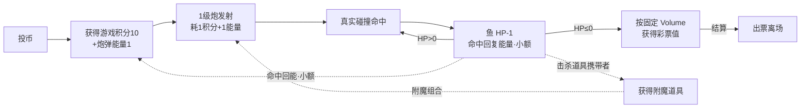
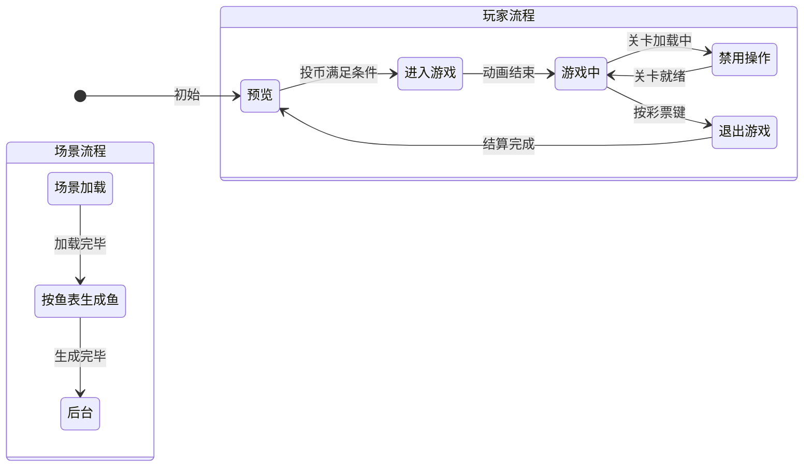

# 龙腾破海策划（血量版总纲）

> ⚠️ 本工作区 = **血量版（HP Gameplay）独立产品线**（技巧制血量玩法；概率制结算内核已退役）。开发依据与交接见 `GameDM/血量版本开发交接总纲.md`。

## 〇、文档体系目录导览

GamePlan 按五个域组织（详细目录约定见 [[AGENTS]]）：

| 域 | 内容 | 入口文档 |
|----|------|---------|
| **设备输入输出系统/** | 各种设备的输入输出操作（串口/投币器/出票器/摇杆/切炮键…） | [[设备输入输出系统/设备系统]] |
| **流程与视觉/** | UI（xxUI 策划说明）、特效（xxActor 特效表现+清单）、流程（玩家流程/场景流程） | [[流程与视觉/UI/UI总览]]、[[流程与视觉/特效/特效总览]]、[[流程与视觉/流程/场景流程]] |
| **鱼关卡/** | 「xx关卡」第一个实例=鱼关卡：标准关卡/鱼潮关卡（规范+具体关卡）+ 通用件 + 关卡设计总纲 | [[关卡设计总纲]] |
| **实体/** | Actor 实体（鱼/炮台/子弹…同构：基础实体+派生实体+清单） | [[实体/鱼/鱼]]、[[实体/炮台/炮台]]、[[实体/子弹/子弹]] |
| **玩法系统/** | 被动玩法系统（伤害/经济）+ 附魔系统（主动+被动两面）；奖励不构成系统（击杀反馈=特效实体与彩票数值，见 [[实体/鱼/奖励鱼]] 与经济系统） | [[玩法系统/伤害系统/伤害系统]]、[[玩法系统/经济系统/经济系统]]、[[玩法系统/附魔系统/附魔系统]] |

---

## 一、游戏定位

爽快激情的街机休闲技巧游戏（血量制）：玩家消费硬币获得游戏积分与炮弹能量，操控炮台发射炮弹**真实命中**鱼类、逐点扣血击杀，获得**固定彩票值**，最终主动离开游戏按彩票值出票。核心结果由玩家的**瞄准、目标选择、发射时机、炮弹附魔组合、对特殊鱼和大型鱼的处理方式**共同决定。

**核心循环一句话**：玩家投币获得积分和基础炮弹能量，用 1 级炮真实击中目标并逐点扣血，通过特殊鱼获得附魔道具，利用道具组合击杀大型鱼，最终按鱼的固定 Volume 获得彩票。

> 命中回能为游戏内资源小循环（能量），与彩票值严格隔离，不构成奖励回流。

### 政策依据与红线（《游戏游艺设备内容审核工作指引》，截图见 设备输入输出系统/ 目录两张 PNG）

1. **无概率决定结果**：命中、扣血、击杀全部由真实碰撞与玩家操作决定，禁止任何随机结算。
2. **无倍率投注**：禁止「按键同步放大投入与收益」的机制；禁止倍率/加倍/万炮/押分类文案与按键语义。
3. **无奖励循环投入**：彩票值（结算奖励）禁止回流为游戏资源；游戏资源与结算奖励必须隔离。
4. **技巧必须决定结果**：瞄准、目标选择、发射时机、道具组合必须真实影响收益。

> 拍板结论见 [[../GameDM/血量版本-负责人终审单]]；各系统合规自查表分见对应系统文档。

---

## 二、流程总览

| 流程线 | 文档 |
|--------|------|
| 场景流程（加载→生成→后台，切关规则要点） | [[流程与视觉/流程/场景流程]] |
| 玩家流程 · 预览 | [[流程与视觉/流程/玩家流程/preview]] |
| 玩家流程 · 游玩（进入游戏/游戏中/禁用操作） | [[流程与视觉/流程/玩家流程/playing]] |
| 玩家流程 · 退出（彩票结算出票） | [[流程与视觉/流程/玩家流程/exit]] |

---

## 三、体系文档清单

| 域 | 职责 | 文档 |
| ---- | -------------------- | --------------------- |
| 设备输入输出 | 硬件输入信号与控制输出（投币器/摇杆/发射键/切炮键/彩票键/出票） | [[设备输入输出系统/设备系统]] |
| 流程与视觉 · UI | 各具体 UI 的策划说明 | [[流程与视觉/UI/UI总览]] |
| 流程与视觉 · 特效 | 特效清单与基础元素（可被实体/关卡引用） | [[流程与视觉/特效/特效总览]] |
| 鱼关卡 | 场景状态机、深度切关、波次事件、条件触发 | [[关卡设计总纲]] |
| 实体 · 鱼 | 鱼实体状态机、移动策略、鱼群、路径 | [[实体/鱼/鱼]] |
| 实体 · 奖励鱼 | 奖励鱼派生实体（大奖演出/定值序列） | [[实体/鱼/奖励鱼]] |
| 实体 · 炮台 | 炮台属性、操作、部件语义（1 级炮） | [[实体/炮台/炮台]] |
| 实体 · 子弹 | 炮弹实体（飞行/碰撞/附魔派生） | [[实体/子弹/子弹]] |
| 玩法系统 · 伤害 | 子弹-鱼伤害判定与击杀结算（真实碰撞扣血/暴击/状态伤害/击杀彩票入账） | [[玩法系统/伤害系统/伤害系统]] |
| 玩法系统 · 数值 | HP/Volume 定价模型、出票率公式、九档 R̄（数值权威） | [[玩法系统/伤害系统/数值框架]] |
| 玩法系统 · 经济 | 三资源隔离、投币兑换、彩票出票结算（快照出票/退场结算）、断电保护 | [[玩法系统/经济系统/经济系统]] |
| 玩法系统 · 附魔 | 附魔道具（主动：切换/储备/时限；被动：子弹对鱼效果） | [[玩法系统/附魔系统/附魔系统]] |

---

## 四、实体清单

### 鱼实体

详见表：[[实体/鱼/鱼清单]]（含权威 ID 表与多维表格数据源说明）

| ID 开头 | 类别 |
| :----: | :--- |
| 1 | 普通鱼 |
| 2 | 进阶鱼（特效表现） |
| 3 | 奖励鱼、奇物 |
| 4 | Boss |
| 11/12/13、21/22/23 | **特效鱼**（Arrow/Boom/Rotate 变体） |
| 5、6 | 鱼群 |
| 9 | 关卡 |

### 其他实体

| 实体 | 文档 |
|------|------|
| 炮台 | [[实体/炮台/炮台]] |
| 子弹（+附魔派生） | [[实体/子弹/子弹]] |
| 特效（Effect Actor） | [[流程与视觉/特效/特效总览]] |

---

## 五、数据配置（GameData 三表协作约定）

| 数据源 | 内容 | 协作约定 |
|--------|------|---------|
| `GameData/游戏数据.duowei` | DataModule 全局数据 | 策划写**名称**与需求语义，主程对应代码模型设计 |
| `GameData/游戏事件.duowei` | 可用事件清单 | 同上 |
| `GameData/鱼种.duowei` 等实体表（`[实体名].duowei`） | 各 Actor 数据（如 FishActor：Id/Name/HP/Volume/Speed/Level） | 同上；鱼种表现状见 [[实体/鱼/鱼清单]] 数据源节 |

**配置链路**：多维表格（`.duowei`，协作编辑源）→ xlsx → Luban 产物 `Assets/StreamingAssets/luban/cfg_tb*.json`（运行时）。数据已文件夹化递归加载（`GameModel.OnConfigInit`），详见 [鱼与关卡数据配置说明](鱼与关卡数据配置说明.md)。

| 运行时目录 | 内容 |
|--------|------|
| `FishData/` | 鱼种属性配置（Normal/Advanced/Award/Boss/Effect 分类 JSON） |
| `GroupData/{SchoolFishData,FormationFishData,FixedFormationFishData}/` | 鱼群配置（群游/阵型/固定阵三类，按数据子类分文件夹） |
| `WaveData/{Startand,Award}/` | 关卡配置（Timeline 时序引用 + 事件库） |
| `ConditionEvent/` | 条件事件库（FishEvent 定义，GUID 跨关卡复用） |
| `PathConfig/` + `FormationData/` | 路径/阵型独立配置（GUID，不进 WaterDict） |

---

## 六、血量版范围界定（首版验证目标）

**首版只验证一件事**：1 级炮 + 单目标判定 + 固定扣血 + 附魔组合 + 固定彩票奖励，是否能形成好玩的完整循环。

**暂移出首版范围的内容**（后续按需单独立项）：

1. 高等级炮的完整成长规则（2~10 级炮伤害与消耗；已定方向：本局临时等级）；
2. 炮台升级蓄能满值后的具体升级表现；
3. 多目标范围伤害；
4. 随机暴击扩展（基础暴击为存量机制延续，见 [[玩法系统/伤害系统/伤害系统]] §2.3）；
5. 弱点系统；
6. 速杀奖励档位；
7. 鱼潮关的普通经济平衡（奖励关豁免，见 [[关卡设计总纲]] §四）；
8. 通过概率云、抽水率、池健康度控制收益（**永久移除**，不列入后续）。

---

## 七、相关文档

### 策划文档
- 见 §〇 目录导览与 §三 体系文档清单

### 设计文档（GameDD）
- [总体设计](GameDD/总体设计.md)
- [Gameplay玩法](GameDD/Gameplay玩法.md)（血量版实现基准）

### 开发管理（GameDM）
- [[../GameDM/血量版本-负责人终审单]]（拍板结论权威）
- `GameDM/血量版本开发交接总纲.md`（开发依据与交接）
