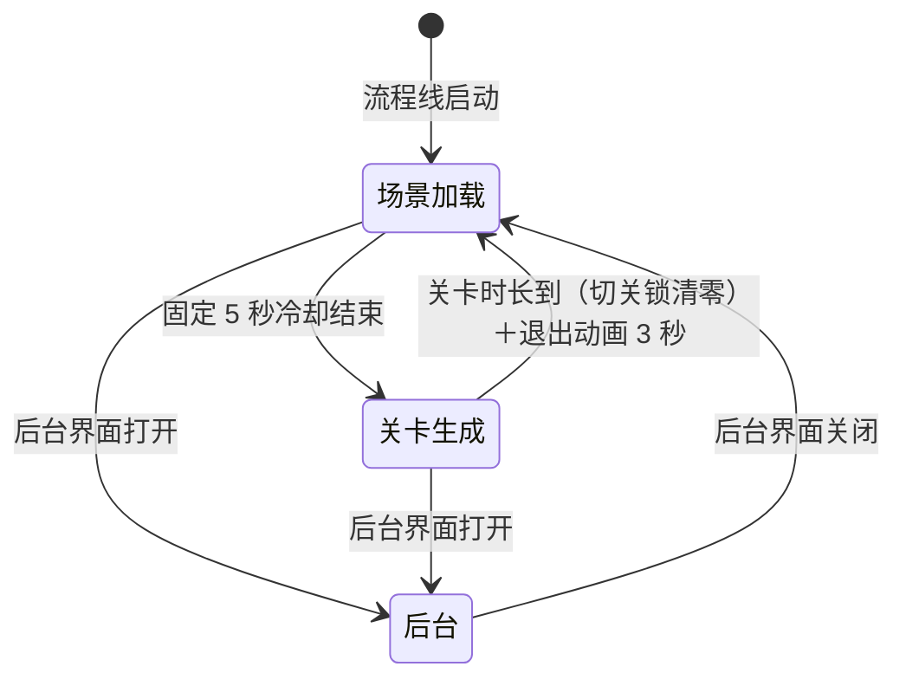

# 场景流程（Scene Flow）

> 场景侧流程线：**全局单条**（Flow_Scene），驱动 关卡加载 → 关卡生成 → 后台 三态循环。与**玩家流程**（每座一条，见 [[流程与视觉/流程/玩家流程/玩家流程总览]]）并行运行，两线无状态嵌套，通过**玩家输入锁**联动。关卡调度规则（深度体系/白名单/解锁条件）见 [[关卡设计总纲]]。

---

## 一、状态机

| 状态 | 需求行为 | 与玩家流程的联动 |
|------|---------|----------------|
| **场景加载（Loading）** | 禁用全部玩家输入；广播场景切换事件；关闭边界视图；清理上一关残留鱼与鱼群（含屏外，组成员随组回收）；选下一关并加载（含 Boss 预告记录重置）；固定 5 秒冷却后转生成。选关失败时 3 秒后照常转生成（无重试） | 在座玩家 游戏中 → **禁用操作** |
| **关卡生成（Generating）** | 广播场景就绪事件；恢复全部玩家输入；打开边界视图。关卡内鱼/鱼群按时间线时序生成由关卡系统驱动（不属于本状态职责） | 禁用操作 → **游戏中** |
| **后台（Backend）** | 运营后台界面占用期间挂起关卡循环并锁定玩家输入；后台关闭时恢复输入并回加载态（与加载态加锁同帧衔接，无输入泄漏）。退出时置「下次加载强制回深度 1」标志（无人游玩会话结束） | 后台界面期间锁定玩家输入 → 在座玩家 游戏中 → **禁用操作** |

---

## 二、切关规则（要点）

- **选关**：优先深度体系白名单（候选池过滤解锁条件，池内随机）；白名单为空或未配置时回退按场景随机（排除当前场景）。完整规则见 [[关卡设计总纲]] §二
- **首关与后台返回强制深度 1**：进程启动首轮即首关、后台会话结束后的下一次加载，均走深度 1 候选（深度 1 三关中解锁者随机；不加鱼潮扩展），标志由加载态消费（读后即清）
- **切关锁**：引用计数锁（大奖演出等持有期间锁定切关），关卡时长判定须锁清零才触发到点切关
- **到点切关时序**：关卡时长到 → 广播切换前事件 → 播场景退出动画 → 3 秒后回加载态
- **加载节奏**：加载态固定 5 秒冷却（不等待资源就绪信号，纯定时）；选关失败 3 秒兜底进生成

---

## 三、预留事件

场景切换（加载进入）、场景就绪（生成进入）、场景切换前（到点切关）三个事件为预留广播点，当前无监听方（供后续 UI/演出/统计接入）。

---

## 四、鱼潮关豁免

鱼潮关属于奖励关，不纳入普通关的攻击范围、收益和经济平衡约束，可继续使用现有大阵型、集中生成和奖励演出（负责人终审确认）。

---

## 五、关联文档

- [[关卡设计总纲]] — 关卡调度权威（深度/白名单/解锁/鱼潮）
- [[流程与视觉/流程/玩家流程/玩家流程总览]] — 玩家流程线与两线输入锁联动
- [[设备输入输出系统/设备系统]] — 后台界面的硬件输入（设置/上下键）
