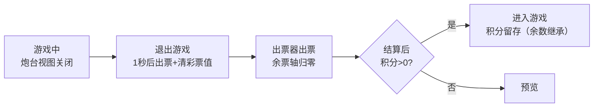

# 玩家流程 · 退出（Exit · Game_Exit · 离场结算）

> 玩家流程的结算终态：**离场触发**（该座位炮台根视图关闭＝机型布局关座/真正离场）→ 出票＋**仅清彩票值**（积分/炮弹能量/投币数留存）→ 积分 = 0 回预览（积分 > 0 则自动返回进入游戏，余数继承）。**彩票键不进入本状态**——游玩中长按彩票键为快照出票、不退场（见 [[流程与视觉/流程/玩家流程/playing]] §二）。

---

## 一、状态定义

| 项 | 内容 |
|----|------|
| 进入 | 停用积分恢复器（不再跟随记分）；强制切回普通炮型；1 秒后执行出票（快照结算）＋彩票值清零（积分/炮弹能量/投币数留存不清）；亮出票指示（中/英余票数字），隐出票就绪提示 |
| 持续 | 每帧读出票器余票轴刷新余票显示；余票清零后起 1 秒倒计时；0.5 秒宽限期后检测：出票结算完成后若积分 > 0（留存余额或有人再投币）→ 标记返回游戏 |
| 退出 | 熄灭出票指示 |
| 接续条件 | **进入游戏**：结算完成后积分 > 0（留存余额或再投币，余数继承直回游戏）；**预览**：出票完成且积分 = 0 |

---

## 二、结算规则

| 环节 | 规则 |
|------|------|
| 触发结算 | 炮台根视图关闭（关座/真正离场）——唯一退场入口 |
| 出票换算 | 出票数 = 进入结算时彩票值快照 ÷ 兑换率（PointToLotteryRate，暂定 **1:1**＝1 彩票值 1 票，运营旋钮待运营确认）；快照不足 1 票不出票；余数（< 兑换率）留账累计下次出票 |
| 出票链路 | 出票指令下发串口后按票面额扣减彩票值（设备侧暂无出票回执，下发即扣，防重复出票窗口）；出票总账累计（玩家 + 全局） |
| 清零 | **仅彩票值清零**（防重复出票；彩票快照同步清零防断电恢复已退票值）；积分/炮弹能量/投币数留存不清（余数继承，换人继承余额继续游玩）；0.2 秒后广播刷新事件（积分/能量按留存现值、彩票值按 0 刷新 UI） |
| 返回游戏 | 出票结算完成后（进入后 1 秒、0.5 秒宽限期后）检测积分 > 0——留存余额或结算后再投币——即直回「进入游戏」继续游玩；积分 = 0 走预览 |
| 断电保护 | 彩票值全程快照持久化：击杀入账、出票扣减、退场清零三处同步写快照——断电/重启不丢已获权益、不重复出已出的票 |

> 三资源隔离：彩票值仅用于最终结算出票，禁止回流为积分/能量（见 [[玩法系统/经济系统/经济系统]] §二）。

---

## 三、UI 交互

| UI 元素 | 表现 | 说明 |
|---------|------|------|
| 出票指示 | 中/英双语余票数字，随出票器余票轴实时递减 | 出票过程显示 |
| 出票完成 | 余票归零后 1 秒转场（回预览或直回游戏） | 流程切换 |
| 总分框 | 大奖/连击特效结算后移动到对应玩家炮台分数框上汇入（见 [[流程与视觉/特效/特效总览]] §四） | 特效收尾通用件 |
| 卡票提示 | 出票器报错时常亮（流程线常驻检查） | 异常提示 |

---

## 四、操作/事件表

| 操作 | 触发条件 | 影响的数据 | 发出的事件 |
|------|---------|-----------|-----------|
| 离场结算 | 炮台根视图关闭 | 1 秒后出票 + 彩票值清零（积分/能量/币数留存） | 出票指令、彩票值变更事件、留存值刷新事件 |
| 出票过程 | 出票器余票轴递减 | 余票显示刷新 | — |
| 返回游戏 | 结算完成后积分 > 0（留存或再投币） | 积分留存、流程 → 进入游戏 | 积分刷新事件、流程切换 |
| 回预览 | 余票归零后 1 秒且无人投币 | 流程 → 预览 | 流程切换 |

---

## 五、关联文档

- [[流程与视觉/流程/玩家流程/玩家流程总览]] — 五状态总览与两线关系
- [[流程与视觉/流程/玩家流程/playing]] — 游玩中出票（快照结算，不退场）与相邻状态
- [[玩法系统/经济系统/经济系统]] §六 — 彩票结算与出票细则（系统侧：两个出票入口、1:1 兑换、断电保护）
- [[设备输入输出系统/设备系统]] — 出票器输出信号与余票轴
