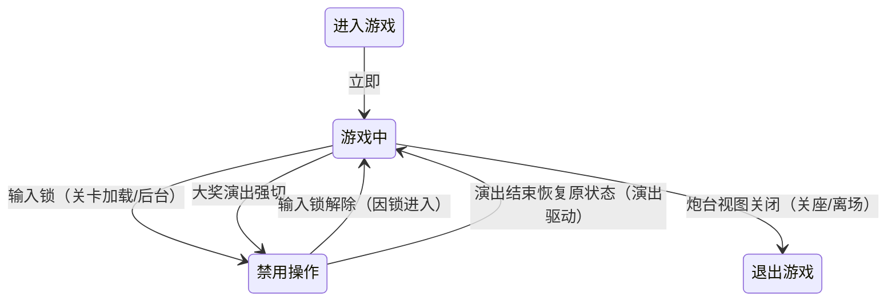

# 玩家流程 · 游玩（进入游戏 → 游戏中 ⇄ 禁用操作）

> 玩家流程的主动玩法主载体。三个状态：**进入游戏**（过渡）→ **游戏中**（操作主态）⇄ **禁用操作**（冻结）。五状态总览见 [[流程与视觉/流程/玩家流程/玩家流程总览]]。

---

## 一、状态定义

### 1. 进入游戏（Enter · Game_Enter）

| 项 | 内容 |
|----|------|
| 进入 | 按座位号错峰（每座 0.1 秒递增）激活该玩家的积分恢复器（断电保护开始跟随记分） |
| 持续 | 无（立即转场） |
| 退出 | 无 |
| 接续条件 | **游戏中**：立即进入 |

> 入场动画/炮台激活演出为预留策划意图，当前未实现（现为立即过渡）。

### 2. 游戏中（Playing）

| 项 | 内容 |
|----|------|
| 进入 | 无附加动作（操作面随即生效） |
| 持续 | 每帧读取设备输入（摇杆/发射键/切炮键/彩票键）并驱动炮台：瞄准、切炮级、双击下切炮型、开炮/连射；彩票键长按出票（见 §二）；同时监听退场与禁用条件 |
| 退出 | 复位炮台（清连射状态） |
| 接续条件 | **退出游戏**：该座位炮台根视图被关闭（机型布局关座＝真正离场）；**禁用操作**：收到输入锁（场景流程加载态/后台、外部禁用指令） |

### 3. 禁用操作（Disable）

| 项 | 内容 |
|----|------|
| 进入 | 冻结玩家操作（炮台以中性输入持续更新，已发射子弹继续飞行结算）；记录进入原因（是否输入锁） |
| 持续 | 等待输入锁解除（或大奖演出结束，见下） |
| 接续条件 | **游戏中**：因输入锁进入且锁解除时自动返回 |

**进入禁用操作的两条路径**：

1. **输入锁**：场景流程加载态禁用全部玩家输入（见 [[流程与视觉/流程/场景流程]]）、后台/外部禁用指令——锁解除后本状态自动回游戏中
2. **大奖演出**：聚宝盆、长转盘等大奖演出组件记录玩家当前状态 → 强切本状态冻结操作 → 演出结束后由演出组件直接恢复原状态（不经本状态的自动返回）

---

## 二、游玩操作（主动玩法）

| 操作 | 输入信号 | 规则 | 详细文档 |
|------|---------|------|---------|
| 瞄准 | 摇杆 | 炮台角度左右旋转，限幅 ±75°（座位可反向） | [[实体/炮台/炮台]] |
| 切换炮型 | 摇杆双击下 | 在已持有的炮型（普通/机关/电击/电光/钻头）间循环切换，跳过不可切换项；电光/钻头等特殊炮型经特定鱼掉落获取（获取演出→切换） | [[实体/炮台/炮台]] |
| 切换炮级 | 切炮键（原 energy 键） | 炮级恒 1 级：现实现为切换广播链（刷新炮级显示），无可切等级 | [[实体/炮台/炮台]] |
| 开炮 | 发射键 | 单发/长按连射/长按进全自动；发射前置校验（积分≥1 且能量≥1，双资源各扣 1） | [[实体/炮台/炮台]] |
| 游玩中出票 | 彩票键长按 3 秒 | **快照出票、不退场**：出票就绪进度条随长按增长，满 3 秒触发一次出票（按住期间不重复，松手复位）；出票数=彩票值快照÷兑换率，余数留账，积分/能量不清，留在游戏中继续游玩 | [[流程与视觉/流程/玩家流程/exit]] §二 |

**命中与击杀反馈**：命中 → 鱼 HP−伤害 + 命中回能（能量，封顶）；击杀 → 彩票值+Volume + 金币回收演出（判定见 [[玩法系统/伤害系统/伤害系统]]，彩票入账与出票见 [[玩法系统/经济系统/经济系统]]）。

---

## 三、UI 交互

| UI 元素 | 表现 | 说明 |
|---------|------|------|
| 出票就绪 | 长按彩票键时进度条增长，满 3 秒触发出票；松手隐藏 | 游玩中出票的进度反馈 |
| 切炮提示 | 普通炮持续 3 秒后亮「切换炮台」提示，切走即灭 | 引导双击下切炮型 |
| 分数区 | 游戏积分与彩票值分开展示 | 积分不足时引导投币 |
| 卡票提示 | 出票器报卡票错误时常亮提示 | 流程线常驻检查（调试模式隐藏） |
| 炮台视图/弹药盘/光球 | 能量、炮级（恒 1）、炮型表现 | 见 [[实体/炮台/炮台]] |

---

## 四、操作/事件表

| 操作 | 触发条件 | 影响的数据 | 发出的事件 |
|------|---------|-----------|-----------|
| 投币 | 投币器信号（游玩中随时） | 积分/能量上涨 | 积分刷新、能量刷新 |
| 瞄准 | 摇杆 | 炮台角度 | — |
| 切换炮型 | 摇杆双击下 | 当前炮型 | 炮台切换 |
| 切换炮级 | 切炮键 | 炮级恒 1（无变化） | 炮级切换事件（UI 刷新链） |
| 开炮 | 发射键且校验通过 | 积分−1、能量−1 | 子弹发射事件 |
| 命中 | 子弹真实碰撞鱼 | 鱼 HP−伤害；能量+回能 | 命中反馈事件 |
| 击杀 | 鱼 HP≤0 | 彩票值+Volume | 鱼击杀事件、彩票值变更事件 |
| 游玩中出票 | 彩票键长按 3 秒 | 彩票值扣出票面额（余数留账）、出票总账累计 | 出票指令、彩票值变更事件 |
| 退场 | 炮台根视图关闭 | 流程 → 退出游戏 | 流程切换 |
| 操作冻结/解禁 | 输入锁事件 | 流程 ⇄ 禁用操作 | 流程切换 |

---

## 五、关联文档

- [[流程与视觉/流程/玩家流程/玩家流程总览]] — 五状态总览与两线关系
- [[流程与视觉/流程/玩家流程/preview]] / [[流程与视觉/流程/玩家流程/exit]] — 相邻状态
- [[流程与视觉/流程/场景流程]] — 输入锁联动（加载/生成/后台）
- [[实体/炮台/炮台]] / [[实体/子弹/子弹]] — 发射与弹道实体侧
- [[玩法系统/伤害系统/伤害系统]] / [[玩法系统/经济系统/经济系统]] — 命中/击杀判定与彩票入账出票
