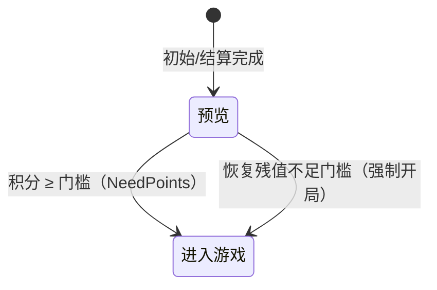

# 玩家流程 · 预览（Preview · Game_Preview）

> 玩家流程的初始状态：机台待机与投币引导。五状态总览见 [[流程与视觉/流程/玩家流程/玩家流程总览]]；本文件只定义**预览**。

---

## 一、状态定义

| 项 | 内容 |
|----|------|
| 进入 | 打开该座位的炮台视图、状态栏视图、玩家 UI 三件套；亮「请投币」提示；隐藏出票指示（余票数字/出票就绪） |
| 持续 | 一次性断电恢复检查（恢复积分与彩票值）；持续等待投币 |
| 退出 | 熄灭「请投币」提示 |
| 接续条件 | **进入游戏**（两条路径）：① 常规投币达门槛——积分 ≥ NeedPoints；② 断电恢复残值——恢复出 0 < 积分 < 门槛 的残余分，0.5 秒后强制开局（不给退分） |

---

## 二、投币与资源初始化

- 门槛换算：NeedPoints = NeedCoins × PointsRate（现值 1 币 × 10 分 = **10 分开局**）
- 每投 1 币：游戏积分 +10、炮弹能量 +1（封顶 100），并累计现金流总账（玩家 + 全局，投币方向；兑换参数见 [[玩法系统/经济系统/经济系统]] §三）
- 门槛判定为流程线上的数据条件迁移（按座位号指向该玩家积分槽，每帧评估），投币即涨分、达标即切「进入游戏」
- 断电保护（两条链路，重启后在本状态生效）：
  - **积分**：积分恢复器按原子快照周期写回（0.25 秒级），重启恢复到断电前积分
  - **彩票值**：快照文件持久化，重启先恢复后清场，再延迟补发 UI 刷新事件（晚于清参事件的冲刷窗口）

---

## 三、UI 交互

| UI 元素 | 表现 | 说明 |
|---------|------|------|
| 投币引导 | 「请投币」提示亮起，切「进入游戏」时熄灭 | 与投币达标联动 |
| 分数区 | 显示恢复值 / 0 | 断电恢复后的积分直接显示 |
| 出票指示 | 余票数字与出票就绪提示保持隐藏 | 出票相关 UI 只在游玩中长按与退场结算时出现 |

---

## 四、操作/事件表

| 操作 | 触发条件 | 影响的数据 | 发出的事件 |
|------|---------|-----------|-----------|
| 投币 | 投币器 coins 信号 | 积分 +10/币、能量 +1/币（封顶）、现金流总账累计 | 积分刷新事件、能量刷新事件 |
| 开局判定 | 积分 ≥ NeedPoints（数据条件迁移） | 流程 → 进入游戏 | 流程切换 |
| 残值强制开局 | 恢复检查出 0 < 积分 < 门槛 | 流程 → 进入游戏 | 流程切换 |

---

## 五、关联文档

- [[流程与视觉/流程/玩家流程/玩家流程总览]] — 五状态总览与两线关系
- [[流程与视觉/流程/玩家流程/playing]] — 下一状态（进入游戏/游戏中/禁用操作）
- [[玩法系统/经济系统/经济系统]] — 投币兑换、三资源与断电保护
- [[设备输入输出系统/设备系统]] — 投币器输入信号
