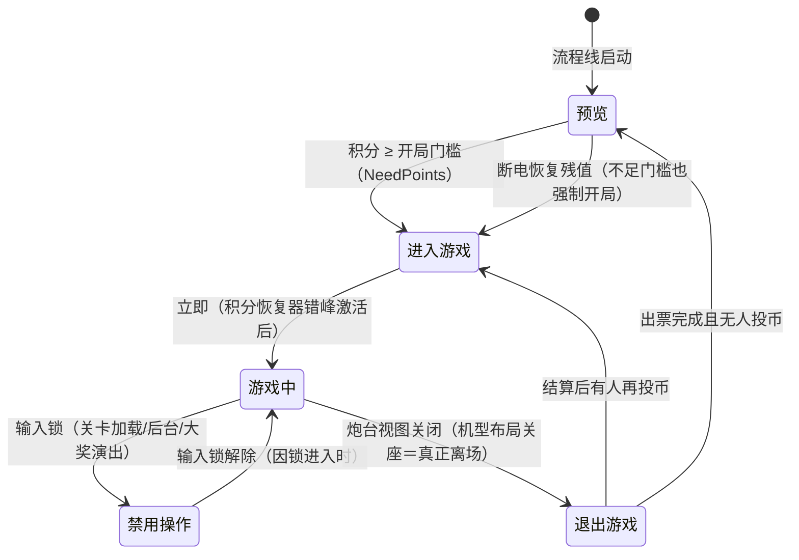

# 玩家流程总览（Game Flow）

> 玩家侧流程线：**每座机一条**（Flow_Game 预制体 ×10 实例，座位号 1–10），驱动单个玩家从待机→游玩→结算的循环。与**场景流程**（全局单条，见 [[流程与视觉/流程/场景流程]]）并行运行。

---

## 一、两套流程的关系

| | 场景流程 | 玩家流程 |
|---|---------|---------|
| 实例数 | 全局 1 条 | 每座 1 条（共 10 条） |
| 职责 | 关卡加载/生成/后台循环 | 单个玩家的 待机→游玩→结算 循环 |
| 初始态 | 场景加载（Loading） | 预览（Preview） |

两线**无直接状态嵌套**，通过**玩家输入锁**联动：

- 场景流程进入**加载**态 → 禁用全部玩家输入 → 各玩家线 游戏中 → 禁用操作
- 场景流程进入**后台**态 → 禁用全部玩家输入 → 各玩家线 游戏中 → 禁用操作（后台关闭时恢复输入并回加载态，与加载态加锁同帧衔接，无输入泄漏）
- 场景流程进入**生成**态 → 恢复输入 → 禁用操作 → 游戏中
- 大奖演出（聚宝盆/长转盘等）也会临时借用**禁用操作**态冻结玩家（演出结束恢复原状态，见 playing）

---

## 二、玩家流程五状态总览

| 状态 | 一句话职责 | 状态节点 | 独立文档 |
|------|-----------|---------|---------|
| 预览（Preview） | 待机吸引、投币引导、断电恢复检查 | Game_Preview | [[流程与视觉/流程/玩家流程/preview]] |
| 进入游戏（Enter） | 过渡态：错峰激活积分恢复器，随即转游玩 | Game_Enter | [[流程与视觉/流程/玩家流程/playing]] |
| 游戏中（Playing） | 主动玩法主载体：输入处理/开炮/游玩中出票 | Game_Playing | [[流程与视觉/流程/玩家流程/playing]] |
| 禁用操作（Disable） | 操作冻结：等输入锁解除或大奖演出结束 | Game_Disable | [[流程与视觉/流程/玩家流程/playing]] |
| 退出游戏（Exit） | 离场结算：全量清参＋出票，回预览或直回游戏 | Game_Exit | [[流程与视觉/流程/玩家流程/exit]] |

> 注：**彩票键不触发退场**。游玩中长按彩票键＝快照出票（只扣彩票值，不清积分/能量，留在游戏中）；退场唯一触发是炮台视图关闭（关座/离场）。

---

## 三、流程线机制口径

- 流程线自动收集子级状态节点注册状态机，初始态（预览）与部分迁移条件配置在流程预制体上，随座位实例覆写（预览→进入游戏的门槛条件按座位号指向对应玩家的积分槽）
- 状态机每帧先评估已配置的数据条件迁移，命中即切换；状态内代码也可直接发起切换（上表各迁移均有明确触发源）
- 流程线启动时统一完成：玩家数据槽绑定、投币信号绑定、输入锁注册、计分板染色、积分/彩票值断电恢复

---

## 四、预留与注记

| 项 | 现状 |
|----|------|
| 入场动画 | 进入游戏状态现无入场演出，为立即过渡（入场演出为预留策划意图，未实现） |
| GunnerFlow 空壳 | GunnerGame.cs 中存在空状态类 GunnerFlow：无状态定义、无逻辑、未挂载、无引用，不构成流程状态 |

---

## 五、关联文档

- [[流程与视觉/流程/场景流程]] — 场景侧流程线与两线联动
- [[流程与视觉/流程/玩家流程/preview]] / [[流程与视觉/流程/玩家流程/playing]] / [[流程与视觉/流程/玩家流程/exit]] — 各状态明细
- [[玩法系统/经济系统/经济系统]] — 投币兑换、三资源与断电保护
