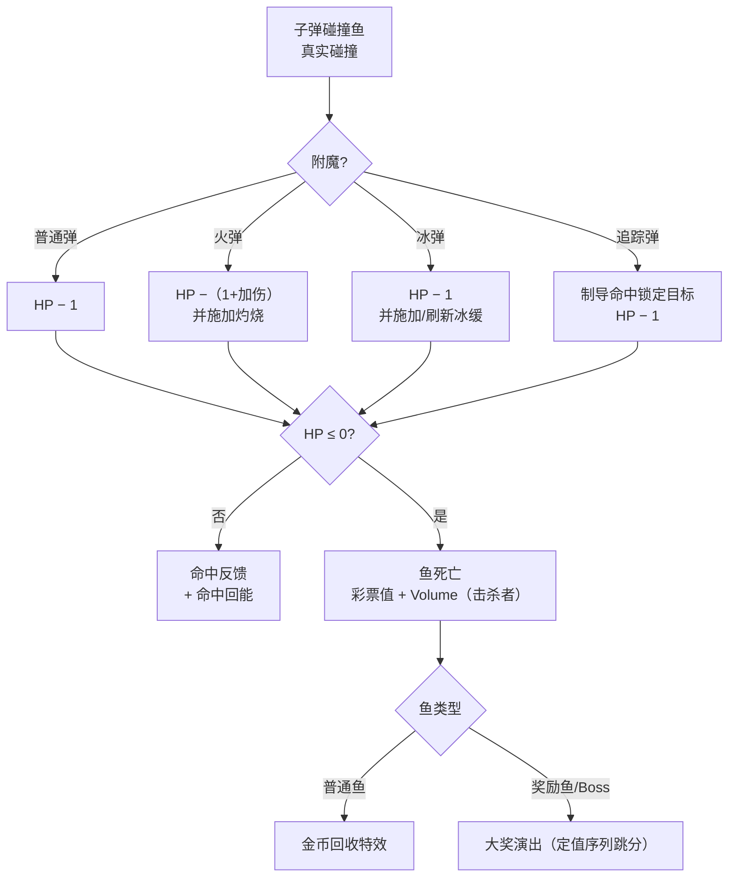

# 伤害系统（子弹-鱼 · 血量制伤害判定）

> 被动玩法系统的核心：**被发射的子弹碰撞到鱼产生的伤害判定**。命中、扣血、击杀全部由真实碰撞与玩家操作决定，无任何概率结算（政策红线①）。数值设计（HP/Volume 分档、R̄ 口径）归同目录 [[玩法系统/伤害系统/数值框架]]。

---

## 玩法定位

按 [[玩法系统/玩法系统分析方法论]] 口径定位（**打鱼玩法链主干**）：

| 项 | 定位 |
|----|------|
| 主动玩法 | **发射炮台子弹** = 主动玩法（发射键输入信号，挂炮台，见 [[实体/炮台/炮台]]） |
| 被动玩法 | 子弹（**不论是否附魔**）对鱼产生影响 = 被动玩法；**附魔子弹影响不同**——冰缓/灼烧/制导必中/射速提升（[[玩法系统/附魔系统/附魔系统]] §四） |
| 反馈 | 击杀时反馈数值 = **对应价值彩票**（实际反馈数值影响 = 彩票值 + 该鱼固定 Volume 计入击杀者；**未击杀 = 0**）；未击杀时另有命中回能反馈（能量，[[玩法系统/经济系统/经济系统]] §三） |
| 反馈链 | **击中特效、奖励特效实体**（击杀触发的金币回收特效 / 大奖演出，见 [[实体/鱼/奖励鱼]] 与 [[流程与视觉/特效/特效总览]]） |

---

## 一、系统定位

| 项 | 说明 |
|----|------|
| 职责 | 子弹 ↔ 鱼的碰撞伤害判定：命中 → 扣血 → 击杀判定 → 通知奖励结算 |
| 上游 | 炮台发射（[[实体/炮台/炮台]]）与子弹实体（[[实体/子弹/子弹]]） |
| 下游 | 击杀结算（彩票值 + Volume 入账，资源与出票归 [[玩法系统/经济系统/经济系统]]） |
| 政策定位 | 命中 = 真实碰撞；无命中概率判定、无池控/难度参数介入 |

---

## 二、命中与伤害规则

### 2.1 基本规则

```text
炮弹真实碰撞命中 → 鱼 HP − 伤害
HP ≤ 0 → 鱼死亡 → 击杀者彩票值 + 该鱼固定 Volume
```

| 规则 | 内容 |
| ---- | ---- |
| 击中判定 | 炮弹碰撞体接触鱼即命中，无概率判定 |
| 单发单目标 | 一发炮弹最多结算 1 个目标（攻击判定范围 ≠ 多目标） |
| 每发伤害 | 基础 1（1 级炮基准）；火弹 = 基础 + 火焰固定加伤；暴击 ×2（伤害强化层） |
| 命中回能 | 每次命中回复炮弹能量（必中回能 ≥1/发，能量不可耗尽，见 [[玩法系统/经济系统/经济系统]] §三） |
| 击杀归属 | **最后一击全奖**（终审 #5）：残血鱼被补刀时彩票归最后一击玩家；灼烧致死的最后一跳视为施加者的最后一击；伤害占比 UI 列后置优化 |
| 鱼群击杀 | 鱼群 HP 按 **GroupData 配置承载**（终审 #6）：开发期定具体实现，策划层不预设共享/独立；HP_pool=ΣHP 数学等价结论仍有效（数值侧） |
| Boss | 与普通鱼同样按 HP 扣减击杀（旧「Boss 命中绕过概率云直接死亡」已作废；Boss HP 高，是火/机关枪组合的核心目标） |

### 2.2 双语义字段

```text
HP：鱼需要承受的伤害总量（击杀所需命中数）
Volume：击杀后获得的彩票值（固定，语义收窄）
```

- R = Volume ÷ HP 是唯一定价自由度（性价比指标），定价原则与全鱼种分档见 [[玩法系统/伤害系统/数值框架]] §三/§四

### 2.3 暴击（伤害强化层 · 存量机制延续）

| 参数 | 值 | 说明 |
|------|:--:|------|
| 基础暴击率 | 20% | 既有暴击系统参数，存量延续 |
| 暴击伤害 | ×2 | 同上 |
| 冰+火目标暴击率 | 20% → 40% | 目标同时处于冰缓+灼烧时生效（附魔组合，见 [[玩法系统/附魔系统/附魔系统]] §4.5.1） |

> 合规边界：暴击只放大**扣血效率**，不参与命中判定、不参与奖励/掉落随机，不触碰 Volume。

### 2.4 状态伤害（附魔被动面）

附魔弹命中附加的状态/弹道效果（冰缓、灼烧跳伤、制导必中、射速提升）属于本系统的伤害效果层，规则与数值见 [[玩法系统/附魔系统/附魔系统]] §四：
- 灼烧跳伤可将 HP 扣至 0 触发击杀（最后一跳视为施加者最后一击）
- 灼烧只刷新剩余跳数不叠加伤害；冰缓只刷新时长不叠加强度

---

## 三、命中结算流程



---

## 四、操作/事件表

| 操作 | 触发条件 | 影响的数据 | 发出的事件 |
|------|---------|-----------|-----------|
| 命中 | 炮弹真实碰撞鱼 | 鱼 HP − 伤害；炮弹能量 +回能 | 命中反馈事件、能量变更事件 |
| 状态施加 | 冰/火弹命中 | 目标获得冰缓/灼烧状态 | 状态施加事件 |
| 灼烧跳伤 | 灼烧计时到期 | 鱼 HP − 每跳伤害 | 命中反馈事件（灼烧） |
| 击杀 | 鱼 HP ≤ 0 | 击杀者彩票值 + Volume | 鱼击杀事件（彩票入账见 [[玩法系统/经济系统/经济系统]] §四） |

---

## 五、政策合规自查

| # | 政策红线 | 本系统对照 | 结论 |
|:-:|---------|-----------|:--:|
| 1 | 无概率决定结果 | 命中 = 真实碰撞、扣血 = 固定值、击杀 = HP 归零；暴击属伤害强化层（不参与命中/奖励判定） | ✅ |
| 2 | 无倍率投注 | 伤害不随任何按键/炮等级放大（首版 1 级炮） | ✅ |
| 3 | 无奖励循环投入 | 命中回能为游戏内资源小循环（能量），与彩票值严格隔离 | ✅ |
| 4 | 技巧决定结果 | 瞄准、目标选择、发射时机、附魔组合直接决定命中与扣血效率 | ✅ |
| 5 | 无抽水/暗控 | 无池控/难度参数介入 | ✅ |

---

## 六、关联文档

- [[玩法系统/玩法系统分析方法论]] — 玩法定位口径（主动 + 被动：打鱼玩法链主干）
- [[玩法系统/伤害系统/数值框架]] — HP/Volume 定价、R̄ 与九档难度、附魔数值（数值权威）
- [[实体/子弹/子弹]] / [[实体/炮台/炮台]] — 发射与弹道实体侧
- [[玩法系统/经济系统/经济系统]] — 击杀彩票入账、出票结算与政策红线（固定 Volume → 彩票）
- [[玩法系统/附魔系统/附魔系统]] — 附魔弹被动效果与数值
- [[实体/鱼/鱼]] — 鱼实体生命周期与被击交互
