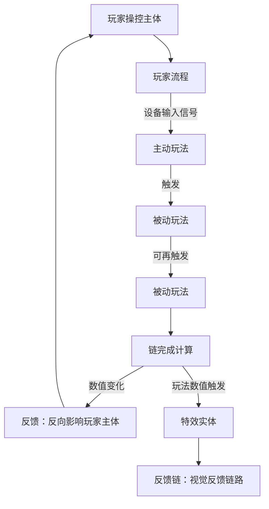

# 玩法系统分析方法论

> 玩法系统域的策划分析规范：定义玩法概念体系与因果骨架，规定玩法系统的分析方法步骤。`玩法系统/` 下各系统文档的「玩法定位」段均按本方法论口径编写（本项目系统定位总表含奖励＝特效实体裁定，见 §四）。

---

## 一、概念定义

| 概念 | 定义 |
|------|------|
| 玩家操控主体 | 玩家在游戏中操控的实体；**主动玩法都挂在操控主体上，主体变玩法变**。本项目玩家操控主体 = 炮台（[[实体/炮台/炮台]]） |
| 玩家流程 | 玩家从进入游戏到离开所经历的流程状态序列（预览/游玩/禁用操作/退出等，见 [[流程与视觉/流程/玩家流程/playing]] 等）；**不同流程有不同的玩法系统集合** |
| 主动玩法 | 由**设备输入信号触发**的玩家主动行为（发射炮台子弹、切换附魔、投币、按彩票键结算）；挂在操控主体上、在具体流程中进行 |
| 被动玩法 | 由主动玩法（或上游被动玩法）触发、**规则自动生效**的系统行为（子弹-鱼伤害判定、击杀结算、状态施加）；玩家不直接操作 |
| 玩法链 | 主动玩法触发对应系统的被动玩法、被动玩法可再触发被动玩法所形成的**链路** |
| 反馈 | 玩法链完成计算后**反向影响玩家主体**的结果，通常为主体数值变化（彩票值 + Volume、能量回能等） |
| 特效实体 | **反馈中的特殊实体**：由玩法数值触发形成的视觉表现实体（击中特效、奖励特效实体、多阶段大奖演出）。只作用于视觉、不作用于玩家主体，**无数据域、数据全部来自玩法实体**（特性详见 §1.1） |
| 反馈链 | 玩法数值触发特效实体后形成的**视觉反馈链路**（击中特效 → 奖励特效实体 → 多阶段演出跳分） |

### 1.1 特效实体的边界特性

- **只作用于视觉**：特效反馈作用于玩家视觉，**不作用于玩家主体**——反馈主体仍是**触发特效前的实体**（反馈数值已在该实体上结算完毕）。
- **无数据域**：特效实体不持有自己的数据，**数据全部来自玩法实体**（由触发它的玩法数值提供）；影响方向单向——**玩法实体影响特效，特效不影响玩法实体**。
- **交互式特效与子级主动玩法**：交互式特效/动画在**玩家主体输入禁用的流程状态**下进行；该状态下设备输入信号传给**特效主体**，形成**子级主动玩法**（子级主体 = 特效主体，父级玩家主体的输入同时禁用）。

---

## 二、因果骨架

玩法从主体到反馈的因果顺序：

骨架要点：

1. **主体 → 流程**：先有玩家操控主体，主体在玩家流程中行动；不同流程有不同的玩法系统集合。
2. **设备信号触发主动**：主动玩法由设备输入信号触发，挂在操控主体上。
3. **主动触发被动成链**：主动玩法触发对应系统的被动玩法，被动玩法可再触发被动玩法——链路即**玩法链**。
4. **链完成计算 → 反馈**：链完成计算后反向影响玩家主体（通常数值变化），形成反馈。
5. **反馈中的特殊实体 = 特效**：反馈中的特殊实体是特效——由玩法数值触发形成**视觉反馈链（反馈链）**；特效只作用于视觉、不作用于玩家主体，故无数据域、数据全部来自玩法实体。

---

## 三、分析方法步骤

| 步骤 | 分析内容 | 产出 |
|:--:|---------|------|
| 1 | **定操控主体与流程**：明确玩家操控主体是什么（主体变玩法变）；列出玩家流程（具体流程状态） | 主体定义 + 流程清单 |
| 2 | **定各流程的玩法系统集合**：逐流程确定该流程下生效的玩法系统集合 | 流程 × 玩法系统矩阵 |
| 3 | **逐系统定位**：对每个系统逐项定位——主动/被动属性、在玩法链中的位置（触发源与下游）、反馈（影响玩家主体的什么数值）、反馈链（触发哪些特效实体） | 各系统文档「玩法定位」段 |

---

## 四、本项目系统定位总表（含奖励裁定）

| 系统 | 方法论定位 | 定位要点 |
|------|-----------|---------|
| [[玩法系统/经济系统/经济系统\|经济系统]] | **主动玩法** | 经济数值属炮台（玩家主体 = 炮台），属性在炮台内直接使用；实现挂炮台实体或玩家流程对应按键操作 |
| 奖励系统（已解散） | **特效实体（不成系统）** | 由玩家打鱼玩法链触发；交互式特效/动画在玩家主体输入禁用的流程状态下进行，该状态下输入信号传给特效主体形成子级主动玩法（特性见 §1.1）；奖励实体与定值序列见 [[实体/鱼/奖励鱼]]，击杀彩票数值归 [[玩法系统/经济系统/经济系统]] |
| [[玩法系统/附魔系统/附魔系统\|附魔系统]] | **实体 + 主动 + 被动** | 附魔道具 = 实体（处于炮台背包存储）；使用炮台背包内道具的操作 = 主动玩法；附魔对象 = 子弹；附魔道具对子弹产生附带效果 = 道具与子弹的交互 = 被动玩法 |
| [[玩法系统/伤害系统/伤害系统\|伤害系统]] | **主动 + 被动（打鱼玩法链主干）** | 发射炮台子弹 = 主动玩法；子弹（不论是否附魔）对鱼产生影响、附魔子弹影响不同 = 被动玩法；击杀时反馈数值 = 对应价值彩票（实际反馈数值影响 = 彩票，未击杀 = 0）；反馈链 = 击中特效、奖励特效实体 |

---

## 五、关联文档

- [[玩法系统/经济系统/经济系统]] / [[玩法系统/附魔系统/附魔系统]] / [[玩法系统/伤害系统/伤害系统]] — 三系统文档（各含「玩法定位」段）；奖励已裁定为特效实体不成系统、无独立系统文档（裁定记录见 §四）
- [[流程与视觉/流程/玩家流程/playing]] — 玩家流程（主动玩法载体）
- [[实体/炮台/炮台]] — 玩家操控主体
