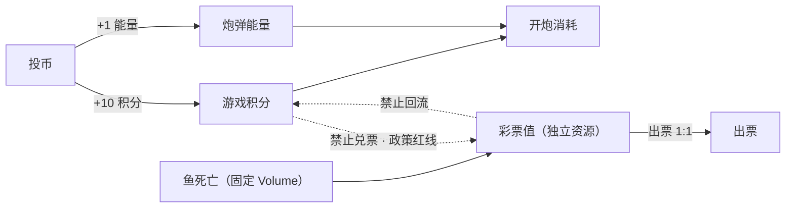
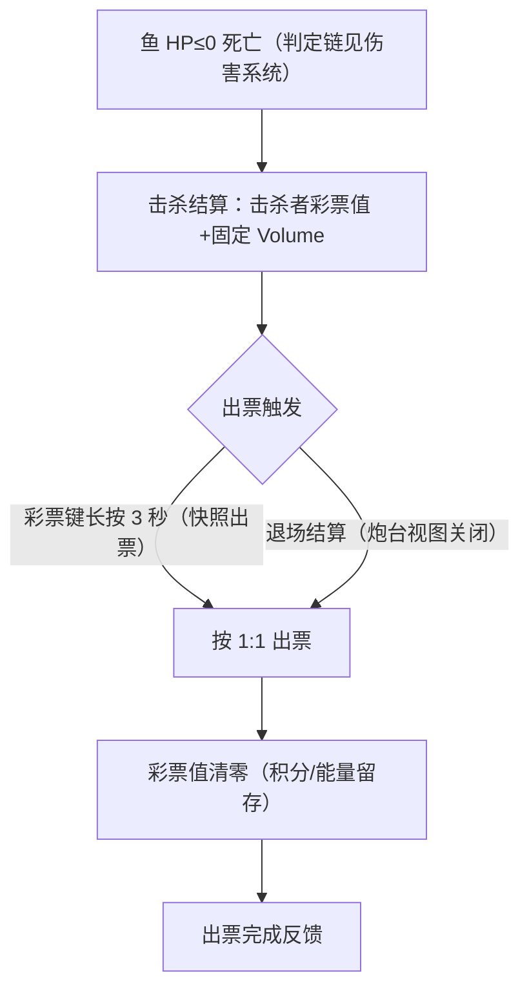

# 经济系统（三资源 · 兑换与隔离）

> 玩家资源体系：资源定义、**三资源隔离铁律**、首版兑换参数、**彩票分隔离与政策红线（彩票机版本口径）**、出票结算细则（§六，快照出票/退场结算两个出票入口）与资源向操作/事件表。击杀判定链归 [[玩法系统/伤害系统/伤害系统]]；出票硬件链路归 [[设备输入输出系统/设备系统]]。

---

## 玩法定位

按 [[玩法系统/玩法系统分析方法论]] 口径定位：

| 项 | 定位 |
|----|------|
| 玩法属性 | **主动玩法**——由设备输入信号触发的资源交互（投币器投币、发射键开炮、彩票键结算） |
| 数值归属 | 经济数值属**炮台**（玩家操控主体 = 炮台）：游戏积分/炮弹能量/彩票值属性在炮台内直接使用 |
| 实现挂载 | 挂**炮台实体**，或**玩家流程**中对应的按键操作（[[流程与视觉/流程/玩家流程/playing]] / [[流程与视觉/流程/玩家流程/exit]]） |

玩法链位置：投币/开炮/结算等输入信号（主动玩法，挂炮台）→ 资源变更直接在炮台属性上结算（积分/能量/彩票值增减）→ 反馈即玩家主体数值变化（弹药盘/积分显示刷新）；伤害判定链见 [[玩法系统/伤害系统/伤害系统]]，命中回能与击杀彩票入账的资源口径在本文 §三/§四 承载。

---

## 一、资源定义

| 资源 | 类型 | 获得方式 | 用途 | 禁止 |
|------|----|---------|------|------|
| 游戏积分 | 整数 | 投币获得 | 发射炮弹时消耗 | 直接作为最终奖励领取 |
| 炮弹能量 | 整数 | 投币同时获得 | 发射炮弹时消耗 | — |
| 彩票值 | 整数 | 鱼死亡直接获得（按该鱼固定 Volume，不经游戏积分中转） | 最终结算出票 | 回流为游戏积分或炮弹能量；由游戏积分兑换获得 |

> 术语映射：「炮弹能量」在当前实现中对应「炮弹积分（AmmoPoints）」——命名差异仅在实现层，资源语义以本文档为准。

---

## 二、三资源隔离铁律

```text
游戏积分 / 炮弹能量：用于继续游戏
彩票值：仅用于最终结算
```

| 禁止项 | 说明 |
| ----------- | ---------------------- |
| 彩票值 → 积分/能量 | 禁止（奖励循环投入，红线③） |
| 积分 → 彩票值 | 禁止（政策红线：回分兑票构成赌博性质，见 §六；积分只能开炮消耗） |
| 道具 → 彩票值/积分 | 禁止（道具溢出即损失，见 [[玩法系统/附魔系统/附魔系统]] §5.4） |
| 附魔加成彩票 | 禁止（任何道具/组合不改 Volume） |

彩票值不能直接重新变成游戏积分或炮弹能量，否则构成「奖励循环投入游戏」的审核风险。

---

## 三、首版兑换参数（1 级炮阶段）

| 项 | 值 | 说明 |
|----|:--:|------|
| 1 个游戏币 → 游戏积分 | 10 | 终审 #1 拍板；原 PointsRate 语义收编为固定值 |
| 1 个游戏币 → 炮弹能量 | 1 | 保证有最低炮等级可消耗的能量 |
| 1 级炮发射 → 消耗 | 1 积分 + 1 能量 | 双资源同耗 |
| 命中鱼 → 回复能量 | ≥1 / 发（必中回能） | 子弹范围攻击+遇墙反弹必中 → 每发至少命中 1 目标、回能 ≥1 ≥ 每发耗能 1，**能量不可能耗尽**；具体回能数值待玩法定（取 >1 仅加快能量盈余，不影响模型）；**能量上限 = 100**（终审 #13） |
| 炮弹能量不足 | 不能发射 | 保底规则沿用；必中回能机制下正常游玩能量不会耗尽——**能量非瓶颈，积分（10 发/币）是唯一弹药约束**（终审 #13） |
| 出票兑换 | 1 彩票值 = 1 票 | 兑换率暂定 **1:1**（PointToLotteryRate=1），运营旋钮，待运营确认（口径见 §六） |

**经济语义**：1 币名义额度 = 10 发（积分面），且每币实际发数恒为 10 发——能量经必中回能恒为净盈余，不构成约束；积分是唯一弹药约束。出票率模型与敏感性分析见 [[玩法系统/伤害系统/数值框架]] §二。

---

## 四、资源向操作/事件表

| 操作 | 触发条件 | 影响的数据 | 发出的事件 |
|------|---------|-----------|-----------|
| 投币 | 玩家投入硬币 | 游戏积分+10、炮弹能量+1 | 积分刷新事件 |
| 开炮 | 按发射键，且积分≥1 且能量≥1 | 游戏积分−1、炮弹能量−1 | 子弹发射事件 |
| 命中 | 子弹真实碰撞鱼 | 鱼 HP−1；**命中回能**：炮弹能量 +回能（≥1/发，具体数值待玩法定） | 命中反馈事件、能量变更事件 |
| 击杀 | 鱼 HP≤0 | 彩票值+ Volume（击杀者） | 鱼击杀事件 |
| 结算 | 按彩票键 | 彩票值按 1:1 出票；出票后彩票值清零，游戏积分/炮弹能量留存不清（见 §六） | 结算完成事件 |

---

## 五、断电保护

- 所有位置的分数在游戏被不正常关闭（如断电重启）的情况下，重启后恢复保留（关闭前的玩家分数/彩票值不变，自动恢复）
- 彩票值为玩家已获权益，**断电/重启不丢失**（须持久化存储）——街机运营合规要求

---

## 六、彩票分隔离与政策红线（彩票机版本口径）

> 本版本为**伤害判定玩法**：鱼死亡直接获得彩票价值，彩票值（彩票分）是与游戏积分彻底隔离的独立资源，链路单向——击杀 → 彩票值 → 出票，不存在任何积分兑票通路。概率制主线的积分兑票路线不适用于本版本。

| # | 口径 | 内容 |
|:-:|------|------|
| 1 | 彩票分独立资源 | 彩票值为独立资源：鱼死亡时击杀者**直接获得**该鱼固定 Volume 的彩票价值，不经游戏积分中转，不受任何概率/倍率影响 |
| 2 | 游戏积分 ⇏ 彩票 | **政策红线：游戏积分不可兑换彩票**——回分兑换彩票构成赌博性质（政策不允许），游戏内不存在任何「积分 → 彩票」兑换入口（含后台/设置） |
| 3 | 出票 1:1 | 出票兑换率暂定 **1:1**（1 彩票值 = 1 票，PointToLotteryRate=1），出票数仅由彩票值决定，与游戏积分无关 |
| 4 | 退场积分留存 | 退场结算**不清**游戏积分/炮弹能量等游玩数值（积分留存，可继续游玩）；出票后仅**彩票值清零**（防重复出票，断电快照同步） |



**与三资源兑换（§三）的关系**：投币兑换（1 币 = 10 积分 + 1 能量）不受影响——游戏积分仍是纯**游玩资源**（投币获得、开炮消耗，与命中回能联动），仅「兑票」这一通路被政策禁止；彩票值只来自击杀（§四 击杀结算）、只去向出票（1:1）。两条链路（币 → 积分/能量 → 游玩；击杀 → 彩票值 → 出票）单向且互不兑换，与 §二 铁律完全一致。

**出票结算细则（两个出票入口）**：

| 出票入口 | 触发 | 口径 |
|---------|------|------|
| ① 游玩中快照出票 | 彩票键**长按 3 秒**触发一次 | **不退场**：出票数 = 彩票值快照 × 1（1:1 下即彩票值，不产生余数）；出票后彩票值清零，游戏积分/炮弹能量不动，留在游戏中继续游玩（流程交互见 [[流程与视觉/流程/玩家流程/playing]] §二） |
| ② 退场结算出票 | 炮台视图关闭（关座/真正离场）后离场结算 | 同按 1:1 出票并清零彩票值（断电快照同步清零）；游戏积分/炮弹能量留存不清（流程见 [[流程与视觉/流程/玩家流程/exit]] §二） |



---

## 七、政策合规自查

| # | 政策红线 | 本系统对照 | 结论 |
|:-:|---------|-----------|:--:|
| 1 | 无概率决定结果 | 资源获得与消耗全部为固定兑换，无随机；击杀彩票为固定 Volume，无滚值/池控随机 | ✅ |
| 2 | 无倍率投注 | 兑换率固定（出票 1:1），无按键放大投入与收益 | ✅ |
| 3 | 无奖励循环投入 | 三资源隔离铁律；彩票只出不回 | ✅ |
| 4 | 技巧决定结果 | 资源转化为命中/击杀由操作决定；彩票值全部来自真实命中与击杀 | ✅ |
| 5 | 无回分兑换彩票 | 游戏积分不可兑换彩票（§六口径②），兑票通路不存在 | ✅ |

---

## 八、关联文档

- [[玩法系统/玩法系统分析方法论]] — 玩法定位口径（主动玩法）
- [[总体策划]] — 血量制核心循环与政策红线
- [[玩法系统/伤害系统/伤害系统]] — 击杀判定链（击杀 → 固定 Volume → 彩票入账）
- [[玩法系统/伤害系统/数值框架]] — 出票率公式与经济模型（数值权威）
- [[实体/炮台/炮台]] — 发射消耗与弹尽表现
- [[流程与视觉/流程/玩家流程/playing]] / [[流程与视觉/流程/玩家流程/exit]] — 两个出票入口的流程侧
- [[设备输入输出系统/设备系统]] — 投币器/出票器硬件链路
