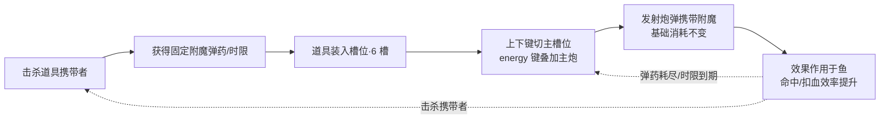
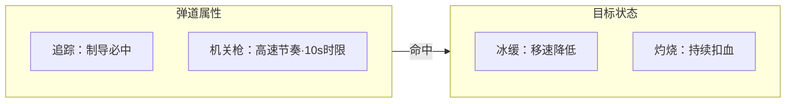
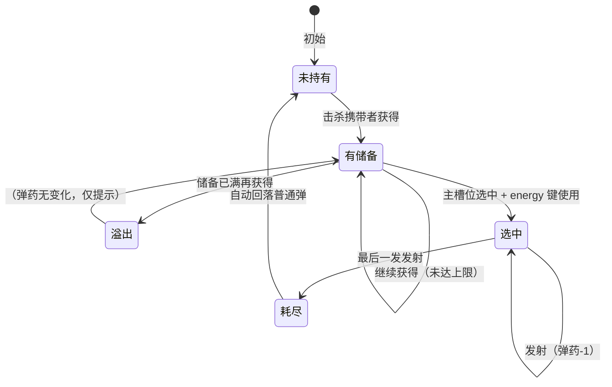
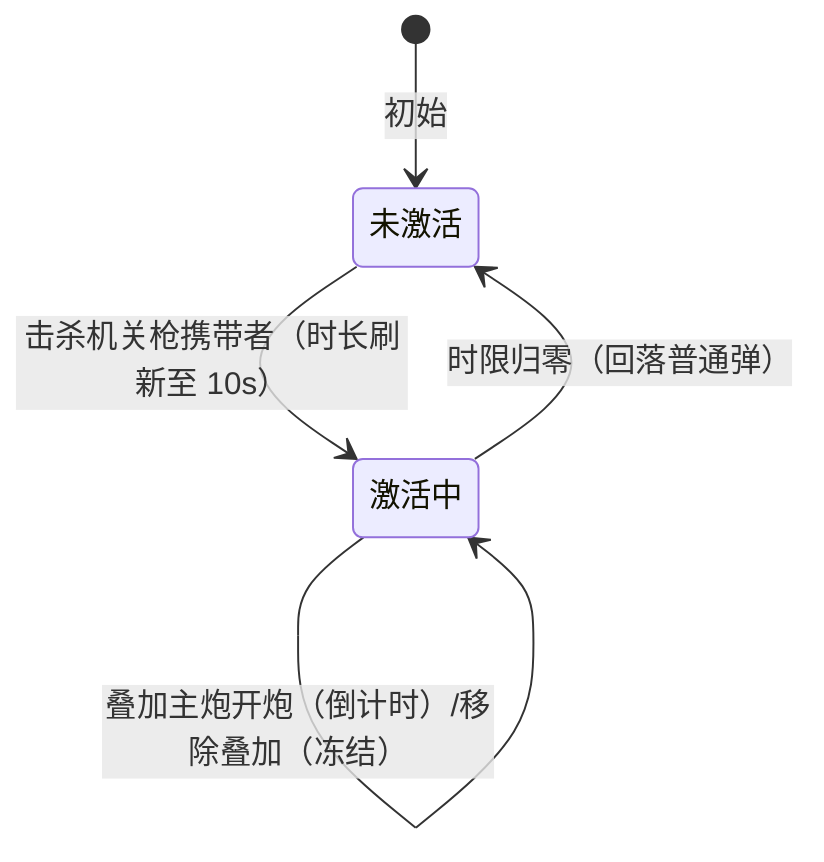

# 附魔系统（血量制 · 技巧放大器）

> 本文按**主动玩法 / 被动玩法**两面组织：
> - **主动玩法** = 玩家利用输入信号（上下键 / energy 键）使用附魔道具、把附魔**叠加到主炮**（经主炮发射的炮弹生效）的全部交互与数据——主槽位切换（6 槽环形）、储备消耗、时限激活；
> - **被动玩法** = 附魔生效后由规则自动生效的效果——机关枪射速提升（发射节奏）与附魔弹命中鱼后的伤害效果（灼烧跳伤 / 冰缓 / 制导必中）与数值。
>
> 经济口径：**彩票机口径**（鱼死亡直接得彩票值 LotteryValue，游戏积分不可兑换彩票，见 [[玩法系统/经济系统/经济系统]] §六）；附魔一切数值按 HP/Volume 定价模型核对（数值权威 [[玩法系统/伤害系统/数值框架]] v3.3 §五）。

---

## 玩法定位

按 [[玩法系统/玩法系统分析方法论]] 口径定位：

| 项 | 定位 |
|----|------|
| 附魔道具 | **实体**——处于**炮台背包**（6 槽位）存储的道具实体（冰/火/追踪/机关枪） |
| 主动玩法 | **使用炮台背包内道具的操作** = 主动玩法：上下键切换主槽位选择附魔、energy 键使用道具将附魔叠加到主炮、发射时消耗储备 / 机关枪时限激活（§三 主动面） |
| 附魔对象 | **主炮**——energy 键使用后附魔叠加到主炮，经主炮发射的炮弹携带生效 |
| 被动玩法 | 附魔叠加到主炮后由规则自动生效的效果 = **被动玩法**：机关枪射速提升（发射节奏）与附魔弹命中后的冰缓/灼烧/制导必中（§四 被动面） |

玩法链位置：上下键/energy 键/发射键输入信号（主动玩法，挂炮台）→ 附魔叠加到主炮（道具实体 → 主炮，经炮弹携带生效）→ 子弹-鱼碰撞伤害判定（被动玩法，[[玩法系统/伤害系统/伤害系统]]）→ 效果与数值反馈。

---

## 首版范围（M1 首版）

> 负责人 2026-09-05 立项拍板确定的首次实现范围与数据过渡形态；本文其余章节为完整设计口径，首版实现按本节裁剪。

| 项 | 首版口径 |
|----|---------|
| 首版道具 | **机关枪 + 冰** 先行实现；**追踪 / 火**为后续版本接入（语义与数值口径已在本文 §二~§四 锁定，实现排期后续） |
| 输入交互 | 上下键切换主槽位（6 槽环形）、energy 键使用主槽位道具叠加到主炮（§三）；**双击下键切炮类型玩法彻底退役**——无炮台切换玩法，**炮型恒 1 级** |
| UI | 暂用关卡风格信息 UI：显示 6 个槽位的道具 + 主炮附魔叠加情况（§3.2；§十 1 已拍板暂定方案）；正式 UI 后续 |
| 数据过渡形态 | 附魔道具数据类入**玩家数据 GameModel**；附魔道具**实体 prefab 与 .duowei 表（§9.1 表 A/表 B）随实体回补时接入** |

---

## 一、系统定位

### 1.1 一句话职责

附魔系统管理**附魔道具的获取、储备、槽位选择与使用**——玩家击杀携带附魔道具的鱼（携带者）获得附魔能力，通过上下键切换主槽位选择附魔、energy 键使用道具将附魔叠加到主炮，使炮弹获得附加效果。

### 1.2 政策定位（技巧放大器 · 彩票机经济口径）

道具系统的全部价值在于**放大玩家的命中效率与扣血效率**，为「技巧决定结果」服务：

| 铁律   | 内容                                | 对应政策红线       |
| ---- | --------------------------------- | ------------ |
| 铁律 1 | 附魔弹**不改变**单发基础消耗（仍为 1 积分 + 1 能量；储备型另耗 1 发附魔弹药——附魔弹药为道具储备，非投注资源）  | 无倍率投注（红线②）   |
| 铁律 2 | **附魔不改击杀彩票值**：鱼 HP≤0 死亡时击杀者**直接获得**该鱼固定 Volume 的彩票值（LotteryValue，不经游戏积分中转）；多阶段定值演出总额恒等于 Volume（[[实体/鱼/奖励鱼]] §三）——任何附魔、组合都不触碰该值        | 无倍率投注（红线②）   |
| 铁律 3 | 道具获取与效果**全链路无随机**（生成确定、携带必掉、效果确定；冰火组合的暴击为伤害强化层存量机制，只放大扣血效率，不参与命中判定与奖励随机） | 无概率决定结果（红线①） |
| 铁律 4 | 附魔**不引入任何积分 ⇄ 彩票通路**：游戏积分不可兑换彩票（政策红线），附魔弹药/道具与彩票值、游戏积分零互换（储备溢出即损失） | 彩票分隔离（[[玩法系统/经济系统/经济系统]] §六） |

> 数值侧口径：附魔对出票率（= 命中率 p × 加权单命中彩票值 R̄，公式见 [[玩法系统/伤害系统/数值框架]] §2.2）的全部影响经 §五 验算封顶——追踪弹场次发数占比 ρ ≤ 15%（终审 #4）、火弹发数占比 β ≤ 10%（数值侧护栏）、冰火暴击期望伤害 1.2→1.4；本文不重复维护数值，只锁定语义与约束。

### 1.3 在核心循环中的位置



---

## 二、道具总览与统一模型

### 2.1 双模型：储备制 + 时限制

机关枪为 **10 秒时限制**——储备制的「有限发数自然限定高射速收益」对机关枪约束不足，固定时限直接封顶高速节奏的持续时间。（时限口径：负责人 2026-09-05 立项拍板 **10 秒**，覆盖终审 #2 的 6 秒口径。）

四种道具分为两类模型：

**储备制（冰 / 火 / 追踪）**：

```text
获得：击杀携带者 → 该道具弹药数 + 固定数量（待数值）
储备：6 槽位中对应槽显示剩余弹药（信息 UI，§3.2）
使用：上下键切至主槽位 → energy 键使用，附魔叠加到主炮；开炮每发额外消耗 1 发该弹药
耗尽：自动回落普通炮弹，对应槽位置灰
```

**时限制（机关枪）**：

```text
获得：击杀携带者 → 激活机关枪模式并刷新至固定时长 10 秒（玩法锁定）
使用：激活期间开炮采用高速连发节奏，不消耗弹药（每发仍耗 1 积分 + 1 能量）
到期：计时结束自动回落普通炮弹；再次击杀携带者重新激活并刷新
```

统一的好处：规则单一（玩家只学两次：攒弹药 / 抢时效）、四道具同屏共存、数值侧按「发数 + 时长」统一定价。

### 2.2 道具清单

| 道具 | 模型 | 作用层 | 效果方向 | 价值定位 |
|------|------|--------|---------|---------|
| 冰属性炮弹 | 储备制 | 目标状态 | 命中使目标**冰缓**（移速降低） | 控场：让目标更容易被持续命中 |
| 火属性炮弹 | 储备制 | 目标状态 | 提高单发伤害 + 命中施加**灼烧**持续扣血 | 输出：更快削减高 HP 鱼 |
| 追踪炮弹 | 储备制 | 弹道属性 | 制导飞向已锁定目标，**必中单一目标** | 精准：消灭瞄准误差 |
| 机关枪炮弹 | **时限制（10s）** | 弹道属性 | 高速连发节奏（发射间隔缩短） | 节奏：单位时间倾泻更多弹药 |

> 作用层说明：**目标状态**作用在鱼身上（可与其他状态共存）；**弹道属性**作用在炮弹飞行/发射节奏上。主动使用面上四者统一为「上下键切主槽位 → energy 键使用叠加主炮 → 发射」，差异仅在储备消耗（发数）与时限激活（机关枪）；效果差异见 §四 被动玩法。

### 2.3 通用规则（四道具共用）

| 规则 | 内容 |
|------|------|
| 单发单附魔 | 同一发炮弹只携带一种附魔；组合通过不同炮弹先后作用实现（§4.5） |
| 单发单目标 | 附魔**不改变**单发最多结算 1 个目标的规则 |
| 基础消耗不变 | 附魔弹发射仍消耗 1 积分 + 1 能量（机关枪额外不消耗弹药；储备型额外只消耗 1 发弹药） |
| 不改彩票 | 任何附魔、组合都不改变击杀后的固定 Volume（铁律 2） |

---

## 三、主动玩法：道具使用（叠加到主炮）

> 玩家侧的全部操作面：**上下键切换主槽位 → energy 键使用道具、附魔叠加到主炮 → 储备消耗 / 时限激活**。输入信号 = 上下键 + energy 键 + 摇杆锁定（追踪前置）+ 发射键；**双击下键切炮类型玩法彻底退役**——无炮台切换玩法，炮型恒 1 级。

### 3.1 输入交互：上下键切换主槽位（6 槽环形）+ energy 键使用叠加主炮

```text
槽位模型：6 槽位环形排布，其中 1 个为主槽位（选中态，UI 高亮）
上下键：切换主槽位（沿 6 槽环形循环移动选中态）
energy 键：使用主槽位道具 → 该附魔叠加到主炮（主炮发射的炮弹携带附魔生效，§四）
双击下键：切炮类型玩法彻底退役——无炮台切换玩法，炮型恒 1 级
```

| 规则 | 内容 |
|------|------|
| 主槽位 | 6 槽中当前选中的 1 个槽位；首版道具为机关枪 + 冰（「首版范围」），空余槽位预留后续道具（追踪/火及高级附魔，§十 10） |
| 切换 | 上下键沿环形切换主槽位；跳过空槽与不可用道具槽（未持有/已耗尽/未激活，置灰） |
| 使用 | energy 键使用主槽位道具，附魔叠加到主炮；主炮无任何叠加时发射普通弹 |
| 耗尽自动回落 | 储备型弹药耗尽、或机关枪时限归零的瞬间，主炮对应叠加失效、回落普通弹，槽位置灰 |
| 新获得提示 | 获得道具时对应槽位点亮 + 提示（不自动切换主槽位，玩家自己决定战术） |
| 叠加细则 | 主炮同时叠加多个附魔的数量上限/互斥关系由主程设计期定稿（跨层共存口径参考 §4.5：弹道层与状态层可同时生效） |

### 3.2 附魔信息 UI（暂用关卡风格 · §十 1 已拍板暂定方案）

首版暂用**关卡风格信息 UI**：显示 **6 个槽位的道具**（主槽位高亮、空槽/耗尽置灰；冰/火/追踪显剩余发数，机关枪显剩余时限秒数）+ **主炮附魔叠加情况**（当前叠加在主炮上的附魔）。正式 UI 后续版本再定；冻结态的可感知表达随 §十 2 由主程设计期定稿。本系统只定语义，UI 实现细节归 GameDD 附魔系统设计。

### 3.3 各道具的主动使用数据

#### 冰属性炮弹（储备制 · 主动面）

| 主动规则 | 内容 |
|---------|------|
| 选中方式 | 上下键切至主槽位，energy 键使用叠加主炮 |
| 消耗 | 开炮每发额外消耗 1 发冰弹弹药 |
| 耗尽 | 最后一发发射后自动回落普通弹 |
| 储备上限 | 到达上限后再获得 = 溢出损失（§5.4） |

主动参数：

| 参数 | 类型 | 建议范围 | 口径说明 |
|------|------|---------|---------|
| 单次掉落冰弹数(发) | 整数 | 5 ~ 20 | 待数值（携带者掉落配置，§五） |
| 冰弹储备上限(发) | 整数 | 20 ~ 60 | 待数值；数值入模基线 30（数值框架 §5.1） |

#### 火属性炮弹（储备制 · 主动面）

| 主动规则 | 内容 |
|---------|------|
| 选中方式 | 上下键切至主槽位，energy 键使用叠加主炮 |
| 消耗 | 开炮每发额外消耗 1 发火弹弹药 |
| 耗尽 | 最后一发发射后自动回落普通弹 |
| 储备上限 | 到达上限后再获得 = 溢出损失 |

主动参数：

| 参数 | 类型 | 建议范围 | 口径说明 |
|------|------|---------|---------|
| 单次掉落火弹数(发) | 整数 | 5 ~ 20 | 待数值 |
| 火弹储备上限(发) | 整数 | 20 ~ 40 | 待数值；数值入模基线 20（数值框架 §5.1）——储备上限是 β≤10% 配额的实现载体（数值框架 §5.3 验算 1），上探须复核配额 |

#### 追踪炮弹（储备制 · 主动面，含锁定前置）

| 主动规则 | 内容 |
|---------|------|
| 前置操作 | 玩家先通过摇杆锁定一个目标（锁定交互沿用 [[实体/炮台/炮台]] §3.1；追踪激活时锁定范围放宽，见 §4.3） |
| 选中方式 | 上下键切至主槽位，energy 键使用叠加主炮 |
| 消耗 | 开炮每发额外消耗 1 发追踪弹弹药 |
| 无锁定时发射 | 未锁定目标时发射追踪弹 = 普通直飞弹（仍消耗弹药，引导玩家先锁定；备选口径待裁定，§十 7） |
| 耗尽 | 最后一发发射后自动回落普通弹 |

主动参数（**终审 #4 已拍板**：必中 p=1.0 + 供给配额）：

| 参数 | 类型 | 建议范围 | 口径说明 |
|------|------|---------|---------|
| 单次掉落追踪弹数(发) | 整数 | **5 ~ 8** | 终审 #4 拍板（供给配额压掉落） |
| 追踪弹储备上限(发) | 整数 | **15 ~ 20** | 终审 #4 拍板；数值入模基线 18（数值框架 §5.1） |

#### 机关枪炮弹（时限制 · 主动面）

| 主动规则 | 内容 |
|---------|------|
| 激活 | 击杀机关枪携带者立即激活（无需手动选中），剩余时长**刷新至满 10 秒**——重复击杀不叠加、只刷新（确定性封顶） |
| 选中方式 | 激活期间可经上下键切至主槽位、energy 键使用叠加主炮；未激活时该槽不可用（跳过） |
| 计时冻结 | 时限仅在**机关枪附魔叠加于主炮生效期间**倒计时；叠加移除时冻结保留，恢复叠加继续（玩家可战术性分段用完）——冻结细则（含禁用期间冻结）由主程设计期定稿后回填（§十 2） |
| 消耗 | 激活期间每发消耗 1 积分 + 1 能量——**不消耗任何弹药** |
| 到期 | 时限归零自动回落经典节奏与普通弹，机关枪槽位熄灭 |

主动参数（时长为玩法锁定项）：

| 参数 | 类型 | 建议范围 | 口径说明 |
|------|------|---------|---------|
| 机关枪持续时长(秒) | 整数 | **固定 10（玩法锁定）** | 负责人 2026-09-05 立项拍板（覆盖终审 #2 的 6 秒口径）；重复获得只刷新不叠加 |
| 机关枪连发间隔(毫秒) | 整数 | 80 ~ 150 | 待数值；数值入模基线 100（射速 0.1s/发，数值框架 §1.3） |
| 经典连发间隔(毫秒) | 整数 | 150 ~ 300 | 待数值；数值入模基线 200（射速 0.2s/发），随本表一并定稿 |

### 3.4 主动操作/事件表

| 操作 | 触发条件 | 影响的数据 | 发出的事件 |
|------|---------|-----------|-----------|
| 获得道具（储备型） | 携带者死亡（击杀者判定） | 该道具弹药数 +N | 道具获得事件 |
| 获得机关枪 | 机关枪携带者死亡（击杀者判定） | 机关枪剩余时长刷新至 10s | 道具获得事件（机关枪） |
| 切换主槽位 | 按上下键 | 主槽位索引变更（6 槽环形） | 槽位切换事件 |
| 使用主槽位道具 | 按 energy 键（主槽位道具可用） | 附魔叠加到主炮（机关枪=时限激活生效） | 附魔叠加事件 |
| 发射附魔弹 | 开炮且主炮带附魔叠加 | 积分−1、能量−1（储备型另−1 弹药） | 子弹发射事件（带附魔类型） |
| 弹药耗尽 | 储备型最后一发发射后 | 主炮对应叠加失效、回落普通弹 | 弹药耗尽事件 |
| 机关枪到期 | 剩余时长归零 | 机关枪熄灭、回落普通弹 | 机关枪结束事件 |
| 溢出 | 携带者死亡且对应储备已满 | 无变化 | 溢出提示事件 |

---

## 四、被动玩法：附魔子弹对鱼的效果

> 效果面总览：附魔叠加到主炮后由规则自动生效的效果——机关枪射速提升（发射节奏，单位时间命中数放大）与附魔弹**碰撞鱼之后**的伤害效果（灼烧跳伤、冰缓、制导必中）与数值。

### 4.1 冰属性炮弹 → 冰缓（目标状态）

**效果语义**：冰弹命中目标 → 目标进入**冰缓**状态：沿路径移动速度按固定比例降低，持续固定时长。表现为鱼身结冰色/减速动画。

| 状态规则 | 内容 |
|---------|------|
| 施加 | 冰弹命中即施加（无论是否击杀） |
| 叠加 | 同一目标重复命中**只刷新时长，不叠加强度**（防止无限堆减速） |
| 减速下限 | 目标速度最低不低于 0（完全静止需要专门强化道具，首版不开放——机关枪+定身会削弱瞄准价值） |
| 移除 | 时长到期自然移除；目标死亡/离场随之消失 |
| Boss 抗性 | Boss 类目标减速效果按固定折扣系数生效（大型目标抗控） |

效果参数：

| 参数 | 类型 | 建议范围 | 口径说明 |
|------|------|---------|---------|
| 冰缓减速比例 | 小数 | 30% ~ 70% | 待数值；数值入模基线 50%（数值框架 §5.1）。全鱼种统一或按鱼等级分档；须保证减速后速度 > 0 |
| 冰缓持续时长(秒) | 小数 | 2 ~ 6 | 待数值；数值入模基线 5s；与连射射速联动：保证刷新周期内可命中多发 |
| Boss 减速折扣系数 | 小数 | 0.2 ~ 0.6 | 终审确认项入模 0.4（Boss 实际减速 = 比例 × 折扣，如 50%×0.4=20%） |

### 4.2 火属性炮弹 → 加伤 + 灼烧跳伤（目标状态）

**效果语义**：火弹命中目标 → 单发伤害 = 基础伤害 + 火焰固定加伤；同时目标进入**灼烧**状态：每固定间隔扣 1 跳固定 HP，共固定跳数。表现为鱼身燃烧粒子。

| 状态规则 | 内容 |
|---------|------|
| 伤害 | 单发伤害为固定整数（基础 1 + 火焰加伤 +1，终审确认项拍板），不随机 |
| 施加 | 火弹命中即施加灼烧（无论是否击杀） |
| 叠加 | 同一目标重复命中**只刷新剩余跳数，不叠加伤害**（防止机关枪速叠灼烧数值爆炸） |
| 致死 | 灼烧跳伤害可将 HP 扣至 0，触发击杀；**灼烧致死的最后一跳视为施加者的最后一击**（击杀归属已裁定：最后一击全奖，见 [[玩法系统/伤害系统/伤害系统]] §2.1） |
| 移除 | 跳数耗尽自然移除；目标死亡/离场随之消失 |
| Boss | 灼烧对 Boss 正常生效（持续伤害是对 Boss 的主要战术） |

效果参数：

| 参数 | 类型 | 建议范围 | 口径说明 |
|------|------|---------|---------|
| 火焰单发加伤(HP) | 整数 | **固定 +1（终审拍板）** | 单发伤害 = 2；决定火弹对高 HP 鱼的性价比核心 |
| 灼烧每跳伤害(HP) | 整数 | 1 ~ 2 | 待数值；数值入模基线 2（固定整数，无暴击） |
| 灼烧跳间隔(秒) | 小数 | 0.5 ~ 1.0 | 待数值；数值入模基线 1.0 |
| 灼烧总跳数 | 整数 | 3 ~ 6 | 待数值；数值入模基线 4；总灼烧伤害 = 每跳 × 跳数 = **8/目标**（数值框架 §5.1 入模口径） |

### 4.3 追踪炮弹 → 制导必中（弹道属性）

> 由现有电击锁定炮（LightningCannonFunc）改造而来，锁定操作沿用现有摇杆锁定交互。

**效果语义**：选中追踪附魔且场上存在已锁定目标时，发射的炮弹**制导飞向该目标，必定命中该单一目标**（必中 p=1.0，终审 #4 方案 A）。

| 规则 | 内容 |
|------|------|
| 制导 | 炮弹飞行中持续转向锁定目标；**只制导该目标，不可转向其他目标** |
| 目标丢失 | 目标死亡/离场 → 已发射未命中的追踪弹转为直飞（可继续撞其他鱼） |
| 伤害 | 追踪弹伤害 = 基础伤害 1，**不加伤**（必中本身已是全部价值） |
| 锁定范围 | 可锁定目标等级低于普通锁定（见下表），覆盖高价值高速目标 |
| 供给配额 | 必中强度由**供给配额**封顶：掉落 5~8 发/次、储备上限 15~20、场次发数占比 ρ ≤ 15%（由关卡投放频率控制，终审 #4；验算见数值框架 §5.3 验算 2） |

| 锁定范围 | 目标 | 说明 |
|---------|------|------|
| 普通锁定（无附魔） | 精英鱼及以上 | 沿用现状 |
| 追踪锁定 | 进阶鱼（2xxx）及以上、奖励鱼（3xxx）、Boss（4xxx） | 追踪弹激活时放宽；普通小鱼不值得追踪 |

效果参数：

| 参数 | 类型 | 建议范围 | 口径说明 |
|------|------|---------|---------|
| 追踪弹伤害(HP) | 整数 | 固定 1 | 终审拍板：不加伤，必中即价值 |
| 制导转向能力 | 小数 | 待数值与实现侧共同标定 | 表现为「多远距离内发射仍能追上」；需保证高速鱼在一定距离内可追及（工程池课题） |

### 4.4 机关枪炮弹 → 射速提升（弹道属性）

**效果语义**：机关枪模式激活后的 **10 秒**内，开炮采用**高速连发节奏**（发射间隔 80~150ms，对比经典 150~300ms；入模基线 100ms/200ms），单位时间命中数 ×2——**单发投入产出比不变，只有节奏变快**（间隔数值见 §3.3）。

| 规则 | 内容 |
|------|------|
| 节奏 | 激活期间：单点单发；长按/自动连射按高速间隔发射（交互沿用 [[实体/炮台/炮台]] §3.2） |
| 伤害 | 机关枪弹伤害 = 基础伤害 1，**不加伤**（射速即价值；与冰缓/灼烧组合是核心打法） |
| 价值边界 | 高射速消耗积分/能量更快且有时限硬顶——机关枪是「单位时间投入与输出同步放大」的节奏选择，**不是**收益放大 |

### 4.5 组合规则（效果叠加）

**同一发炮弹只携带一种附魔**；组合 = 玩家切换主槽位使用不同道具，让不同附魔的效果**先后叠加在同一个目标/同一次攻击节奏上**（主炮多附魔叠加的数量上限/互斥见 §3.1 叠加细则）：



- **弹道层内部**：追踪 + 机关枪可同时生效（机关枪节奏发射追踪弹）；
- **状态层内部**：冰缓 + 灼烧可同时存在于一条鱼（互不覆盖）；
- **跨层**：弹道附魔决定「怎么打中/打多快」，状态附魔决定「打中后留下什么」。

**组合效果表**：

| 组合 | 实现方式 | 效果语义 | 战术场景 |
|------|---------|---------|---------|
| 冰 + 追踪 | 追踪弹（冰）命中 | 必中弹稳定施加冰缓，锁定目标持续减速 | 高速鱼/横穿鱼持续压制 |
| 火 + 机关枪 | 机关枪节奏发射火弹 | 高频命中刷新灼烧 + 高频加伤，最快 HP 削减速度 | Boss/大型鱼强攻 |
| 追踪 + 机关枪 | 机关枪节奏发射追踪弹 | 高速必中弹幕，对移动目标零浪费 | 大型移动目标连续命中 |
| 冰 + 火 | 冰弹与火弹先后命中同一目标 | 见 §4.5.1 冰火组合（暴击率口径） | 全组合基石 |

#### 4.5.1 冰 + 火 组合：提升暴击率（既有暴击系统延续）

**规则**：目标**同时**处于冰缓与灼烧状态时，对该目标的攻击获得**暴击率加成 +20%**：

| 参数 | 值 | 说明 |
|------|:--:|------|
| 基础暴击率 | 20% | 游戏既有暴击系统参数，存量延续不改 |
| 暴击伤害 | ×2 | 同上 |
| 冰+火目标暴击率 | 20% → **40%** | 双状态共存期间生效；任一状态移除即回落 20% |

⚠️ **合规备注**：暴击属**伤害强化层**的存量机制延续——只放大扣血效率（期望伤害 1.2→1.4，+16.7%），**不参与命中判定、不参与奖励/掉落随机**。红线①（无概率决定结果）约束的是命中与奖励结算，红线③（无奖励循环投入）不受影响；彩票值仍只随固定 Volume 挂钩（铁律 2 不变）。数值侧建模见 [[玩法系统/伤害系统/数值框架]] §5.2。

| 设计意图 | 说明 |
|---------|------|
| 伤害强化层 | 暴击只提高扣血效率，不影响命中判定与奖励结算，不触碰 Volume（铁律 2） |
| 奖励纵深 | 四道具两两组合均有明确收益，冰火作为「无弹道增益」的组合获得专属打法（速冻后烧） |
| 存量延续 | 复用既有暴击系统实现，零新增系统成本 |

**参数面**：已随终审拍板锁定（见上表），无剩余待定参数。

#### 4.5.2 组合价值边界

组合的价值**不在于改变彩票倍率**，而在于：更容易命中、更快扣血、更适合大型鱼、更容易在目标离场前完成击杀、改变玩家的战术选择。大型鱼的短时间击杀，应当来自玩家对附魔道具的正确组合，而不是随机暴击或随机奖励。

---

## 五、道具获取（随机携带制）

### 5.1 携带制总则

附魔道具由**其他鱼随机携带**——鱼被击杀时，其携带的附魔道具归击杀者：

| 规则项 | 内容 |
|--------|------|
| 随机性的位置 | 「随机」体现在**关卡配置期**：哪些波次/哪些个体携带何种道具，由关卡配置编排决定（不同关卡/波次可配置不同的携带组合，数据表形态见 §9.1）；**配置一旦定稿，运行时的生成与掉落完全确定，无任何概率判定**（红线①不破） |
| 必掉 | 携带者被击杀时**必然**掉落所携带道具，种类与数量为固定配置 |
| 归属 | **击杀者**（最后一击玩家）独得 |
| 可识别 | 携带者有视觉标识（建议：彩色光环/角标，形态待资产侧，§十 5），玩家可识别「这条鱼带道具」，形成争夺目标 |
| 未击杀离场 | 携带者走完路径离场 = 道具随之损失，**机会损失**（技巧决定结果：打得中才有） |
| 单鱼单道具 | 每条携带者只带 1 种道具（不做组合携带，保持「打什么鱼拿什么」的可记忆性） |

> 设计意图：携带制让道具获取融入常规捕捞节奏（打谁都可能撞见携带者），同时保留争夺焦点（标识可见）；相比专门道具鱼，减少「专属鱼种」的内容膨胀，携带者 HP 定价为数值课题（首版携带者 HP 与普通个体一致；加价课题终审 #8 裁定暂缓不推进，仅登记 §十 4）。

### 5.2 与一次性道具的区分（螃蟹类）

**螃蟹类（钻头螃蟹 / 激光螃蟹 / 雷神蟹）为一次性道具，不属于附魔型**，二者严格区分：

| 类别 | 成员 | 生效方式 | 是否入槽位 |
|------|------|---------|------------|
| 附魔型 | 冰 / 火 / 追踪 / 机关枪 | 获得后入 6 槽位、经主槽位使用叠加主炮多次生效 | ✅ 是 |
| 一次性道具 | 钻头螃蟹、激光螃蟹、雷神蟹 | 击杀即触发一次性效果/奖励，即时结算完毕 | ❌ 否 |

> 螃蟹类的一次性效果语义（原雷神蟹随机滚值已随概率制退役，定值序列见 [[实体/鱼/奖励鱼]] §三）待后续细化为固定值规则（§十 9）；其不属于本附魔系统的储备/时限模型，本文仅锁定分类边界。

### 5.3 生成与投放频率控制

- 携带者投放（哪些波次、哪种道具、投放密度）由**关卡配置承载**，要求**确定性、可编排**（数据表草案见 §9.1 表 B）；投放频率的具体节奏归关卡配置与数值侧建模（呼应终审 #4：追踪弹供给配额由关卡投放频率控制，ρ ≤ 15% 场次发数占比）。
- **鱼潮关也投放附魔道具携带者**（负责人终审确认项）：鱼潮关经济平衡豁免维持不变，携带者投放不影响其纯奖励演出定位。

### 5.4 储备上限与溢出（储备型适用）

| 规则 | 内容 |
|------|------|
| 适用范围 | 仅冰/火/追踪三个储备型道具；机关枪为时限制，无储备与溢出概念 |
| 单道具上限 | 每种道具弹药有储备上限（参数面 §3.3），到达后不再累计 |
| 溢出表现 | 储备已满时击杀携带者：弹药**溢出损失**，弹窗/角标提示「已满，请使用」 |
| 不折算 | 溢出不折算为彩票值或游戏积分（道具与彩票值/游戏积分零互换，铁律 4；彩票值只来自击杀、只去向出票，见 [[玩法系统/经济系统/经济系统]] §六） |

---

## 六、状态机

### 6.1 储备型道具弹药生命周期（冰/火/追踪）



| 状态 | 含义 |
|------|------|
| 未持有 | 对应槽位不显示 |
| 有储备 | 对应槽位点亮显示剩余发数 |
| 选中 | energy 键使用后叠加到主炮生效，开炮携带该附魔（主槽位高亮） |
| 溢出 | 瞬时提示态：储备满时再获得，弹药不变、仅提示 |
| 耗尽 | 储备归零，自动切回普通弹 |

### 6.2 机关枪时限生命周期（时限制）



| 状态 | 含义 |
|------|------|
| 未激活 | 机关枪槽位置灰、主槽位切至该槽不可用（跳过） |
| 激活中 | 槽位点亮显示剩余秒数；叠加主炮生效期间高速连发倒计时，冻结细则（切走/禁用期间）由主程设计期定稿后回填（§十 2） |

---

## 七、参数面汇总（数值建模入口）

> 本节为四道具全部参数的汇总清单；口径分三档——**终审拍板**（玩法锁定，不可动）、**数值入模基线**（数值框架 §五 验算采用值，正式定值以数值侧为准）、**待数值**（建议范围）。**附魔不改击杀彩票值为铁律（§1.2 铁律 2），一切参数调整不得触碰 Volume。**

|  #  | 所属  | 参数           | 类型  | 口径 | 值 / 建议范围      | 约束说明                       |
| :-: | --- | ------------ | --- | :---: | --------- | -------------------------- |
|  1  | 冰   | 冰缓减速比例       | 小数  | 待数值（基线 50%） | 30% ~ 70% | 减速后速度 > 0；可按鱼等级分档          |
|  2  | 冰   | 冰缓持续时长(秒)    | 小数  | 待数值（基线 5） | 2 ~ 6     | 与射速联动保证可刷新                 |
|  3  | 冰   | Boss 减速折扣系数  | 小数  | 终审确认项入模 0.4 | 0.2 ~ 0.6 | Boss 实际减速 = 比例 × 折扣        |
|  4  | 冰   | 单次掉落冰弹数(发)   | 整数  | 待数值 | 5 ~ 20    | 携带者掉落配置                     |
|  5  | 冰   | 冰弹储备上限(发)    | 整数  | 待数值（基线 30） | 20 ~ 60   | 溢出损失                       |
|  6  | 火   | 火焰单发加伤(HP)   | 整数  | **终审拍板** | **固定 +1** | 单发伤害 = 2；火弹性价比核心                    |
|  7  | 火   | 灼烧每跳伤害(HP)   | 整数  | 待数值（基线 2） | 1 ~ 2     | 固定整数                       |
|  8  | 火   | 灼烧跳间隔(秒)     | 小数  | 待数值（基线 1.0） | 0.5 ~ 1.0 | —                          |
|  9  | 火   | 灼烧总跳数        | 整数  | 待数值（基线 4） | 3 ~ 6     | 只刷新不叠加；总伤 8/目标（入模口径）                |
| 10  | 火   | 单次掉落火弹数(发)   | 整数  | 待数值 | 5 ~ 20    | —                          |
| 11  | 火   | 火弹储备上限(发)    | 整数  | 待数值（基线 20） | 20 ~ 40   | β≤10% 配额载体（参数 23），上探须复核配额          |
| 12  | 追踪  | 追踪弹伤害(HP)    | 整数  | **终审拍板** | **固定 1** | 玩法锁定：不加伤                   |
| 13  | 追踪  | 制导转向能力       | 小数  | 待实现标定  | — | 与弹道实现共同标定（§十 11），保证一定距离内可追及高速鱼              |
| 14  | 追踪  | 单次掉落追踪弹数(发)  | 整数  | **终审拍板** | **5 ~ 8** | 供给配额（终审 #4） |
| 15  | 追踪  | 追踪弹储备上限(发)   | 整数  | **终审拍板** | **15 ~ 20** | 入模基线 18；配额硬顶 |
| 16  | 机关枪 | **机关枪持续时长(秒)** | 整数 | **负责人拍板** | **固定 10** | 玩法锁定（2026-09-05 立项拍板，覆盖终审 #2 的 6 秒）：重复获得只刷新不叠加     |
| 17  | 机关枪 | 机关枪连发间隔(毫秒)  | 整数  | 待数值（基线 100） | 80 ~ 150  | 射速 0.1s/发（数值框架 §1.3）                |
| 18  | 机关枪 | 经典连发间隔(毫秒)   | 整数  | 待数值（基线 200） | 150 ~ 300 | 射速 0.2s/发，一并定稿                  |
| 19  | 机关枪 | 机关枪弹伤害(HP)   | 整数  | **终审拍板** | **固定 1** | 玩法锁定：不加伤                   |
| 20  | 组合  | 冰火暴击率加成 | 百分比 | **终审拍板** | **+20%（20%→40%）** | 终审 #7：既有暴击系统延续（基础 20%、伤害 ×2） |
| 21  | 全局  | 携带者 HP 定价    | 整数  | **⏸ 暂缓（仅登记）** | — | 终审 #8 裁定暂缓不推进；首版携带者 HP 与普通个体一致（HpOverride 字段预留）；三方案参考见 [[玩法系统/伤害系统/数值框架]] §5.4 |
| 22  | 全局  | 携带者投放频率/分布   | —   | 待数值       | — | 归关卡配置承载（§9.1 表 B），数值侧建模节奏（含追踪配额参数 23） |
| 23  | 全局  | 火弹发数占比配额 β | 百分比 | 数值侧护栏 | ≤ 10% | 由储备上限与掉落量控制（数值框架 §5.3 验算 1）；实测超限优先下调灼烧总伤（8→6），不动拍板的加伤 +1 |

---

## 八、政策合规自查

|  #  | 政策红线    | 本系统对照                                        | 结论  |
| :-: | ------- | -------------------------------------------- | :-: |
|  1  | 无概率决定结果 | 携带者分布在**配置期**确定、运行时生成与掉落完全确定（必掉固定）+ 效果确定（固定值；冰火组合的暴击为**伤害强化层存量机制**——只放大扣血效率，不参与命中判定/奖励随机，不触本红线） |  ✅  |
|  2  | 无倍率投注   | 附魔不改变单发积分/能量消耗、不改 Volume；机关枪只有节奏无收益放大且有 10s 时限硬顶        |  ✅  |
|  3  | 无奖励循环投入 | 道具只从击杀携带者获得；溢出不折算彩票值/积分，与三资源零互换               |  ✅  |
|  4  | 技巧决定结果  | 打不打得中携带者、选什么组合、何时切换，全部由玩家操作决定                |  ✅  |
|  5  | 无抽水/暗控  | 无任何池控/难度参数介入                                 |  ✅  |
|  6  | 无回分兑换彩票（彩票机口径） | 击杀彩票 = 鱼死亡直接得 LotteryValue，不经游戏积分中转；附魔不引入任何积分 → 彩票兑换入口（铁律 4，见 [[玩法系统/经济系统/经济系统]] §六） | ✅ |
|  7  | 内容安全    | 冰/火/电表现均为卡通海洋风格特效，无血腥                        |  ✅  |

---

## 九、与新体系的接入面（数据 / 流程 / 伤害链）

### 9.1 数据表形态建议（.duowei 表字段草案）

> 遵循 GameData 直出管线约定（`GameData/README.md`）：编辑源 = `GameData/DuoWei/*.duowei`；字段名英文 PascalCase；类型 text / number / relation / singleSelect；字段名 `>类型` 后缀定制 C# 成员类型（单选列选项生成枚举）；新表导出须在「类名映射」表登记「表名 → 类名」。以下为**策划侧字段需求草案**，最终 schema 与类名由主程设计定夺（本节供 GameDD 附魔系统设计与类名映射登记参考）。
>
> **接入时序（首版过渡现状）**：首版数据形态 = **附魔道具数据类入玩家数据 GameModel**（见「首版范围」）；本节两张 .duowei 表（表 A/表 B）与附魔道具实体 prefab 一并在**实体回补时**接入落建。

**表 A：附魔道具（每道具一行，共 4 行）**——道具静态参数：

| 字段 | 类型 | 默认值 | 说明 |
|------|------|------|------|
| Name | 文本 | — | 道具名（冰属性炮弹/火属性炮弹/追踪炮弹/机关枪炮弹） |
| Id | 整数 | — | 道具 ID（1=冰 2=火 3=追踪 4=机关枪） |
| Model>EnchantModel | 选项（单选列，选项：Reserve 储备制 / Duration 时限制） | — | 道具模型（枚举导出） |
| DropCount | 整数 | 0 | 单次掉落发数（储备制适用；时限制填 0） |
| ReserveLimit | 整数 | 0 | 储备上限（储备制适用） |
| DurationSeconds>float | 小数 | 0 | 时限秒（时限制适用，机关枪 = 10） |
| FireIntervalMs | 整数 | 0 | 连发间隔毫秒（仅机关枪） |
| SlowPercent>float | 小数 | 0 | 冰缓减速比例（仅冰） |
| SlowDurationSeconds>float | 小数 | 0 | 冰缓持续秒（仅冰） |
| BossSlowFactor>float | 小数 | 0.4 | Boss 减速折扣系数（仅冰） |
| BonusDamage | 整数 | 1 | 火焰单发加伤（仅火） |
| BurnDamagePerTick | 整数 | 0 | 灼烧每跳伤害（仅火） |
| BurnIntervalSeconds>float | 小数 | 0 | 灼烧跳间隔秒（仅火） |
| BurnTotalTicks | 整数 | 0 | 灼烧总跳数（仅火） |

**表 B：附魔携带者（每配置一行）**——携带者投放编排（随机携带制的「配置期随机」落点）：

| 字段 | 类型 | 默认值 | 说明 |
|------|------|------|------|
| Name | 文本 | — | 配置名（建议「关卡-波次-道具」命名，如「宝藏海域-波3-冰」） |
| SpawnEventId | 关联 → 生成条件事件.duowei | — | 绑定投放事件（配置期确定哪一波出携带者——投放频率/配额的直接载体） |
| FishId | 关联 → 鱼种.duowei | 空 | 携带鱼种（空 = 沿用事件原鱼种，仅作标记） |
| GroupIds | 关联 → 群阵.duowei（多选） | 空 | 可选：绑定投放群（群内个体携带） |
| EnchantId | 关联 → 附魔道具.duowei | — | 携带道具（单鱼单道具） |
| DropCountOverride | 整数 | 空 | 覆盖道具默认掉落数（空 = 用表 A DropCount） |
| HpOverride | 整数 | 空 | 携带者 HP 覆盖（空 = 同普通个体；加价课题暂缓终审 #8，字段预留） |

**表形态取舍（供主程设计定夺，本稿推荐方案一）**：

| 方案 | 形态 | 优点 | 缺点 |
|:--:|------|------|------|
| 一（推荐） | 独立表 B 如上 | 语义清晰（携带者编排独立成域）、跨关卡复用、配额校验（ρ/β）可独立做配置期断链校验 | 新增一张表 + 生成链注入点 |
| 二 | 生成条件事件表加一列 `EnchantCarrierId`（关联 → 附魔携带者精简表） | 最小侵入（复用事件行） | 携带语义混入事件表，跨关卡复用与校验弱 |

**登记与校验要求**：① 两表在 `类名映射.duowei` 各加一行（表名 → 类名，建议类名 EnchantItemData / EnchantCarrierData，最终以主程定为准）；② 直出校验含断链检查（relation 空引、道具表无对应行、表 A 参数与 §七拍板值冲突时 FAIL）；③ 螃蟹类一次性道具**不入本两表**（分类边界 §5.2）。

### 9.2 与玩家流程（playing）的交互点

附魔不新增流程状态——全部主动交互发生在「游戏中」态内（流程定义见 [[流程与视觉/流程/玩家流程/playing]]）：

| 交互点 | playing 现状 | 附魔上线后（本系统口径） |
|--------|------------|--------------------|
| 上下键 / energy 键 | 「切炮键」原语义为切换炮级（炮级恒 1 级，现实现为切换广播链刷新显示）；**双击下键切炮类型玩法已彻底退役**——无炮台切换玩法，炮型恒 1 级 | 上下键 = **切换主槽位**（6 槽环形，跳过不可用槽）、energy 键 = **使用主槽位道具将附魔叠加到主炮**（§3.1）；仅游戏中态响应 |
| 发射键 | 开炮扣 1 积分 + 1 能量（前置校验双资源） | 储备型附魔叠加主炮生效期间**另扣 1 发附魔弹药**（前置校验扩展一项）；机关枪激活期不耗弹药 |
| 摇杆长按下 | 锁定精英鱼及以上 | 追踪附魔选中时锁定范围放宽至进阶鱼及以上（§4.3） |
| 禁用操作 | 输入锁/大奖演出强切，冻结玩家操作 | 切槽/使用/发射随输入锁冻结；机关枪时限在禁用期间的冻结口径由主程设计期定稿后回填（§十 2） |
| 附魔信息 UI | 炮台部件视觉（能量/炮级表现） | 暂用关卡风格信息 UI：6 槽位道具 + 主炮附魔叠加显示（§3.2，§十 1 已拍板暂定方案）；正式 UI 后续，本系统只定语义 |
| 断电保护 | 积分/彩票值断电恢复 | 附魔储备断电恢复口径由主程设计期定稿后回填（§十 6） |

### 9.3 与伤害系统（实现设计）的命中链挂接点

按 GameDD「伤害系统实现设计」现行口径：三个命中入口（普通弹/钻头弹/电击直击）统一走伤害算法唯一入口 `ApplyDamage(目标, 玩家, 伤害)`；**伤害强化（火弹加伤/暴击）在调用侧算好经 damage 参数传入**（预留位现行，基础伤害 1）；**灼烧跳伤预留同一入口**（跳伤传施加者 Id → 击杀归属「最后一击全奖」天然成立）。附魔各效果在命中链的层次归属（策划口径，实现细节归 GameDD 附魔系统设计）：

| 附魔效果 | 命中链层次 | 挂接要点 |
|---------|:--:|---------|
| 追踪 · 制导 | 弹道层（命中前） | 子弹飞行阶段持续转向锁定目标、必中该目标；命中仍走统一命中入口，伤害 = 1 |
| 机关枪 · 射速 | 发射节奏层（命中前） | 炮台连发间隔切换（100ms 基线）；不进伤害判定 |
| 火 · 加伤 / 冰火暴击 | **伤害强化层**（命中时） | 经 damage 参数承载：基础 1 + 火加伤 1；暴击 ×2（冰火目标暴击率 40%）——只放大扣血，不参与命中判定与奖励 |
| 灼烧 · 跳伤 | **目标状态层**（命中后） | 周期跳伤走 ApplyDamage 同一入口、传施加者 Id；跳数只刷新不叠加；致死最后一跳 = 施加者最后一击 |
| 冰缓 · 减速 | **目标状态层**（命中后） | 鱼移动速度按系数降低（时长只刷新不叠加强度；Boss 折扣 0.4）；不改伤害数值 |
| 击杀结算层 | **不动** | 鱼 HP≤0 → 击杀者彩票值 + 固定 Volume 直接入账，附魔零影响（铁律 2；结算见 [[玩法系统/经济系统/经济系统]] §四） |

### 9.4 数值联动边界

- 出票率模型（= p × R̄）与附魔全部验算归 [[玩法系统/伤害系统/数值框架]] §五（追踪 ρ≤15%、火 β≤10%、暴击期望 1.2→1.4、携带者课题 §5.4）；本文只锁语义与约束，不重复维护数值。
- 击杀彩票入账与多阶段定值演出（[[实体/鱼/奖励鱼]] §三，总额恒 = Volume）不受附魔影响——附魔只作用于扣血效率。

---

## 十、待负责人裁定清单

> v6.0 重新策划分析评估发现的开放问题逐条登记；裁定后由策划侧同步本文与数值框架对应口径。

|  #  | 课题 | 现行口径 / 建议 | 状态 |
| :-: | ---- | -------------- | :-: |
|  1  | 附魔 **UI 表达** | 已拍板暂定方案：暂用关卡风格信息 UI——显示 6 个槽位的道具 + 主炮附魔叠加情况（§3.2）；正式 UI 后续再定，冻结态可感知表达随 #2 一并定稿 | ✅ 已拍板（暂用方案，正式 UI 后续） |
|  2  | 机关枪时限在**禁用操作期间**是否冻结 | 建议冻结（大奖演出/关卡加载强切非玩家可操作时间，对称于「叠加移除冻结」口径）；若不冻结则演出期间机关枪白烧 10s，损害体验 | 设计期由主程定稿后回填 |
|  3  | **追踪配额投放节奏参数面** | ρ ≤ 15% 场次发数占比的实现建议双保险：储备上限 15~20 硬顶 + 配置期投放频率校验（表 B 投放条目 → 场次发数预估换算）；具体节奏（投放间隔/每关条目数/各关道具配比）待数值建模 | 待数值 + 关卡配置 |
|  4  | **携带者 HP 加价课题** | 终审 #8 已裁定**暂缓不推进，仅登记**；首版携带者 HP 与普通个体一致（表 B HpOverride 空置）；重启时三方案参考见数值框架 §5.4 | ⏸ 暂缓（不推进） |
|  5  | 携带者**视觉标识**形态 | 彩色光环/角标（§5.1 可识别要求）；具体形态与资产归负责人/美术侧 | 待资产侧 |
|  6  | 附魔储备**断电恢复**口径 | 建议储备型弹药与积分/能量同口径（断电恢复）；机关枪剩余时限建议不恢复（10s 短时效，恢复意义小且引入演出复杂度） | 设计期由主程定稿后回填 |
|  7  | 追踪弹**无锁定时发射** | 现行口径：无锁定发射 = 普通直飞仍耗弹药（引导先锁定）；备选：无锁定时追踪槽不可用（主槽位切换跳过，避免误耗）——默认维持现行 | 待裁定（默认现行） |
|  8  | 暴击「既有系统延续」的**实现侧查证** | 终审 #7 口径为存量延续，但工程侧全库检索未命中既有暴击实现（旧任务留档）——按新建设计推进，待负责人确认后销项（若实现在 DLL/其他分支则改复用） | 待确认（工程侧） |
|  9  | 螃蟹类一次性道具效果语义 | 分类边界已锁（§5.2，不入附魔两表）；效果固定值规则待后续专项细化 | 待后续专项 |
| 10  | 高级附魔扩展（定身冰/多发弹等） | 首版后；需单独合规评审（多发弹涉单发单目标红线边界） | 首版后 |
| 11  | 制导转向能力标定 | 参数 13 需与弹道实现共同标定（工程池既有课题） | 待实现侧 |

---

## 十一、立项建议（主程设计 → 实现里程碑）

> 评估结论：本系统**已立项**（负责人 2026-09-05 拍板，GameDM 任务「附魔系统立项-M1首版」）——玩法语义与数值口径已闭环（终审 12 项拍板 + 立项新口径：机关枪 10s / 主槽位交互 / 首版范围机关枪+冰），接入面明确（§九），开放问题均不阻塞开发（§十 2/6 设计期由主程定稿后回填、§十 7 默认现行）。五个里程碑，串行依赖 M1 →（M2/M3/M4 可并行）→ M5：

| 里程碑 | 内容 | 关键验收 | 主要角色 |
|:--:|------|---------|---------|
| **M1 数据链与系统骨架** | 附魔模块骨架（首版道具=机关枪+冰：状态机 §六、主槽位切换与 energy 使用 §3.1、弹药储备/时限数据入玩家数据 GameModel，见「首版范围」）；§9.1 两张 .duowei 表与实体 prefab 随实体回补落建（后续回补项） | 主槽位切换正确跳过不可用槽；状态机全状态走查；附魔弹单发消耗仍为 1 积分 + 1 能量 | 主程（设计）→ 工程师 |
| **M2 携带者投放与掉落** | 携带者配置注入生成链（配置期确定）、击杀必掉、归击杀者、视觉标识（依赖 §9.1 表 B，随实体回补接入） | 全链路无运行时概率判定（审查）；鱼潮关投放支持；螃蟹类路径不混入；携带者 HP 与普通个体一致 | 工程师（数值策划配表） |
| **M3 道具效果与暴击** | §9.3 命中链分层挂接：冰缓/灼烧状态层、追踪制导弹道层、机关枪射速节奏层、火加伤/暴击伤害强化层（首版=机关枪+冰，追踪/火随后续版本） | 灼烧只刷新不叠加、灼烧跳伤归属施加者；冰缓只刷新时长；机关枪 10s 硬顶；暴击只在扣血层生效（Debug 验证 40%）；追踪必中 + 配额由投放控制 | 工程师 |
| **M4 附魔信息 UI** | 暂用关卡风格信息 UI：6 槽位（发数/秒数）+ 主炮叠加显示、主槽位切换联动、机关枪冻结态表达（随 §十 2 设计期定稿） | UI 与附魔状态实时一致；更新走事件（System 禁直接操作 UI）；断电口径随 §十 6 设计期定稿 | 工程师 |
| **M5 数值落地与配额验证** | §七入模基线正式定值入表、ρ≤15% / β≤10% 配额配置期校验或实测核对、全道具回归与合规终验 | 参数面定稿（待数值项清零）；配额核验通过；合规自查表 §八逐项复核（衔接既有 T16 回归终验任务） | 数值策划 + 工程师 |

**立项路径（现状）**：负责人已于 2026-09-05 立项拍板（GameDM 任务「附魔系统立项-M1首版」）→ 主程填充 GameDD 附魔系统详细设计并开发 → 按 M1~M5 实现（首版范围见「首版范围」节，开发任务另立笔记）。旧任务笔记（GameDM `血量版波3-T9~T12`）为本稿前身底稿，已按新里程碑重开。

---

## 十二、关联文档

- 方法论：[[玩法系统/玩法系统分析方法论]]（玩法定位口径：实体 + 主动 + 被动）
- 玩家流程载体：[[流程与视觉/流程/玩家流程/playing]]（游玩中的附魔切换交互点，§9.2）
- 使用载体：[[实体/炮台/炮台]]（开炮交互；附魔输入=上下键/energy 键，炮型恒 1 级无切换玩法）
- 子弹实体：[[实体/子弹/子弹]]（附魔弹的实体侧定义）
- 结算边界：[[玩法系统/经济系统/经济系统]] §六（彩票机口径：附魔不改 Volume、积分 ⇏ 彩票）与 [[玩法系统/伤害系统/伤害系统]] §2.1（灼烧致死归属）
- 鱼种现状：[[实体/鱼/鱼清单]]（携带者可选鱼种池参考；螃蟹类一次性道具）
- 击杀演出：[[实体/鱼/奖励鱼]] §三（多阶段定值序列，总额恒 = Volume，附魔不影响）
- 数值建模：[[玩法系统/伤害系统/数值框架]]（§五 附魔道具数值表与验算；§5.4 携带者课题）
- 设计对接：GameDD「附魔系统」（占位，M1 前填充）与「伤害系统实现设计」（命中链现行口径，§9.3）
- 数据管线：`GameData/README.md`（.duowei 直出约定与类名映射登记，§9.1）
