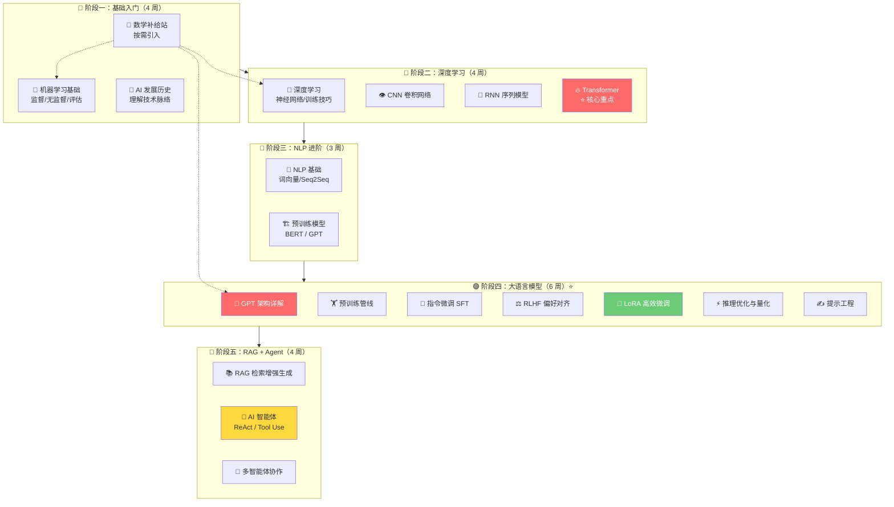
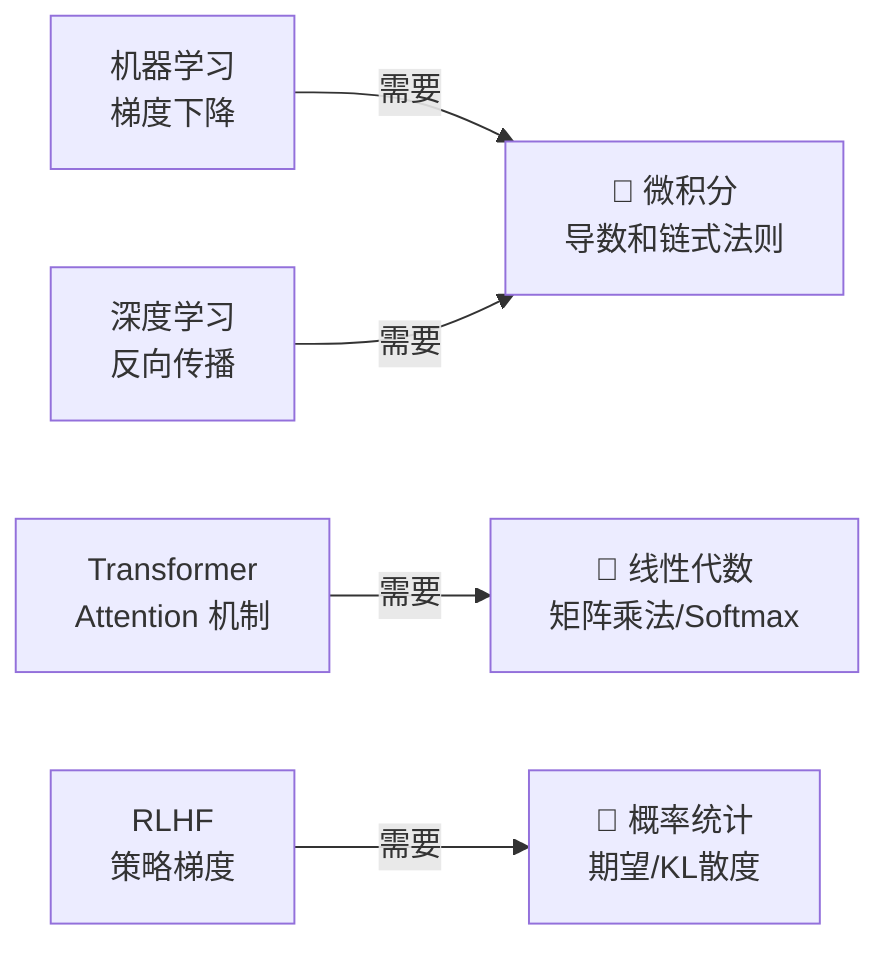

# 🧭 AI 学习路线总览

> 从机器学习基础出发，穿越深度学习、大语言模型，最终抵达 AI 智能体。

---

## 学习路径图



---

## 各阶段概览

| 阶段 | 模块 | 时间 | 难度 | 关键产出 |
|------|------|------|------|---------|
| 🔰 一 | [[../01.历史脉络/AI发展时间线\|AI历史]] + [[../02.机器学习基础/2.1 什么是机器学习\|ML基础]] | 4 周 | 🟢 | 房价预测模型 |
| 🔶 二 | [[../04.深度学习/4.1 神经网络基础\|深度学习]] + [[../04.深度学习/4.5 Transformer详解\|Transformer]] | 4 周 | 🟡 | 手写数字识别 |
| 🔷 三 | [[../05.NLP自然语言处理/5.1 文本表示与词向量\|NLP基础]] → [[../05.NLP自然语言处理/5.3 预训练语言模型\|预训练模型]] | 3 周 | 🟡 | 文本分类器 |
| 🟣 四 | [[../06.大语言模型/6.1 GPT架构深度解析\|LLM全流程]] → Tuning → 推理 | 6 周 | 🔴 | 微调中文LLM + 部署 |
| 🔴 五 | [[../07.RAG检索增强生成/7.1 RAG原理与架构\|RAG]] → [[../08.AI智能体/8.1 Agent核心概念\|Agent]] | 4 周 | 🔴 | 知识库问答 + AI助手 |

---

## 数学引入策略

数学不前置学习，而是在**理解算法需要时**按需查阅：



> 📌 所有数学笔记集中在 [[../03.数学补给站/线性代数核心\|数学补给站]]，标注了「何时需要」，需要时再去查。

---

## 难度标记说明

| 标记 | 含义 |
|------|------|
| 🟢 入门 | 无前置知识要求，概念易懂 |
| 🟡 进阶 | 需要一定 ML/DL 背景 |
| 🔴 高级 | 需要完整理解前置模块 |

---

## 推荐学习节奏

```
每周学习投入：10-15 小时
  - 周中 4 天 × 1.5h 理论学习
  - 周末 1 天 × 4h 项目实操
  - 另 1 天休息/弹性

总计约 21 周（约 5 个月）完成全路径
```

---

## 快速跳转

- 📜 [[../01.历史脉络/AI发展时间线|→ 先看 AI 发展史，建立全局认知]]
- 🤖 [[../02.机器学习基础/2.1 什么是机器学习|→ 开始机器学习之旅]]
- 📊 [[学习进度追踪|→ 查看学习进度表]]
- 📐 [[../03.数学补给站/线性代数核心|→ 数学补给站（按需查阅）]]
- 📚 [[../10.资源索引/推荐书籍与课程|→ 推荐学习资源]]
