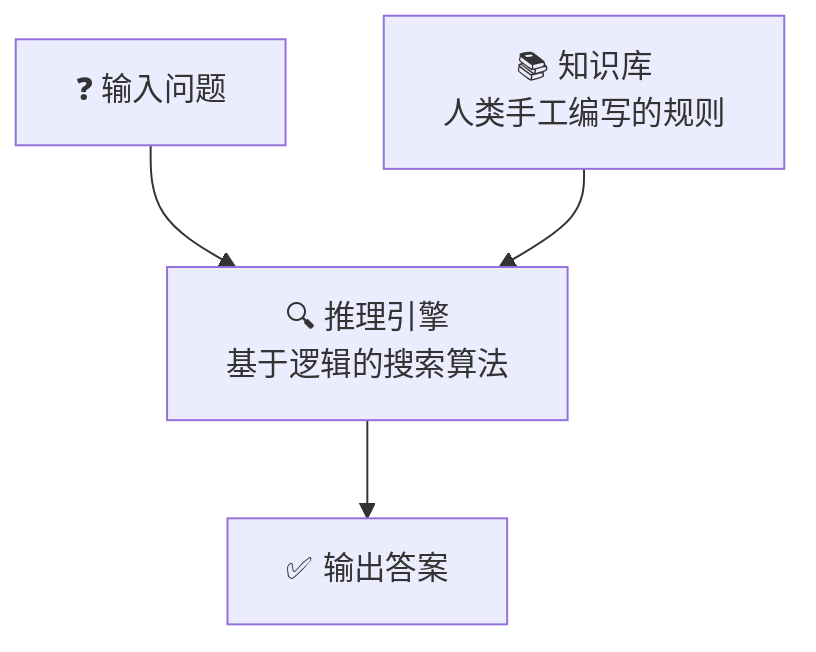
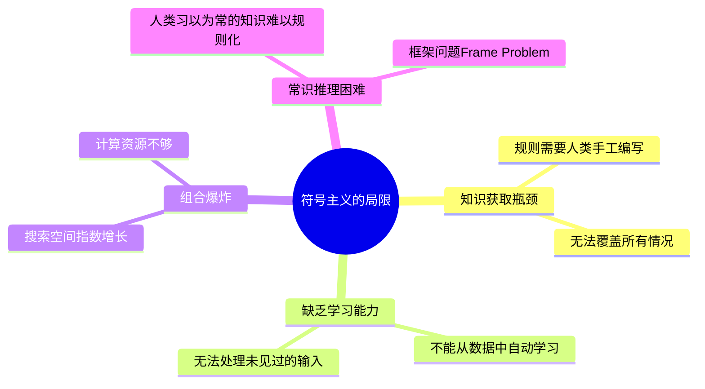

# 1.1 符号主义时代（1950s - 1980s）

> AI 的「第一次尝试」：用逻辑规则模拟人类智能。

---

## 时代背景

二战后的计算机科学家们怀着一个朴素的想法：

> 💡 **"如果我能把人类知识写成足够多的 if-then 规则，机器就能像专家一样推理。"**

这个流派被称为**符号主义（Symbolism）**或**规则驱动 AI**。

---

## 技术范式

**核心思想**：
- 知识 = 符号 + 规则
- 智能 = 在规则空间中搜索答案
- **不涉及数据学习，完全依赖人类编程**

---

## 关键里程碑

### 1950 — 图灵测试
艾伦·图灵发表《Computing Machinery and Intelligence》，提出判断机器智能的标准：如果人类无法区分对话对象是人还是机器，则该机器具有智能。

### 1956 — 达特茅斯会议 🏛️
约翰·麦卡锡首次提出 **"Artificial Intelligence"** 一词，标志着 AI 作为一门学科的诞生。参会者包括明斯基、香农、西蒙等 10 位先驱。

### 1957 — 感知机（Perceptron）
弗兰克·罗森布拉特发明感知机——**虽然属于符号主义时代，但它是神经网络的雏形**。能学习简单的线性分类。

### 1966 — ELIZA 聊天机器人
MIT 的约瑟夫·魏泽堡开发 ELIZA，模拟心理治疗师对话。用简单的模式匹配（不是真正的理解），但成功让很多人以为在和真人对话。

### 1980s — 专家系统热潮
MYCIN（医疗诊断）、XCON（计算机配置）等专家系统在特定领域达到或超过人类专家水平。

---

## 为什么失败了？

### 两次 AI 寒冬

| 寒冬 | 时间 | 触发原因 |
|------|------|---------|
| 第一次 | 1974-1980 | 英国 Lighthill 报告批评 AI 研究没有兑现承诺 |
| 第二次 | 1987-1993 | 专家系统维护成本高、Lisp 机器市场崩溃 |

---

## 历史遗产

虽然符号主义不再是主流，但它留下了：

| 遗产 | 现代对应 |
|------|---------|
| 知识图谱 | Google Knowledge Graph |
| 规则引擎 | 风控系统、业务逻辑引擎 |
| 搜索算法（A* / 剪枝）| 路径规划、游戏 AI |
| 逻辑编程（Prolog）| 约束求解 |

> 🤔 **思考题**：现代 LLM 的 Prompt Engineering 和专家系统的「写规则」，本质上有相似之处吗？

---

## → 下一站

[[1.2 机器学习的崛起]] — 当符号主义走到尽头，数据驱动的方法悄然兴起。
