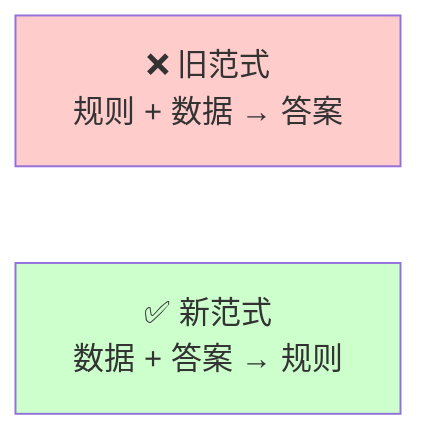
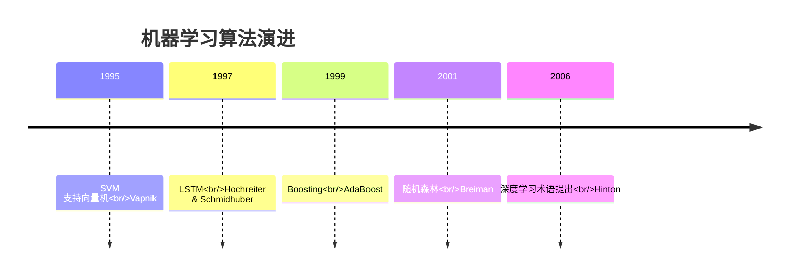
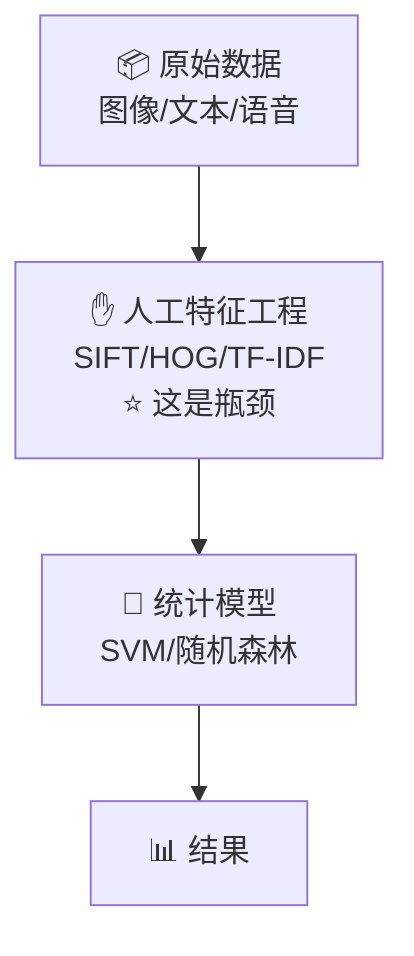

# 1.2 机器学习的崛起（1990s - 2010）

> AI 的「第二次浪潮」：不再手写规则，而是让机器从数据中学习。

---

## 范式转变

符号主义失败的根本原因是**知识获取瓶颈**——人类无法穷尽所有规则。

机器学习给出了一个完全不同的答案：

> 💡 **"不要告诉机器规则，给机器数据和答案，让它自己发现规则。"**

---

## 核心突破

### 统计学习理论基础

| 概念 | 画线外说 |
|------|---------|
| **PAC 学习理论** | Valiant, 1984 — 证明了「可学习性」的数学条件 |
| **VC 维** | Vapnik-Chervonenkis — 度量模型复杂度的理论工具 |
| **偏差-方差权衡** | 解释过拟合与欠拟合的核心框架 |
| **结构风险最小化** | 在经验风险和模型复杂度间取得平衡 |

> 📐 这些概念的数学细节见 [[../03.数学补给站/概率统计精华]]

### 关键算法诞生

---

## 技术栈特征

| 维度 | 符号主义 | 机器学习 |
|------|---------|---------|
| 知识来源 | 人类手工编写 | 从数据中自动学习 |
| 核心角色 | 知识工程师 | 数据 + 特征工程师 |
| 模型类型 | 逻辑规则 | 统计模型（SVM、树模型等） |
| 成功领域 | 围棋（规则明确）| 推荐系统、搜索、广告 |

---

## 里程碑事件

### 1997 — IBM 深蓝战胜卡斯帕罗夫 ♟️
虽然用的是搜索+评估函数（混合了符号主义思想），但标志着机器在特定智力领域超越人类最强。

### 2000s — 机器学习商业化
- Google 用 PageRank + ML 革新搜索
- Amazon 用协同过滤驱动推荐引擎
- Netflix Prize（2006）推动推荐算法研究

### 2009 — ImageNet 发布
李飞飞团队发布包含 1400 万张标注图片的 ImageNet 数据集，**为深度学习革命准备了弹药**。

---

## 局限与伏笔

**核心问题：特征工程需要大量人类专家经验。**

> 💡 这为深度学习铺平了道路——能否让模型自己学特征？

---

## 你需要记住的

> ✨ 机器学习的核心思想只有一句话：**从数据中找到从输入到输出的映射函数 $f(x) = y$**

- 不再手写规则 → 极大扩展了 AI 的适用范围
- 但特征工程仍是人工瓶颈 → 推动了端到端深度学习的需求
- 统计学习理论为理解「为什么模型能泛化」提供了数学框架

---

## → 下一站

[[1.3 深度学习的革命]] — GPU + 大数据 + 深层网络，AI 能力迎来质的飞跃。
