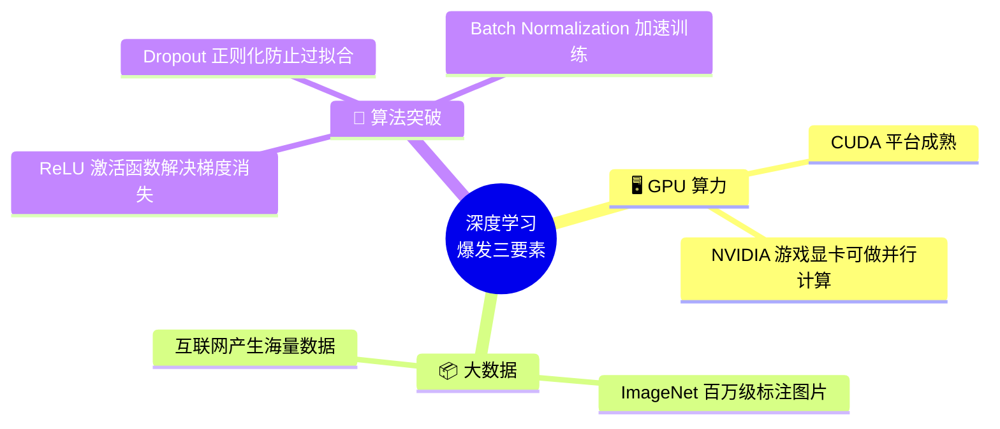
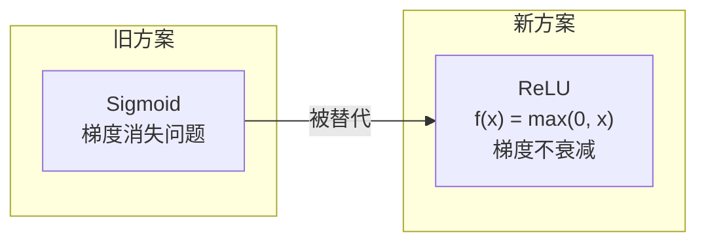
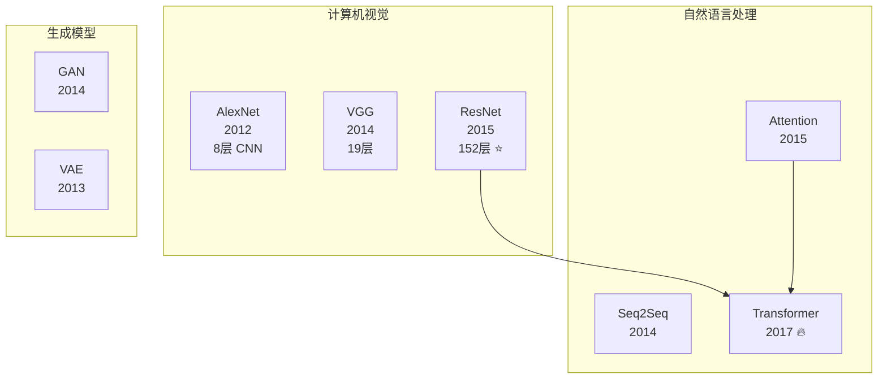
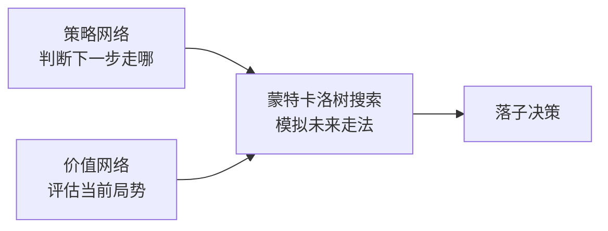

# 1.3 深度学习的革命（2012 - 2017）

> 2012 年，一个叫 AlexNet 的神经网络在 ImageNet 比赛中碾压所有传统方法。深度学习时代正式开启。

---

## 为什么是 2012？

深度学习的概念并不新鲜（Hinton 2006 年就提出了），但 2012 年三个条件首次同时满足：

---

## 关键事件时间线

| 年份 | 事件 | 意义 |
|------|------|------|
| 2012 | **AlexNet** 赢得 ILSVRC | 深度学习首次在大规模视觉任务中碾压传统方法 |
| 2014 | **GAN** 提出（Goodfellow）| 开创生成模型新范式 |
| 2014 | **Seq2Seq + Attention** | NLP 领域的革命性架构 |
| 2015 | **ResNet**（152层）| 解决了深层网络退化问题 |
| 2015 | **Batch Normalization** | 训练深层网络成为可能 |
| 2016 | **AlphaGo 4:1 李世石** | AI 战胜人类围棋冠军 |
| 2017 | **Attention Is All You Need** | 🔥 **Transformer 诞生，改变一切** |

---

## 核心技术突破

### 1. ReLU — 让深层网络可训练

### 2. Dropout — 防止过拟合

训练时随机"关掉"一部分神经元，迫使网络学习更鲁棒的特征。

### 3. ResNet — 让网络可以无限深

$$H(x) = F(x) + x$$

**残差连接（Skip Connection）** 让梯度可以直接流过深层网络，解决了退化问题。**这也是后来 Transformer 的核心组件之一。**

---

## 代表性架构

---

## AlphaGo — 深度强化学习的巅峰

> AlphaGo 的胜利证明：AI 可以在被认为"需要直觉和创造力"的领域超越人类。

---

## 这个时代留下的遗产

| 遗产              | 为什么重要                     |
| --------------- | ------------------------- |
| 端到端学习           | 不再需要手工设计特征                |
| 预训练 + 微调范式      | 先在大量数据上预训练，再针对具体任务微调      |
| GPU 生态          | CUDA + cuDNN 成为 AI 基础设施   |
| 开源文化            | PyTorch、TensorFlow 降低入门门槛 |
| **Transformer** | 为 LLM 时代奠定了架构基础           |

---

## → 下一站

[[1.4 大模型时代的开启]] — 当 Transformer 遇上互联网级别的数据，大模型时代来临。
